| 元数据 | 内容 |
|---|---|
| 标题 | A programmable metasurface antenna that approaches the wireless information mapping limit |
| 作者 | Haotian Wu, Ruiwen Shao, Zhixia Xu, Jun Wei Wu, Shurun Tan, Xixi Wang, Zhenjie Qi, Qiang Cheng（程强）, Yuanjin Zheng, Yu Luo（罗宇）, Tie Jun Cui（崔铁军，通讯作者） |
| 单位 | 东南大学毫米波国家重点实验室；新加坡南洋理工大学电气与电子工程学院；大连海事大学信息科学技术学院；浙江大学 ZJU-UIUC 联合学院；南京航空航天大学微波光子学国家重点实验室 |
| 期刊 | Nature Electronics（《自然·电子学》）2025 年，第 8 卷，第 179–191 页 |
| DOI | https://doi.org/10.1038/s41928-024-01298-7 |
| 论文类型 | 系统/方法论文（期刊 Article），13 页（正文 + Methods + 参考文献） |
| 来源 | Zotero 本地 PDF（selectable-text） |

## 章节索引

| 章节 | 内容 |
|---|---|
| 摘要 ABSTRACT | 无需 DAC/混频的可编程超表面发射机；信息映射效率逼近理论上限 |
| 1 引言 INTRODUCTION | 5G/6G 需求、MIMO 复杂度、可编程超表面发射机现状、信息映射效率瓶颈 |
| 2 信息映射方案 INFORMATION MAPPING SCHEME | 空间谐波检索、非递归编码、C₂ₚ 对称星座、级联编码与能量转换效率 |
| 3 天线样机实现 IMPLEMENTATION OF THE PROGRAMMABLE METASURFACE ANTENNA | 1 比特相位调制样机、超原子结构与 PIN 二极管、单元远场响应 |
| 4 信息映射方案的实验验证 EXPERIMENTAL DEMONSTRATION OF THE INFORMATION MAPPING SCHEME | 32 种可编程图案、四级幅度、半谐波/一次谐波方向实测、星座图合成 |
| 5 模拟数据传输 SIMULATED DATA TRANSMISSION | 图像传输仿真、误码率评估、与 MIMO 的对比与局限 |
| 6 结论 CONCLUSIONS | 主要成果与展望 |
| Methods 方法 | 编码序列与远场响应（式 6–10）、一次谐波响应独特性（式 11–13）、半谐波方向远场响应（式 14）、负一次谐波的共轭对称、Sᵢ 集合编码序列、非谐波方向、实验装置、比特串编码 |

## 公式索引

- [E001 · Eq. (1)](#E001) — 远场响应正比于编码序列与相位梯度的内积 E₂(kₓ) ∝ f(kₓ)·Σ exp[−j(mkₓd + φₘ)]
- [E002 · Eq. (2)](#E002) — 两序列在一次谐波方向产生相同响应的必要条件（求和式）
- [E003 · Eq. (3)](#E003) — 循环矩阵方程 Mζ = 0
- [E004 · Eq. (4)](#E004) — 信息映射效率 η₁ = log₂(2ᵖ − 1)/p
- [E005 · Eq. (5)](#E005) — 一次谐波相位梯度与半谐波相位梯度的非退化变换 g₁ᵀ = γₚ·g₁/₂ᵀ
- [E006 · Eq. (6)](#E006) — 远场正比于超表面场分布的傅里叶变换 E₂(k) ∝ ∫∫E₁(r)e^(−jkr)dr
- [E007 · Eq. (7)](#E007) — 超表面平面场分布为口径函数与编码序列的卷积 E₁(x) ∝ φ_d(x) ∗ s(x)
- [E008 · Eq. (8)](#E008) — 卷积定理：E₂(kₓ) ∝ F[φ_d(x)] × F[s(x)]
- [E009 · Eq. (9)](#E009) — 编码序列的傅里叶变换展开（含积分与求和）
- [E010 · Eq. (10)](#E010) — 远场响应与编码序列的最终关系 E₂(kₓ) ∝ f(kₓ)·Σ exp[−j(mkₓd + φₘ)]
- [E011 · Eq. (11)](#E011) — 循环置换后的矩阵方程 R^qₘ × ζₘ = 0
- [E012 · Eq. (12)](#E012) — Mζ = (R + J)ζ = 0
- [E013 · Eq. (13)](#E013) — 循环矩阵 M 的伴随多项式 α(x)
- [E014 · Eq. (14)](#E014) — p = 5 时的非退化变换矩阵 g₁ᵀ = γ₅·g₁/₂ᵀ

## 术语表（Terminology Ledger）

| 原文术语 | 中文 | 说明 |
|---|---|---|
| programmable metasurface (antenna) | 可编程超表面（天线） | 每个可编程单元（列）可独立切换相位状态的天线/表面 |
| information mapping efficiency | 信息映射效率 | 每单位切换时间从可编程图案中提取并映射到接收端的信息量比率；本文核心指标 |
| non-recurrent encoding | 非递归编码 | 无法通过非整周期的循环置换回到自身的编码序列（全 1/全 −1 两个“递归”序列除外） |
| spatial harmonic retrieval | 空间谐波检索 | 将编码信息映射到（第一）空间谐波方向并在该方向一次测量提取 |
| first-harmonic direction | 一次谐波方向 | θ = sin⁻¹(λ/pd) 对应的远场方向 |
| half-harmonic direction | 半谐波方向 | 对应相位梯度 g₁/₂ 的远场方向 |
| constellation diagram | 星座图 | 复平面上各编码序列远场响应状态点的分布 |
| C₂ₚ symmetry | C₂ₚ 对称 | 星座点在复平面上的 2p 重旋转对称性 |
| cyclic permutation (R) | 循环置换（算子 R） | 把编码序列循环移动一位 |
| sign-flipping operator (σ) | 符号翻转算子（σ） | 把编码序列各元素取反 |
| recurrent sequence | 递归序列 | 全 1 或全 −1 序列，在一次谐波方向响应为零 |
| 1-bit phase modulation | 1 比特相位调制 | 每列相位在 0 与 π（‘on’/‘off’）间切换 |
| meta-atom | 超原子（元原子） | 超表面天线的最小单元（此处按列排列） |
| aperture function φ_d(x) | 口径函数 φ_d(x) | 零相位状态下单列超原子的电场分布函数 |
| array factor | 阵列因子 | 编码序列与相位梯度内积所决定的远场包络 |
| cascaded encoding | 级联编码 | 将编码序列按因子 r 空间重复，能量集中于整数谐波 |
| bit mapping efficiency | 比特映射效率 | 每单位可编程图案（或图案序列）实际传输的比特数效率 |
| encoding sequence | 编码序列 | 长度 p 的 ±1 序列，控制各列相位 0/π |
| circulant matrix | 循环矩阵 | 每行由上一行循环移位得到的方阵 |
| Eisenstein's criterion | 艾森斯坦判别法 | 判定多项式不可约的准则（用于 xᵖ−1 的分解） |
| harmonic-field response | 谐波场响应 | 在（半）谐波方向测量的远场复响应 |
| SNR / bit error rate (BER) | 信噪比 / 误码率 | 通信信道质量与差错指标 |
| MIMO | 多输入多输出 | 传统多天线系统 |
| RIS | 可重构智能表面 | 可编程超表面在无线环境中的一种实现 |
| VNA | 矢量网络分析仪 | 测量远场幅度与相位的仪器 |
| anechoic chamber | 微波暗室 | 无反射测量环境 |
| MCU | 微控制器单元 | 控制 PIN 二极管状态的单芯片微控制器 |
| PIN diode | PIN 二极管 | 本文用 MADP-14020-907，改变偏压极性切换相位状态 |
| DAC / mixer | 数模转换器 / 混频器 | 传统射频链中用于调制/变频的器件，本方案可省去 |
| C₂ₚ / η₀ / η₁ | 对称阶数 / 法向/一次谐波信息映射效率 | η₀=log₂(p+1)/p；η₁=log₂(2ᵖ−1)/p |
| α₀–α₃ | 四级归一化幅度 | 0、≈0.38、≈0.62、1，用于把 32 个图案分为 S₀–S₃ 集合 |
| γₚ / γ₅ | 半谐波→一次谐波变换矩阵 | 非退化矩阵；γ₅ 为 p=5 的实例 |
| {Sᵢ} / γ⁻¹{Sᵢ} | 一次/半谐波幅度集合 | S₀ 含 2 个序列，S₁–S₃ 各含 10 个序列 |

---

## 摘要 ABSTRACT

**Original:** Digitally programmable metasurfaces are of potential use in next-generation mobile communications due to their ability to perform wireless data transmission without digital-to-analogue conversion or frequency mixing. However, communication networks based on programmable metasurfaces currently suffer from relatively low data transmission rates and low information mapping efficiencies (where the transmitted information per unit switching time is much lower than the information that encodes the programmable pattern). Here we report a programmable metasurface antenna that can approach the theoretical upper limit of the information mapping efficiency. Our approach combines non-recurrent encoding with spatial harmonic retrieval, and we show that the model maps most available programmable patterns to the first-harmonic direction in bijection. As a result, the approach can retrieve all of the encoding information through a single measurement. We also optimize the power efficiency of the communication architecture by using cascaded encoding to amplify the far-field radiation exclusively in the harmonic angles.

**中文:** 数字可编程超表面能够在无需数模转换或频率混频的情况下完成无线数据传输，因此有望用于下一代移动通信。然而，基于可编程超表面的通信网络目前面临数据传输速率偏低、信息映射效率不高的问题——每单位切换时间实际传输的信息量远低于编码可编程图案所需的信息量。本文报道一种可逼近信息映射效率理论上限的可编程超表面天线。我们的方法把非递归编码与空间谐波检索相结合，证明了该模型把绝大多数可编程图案双射（bijection）映射到一次谐波方向，因而只需一次测量即可取回全部编码信息；同时利用级联编码提升通信架构的功率效率，使远场辐射能量专一地集中于谐波角度。

## 1 引言 INTRODUCTION

**Original:** Wireless networks for fifth-generation technologies need high-capacity, low-latency and high-security wireless communications for applications such as holographic imaging, autopilot-based vehicles, telemedicine, virtual reality and the Internet of Things. Next-generation wireless communication systems are expected to offer further improvements in communication capabilities, particularly in key metrics such as channel capacity and system complexity. However, current multiple-input multiple-output (MIMO) networks rely on complex signal modulation devices including digital-to-analogue converters and mixers, introducing structural complexity and high cost to the communication systems.

**中文:** 第五代（5G）无线网络需要为大容量、低时延、高安全性的应用——如全息成像、自动驾驶车辆、远程医疗、虚拟现实与物联网——提供无线通信。下一代无线通信系统被期望在信道容量与系统复杂度等关键指标上继续提升。然而，当前多输入多输出（MIMO）网络依赖数模转换器、混频器等复杂信号调制器件，给通信系统引入了结构复杂度与高成本。

**Original:** Metasurfaces can manipulate electromagnetic waves and transmit wireless data without digital-to-analogue conversion or frequency mixing. Metasurfaces can either be passive or active. Passive metasurfaces are generally designed with fixed functionalities and are primarily used for mode multiplexing and controlling the wave propagation in wireless communication links. Recent passive metasurface-assisted communication schemes include vortex-mode multiplexing, polarization-channel multiplexing and multibeam for multiple users. Active metasurfaces are composed of meta-atoms integrated with controllable components and can be used for versatile and real-time, programmable electromagnetic wave manipulation. Real-time manipulation of the scattering patterns is possible through the control of embedded active devices such as varactors, photodiodes and microelectromechanical systems.

**中文:** 超表面可以操控电磁波，并在无需数模转换或频率混频的情况下传输无线数据。超表面分为无源与有源两类：无源超表面通常具有固定功能，主要用于模式复用以及控制无线通信链路中的波传播，近期无源超表面辅助通信方案包括涡旋模式复用、极化信道复用与面向多用户的多波束等；有源超表面由集成可控器件的超原子构成，可实现灵活、实时的可编程电磁波操控——通过控制变容二极管、光电二极管与微机电系统等嵌入式有源器件，即可实时调控散射图案。

**Original:** Reconfigurable intelligent surfaces (RISs)—implementations of programmable metasurfaces in radio environments—can scatter incident electromagnetic waves towards desired targets through in situ beamforming. Conformal integration, along with fast switching, could lead to programmable-metasurface-based transmitters. Recent communication strategies that have used programmable metasurface-assisted transmitters include direct beamforming, time-domain frequency-shift keying, space–frequency multiplexing, 256-state quadrature amplitude modulation, light-to-microwave transmitter, full-characteristic modulated space–time metasurface antenna, learning-aided security communication and non-reciprocal transmission/reception with spatiotemporal metamaterial antennas.

**中文:** 可重构智能表面（RIS）——可编程超表面在无线环境中的实现——可通过原位波束赋形把入射电磁波散射到目标方向。共形集成加上快速切换，有望催生基于可编程超表面的发射机。近期基于可编程超表面辅助发射机的通信策略包括：直接波束赋形、时域频移键控、空频复用、256 态正交幅度调制、光到微波发射机、全特性调制的时空超表面天线、学习辅助的安全通信，以及基于时空超材料天线的非互易发射/接收等。

**Original:** The number of coding states grows exponentially as the number of coding elements increases in communication and information processing. A 1-bit programmable metasurface with 20 × 20 independent meta-atoms can, for example, yield up to 2⁴⁰⁰ coding states. However, existing programmable-metasurface-based communication architectures still suffer from a low data transmission rate. Low information mapping efficiency—the ratio of the amount of information extracted at the receiver end and the amount of information supplied by the source within a unit of switch time—is a key challenge in this regard. Communication theory shows that the channel capacity of a wireless network is bound by the product of the amount of information received per unit switching time and the switching speed of the system. The amount of information retrieved at the receiving end is bounded by the source information multiplied by the information mapping efficiency. Therefore, to approach the upper limit of channel capacity in a programmable-metasurface-based communication network, we need to maximize the information mapping efficiency and ideally approach unity.

**中文:** 在通信与信息处理中，编码状态数随编码单元数指数增长：例如，含 20×20 个独立超原子的 1 比特可编程超表面可产生多达 2⁴⁰⁰ 种编码状态。然而，现有基于可编程超表面的通信架构仍受低数据传输速率困扰。其中的关键挑战是信息映射效率偏低——它定义为接收端提取的信息量与信源在单位切换时间内提供的信息量之比。通信理论表明，无线网络的信道容量受“单位切换时间内接收的信息量 × 系统切换速度”的乘积约束；接收端能取回的信息量又受“信源信息量 × 信息映射效率”约束。因此，要使基于可编程超表面的通信网络逼近信道容量上限，就必须最大化信息映射效率，理想情况下使其趋近于 1。

**Original:** There is, however, currently no theoretical framework or practical implementation that can achieve—or can approach—the unity condition in the information mapping efficiency, and the potential of reprogrammable capabilities of metasurfaces remains underused, with only a small portion of the programmable patterns being effectively used. For instance, data transmission rates in typical spatiotemporal metasurface-based communication systems drop considerably when the temporal repetition is introduced to the encoding sequence.

**中文:** 然而，目前尚无理论框架或实际实现能够达到——甚至逼近——信息映射效率的“1”条件；超表面可重构能力的潜力仍未得到充分利用，只有很小一部分可编程图案被有效使用。例如，在典型的时空超表面通信系统中，一旦在编码序列中引入时间重复，数据传输速率就会显著下降。

**Original:** In this Article, we report a programmable metasurface antenna that approaches the theoretical upper limit of the information mapping efficiency. Our antenna is 1-bit phase modulated, where the phase state of each column of the meta-elements can be independently switched to ‘0’ or ‘π’ through the integrated control unit (Fig. 1). We map all the available programmable patterns to the first-harmonic direction in bijection, with one specific exception, and show that the encoded information can be retrieved with a single measurement. Our theoretical framework is applicable to all types (radiation, reflection and transmission) of programmable metasurfaces as long as the implemented amplitude and phase modulations align with the proposed model.

**中文:** 本文报道一种逼近信息映射效率理论上限的可编程超表面天线。该天线采用 1 比特相位调制，每个超元（meta-element）列的相位状态都可通过集成控制单元独立地在‘0’与‘π’之间切换（图 1）。我们把所有可编程图案双射映射到一次谐波方向（仅有一个例外），并证明编码信息可通过一次测量取回。只要实际实现的幅度与相位调制符合所提出的模型，该理论框架适用于辐射、反射、透射等所有类型的可编程超表面。

### 图 1 基于可编程超表面天线的信息映射

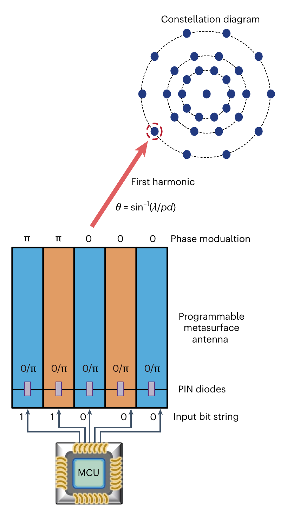

**Original caption:** Fig. 1 | Information mapping based on programmable metasurface antennas. A 1-bit phase-modulated programmable metasurface antenna is used, where the number of the operating columns (p) is an odd prime (such as 5) and the width of each column is d. PIN diodes are incorporated into each column of the programmable metasurface antenna, enabling the flexible switching of the phase response of each column of the radiator to be either ‘0’ or ‘π’ via the integrated microcontroller unit (MCU). In the information mapping process, a p-bit encoding sequence is transmitted from the MCU to control the states of the PIN diodes in each column of radiators, thereby modulating the spatial phase distribution on the plane of the programmable metasurface antenna. The first-harmonic direction is defined by the angle relative to the normal of the programmable metasurface antenna as θ = sin–1(λ/pd), where λ is the wavelength of the electromagnetic wave. At this specific angle, the far-field responses produced by all the available 2ᵖ encoding sequences result in a constellation diagram that comprises a total of 2ᵖ – 1 distinct states with C₂ₚ symmetry in the complex plane. For instance, the input bit string ‘1, 1, 0, 0, 0’ will induce the phase modulation of ‘π, π, 0, 0, 0’ for the programmable metasurface antenna, resulting in a far-field response that is denoted by the red dashed circle in the constellation diagram. By selecting the 2ᵖ – 1 encoding sequences for information modulation, it is possible to retrieve the encoding sequence through a single measurement of the far-field response in the first-harmonic direction.

**中文图注:** 图 1：基于可编程超表面天线的信息映射。采用 1 比特相位调制的可编程超表面天线，工作列数 p 为奇素数（如 5），每列宽度为 d。天线的每一列都集成 PIN 二极管，可通过集成微控制器单元（MCU）把每一列辐射体的相位响应在‘0’与‘π’之间灵活切换。在信息映射过程中，MCU 把 p 比特编码序列传输到各列 PIN 二极管以控制其状态，从而调制可编程超表面天线平面上的空间相位分布。一次谐波方向定义为相对天线法线的角度 θ = sin⁻¹(λ/pd)，λ 为电磁波波长。在该特定角度上，全部 2ᵖ 种编码序列产生的远场响应构成一个包含 2ᵖ − 1 个不同状态、在复平面上具有 C₂ₚ 对称性的星座图。例如，输入比特串‘1,1,0,0,0’会使天线产生‘π,π,0,0,0’的相位调制，其远场响应即星座图中红色虚线圈所标注的状态。通过选取这 2ᵖ − 1 个编码序列进行信息调制，即可在一次谐波方向对远场响应做单次测量从而取回编码序列。

**Reading note:** 图中上半部分示意可编程超表面发射机：MCU 输出比特串（如 1 1 0 0 0）→ 控制每列 PIN 二极管（0/π）→ 空间相位分布被调制；下半部分是一次谐波方向的星座图：2ᵖ 种图案映射出 2ᵖ−1 个状态点（C₂ₚ 对称），其中红色虚线圈对应输入‘1 1 0 0 0’的状态。注意图中“Phase modualtion”为原文笔误（应为 modulation）。

## 2 信息映射方案 INFORMATION MAPPING SCHEME

**Original:** The encoding sequence of a programmable metasurface antenna with length p is denoted as s = [exp(–jφ₀), exp(–jφ₁)…exp(–jφₚ₋₁)], and the resulting far-field response along the x direction is denoted as E₂(kₓ), where kₓ = ksinθ. Because of the Fourier transformation relation between the encoding sequences and the far-field radiation patterns (Methods), the radiated/scattered electric far fields (E₂(kₓ)) are proportional to the inner product between the encoding sequence s and direction-dependent phase gradient g(kₓ) = [1, exp(–jkₓd),…, exp(–(p – 1)jkₓd)] such that

**中文:** 长度为 p 的可编程超表面天线编码序列记作 s = [exp(–jφ₀), exp(–jφ₁)…exp(–jφₚ₋₁)]，沿 x 方向的远场响应记作 E₂(kₓ)，其中 kₓ = ksinθ。由于编码序列与远场辐射方向图之间存在傅里叶变换关系（见 Methods），辐射/散射电场远场 E₂(kₓ) 正比于编码序列 s 与方向相关的相位梯度 g(kₓ) = [1, exp(–jkₓd),…, exp(–(p–1)jkₓd)] 的内积：

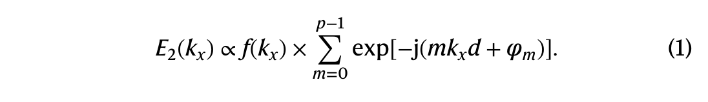

**中文说明：** 式 (1) 是本模型的基础：E₂(kₓ) ∝ f(kₓ) × Σₘ₌₀^{p−1} exp[−j(mkₓd + φₘ)]，其中 f(kₓ) 为单列超原子的远场响应，φₘ 为第 m 列超原子阵列的相位响应，d 为每列宽度。

**Original:** To send information of the programmable pattern (encoding sequence) to the far-field region, it is vital to find a fitting decoding scheme to retrieve the encoded sequence from the far-field measurements. The amount of information that can be obtained via the single measurement of the radiated field cannot exceed the amount of information provided by the programmable pattern, which is bounded by the logarithm of the number of possible encoding sequences such that I_max = log₂[2ᵖ] = p bits. Specifically, we require the receiver positioned in the direction of the first spatial harmonic, with the angle relative to the normal direction being sin⁻¹(λ/pd), where λ is the wavelength of the electromagnetic wave (Fig. 1).

**中文:** 要把可编程图案（编码序列）的信息发送到远场区，关键在于找到合适的解码方案，从远场测量中取回编码序列。单次远场测量所能获得的信息量不可能超过可编程图案提供的信息量，后者受“可能编码序列个数的对数”约束，即 I_max = log₂[2ᵖ] = p 比特。具体而言，我们要求接收机位于第一空间谐波方向，该方向相对法线的角度为 sin⁻¹(λ/pd)，其中 λ 是电磁波波长（图 1）。

**Original:** The utilization of the term ‘spatial harmonic’ may seem unconventional, given that the proposed meta-array is not modulated periodically. Nevertheless, the angle of the first spatial harmonic defined in this work coincides with the orientation of the first spatial harmonic generated by a periodic array with the periodicity p × d. Therefore, our model can be conceptualized as the meta-atom array comprising a single period.

**中文:** 由于所提出的超原子阵列并非周期调制，使用“空间谐波”一词可能显得不同寻常。不过，本文定义的第一空间谐波角度与周期为 p × d 的周期阵列所产生的第一空间谐波方向一致。因此，可以把我们的模型理解为“只包含一个周期”的超原子阵列。

**Original:** Generally, the permissible radiation/scattering channels of the periodic array are limited to discrete angles determined by integer harmonics. By contrast, when the array is modulated non-periodically, radiation at integer harmonics no longer exhibits a sharp distinction from other non-harmonic angles. However, under the condition of non-periodic modulation, the far-field responses in the first-harmonic angle still exhibit a unique symmetry in the constellation diagram, a characteristic generally not shared with non-harmonic angles. When the length of the encoding sequences is an odd prime (such as p = 5), almost all of the generated far-field responses will exhibit distinctiveness and manifest C₂ₚ symmetry in the constellation diagram along the first-harmonic direction (Fig. 1).

**中文:** 一般而言，周期阵列允许的辐射/散射信道被限制在由整数谐波决定的离散角度。相反，当阵列被非周期调制时，整数谐波处的辐射与其它非谐波角度不再有显著区分。但在非周期调制条件下，一次谐波角度的远场响应在星座图中仍呈现独特的对称性——这一特征通常是非谐波角度所不具备的。当编码序列长度为奇素数（如 p = 5）时，沿一次谐波方向产生的几乎全部远场响应都具有独特性，并在星座图中呈现 C₂ₚ 对称（图 1）。

**Original:** To illustrate our model, we introduce the concept of cyclic permutation operator (R) and the sign-flipping operator (σ). Specifically, the cyclic permutation operator (R) permutes a 1-bit encoding sequence from s = [s₀, s₁,…, sₚ₋₂, sₚ₋₁] to R(s) = [sₚ₋₁, s₀,…, sₚ₋₃, sₚ₋₂], and the sign-flipping operator flips the signs of each element of the sequence such that σ(s) = –s. On the basis of equation (1), it can be demonstrated that applying a single permutation to an encoding sequence s produces a phase shift of –2π/p in the first-harmonic direction, whereas applying sign flipping to the sequence induces a phase shift of π. Consequently, the far-field responses generated by all of the possible 1-bit encoding sequences must exhibit the C₂ₚ symmetry in the complex plane in the first-harmonic direction (Supplementary Section 2).

**中文:** 为说明该模型，我们引入循环置换算子（R）与符号翻转算子（σ）。循环置换算子把 1 比特编码序列从 s = [s₀, s₁,…, sₚ₋₂, sₚ₋₁] 变为 R(s) = [sₚ₋₁, s₀,…, sₚ₋₃, sₚ₋₂]；符号翻转算子则把序列每个元素取反，即 σ(s) = –s。基于式 (1) 可以证明：对编码序列 s 做一次循环置换，会使其一次谐波方向响应产生 −2π/p 的相移；而符号翻转则使响应产生 π 的相移。因此，全部可能的 1 比特编码序列在一次谐波方向产生的远场响应必然在复平面上呈现 C₂ₚ 对称（补充材料第 2 节）。

**Original:** To demonstrate the distinctiveness of the far-field responses at the first harmonic, we introduce the concept of a non-recurrent sequence. Specifically, for an encoding sequence with length p, if a cyclic permutation of this sequence with the number of steps that are not multiples of p cannot yield the original sequence, then the sequence is classified as non-recurrent. For a 1-bit sequence with the length of an odd prime, it can be shown that the sequence that is not composed exclusively of 1s and −1s can be characterized as non-recurrent (Supplementary Section 3). Here we first postulate the existence of at least two non-recurrent sequences, denoted as c = [c₀, c₁,…, cₚ₋₁] and d = [d₀, d₁,…, dₚ₋₁], which produce identical far-field responses in the first-harmonic direction. Furthermore, we will proceed to show that this presumption will inevitably lead to a contradiction.

**中文:** 为证明一次谐波方向远场响应的独特性，我们引入“非递归序列”（non-recurrent sequence）的概念：对长度为 p 的编码序列，若步数不为 p 的倍数的循环置换都无法得到原序列，则该序列为非递归序列。可以证明，对长度为奇素数的 1 比特序列，只要它不全部由 1 或 −1 组成，就一定是非递归序列（补充材料第 3 节）。这里先假设至少存在两条非递归序列 c = [c₀, c₁,…, cₚ₋₁] 与 d = [d₀, d₁,…, dₚ₋₁]，它们在一次谐波方向产生完全相同的远场响应；接下来将证明这一假设必然导致矛盾。

**Original:** Specifically, given that the far-field responses produced by the two encoding sequences are assumed to be the same at the first harmonic, it is imperative that these two sequences adhere to the following condition:

**中文:** 具体而言，既然假设两条编码序列在一次谐波方向的远场响应相同，它们就必须满足如下条件：

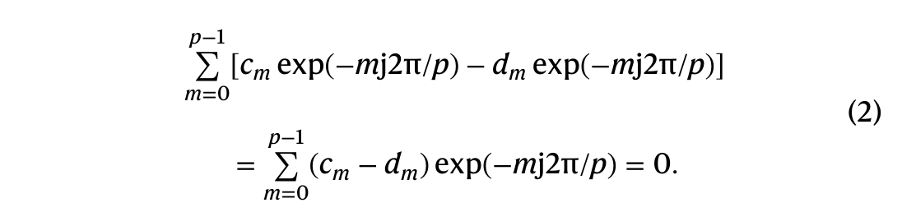

**中文说明：** 式 (2) 即 Σₘ₌₀^{p−1}[cₘ exp(−jm2π/p) − dₘ exp(−jm2π/p)] = Σₘ₌₀^{p−1}(cₘ − dₘ)exp(−jm2π/p) = 0。它把“两序列一次谐波响应相同”转写为关于 c−d 的求和为零。

**Original:** On the contrary, since the cyclic permutation of the encoding sequence will produce a phase shift for the harmonic-field response with an identical amplitude response, equation (2) can be extended (Methods) to a matrix equation given by

**中文:** 反过来，由于编码序列的循环置换会给谐波场响应带来相移而保持幅度响应不变，式 (2) 可被推广（见 Methods）为如下矩阵方程：

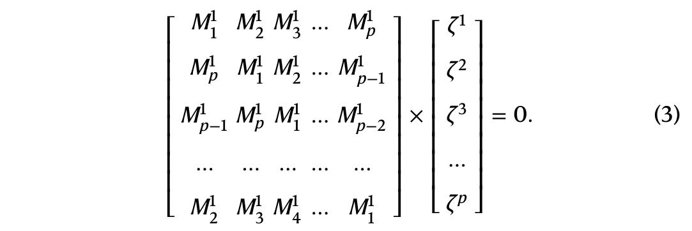

**中文说明：** 式 (3) 为 M·ζ = 0，其中 M 是由两个编码序列（经循环置换）构造的循环矩阵，ζ = [ζ₁,…,ζₚ]ᵀ 为待定列向量。该式对应“存在两条非递归序列共享同一谐波场响应”的假设。

**Original:** The matrix M in equation (3) is circulant and adheres to the circulation condition Mⁱ⁺¹ⱼ₊₁ = Mⁱⱼ, and the vector component of ζ can be expressed as ζₘ = exp[−(m−1)j2π/p].

**中文:** 式 (3) 中的矩阵 M 是循环矩阵，满足循环条件 Mⁱ⁺¹ⱼ₊₁ = Mⁱⱼ；向量 ζ 的分量可表示为 ζₘ = exp[−(m−1)j2π/p]。

**Original:** Leveraging the cyclic characteristics of circulant matrices and the two encoding sequences, it can be established that the matrix M must be non-singular (Methods). The matrix non-singularity implies that Mζ = 0 is not satisfied for any pair of non-recurrent sequences, which contradicts the assumption that there exist two non-recurrent encoding patterns sharing the same harmonic-field responses.

**中文:** 借助循环矩阵的循环特性以及这两条编码序列，可以证明矩阵 M 必然非奇异（见 Methods）。矩阵非奇异意味着：对任意一对非递归序列，Mζ = 0 都不成立——这与“存在两条共享同一谐波场响应的非递归编码图案”的假设相矛盾。

**Original:** In addition, notice that the far-field responses generated by the two recurrent encoding sequences (all 1s and all −1s) are both zero in the first-harmonic direction (Supplementary Section 4). Hence, we can include one of the recurrent sequences (such as all 1s) into the set of non-recurrent sequences and arrange the 2ᵖ – 1 encoding sequences for data transmissions, where the resulting information mapping efficiency can be expressed as

**中文:** 此外注意：两条递归编码序列（全 1 与全 −1）在一次谐波方向的远场响应都为零（补充材料第 4 节）。因此，我们可以把其中一条递归序列（如全 1）并入非递归序列集合，用 2ᵖ − 1 条编码序列进行数据传输，此时的信息映射效率可表示为

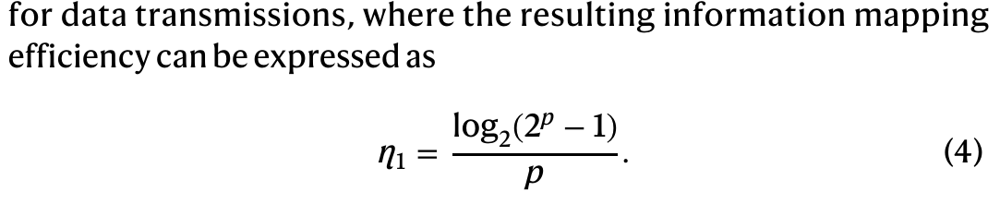

**中文说明：** 式 (4) 即 η₁ = log₂(2ᵖ − 1)/p：用 p 比特输入（2ᵖ−1 个可用状态）换取 log₂(2ᵖ−1) 比特信息。

**Original:** For instance, when the length of the encoding sequences is p = 5, the information mapping efficiency is calculated to be approximately 4.95, reaching 99% of theoretical upper bound, and it will increase to over 99.8% when p = 7. Hence, the information mapping efficiency of the proposed scheme approaches the theoretical upper limit of unity.

**中文:** 例如，当编码序列长度 p = 5 时，单次测量可检索的信息量约为 4.95 比特，达到理论上限（5 比特）的 99%；当 p = 7 时更将超过 99.8%。因此，本方案的信息映射效率逼近“1”的理论上限。

**Original:** The non-zero spatial harmonic plays a key role in producing the distinctive and symmetrically distributed far-field responses. For instance, Fig. 2 compares the far-field responses of the encoding sequences in the normal (kₓ = 0) and the first-harmonic (kₓ = k₁) directions. The schematic of the possible encoding patterns of lengths p = 3, 5 and 7 are presented in Fig. 2a–c. Specifically, the far-field responses obtained in the normal direction is depicted in Fig. 2d–f, where the number of distinctive states is only p + 1. Consequently, the information mapping efficiency in the normal direction (η₀ = log₂(p + 1)/p) is less than 1 and decreases as the length of the encoding sequence increases. By contrast, the far-field responses in the first-harmonic direction exhibit C₂ₚ symmetrically distributed 2ᵖ – 1 distinct states in the complex plane (Fig. 2g–i). As a result, the information mapping efficiency (η₁ = log₂(2ᵖ − 1)/p) tends to unity and will be further increased as the length of the encoding sequence increases.

**中文:** 非零空间谐波对产生独特且对称分布的远场响应起着关键作用。例如，图 2 对比了法向（kₓ = 0）与一次谐波方向（kₓ = k₁）上编码序列的远场响应：图 2a–c 给出长度 p = 3、5、7 的所有可能编码图案示意；图 2d–f 为法向方向的远场响应，其不同状态数只有 p + 1 个。因此，法向信息映射效率 η₀ = log₂(p + 1)/p 小于 1，且随编码序列长度增加而下降。相比之下，一次谐波方向的远场响应在复平面上呈现 C₂ₚ 对称分布的 2ᵖ − 1 个不同状态（图 2g–i），因而信息映射效率 η₁ = log₂(2ᵖ − 1)/p 趋近于 1，并随编码序列长度增加进一步提高。

**Original:** We note that the data transmission in a communication network also strongly depends on the signal-to-noise ratio (SNR) and the signal bandwidth (switching speed). Nevertheless, the information mapping efficiency inherently acts as a diminishing factor, constraining the upper limit of the channel capacity of the programmable metasurface antenna-based communication system. For instance, in the extreme scenario in which the information mapping efficiency falls to zero, no information can be transmitted, regardless of a high SNR or rapid switching speed in the metasurface-based communication system.

**中文:** 我们指出，通信网络的数据传输还强烈依赖于信噪比（SNR）与信号带宽（切换速度）。但信息映射效率本质上是一个“衰减因子”，约束着可编程超表面天线通信系统的信道容量上限。例如，在信息映射效率降为零的极端情形下，无论 SNR 多高、超表面通信系统的切换速度多快，都无法传输任何信息。

**Original:** The key distinction between the proposed programmable metasurface antenna-based transmitter and the conventional transmitters is the modulation mechanism for constellation diagram generation. In conventional transmitters, the constellation diagram is created by in-phase/quadrature channels before the signal is radiated. In sharp contrast, the constellation in our proposed transmitter architecture is synthesized through wave propagation and interference in space, a technique also used in optical computing. The comparative analysis of the architecture and communication capabilities between conventional transmitters and our proposed scheme is provided in Supplementary Sections 19 and 20.

**中文:** 所提出的可编程超表面天线发射机与传统发射机的关键区别在于星座图的生成/调制机制。传统发射机在信号辐射之前，先通过同相/正交（I/Q）通道构造星座图；而在我们的发射机架构中，星座是在空间中通过波的传播与干涉自然合成的——这也正是光学计算所使用的技术。两种架构与通信能力的对比分析见补充材料第 19、20 节。

**Original:** The energy conversion efficiency of the MIMO transmitter is relatively high due to its ability to steer the main lobe towards the target user and minimizing the energy radiation to other unwanted directions. Comparatively, in the proposed scheme, the far-field radiation pattern of a single-column radiator reaches its peak in the normal direction, which is misaligned with the communication channel of the first harmonic. This misalignment results in diminished energy conversion efficiency to the communication channel. To improve the energy conversion efficiency, we show that applying an additional phase gradient of gᵤ = 2π/pd to the meta-array will shift the first-harmonic angle towards the normal direction. As a result, the alignment of the shifted first harmonic with the radiation peak of the single column of radiators enables higher energy conversion efficiency in the communication channel. More details regarding the methodology for shifting the first-harmonic angle are provided in Supplementary Section 21.

**中文:** MIMO 发射机的能量转换效率相对较高，因为它能把主瓣指向目标用户，并把能量辐射降到其它无用方向上。相比之下，在本方案中，单列辐射体的远场辐射方向图在法向达到峰值，而通信信道位于一次谐波方向，二者不重合，导致进入通信信道的能量转换效率下降。为提高能量转换效率，我们证明：向超原子阵列附加 gᵤ = 2π/pd 的额外相位梯度，可将一次谐波角度移向法向。于是，被移动后的一次谐波与单列辐射体辐射峰值对齐，通信信道的能量转换效率得以提高（移动一次谐波角的更多细节见补充材料第 21 节）。

### 图 2 法向与一次谐波方向的远场响应

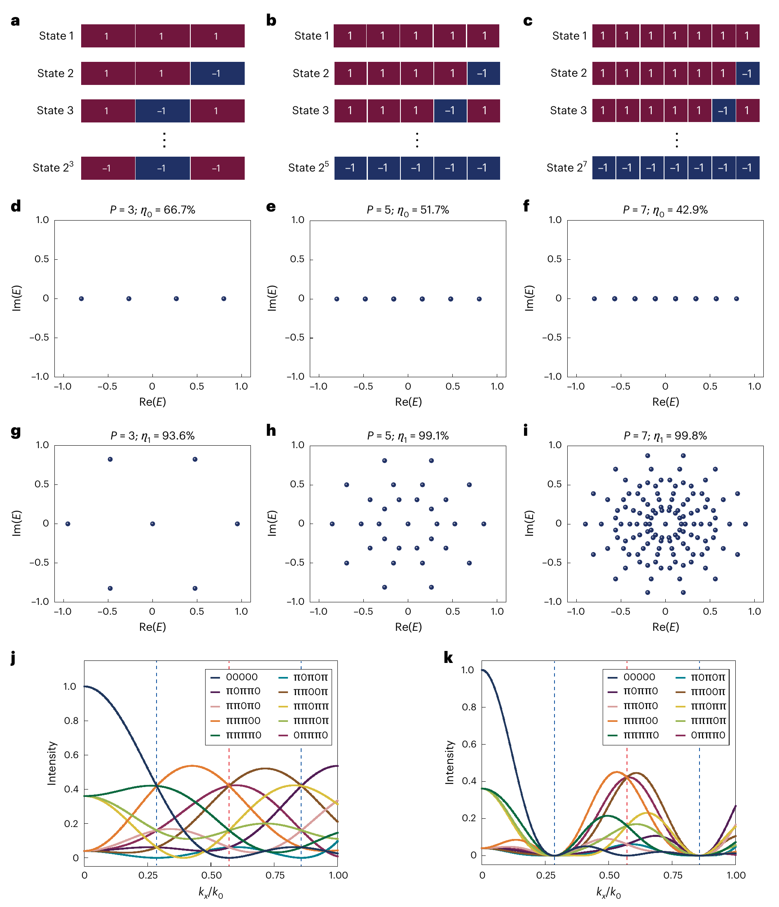

**Original caption:** Fig. 2 | Far-field responses of the programmable metasurface in the normal and first-harmonic directions, where the lengths of the encoding sequences are odd primes. a–c, The 2ᵖ possible binary encoding patterns with a sequence length of p = 3 (a), p = 5 (b) and p = 7 (c). d–f, Far-field responses of the metasurface in the normal direction (kₓ = 0), where the length of the encoding sequence is p = 3 (d), p = 5 (e) and p = 7 (f). The notations Re(E) and Im(E) represent the real and imaginary parts of the complex amplitude of the electric field. The symbol η₀ represents the calculated information mapping efficiency in the normal direction to the metasurface. g–i, Far-field responses of the metasurface in the first-harmonic direction (kₓ = k₁), where the length of the encoding sequence is p = 3 (g), p = 5 (h) and p = 7 (i). The symbol η₁ represents the calculated information mapping efficiency in the first-harmonic direction. j,k, Array factors generated by all the possible 1-bit encoding sequences with the length of 5, both without cascaded encoding (j) and with a cascaded encoding factor of 2 (k).

**中文图注:** 图 2：编码序列长度为奇素数时，可编程超表面在法向与一次谐波方向的远场响应。a–c，长度 p = 3 (a)、5 (b)、7 (c) 时 2ᵖ 种可能的二元编码图案。d–f，法向（kₓ = 0）的远场响应（p = 3/5/7），Re(E)、Im(E) 分别表示电场复振幅的实部与虚部，η₀ 表示法向信息映射效率。g–i，一次谐波方向（kₓ = k₁）的远场响应（p = 3/5/7），η₁ 表示一次谐波信息映射效率。j,k，长度 5 的全部 1 比特编码序列产生的阵列因子：无级联编码 (j) 与级联编码因子为 2 的情形 (k)。

**Reading note:** 法向（d–f）只有 p+1 个可区分状态、η₀ 随 p 下降；一次谐波方向（g–i）有 2ᵖ−1 个状态且呈 C₂ₚ 对称、η₁ 趋近 1（p=5 时 99.1%，p=7 时 99.8%）。j/k 对比显示级联编码使能量集中于整数谐波（红虚线为一次谐波角，蓝虚线为半谐波与 1.5 次谐波角）。

**Original:** Another viable approach to enhance the energy conversion efficiency is to adopt spatially repetitive modulation in the encoding sequence, a process we term cascaded encoding. For instance, the encoding sequence of ‘1, −1, 1, 1, −1’ can be modified into ‘1, −1, 1, 1, −1, 1, −1, 1, 1, −1’ when a cascaded encoding factor of r = 2 is introduced. As a result, the radiated energy will become more concentrated on the integer harmonics, and will be notably suppressed in the non-harmonic directions (Supplementary Section 7). We note that the same amount of information will be transmitted regardless of whether cascaded encoding is implemented. Accordingly, incorporating cascaded encoding with a factor of q into the modulation sequence will result in the information mapping efficiency decreasing to 1/q of its original value.

**中文:** 提高能量转换效率的另一个可行途径是在编码序列中采用空间重复调制，我们称之为级联编码（cascaded encoding）。例如，当级联因子 r = 2 时，编码序列‘1,−1,1,1,−1’可改写为‘1,−1,1,1,−1,1,−1,1,1,−1’。于是辐射能量更集中于整数谐波，而在非谐波方向被显著抑制（补充材料第 7 节）。需要指出，无论是否实施级联编码，传输的信息量都相同；因此，在调制序列中加入级联因子 q，会使信息映射效率降为原来的 1/q。

**Original:** The far-field response of the programmable metasurface antenna in the half-harmonic direction is proportional to the inner product between the encoding sequence and the phase gradient g₁/₂ = g(0.5k₁) = [1, exp(−jπ/p),…, exp(−(p−1)jπ/p)]. In comparison, the phase gradient in the first-harmonic direction is g₁ = g(k₁) = [1, exp(−j2π/p),…, exp(−(p−1)j2π/p)]. Through algebraic analysis (Methods), it can be verified that the two phase gradients g₁/₂ and g₁ are related by the non-degenerate matrix (γₚ) transformation such that

**中文:** 可编程超表面天线在半谐波方向的远场响应正比于编码序列与相位梯度 g₁/₂ = g(0.5k₁) = [1, exp(−jπ/p),…, exp(−(p−1)jπ/p)] 的内积；相比之下，一次谐波方向的相位梯度为 g₁ = g(k₁) = [1, exp(−j2π/p),…, exp(−(p−1)j2π/p)]。通过代数分析（见 Methods）可验证，两条相位梯度 g₁/₂ 与 g₁ 由非退化矩阵（γₚ）联系：

**中文说明：** 式 (5) 即 g₁ᵀ = γₚ·g₁/₂ᵀ（ᵀ 表示转置），表明半谐波与一次谐波方向的响应在“对称性与唯一性”上具有相同特征。

**Original:** where T denotes the transpose of the vector. As a result, the constellation diagrams obtained in the half-harmonic and the first-harmonic directions should exhibit the same characteristic in terms of symmetry and uniqueness. However, the radiated energy will vanish completely at all half-harmonics when the cascaded encoding factor is an even number (Supplementary Section 8). For instance, Fig. 2j,k shows the array factors generated by all the 1-bit encoding sequences with length p = 5 in the case of no cascaded encoding (Fig. 2j) and a cascaded encoding factor of 2 (Fig. 2k), where k₁ = 2π/pd corresponds to the first-harmonic direction. In each plot, the red dashed line represents the first-harmonic angle, whereas the two blue dashed lines represent the angles of the half-harmonic and the one-and-a-half harmonic, respectively. The 32 coding sequences exhibit 10 distinct array factors (Supplementary Section 2 provides the detailed analysis). It is evident that on implementing the cascaded encoding, the radiation patterns become more concentrated at integer harmonics but notably suppressed at half-harmonics. Therefore, this study focuses on the investigation of information mapping at the first harmonic.

**中文:** 其中 T 表示向量转置。因此，半谐波与一次谐波方向得到的星座图在对称性与唯一性方面应具有相同特征。然而，当级联编码因子为偶数时，所有半谐波处的辐射能量将完全消失（补充材料第 8 节）。例如，图 2j,k 给出长度 p = 5 的全部 1 比特编码序列在无级联编码（j）与级联因子 2（k）两种情况下的阵列因子，其中 k₁ = 2π/pd 对应一次谐波方向。各图中红色虚线表示一次谐波角，两条蓝色虚线分别表示半谐波与 1.5 次谐波角；32 条编码序列呈现 10 种不同的阵列因子（详细分析见补充材料第 2 节）。显然，实施级联编码后，辐射方向图更集中于整数谐波，而在半谐波处被显著抑制。因此，本研究聚焦于一次谐波方向的信息映射。

## 3 天线样机实现 IMPLEMENTATION OF THE PROGRAMMABLE METASURFACE ANTENNA

**Original:** We propose the prototype of a 1-bit phase-modulated programmable metasurface antenna composed of a two-dimensional array of meta-atoms (Fig. 3a–e). The designed meta-atom contains three metallic layers, separated by two dielectric substrates. The top layer is composed of a slotted copper patch and the middle metallic layer is ground to provide retroreflection (Fig. 3c). The substrate of our metasurface antenna is composed of Rogers 4003C laminates, which has a dielectric constant of 3.55 and a loss tangent of 0.0027 at 10 GHz. The detailed geometrical parameters of the meta-atom are a = 15 mm, b₁ = 6.9 mm, b₂ = 5.7 mm and w = 0.8 mm. The thicknesses of the two substrate layers are 1.52 mm and 0.25 mm, respectively. The meta-atoms in each column are connected to the bottom layer through metallic vias and are fed by a 1-to-8 power divider to ensure uniform amplitude modulation (Fig. 3b).

**中文:** 我们提出一种由二维超原子阵列构成的 1 比特相位调制可编程超表面天线样机（图 3a–e）。所设计的超原子包含三层金属层，由两层介质基板分隔：顶层为开缝铜贴片，中间金属层接地以实现背向反射（图 3c）。天线介质基板采用 Rogers 4003C 层压板，其在 10 GHz 时介电常数为 3.55、损耗角正切为 0.0027。超原子的详细几何参数为 a = 15 mm、b₁ = 6.9 mm、b₂ = 5.7 mm、w = 0.8 mm；两层基板厚度分别为 1.52 mm 与 0.25 mm。每列超原子通过金属过孔连接到底层，并由 1 分 8 功分器馈电，以保证均匀的幅度调制（图 3b）。

**Original:** Four positive-intrinsic-negative (PIN) diodes are integrated on the input end of the bottom feeding structure to provide 1-bit phase modulation, and a backside sector is introduced to isolate the microwave signal from the d.c. bias (Fig. 3d). Here a MADP-14020-907 PIN diode is used in each column of the programmable metasurface antenna to switch the phase states, whose equivalent circuit can be tuned by changing the polarity of the bias voltage (Fig. 3e). With this configuration, the effective length of the feeding line can be changed by applying an opposite bias voltage to the two groups of PIN diodes, resulting in 180° phase modulation of the radiated waves at a frequency of 9.7 GHz. The detailed characterization of the feeding structure of the programmable metasurface antenna is provided in Supplementary Section 6.

**中文:** 底部馈电结构的输入端集成四只正-本征-负（PIN）二极管以提供 1 比特相位调制，并引入背面扇区（sector）把微波信号与直流偏置隔离（图 3d）。可编程超表面天线每一列采用一只 MADP-14020-907 PIN 二极管来切换相位状态，其等效电路可通过改变偏压极性进行调谐（图 3e）。在该配置下，向两组 PIN 二极管施加相反的偏压即可改变馈线有效长度，从而在 9.7 GHz 频率上实现 180° 的辐射波相位调制（馈电结构详细表征见补充材料第 6 节）。

**Original:** The outermost four columns of the elements are configured as dummy elements to establish the same boundary conditions for the central five columns. Such an arrangement ensures the same far-field scattering pattern for each column of the meta-atom array. To simplify the notation, we assign on and off to label the 0° and 180° phase states, respectively, for each column of the meta-atoms. The simulated far-field amplitude and phase responses for each column working at f = 9.7 GHz are shown in Fig. 3f–h. The far-field responses generated by the five columns of radiators can realize a phase shift from 0° to 180° when operating in the on and off states in the normal direction (θ = 0°). As the radiation angle deviates from the normal, the resulting far-field response of each column varies by a factor of exp(jkₓx), where x denotes the location of each column. Consequently, the far-field phase degeneracy of the five columns operating in the on and off states will be lifted in the direction away from the normal (Fig. 3g).

**中文:** 最外侧四列单元被配置为哑元（dummy elements），以便为中央五列建立相同的边界条件——这种排布保证超原子阵列每一列具有相同的远场散射图案。为简化记号，我们分别用 on 与 off 表示每一列超原子的 0° 与 180° 相位状态。f = 9.7 GHz 时每一列的仿真远场幅度与相位响应见图 3f–h。工作在 on/off 状态下的五列辐射体，其法向（θ = 0°）远场响应可实现 0° 至 180° 的相移；当辐射角度偏离法向时，每列远场响应会乘上因子 exp(jkₓx)（x 为该列位置），因此五列在 on/off 状态下的远场相位简并会在偏离法向的方向上被解除（图 3g）。

**Original:** In particular, the simulated phase responses of the ten states in the first-harmonic direction (θ = 24.4°) are arranged in the ascending order (Fig. 3h). The average phase difference between the adjacent states is calculated as 35.9°, closely aligned with the theoretical prediction of 36° (Supplementary Section 2 provides more details). The average standard deviation of the simulated phases relative to the linear fit (red dashed line) was calculated to be less than 3.9°.

**中文:** 特别地，一次谐波方向（θ = 24.4°）上十个状态的仿真相位响应按升序排列（图 3h）。相邻状态间的平均相位差计算为 35.9°，与理论预测值 36° 高度吻合（详见补充材料第 2 节）；相对线性拟合（红色虚线）的仿真相位平均标准差小于 3.9°。

### 图 3 样机设计与远场响应

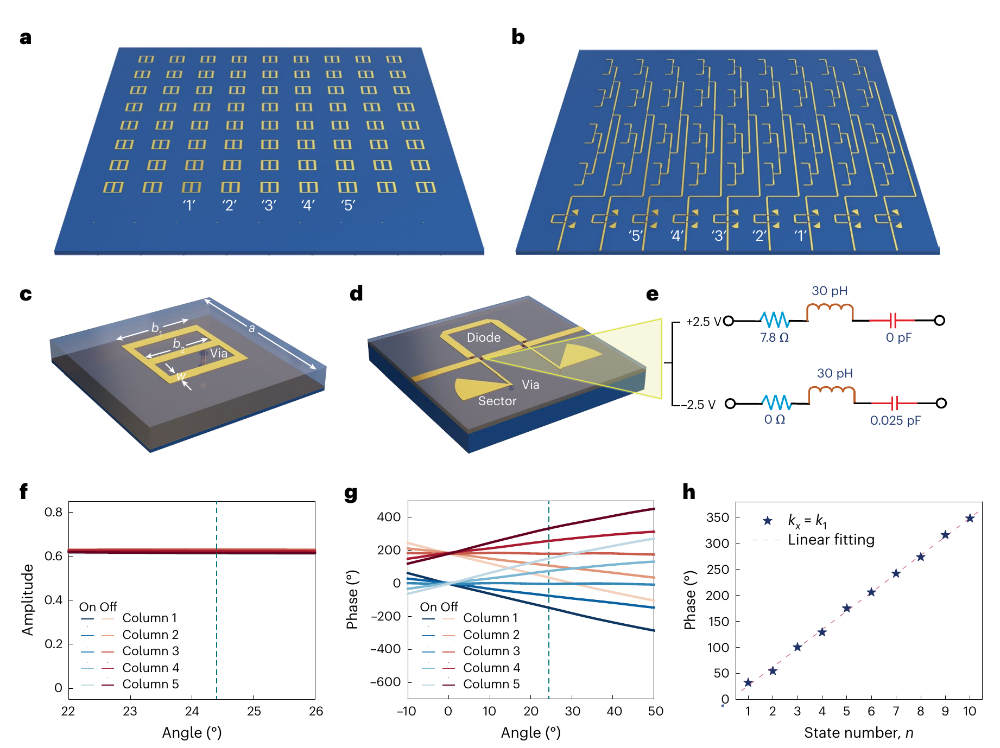

**Original caption:** Fig. 3 | Prototype design and far-field responses. a,b, Front (a) and back (b) configurations of the programmable metasurface antenna. The outer four columns of elements are configured as dummy elements to establish the same boundary conditions for the central five columns of the elements. The five central columns used for information mapping are labelled by numbers from 1 to 5, and the outer dummy columns are not labelled. c, Meta-atom of the programmable metasurface antenna, in which the slotted patch is connected to the ground copper through a metallic rod. d, MADP-14020-907 PIN diodes, controlled by a single-chip microcomputer, are incorporated into each column of the meta-atom array to control the phase states of the metasurface antenna. e, Equivalent circuit model of the PIN diode with respect to the different polarities of the bias voltages (+2.5 V and −2.5 V). f,g, Simulated far-field amplitude (f) and phase (g) responses of the central five columns of the meta-atom array when working in the ‘on’ and ‘off’ states. The green dashed lines mark the amplitude and phase responses in the direction of the first spatial harmonic (θ = 24.4°). h, Simulated far-field phase responses in the first-harmonic direction (θ = 24.4°), obtained by exciting each column of the central five columns of the programmable metasurface antenna in the on and off states, respectively. The obtained phase responses are represented by the modulo of 360° and subsequently arranged in the ascending order, as denoted by state number n. The linear fit of these phase states is represented by the red dashed line, adhering to the equation θ = 35.8062° × n – 9.1218°, and the standard deviation of the simulated phases with respect to the linear fit is calculated as 3.387°.

**中文图注:** 图 3：样机设计与远场响应。a,b，可编程超表面天线正面 (a) 与背面 (b) 结构；外侧四列单元为哑元，为中央五列建立相同边界条件；用于信息映射的中央五列以数字 1–5 标注。c，天线超原子：开缝贴片通过金属杆连接到接地铜。d，每列超原子阵列嵌入由单片机控制的 MADP-14020-907 PIN 二极管以控制天线相位状态。e，不同偏压极性（+2.5 V 与 −2.5 V）下 PIN 二极管的等效电路模型。f,g，中央五列超原子在 on/off 状态下的仿真远场幅度 (f) 与相位 (g) 响应；绿色虚线标注一次空间谐波方向（θ = 24.4°）处的幅度与相位响应。h，分别激励中央五列处于 on/off 状态时，一次谐波方向（θ = 24.4°）的仿真远场相位响应；相位响应按 360° 取模后升序排列（状态号 n），红色虚线为线性拟合 θ = 35.8062° × n − 9.1218°，仿真相位相对拟合的标准差为 3.387°。

**Reading note:** 上图是样机结构：正/背面（a/b）、超原子（c，开缝贴片 + 接地 + 过孔）、PIN 二极管与等效电路（d/e，+2.5/−2.5 V 切换 7.8 Ω/0 Ω 等）；下图是 9.7 GHz 下中央五列 on/off 的幅度与相位（f/g）以及一次谐波方向十个状态的线性相位（h）——相邻状态间隔 ≈35.9°/36°，接近理想的 2π/10。

## 4 信息映射方案的实验验证 EXPERIMENTAL DEMONSTRATION OF THE INFORMATION MAPPING SCHEME

**Original:** Photographs of the fabricated sample and measurement setup are shown in Fig. 4a–c. All the experiments were carried out in a microwave anechoic chamber (Methods). The far-field radiation patterns with respect to all the 32 programmable patterns of the metasurface antenna are measured and organized based on their amplitude responses in the half-harmonic and first-harmonic directions (Methods).

**中文:** 加工样机与测量装置的照片见图 4a–c。全部实验均在微波暗室中进行（见 Methods）。我们测量了超表面天线全部 32 种可编程图案的远场辐射方向图，并按其在半谐波与一次谐波方向的幅度响应进行归类（见 Methods）。

**Original:** The harmonic-field responses generated by the encoding sequences of length 5 exhibit four distinct amplitude levels (Fig. 2h). These amplitude levels can be normalized, thereby represented as α₀ = 0, α₁ ≈ 0.38, α₂ ≈ 0.62 and α₃ = 1. Thus, the 32 encoding sequences can be partitioned into four sets based on their far-field amplitude responses at the first harmonic, which can be represented as {S₀}, {S₁}, {S₂} and {S₃}. Specifically, the set {S₀} comprises only two encoding sequences, namely, all 1s and all −1s. Furthermore, the sets {S₁}, {S₂} and {S₃} each consist of ten encoding sequences (Methods).

**中文:** 长度为 5 的编码序列产生的谐波场响应呈现四个不同幅度电平（图 2h）。将这些电平归一化后可表示为 α₀ = 0、α₁ ≈ 0.38、α₂ ≈ 0.62 与 α₃ = 1。于是，根据一次谐波方向的远场幅度响应，可把 32 条编码序列划分为四个集合 {S₀}、{S₁}、{S₂}、{S₃}：其中 {S₀} 仅含两条编码序列（全 1 与全 −1），而 {S₁}、{S₂}、{S₃} 各含十条编码序列（见 Methods）。

**Original:** The experimentally retrieved far-field responses of the programmable metasurface antenna corresponding to the encoding sequence sets {S₁}, {S₂} and {S₃} are shown in Fig. 4d–f. The far-field responses corresponding to the encoding sequence set {S₀} are shown in Supplementary Section 15. It can be observed that the measured far-field responses within the same set share almost the same amplitude level of αᵢ in the first-harmonic direction, which agrees well with the theoretical predictions.

**中文:** 编码序列集合 {S₁}、{S₂}、{S₃} 对应的实验远场响应见图 4d–f；{S₀} 对应的远场响应见补充材料第 15 节。可以观察到，同一集合内的实测远场响应在一次谐波方向几乎共享相同的幅度电平 αᵢ，与理论预测吻合良好。

**Original:** Similarly, the encoding sequences corresponding to four levels of amplitude responses in the half-harmonic direction can be represented as γ⁻¹₅{S₀}, γ⁻¹₅{S₁}, γ⁻¹₅{S₂} and γ⁻¹₅{S₃}, respectively. Specifically, each of the sets γ⁻¹₅{S₁}, γ⁻¹₅{S₂} and γ⁻¹₅{S₃} contain ten encoding sequences, where the corresponding far-field responses are shown in Fig. 4g–i. The far-field responses with respect to the encoding sequence set of γ⁻¹₅{S₀} are shown in Supplementary Section 15.

**中文:** 类似地，半谐波方向四个幅度电平对应的编码序列可分别表示为 γ⁻¹₅{S₀}、γ⁻¹₅{S₁}、γ⁻¹₅{S₂} 与 γ⁻¹₅{S₃}。其中 γ⁻¹₅{S₁}、γ⁻¹₅{S₂}、γ⁻¹₅{S₃} 各含十条编码序列，其远场响应见图 4g–i；集合 γ⁻¹₅{S₀} 的远场响应见补充材料第 15 节。

**Original:** The measured far-field amplitude and phase responses of the 32 programmable patterns in the normal, half-harmonic and first-harmonic directions are presented in Supplementary Section 16. Only six states can be effectively distinguished in the normal direction. By contrast, 31 distinct states are produced in the half-harmonic and first-harmonic directions, with only one state being indistinguishable from the others.

**中文:** 32 种可编程图案在法向、半谐波与一次谐波方向的实测远场幅度与相位响应见补充材料第 16 节。法向方向只能有效区分六个状态；相比之下，半谐波与一次谐波方向可产生 31 个不同状态，仅有一个状态与其它状态无法区分。

**Original:** Furthermore, multiple far-field measurements were performed at a specific angle of 23° for each encoding pattern, aiming to synthesize the constellation diagram in the first-harmonic direction. Specifically, the harmonic-field responses produced by each encoding pattern were measured 1,000 times, with the input power (Pₜ) supplied to the programmable metasurface antenna varying from 0.0125 mW to 0.05 mW (Fig. 4j–l). The collected states exhibit overlaps with the input power supply of 0.0125 mW and 0.025 mW. As the input power supply increases to 0.05 mW, all the points corresponding to different encoding patterns can be unambiguously identified in the constellation diagram. In general, the experimental obtained constellation diagrams are in agreement with the theoretical predicted results (Fig. 2h).

**中文:** 此外，为合成一次谐波方向的星座图，我们对每种编码图案在特定角度 23° 进行了多次远场测量：每种图案的谐波场响应被测量 1000 次，输入功率 Pₜ 在 0.0125 mW 至 0.05 mW 之间变化（图 4j–l）。在输入功率为 0.0125 mW 与 0.025 mW 时，收集到的状态存在重叠；当输入功率提高到 0.05 mW，不同编码图案对应的点都能在星座图中被无歧义地分辨。总体而言，实验获得的星座图与理论预测结果一致（图 2h）。

**Original:** Even though the far-field responses in our model are distinct and non-overlapping in theory, the presence of noise might lead to the produced points to overlap and mix in the constellation diagram. For instance, Fig. 2g–i shows that the points in the produced constellation diagrams become more closely spaced as the length of the encoding sequence increases. The closely spaced points are more vulnerable to noise in the communication channel, potentially leading to increased bit errors and compromise the data transmission. Hence, for practical communications, extending the sequence length might not always yield a higher information mapping efficiency, as the closely spaced points in the constellation diagram might not be distinguished in a noisy channel. Therefore, evaluating the SNR of the communication channel is helpful to determine the appropriate encoding length adopted in our proposed scheme. Moreover, it is feasible to remove certain points in the constellation diagram that are very closely spaced. Accordingly, the retained points in the constellation diagram will exhibit greater minimum spacing, and can be used for data transmission with improved resilience to noise.

**中文:** 尽管理论上我们模型中的远场响应各不相同、互不重叠，但噪声的存在仍可能使星座图中的状态点发生重叠与混叠。例如图 2g–i 表明，随着编码序列长度增加，星座图中各点间距变小。间距过近的点在通信信道噪声面前更脆弱，可能导致误码增加、危及数据传输。因此，在实际通信中，一味延长序列长度未必能带来更高的信息映射效率——过近的星座点在有噪信道中可能无法分辨。所以，评估通信信道的 SNR 有助于确定本方案应采用的编码长度。此外，还可以剔除星座图中间距过近的点：保留点之间的最小间距会变大，从而以更强的抗噪能力用于数据传输。

**Original:** The far-field responses of the programmable metasurface antenna exhibit relatively high angular dependency around the first-harmonic direction (Supplementary Sections 10–13). For practical communications, the proposed scheme is primarily suited to a scenario in which the relative orientation of the receiver and transmitter varies within a small angle range, such as geosynchronous-satellite-based communication networks and point-to-point wireless links with small angular variations. One feasible strategy to broaden the communication angular range is to utilize frequency scanning, for which the first-harmonic angle varies as the working frequency changes (Supplementary Section 14). Moreover, implementing electrically tunable phase shifters at the feeding part of the meta-array can shift the first-harmonic angle, thereby enabling wide-angle scanning of the communication channel. Supplementary Section 21 provides more details.

**中文:** 可编程超表面天线的远场响应在一次谐波方向附近表现出较强的角度依赖性（补充材料第 10–13 节）。因此在实际通信中，本方案主要适用于收发端相对取向变化较小的场景，例如基于地球同步卫星的通信网络以及角度变化很小的点对点无线链路。拓宽通信角度范围的一个可行策略是利用频率扫描：一次谐波角会随工作频率变化（补充材料第 14 节）；此外，在超原子阵列的馈电部分引入电调移相器也能移动一次谐波角，从而实现通信信道的广角扫描（详见补充材料第 21 节）。

### 图 4 信息映射方案的实验结果

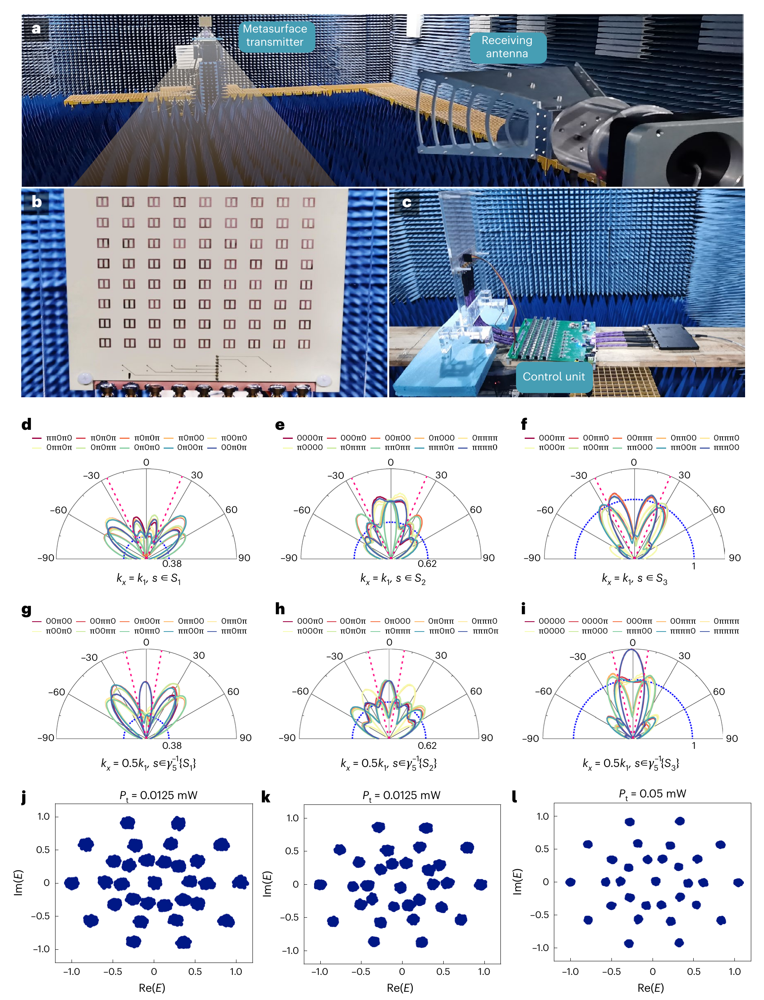

**Original caption:** Fig. 4 | Experimental results of information mapping scheme based on a programmable metasurface antenna. a, Measurement setup of the programmable metasurface antenna in a microwave anechoic chamber. b,c, Photographs of the programmable metasurface antenna (b) and the integrated controlling unit (c). d–f, Measured far-field radiation patterns with respect to the encoding sequences {S₁} (d), {S₂} (e) and {S₃} (f). The two red dashed lines mark the angles of the –first-harmonic and first-harmonic directions, and the blue dashed semicircles mark the normalized amplitude of α₁ = 0.38, α₂ = 0.62 and α₃ = 1. g–i, Measured far-field radiation patterns with respect to the encoding sequence sets γ⁻¹₅{S₁} (g), γ⁻¹₅{S₂} (h) and γ⁻¹₅{S₃} (i). The two red dashed lines mark the angles of the negative and positive half-harmonic directions, and the blue dashed semicircles mark the normalized amplitude levels of α₁ = 0.38, α₂ = 0.62 and α₃ = 1. j–l, Experimentally retrieved constellation diagrams in the first-harmonic direction, where the input power fed to the programmable metasurface antenna (Pₜ) is 0.0125 mW (j), 0.025 mW (k) and 0.05 mW (l).

**中文图注:** 图 4：基于可编程超表面天线的信息映射方案实验结果。a，微波暗室中可编程超表面天线的测量装置。b,c，可编程超表面天线 (b) 与集成控制单元 (c) 的照片。d–f，对应编码序列集合 {S₁} (d)、{S₂} (e)、{S₃} (f) 的实测远场辐射方向图；两条红色虚线标注 −一次谐波与一次谐波方向，蓝色虚线圈标注归一化幅度 α₁ = 0.38、α₂ = 0.62、α₃ = 1。g–i，对应编码序列集合 γ⁻¹₅{S₁} (g)、γ⁻¹₅{S₂} (h)、γ⁻¹₅{S₃} (i) 的实测远场辐射方向图；两条红色虚线标注负、正半谐波方向，蓝色虚线圈标注归一化幅度 α₁ = 0.38、α₂ = 0.62、α₃ = 1。j–l，一次谐波方向实验提取的星座图，输入功率 Pₜ 分别为 0.0125 mW (j)、0.025 mW (k) 与 0.05 mW (l)。

**Reading note:** d–f 与 g–i 分别是第一/半谐波方向按集合测量的方向图——同集合状态幅度几乎一致（α₁/α₂/α₃），验证了理论分类；j–l 是同一角（23°）重复 1000 次测量合成的星座：Pₜ 增大到 0.05 mW 后 31 个状态点可无歧义分辨。

## 5 模拟数据传输 SIMULATED DATA TRANSMISSION

**Original:** Here we propose a simulated data transmission experiment to illustrate how a picture can be transmitted using our proposed scheme, with a detailed description of the bit string encoding provided in Methods. A test image with a size of 971k bytes was converted into a series of pixels, each represented by an 8-bit binary string. Next, the bit strings of the image pixels are grouped into a long bit stream. Following this, the bit stream is segmented into 9-bit binary strings, where each string is assigned with two programmable patterns. To simulate a noisy communication channel, complex Gaussian noise is added to the experimentally retrieved constellation diagram, yielding different levels of SNRs (Fig. 5a–c). More details about the partitioning of the constellation diagram are provided in Supplementary Section 18. Afterwards, the test image can be reconstructed by decoding each segment of the 9-bit string based on the obtained harmonic-field responses in the simulated noisy channel. The reconstructed images under SNR levels of 7 dB, 12 dB and 17 dB are plotted in Fig. 5d–f, respectively. The obtained image exhibits a high level of blurriness under the SNR of 7 dB. In comparison, the quality of the reconstructed image is greatly improved when the SNR increases to 12 dB, and achieves pronounced clarity under the SNR of 17 dB.

**中文:** 这里我们提出一个模拟数据传输实验，演示如何用所提出的方案传输一幅图片（比特串编码的详细描述见 Methods）。一张 971k 字节的测试图像先被转换为一系列像素，每个像素用 8 比特二进制串表示；随后把所有像素的比特串拼成一条长比特流。接着，比特流被切分为 9 比特的二进制串，每个 9 比特串被分配给两个可编程图案。为模拟有噪通信信道，我们向实验提取的星座图加入复高斯噪声，产生不同的 SNR 电平（图 5a–c；星座图划分的更多细节见补充材料第 18 节）。之后，根据模拟有噪信道中得到的谐波场响应，对每个 9 比特串分段解码即可重建测试图像。SNR 为 7 dB、12 dB 与 17 dB 时的重建图像见图 5d–f：SNR = 7 dB 时图像高度模糊；SNR 提高到 12 dB 后图像质量大幅改善；SNR = 17 dB 时图像清晰度显著。

**Original:** During the simulated image transmission, the bit error rate is calculated too (Fig. 5g). Both analytically and experimentally retrieved constellation diagrams are used to decode the transmitted image. The computed bit error rate falls below 10⁻⁶ at an SNR of 15 dB when decoding is performed using an analytical constellation diagram and at an SNR of 17 dB when using experimentally retrieved constellation diagram. The bit error rate obtained from the experimental constellation diagram is greater than the analytically calculated ones, which is attributed to the distortion of the states in the experimentally retrieved constellation diagram. Optimizing the meta-array to generate a constellation diagram that more closely aligns with the theoretical model is expected to further reduce the bit error rate.

**中文:** 在模拟图像传输过程中，我们还计算了误码率（图 5g），并分别用解析提取与实验提取的星座图对传输图像解码。采用解析星座图解码时，误码率在 SNR = 15 dB 时降至 10⁻⁶ 以下；采用实验提取星座图时，则需 SNR = 17 dB。实验星座图得到的误码率高于解析计算结果，这归因于实验提取星座图中状态点的畸变。若优化超原子阵列，使其生成的星座图更贴近理论模型，有望进一步降低误码率。

### 图 5 模拟数据传输实验中的误码率评估

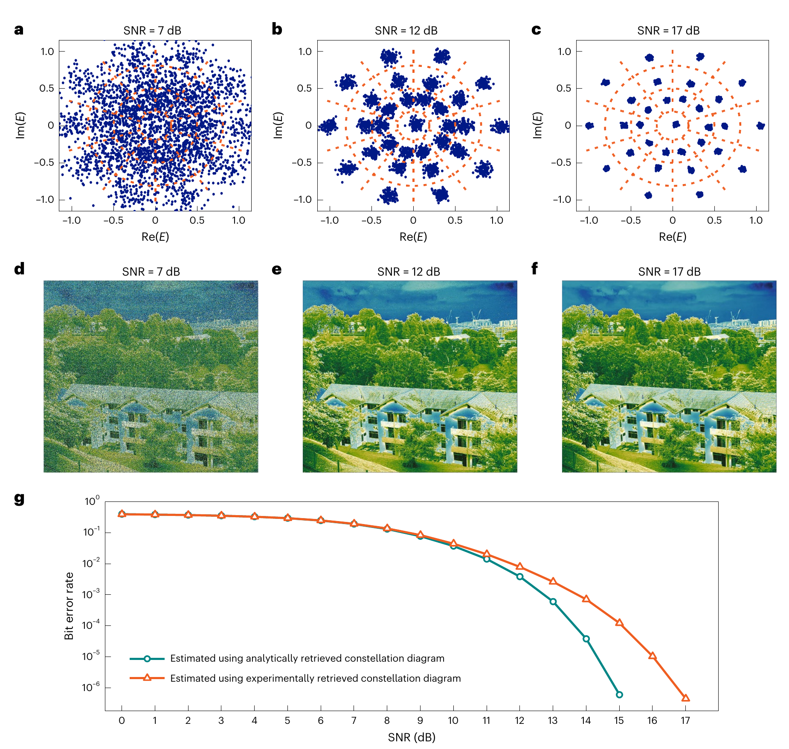

**Original caption:** Fig. 5 | Bit-error-rate evaluation through a simulated data transmission experiment. a–c, Complex Gaussian functions are added to the experimentally retrieved constellation diagram to model a communication channel with SNRs of 7 dB (a), 12 dB (b) and 17 dB (c). d–f, Reconstructed images under SNRs of 7 dB (d), 12 dB (e) and 17 dB (f). g, Calculated bit error rates during simulated image transmission using both analytically and experimentally retrieved constellation diagrams. The green curve corresponds to the calculated bit error rates utilizing the analytical constellation diagram (Supplementary Fig. 16a shows the distribution of the constellation diagram). The orange curve corresponds to the calculated bit error rates utilizing the experimentally retrieved constellation diagram. The experimentally retrieved constellation diagram was obtained by taking the average of the experimentally retrieved harmonic-field responses for each sequence in Fig. 4l, and the obtained constellation diagram is shown in Supplementary Fig. 16b.

**中文图注:** 图 5：通过模拟数据传输实验评估误码率。a–c，向实验提取的星座图加入复高斯函数以模拟 SNR 分别为 7 dB (a)、12 dB (b) 与 17 dB (c) 的通信信道。d–f，SNR 为 7 dB (d)、12 dB (e) 与 17 dB (f) 时的重建图像。g，用解析提取与实验提取两种星座图解码的模拟图像传输误码率：绿色曲线对应解析星座图（星座分布见补充图 16a），橙色曲线对应实验提取星座图（由对图 4l 中各序列的实验谐波场响应取平均得到，见补充图 16b）。

**Reading note:** 该图展示了端到端图像传输验证：随 SNR 提高（a→c）星座点噪声变小、重建图像（d→f）从模糊到清晰；g 图 BER 曲线显示解析星座在 ~15 dB、实验星座在 ~17 dB 达到 10⁻⁶，实验曲线偏高源于实测星座点畸变。

## 6 结论 CONCLUSIONS

**Original:** The proposed communication scheme features a simpler architecture than conventional MIMO systems. However, this simplification comes with trade-offs in terms of functionalities. The MIMO-based transmitters are capable of dynamic beam steering, active beamforming, adaptable control of modulation schemes to accommodate varying channel conditions and supporting high and dynamic bandwidths for data transmission. These capabilities are currently absent in our prototype, but they could be realized in principle in the future. Overall, the proposed scheme is still in the early stage of development and faces several challenges and limitations that necessitate further exploration and improvement.

**中文:** 所提出的通信方案比传统 MIMO 系统架构更简单，但这种简化也带来功能上的取舍。基于 MIMO 的发射机能够进行动态波束控制、主动波束赋形、自适应调整调制方案以适配变化的信道条件，并支持高且动态的带宽用于数据传输——这些能力目前在我们的样机中尚不具备，但原则上未来可以实现。总体而言，本方案仍处于发展初期，面临若干有待进一步探索与改进的挑战与局限。

**Original:** In this study, only one-dimensional programmable metasurface antenna-based transmitters were investigated. It is conceivable to adopt a programmable metasurface antenna-assisted transmitter using two-dimensional encodings to send information at the two-dimensional spatial harmonic (or half-harmonic), which could potentially provide a greater enhancement of the data transmission rate for the programmable metasurface antenna-assisted wireless networks.

**中文:** 本研究只考察了一维可编程超表面天线发射机。可以设想，采用二维编码的可编程超表面天线辅助发射机在二维空间谐波（或半谐波）方向发送信息，将可能为可编程超表面天线辅助的无线网络带来更大的数据传输速率提升。

**Original:** We have reported a programmable metasurface antenna-based transmitter that approaches the maximum information mapping efficiency. Our approach incorporates non-recurrent encoding and spatial harmonic retrieval, and we showed that our model can achieve symmetrically distributed and distinctive far-field responses in the first-harmonic direction. Cascaded encoding was used to enhance the power efficiency of the communication networks and to suppress unwanted energy radiation to the non-harmonic angles. We performed a simulated data transmission experiment and demonstrated bit stream transmission using our model. Our findings are generally applicable over a wide spectral range and lay the groundwork for future programmable metasurface antenna-enabled high-speed radio-frequency-chain-free wireless networks.

**中文:** 我们报道了一种逼近最大信息映射效率的可编程超表面天线发射机。该方法融合非递归编码与空间谐波检索，证明我们的模型能在一次谐波方向产生对称分布且彼此独特的远场响应；级联编码被用于提升通信网络的功率效率并抑制向非谐波角度辐射的无用能量。我们还开展了模拟数据传输实验，验证了基于该模型的比特流传输。研究结果普遍适用于宽频谱范围，为未来由可编程超表面天线赋能的、无需射频链路的高速无线网络奠定了基础。

## Methods 方法

### M.1 编码序列与远场响应（Encoding sequence and far-field response）

**Original:** A metasurface or metasurface antenna can scatter/radiate the electromagnetic waves to the far-field region, where the far-field pattern (E₂(k)) is proportional to the Fourier transform of the field distribution on the metasurface (E₁(r)):

**中文:** 超表面或超表面天线能把电磁波散射/辐射到远场区，其远场方向图 E₂(k) 正比于超表面上场分布 E₁(r) 的傅里叶变换：

**中文说明：** 式 (6) 即 E₂(k) ∝ ∫∫E₁(r)e^(−jkr)dr = F[E₁(r)]，其中 ℱ 表示傅里叶变换，k 是辐射方向 (θ, φ) 的函数：k = [kₓ, k_y] = [ksinθcosφ, ksinθsinφ]。

**Original:** where ℱ denotes the Fourier transform. The vector k is a function of the elevation and azimuth angles (θ, φ) of the radiation direction such that k = [kₓ, k_y] = [ksinθcosφ, ksinθsinφ]. For the model of a one-dimensional programmable metasurface, equation (5) can be simplified to E₂(kₓ) ∝ ∫E₁(x)·e^(−jkₓx)dx, where kₓ = ksinθ.

**中文:** 其中 ℱ 表示傅里叶变换；向量 k 是辐射方向仰角与方位角 (θ, φ) 的函数：k = [kₓ, k_y] = [ksinθcosφ, ksinθsinφ]。对于一维可编程超表面模型，式 (5)（原文如此，应指式 (6)）可简化为 E₂(kₓ) ∝ ∫E₁(x)·e^(−jkₓx)dx，其中 kₓ = ksinθ。

**Original:** A typical 1-bit programmable metasurface is composed of a meta-atom array with p columns, where the phase state of each column of elements can be independently switched from 0 to π (or from π to 0) in real time by the integrated control unit. Here the width of each column of the meta-array is denoted as d, and the electric-field distribution on a column of the meta-array as φ_d(x) for the zero-phase state. Accordingly, the field distribution on the same column of the meta-array can be approximated as –φ_d(x) for the π-phase state. As a result, the overall field distribution on the metasurface plane can be expressed as the convolution of the aperture function of the meta-atoms (φ_d(x)) and the encoding sequence such that

**中文:** 典型 1 比特可编程超表面由含 p 列超原子的阵列构成，每列单元的相位状态可由集成控制单元在 0 与 π（或 π 与 0）之间实时独立切换。设超原子阵列每列宽度为 d，零相位状态下该列的电场分布为 φ_d(x)；相应地，π 相位状态下同一列的场分布可近似为 −φ_d(x)。于是，超表面平面上的总场分布可表示为超原子口径函数 φ_d(x) 与编码序列的卷积：

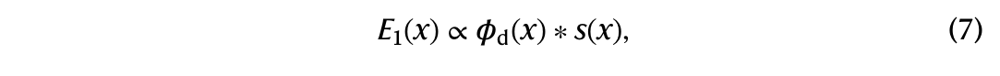

**中文说明：** 式 (7) 即 E₁(x) ∝ φ_d(x) ∗ s(x)，其中 s(x) = Σₘ₌₀^{p−1}[δ(x−md)] × exp(−jφₘ) 是长度为 p 的离散编码序列，δ(x) 为狄拉克 δ 函数，φₘ 为第 m 列超原子阵列的相位响应（下标在原文图注中写作 m−1）。

**Original:** where s(x) = Σₘ₌₀^{p−1}[δ(x−md)] × exp(−jφₘ) represents a discrete encoding sequence with length p. The term δ(x) denotes the Dirac delta function and φₘ represents the phase response of the mth column of the meta-atom array. Following the convolution theorem, the radiated electric far field can be expressed as the product of the Fourier transform of the aperture function and the encoding sequence such that

**中文:** 其中 s(x) = Σₘ₌₀^{p−1}[δ(x−md)] × exp(−jφₘ) 表示长度为 p 的离散编码序列，δ(x) 为狄拉克 δ 函数，φₘ 为第 m 列超原子阵列的相位响应。根据卷积定理，辐射电远场可表示为口径函数的傅里叶变换与编码序列傅里叶变换的乘积：

**中文说明：** 式 (8) 即 E₂(kₓ) ∝ F[φ_d(x)] × F[s(x)] = f(kₓ) × F[s(x)]，其中 f(kₓ) 是零相位状态下单列超原子产生的远场响应。

**Original:** where f(kₓ) represents the far-field response generated by a single column of meta-atoms in the zero-phase state. In particular, the Fourier transform of the encoding sequence can be further formulated as

**中文:** 其中 f(kₓ) 表示零相位状态下单列超原子产生的远场响应。特别地，编码序列的傅里叶变换可进一步写成：

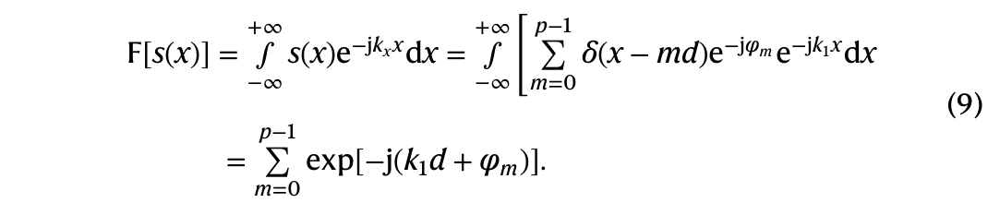

**中文说明：** 式 (9) 给出 F[s(x)] = ∫₋∞^{+∞} s(x)e^(−jkₓx)dx = ∫₋∞^{+∞} [Σₘ₌₀^{p−1} δ(x−md)e^(−jφₘ)e^(−jk₁x)]dx = Σₘ₌₀^{p−1} exp[−j(k₁d + φₘ)]（注意原文被积函数下标处 k₁ 的用法）。

**Original:** As a result, the far-field responses generated by the programmable metasurface can be represented as

**中文:** 因此，可编程超表面产生的远场响应可表示为：

**中文说明：** 式 (10) 即 E₂(kₓ) ∝ f(kₓ) × F[s(kₓ)] = f(kₓ) × Σₘ₌₀^{p−1} exp[−j(mkₓd + φₘ)]，由此建立了辐射方向图 E₂(kₓ) 与编码序列之间的关系（详细分析见补充材料第 1 节）。

**Original:** from which a relation between the radiation pattern (E₂(kₓ)) and the encoded sequence is built. Detailed analysis is provided in Supplementary Section 1.

**中文:** 由此建立了辐射方向图 E₂(kₓ) 与编码序列之间的关系，详细分析见补充材料第 1 节。

### M.2 一次谐波方向远场响应的独特性（Distinctiveness of far-field responses at the first harmonic）

**Original:** Since the far-field responses generated by the two encoding sequences are assumed to be the same in the first-harmonic direction, the two sequences must satisfy equation (2). To simplify the analysis, we denote half of the difference between the sequences c and d as h, which is expressed as h = 0.5 × (c – d) = 0.5 × (c₀ – d₀, c₁ – d₁,…, cₚ₋₁ – dₚ₋₁). Accordingly, equation (2) can be rewritten as Σₘ₌₀^{p−1} hₘ × exp(−jm2π/p) = 0, and the new sequence h is composed of 1s, 0s and −1s, and must contain at least two different numbers since the sequences c and d are different.

**中文:** 既然假设两条编码序列在一次谐波方向产生的远场响应相同，它们就必须满足式 (2)。为简化分析，记序列 c 与 d 差的一半为 h，即 h = 0.5 × (c – d) = 0.5 × (c₀ – d₀, c₁ – d₁,…, cₚ₋₁ – dₚ₋₁)。于是式 (2) 可改写为 Σₘ₌₀^{p−1} hₘ × exp(−jm2π/p) = 0；新序列 h 由 1、0、−1 组成，且因 c 与 d 不同，h 中至少包含两种不同的数。

**Original:** In particular, a cyclic permutation (R) of the encoding sequence h from h = [h₀, h₁,…, hₚ₋₂, hₚ₋₁] to R(h) = [hₚ₋₁, h₀,…, hₚ₋₃, hₚ₋₂] will generate a phase shift of exp(–j2π/p) at the first harmonic. Accordingly, p distinctive cyclic permutation operations (R⁰, R¹, R²,…, Rᵖ⁻¹) can be performed on the sequence h, and the resultant first-harmonic responses will be zero, too. As a result, the first-harmonic responses generated by all the cyclic permuted sequences can be expressed in the matrix form as follows:

**中文:** 特别地，对编码序列 h 做循环置换 R：h = [h₀, h₁,…, hₚ₋₂, hₚ₋₁] → R(h) = [hₚ₋₁, h₀,…, hₚ₋₃, hₚ₋₂]，将使其一次谐波响应产生 exp(−j2π/p) 的相移。因此，可对序列 h 施加 p 种不同的循环置换（R⁰, R¹, R²,…, Rᵖ⁻¹），所得一次谐波响应同样为零。于是，全部循环置换序列的一次谐波响应可写成如下矩阵形式：

**中文说明：** 式 (11) 即 R^qₘ × ζₘ = 0：p 维矩阵 R 的第 q 列为循环置换序列 R^(q−1)(h)，ζ 为 p 维列向量，其分量 ζₘ = exp[−(m−1)j2π/p]；并且列向量 ζ 的元素之和为零。

**Original:** where the qth column of the p-dimensional matrix R is the cyclic permuted sequence R^(q–1)(h), and ζ represents the p-dimensional column vector such that ζₘ = exp[−(m−1)j2π/p]. Note that the sum of the elements of the column vector ζ is zero. Thus, we can construct another matrix equation such that J^qₘζₘ = 0, where each entry of the matrix J is 1. Due to the homogeneity of the matrix equations, a third matrix equation can be constructed by the summation of the two matrix equations such that

**中文:** 其中 p 维矩阵 R 的第 q 列为循环置换序列 R^(q−1)(h)，ζ 为 p 维列向量，其分量 ζₘ = exp[−(m−1)j2π/p]。注意列向量 ζ 的元素之和为零，因此可构造另一个矩阵方程 J^qₘζₘ = 0（矩阵 J 的每个元素都是 1）。由于矩阵方程具有齐次性，将两个矩阵方程相加可构造第三个矩阵方程：

**中文说明：** 式 (12) 即 Mζ = (R + J)ζ = 0。M 是满足循环条件 Mⁱ⁺¹ⱼ₊₁ = Mⁱⱼ 的循环矩阵，其元素由 2、1、0 等非负整数构成。

**Original:** Evidently, M is a circulant matrix satisfying the circulation condition Mⁱ⁺¹ⱼ₊₁ = Mⁱⱼ, and the matrix elements of M consist of non-negative integers comprising 2s, 1s and 0s. Since M is a real-valued matrix, the matrix equation Mζ = 0 can hold only if M is singular. However, we will show in the following that such a matrix must be non-singular as long as the encoding sequences are non-recurrent.

**中文:** 显然，M 是满足循环条件 Mⁱ⁺¹ⱼ₊₁ = Mⁱⱼ 的循环矩阵，其元素由 2、1、0 等非负整数构成。由于 M 是实矩阵，矩阵方程 Mζ = 0 只有在 M 奇异时才可能成立；但下面将证明：只要编码序列是非递归的，这样的矩阵必然非奇异。

**Original:** To demonstrate the non-singularity of the matrix M, we invoke the theorem that the rank of a real circulant matrix is p – d, where d is the degree of the greatest common divisor between α(x) and xᵖ – 1 (ref. 42). The associated polynomial of the circulant matrix (α(x)) can be expressed as

**中文:** 为证明矩阵 M 的非奇异性，我们引用如下定理：实循环矩阵的秩为 p − d，其中 d 是 α(x) 与 xᵖ − 1 的最大公因式的次数（文献 42）。循环矩阵的伴随多项式 α(x) 可表示为：

**中文说明：** 式 (13) 即 α(x) = M¹₁ + M¹₂x + … + M¹ₚx^(p−1)（上标为行号，下标为列号；正文写作 Mⁱⱼ）。

**Original:** Since the length of the encoding sequence is an odd prime number, the term xᵖ – 1 is irreducibly factored out as xᵖ – 1 = (x – 1)(xᵖ⁻¹ + xᵖ⁻² +…+ 1), where the irreducibility is guaranteed by the Eisenstein’s criterion (Supplementary Section 5).

**中文:** 由于编码序列长度为奇素数，xᵖ − 1 可不可约地分解为 xᵖ − 1 = (x − 1)(xᵖ⁻¹ + xᵖ⁻² + … + 1)，其中不可约性由艾森斯坦判别法保证（补充材料第 5 节）。

**Original:** In particular, the matrix elements of M cannot be the same (all 0s, all 1s or all 2s) because the encoding sequences (c and d) are required to be different and non-recurrent. Thus, the associated polynomial of the matrix M cannot be expressed as multiples of xᵖ⁻¹ + xᵖ⁻² +…+ 1. That is, the associated polynomial does not share any non-trivial common divisor with the term xᵖ⁻¹ + xᵖ⁻² +…+ 1.

**中文:** 特别地，矩阵 M 的元素不可能全部相同（全 0、全 1 或全 2），因为编码序列 c 与 d 要求彼此不同且均为非递归序列。因此，矩阵 M 的伴随多项式不可能等于 xᵖ⁻¹ + xᵖ⁻² + … + 1 的倍数，即伴随多项式与 xᵖ⁻¹ + xᵖ⁻² + … + 1 不共享任何非平凡公因子。

**Original:** On the contrary, since the matrix M cannot consist of all 0s, the coefficients of the associated polynomial α(x) must include at least one positive value. As a result, the summation of the coefficients of the polynomial must be greater than zero, which can be expressed as α(1) > 0. In other words, α(x) and x – 1 do not share any non-trivial common divisor either.

**中文:** 反过来，由于矩阵 M 不可能全为 0，伴随多项式 α(x) 的系数中至少有一个正值，因而多项式系数之和必大于零，即 α(1) > 0。换言之，α(x) 与 x − 1 也不共享任何非平凡公因子。

**Original:** The above analysis demonstrates that the degree of the greatest common divisor between α(x) and xᵖ – 1 must be zero (d = 0), and therefore, the rank of the circulant matrix M can be derived as p – 0 = p. Therefore, we have proved that the circulant matrix M must be non-singular if the length of the encoding sequence is an odd prime.

**中文:** 以上分析表明：α(x) 与 xᵖ − 1 的最大公因式的次数必为零（d = 0），因此循环矩阵 M 的秩为 p − 0 = p。由此证明：当编码序列长度为奇素数时，循环矩阵 M 必然非奇异。

**Original:** In particular, when the length of the 1-bit encoding sequence is a composite number, the harmonic-field responses generated by all available encoding sequences generally exhibit a greater number of degenerated states in the resulting constellation diagram (Supplementary Section 9).

**中文:** 特别地，当 1 比特编码序列长度为合数时，全部可用编码序列产生的谐波场响应在星座图中通常呈现更多的简并状态（补充材料第 9 节）。

### M.3 半谐波方向的远场响应（Far-field responses in the half-harmonic direction）

**Original:** It has been shown that the far-field responses of the programmable metasurface antenna in the half-harmonic and first-harmonic directions are proportional to the inner product between the encoding sequence (s) and the gradient term as g₁/₂ = g(π/pd) = [1, exp(−jπ/p), …, exp(−(p−1)jπ/p)] and g₁ = g(2π/pd) = [1, exp(−j2π/p), …, exp(−(p−1)j2π/p)], respectively. Now, suppose m is an even number; then, the mth element in g₁/₂ is related to the ((m/2)+1)th element in g₁ by g₁/₂(m) = −g₁((m/2)+1). Similarly, when m is an odd number, the mth element in g₁/₂ is related to the ((m+1)/2)th element in g₁ by g₁/₂(m) = g₁((m+1)/2). Thus, it is possible to construct a non-degenerate transformation matrix γₚ between these two phase gradients. For instance, when the length of the encoding sequence is p = 5, the phase gradients g₁/₂ and g₁ are related by the matrix transformation rule such that

**中文:** 前面已表明，可编程超表面天线在半谐波与一次谐波方向的远场响应分别正比于编码序列 s 与梯度项 g₁/₂ = g(π/pd) = [1, exp(−jπ/p), …, exp(−(p−1)jπ/p)] 和 g₁ = g(2π/pd) = [1, exp(−j2π/p), …, exp(−(p−1)j2π/p)] 的内积。设 m 为偶数，则 g₁/₂ 的第 m 个元素与 g₁ 的第 (m/2+1) 个元素满足 g₁/₂(m) = −g₁(m/2+1)；当 m 为奇数时，g₁/₂(m) = g₁((m+1)/2)。因此可以在两条相位梯度之间构造非退化变换矩阵 γₚ。例如，当编码序列长度 p = 5 时，相位梯度 g₁/₂ 与 g₁ 满足如下矩阵变换规则：

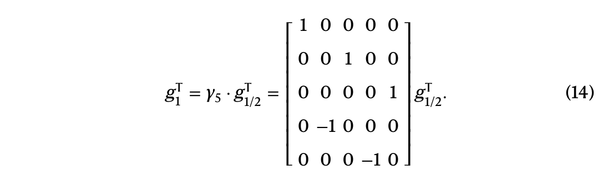

**中文说明：** 式 (14) 即 p = 5 时 g₁ᵀ = γ₅·g₁/₂ᵀ = [1 0 0 0 0; 0 0 1 0 0; 0 0 0 0 1; 0 −1 0 0 0; 0 0 0 −1 0]·g₁/₂ᵀ，γ₅ 为非退化矩阵。

**Original:** It can be easily verified that the matrix γₚ is non-degenerate. That is, the array factor retrieved in the half-harmonic direction for the encoding sequence γ⁻¹₅·s will be the same as the array factor retrieved at the first harmonic for encoding sequence s. For instance, the sequence s = [1, 1, 1, 1, 1] will produce zero in the first-harmonic direction. Thus, we can adopt inverse matrix transformation to obtain the sequence γ⁻¹₅·s = [1, −1, 1, −1, 1]. It can be verified that the sequence γ⁻¹₅·s will produce zero in the half-harmonic direction, too. That is, the far-field responses at the half-harmonic exhibits a similar distribution in the complex plane compared with those observed in the first-harmonic direction.

**中文:** 容易验证矩阵 γₚ 非退化：对编码序列 γ⁻¹₅·s，其半谐波方向取回的阵列因子与编码序列 s 在一次谐波方向取回的阵列因子相同。例如，序列 s = [1,1,1,1,1] 在一次谐波方向产生零响应；通过逆矩阵变换得到序列 γ⁻¹₅·s = [1,−1,1,−1,1]，可验证该序列在半谐波方向同样产生零响应。也就是说，半谐波方向的远场响应与一次谐波方向相比，在复平面上呈现相似的分布。

### M.4 负一次谐波方向的共轭对称（Conjugate symmetry in the –first-harmonic direction）

**Original:** Given that the encoding sequence s = (s₀, s₁, s₂,…, sₚ₋₁) is composed of elements that are either 1 or −1, it is, therefore, real valued. Meanwhile, the array factor is expressed as the inner product of the encoding sequence with the phase gradient term: Σₘ₌₀^{p−1} sₘ·exp(−jmkₓd). Thus, changing kₓ to –kₓ is equivalent to flipping j to –j in this expression. As a result, the constellation diagram produced at the –first harmonic will exhibit conjugation symmetry (j→–j) with the constellation diagram produced at the first harmonic. Therefore, it is also possible to adopt the –first harmonic to realize information mapping and wireless communications. However, the decoding scheme at the –first harmonic should differ from that used at the first harmonic, as the resulting points in the constellation diagram are conjugate with those at the first harmonic. More details are shown in Supplementary Section 17.

**中文:** 编码序列 s = (s₀, s₁, s₂,…, sₚ₋₁) 的元素为 1 或 −1，因此它是实值序列；而阵列因子表示为编码序列与相位梯度项的内积 Σₘ₌₀^{p−1} sₘ·exp(−jmkₓd)。把 kₓ 变为 −kₓ，等价于在该表达式中把 j 变为 −j。因此，负一次谐波方向产生的星座图与一次谐波方向产生的星座图呈共轭对称关系（j→−j）。所以也可以利用负一次谐波实现信息映射与无线通信，但其解码方案应与一次谐波不同——因为该方向星座图的各点与一次谐波方向互为共轭（详见补充材料第 17 节）。

### M.5 集合 {Sᵢ} 内的编码序列（Encoding sequences in sets {Sᵢ}）

**Original:** In particular, the sequences in the set of {Sᵢ} are related by cyclic permutations (R) and sign inversions (σ). For instance, consider an encoding sequence s₁ = [1, –1, 1, –1, 1] within the set {S₁}. By performing all the possible combinations of cyclic permutations and sign inversions to s₁, all the ten sequences contained within the set {S₁} will be generated. These ten sequences can be represented as s₁ = [1, –1, 1, –1, 1], R(s₁) = [1, 1, –1, 1, –1], R²(s₁) = [–1, 1, 1, –1, 1], R³(s₁) = [1, –1, 1, 1, –1], R⁴(s₁) = [–1, 1, –1, 1, 1], σ(s₁) = [–1, 1, –1, 1, –1], Rσ(s₁) = [–1, –1, 1, –1, 1], R²σ(s₁) = [1, –1, –1, 1, –1], R³σ(s₁) = [–1, 1, –1, –1, 1] and R⁴σ(s₁) = [1, –1, 1, –1, –1]. In a similar way, the encoding sequences contained within the sets {S₂} and {S₃} can be generated by performing all the possible combinations of cyclic permutations and sign inversions to the encoding sequence s₂ = [1, 1, 1, 1, –1] and s₃ = [1, 1, 1, –1, –1], respectively.

**中文:** 集合 {Sᵢ} 内的序列由循环置换（R）与符号翻转（σ）相互联系。以 {S₁} 中的编码序列 s₁ = [1,−1,1,−1,1] 为例：对 s₁ 施加全部可能的循环置换与符号翻转组合，即可生成 {S₁} 所含的十条序列——s₁、R(s₁)=[1,1,−1,1,−1]、R²(s₁)=[−1,1,1,−1,1]、R³(s₁)=[1,−1,1,1,−1]、R⁴(s₁)=[−1,1,−1,1,1]、σ(s₁)=[−1,1,−1,1,−1]、Rσ(s₁)=[−1,−1,1,−1,1]、R²σ(s₁)=[1,−1,−1,1,−1]、R³σ(s₁)=[−1,1,−1,−1,1]、R⁴σ(s₁)=[1,−1,1,−1,−1]。类似地，{S₂} 与 {S₃} 中的编码序列可分别由 s₂ = [1,1,1,1,−1] 与 s₃ = [1,1,1,−1,−1] 施加全部循环置换与符号翻转组合生成。

### M.6 非谐波方向的远场响应（Far-field responses in non-harmonic directions）

**Original:** Though it is possible to transmit information at non-harmonic directions, retrieving data at non-harmonic angles has three major drawbacks. First, the rotational symmetry of the far-field responses in the constellation diagram will be inevitably broken when the retrieving angle is not the integer or half-integer harmonic, and thus, it causes great difficulties in decoding information from the distorted far-field distribution. Second, when noises are present, the far-field responses at the non-harmonic angles are more likely to overlap, compared with the harmonic (or half-harmonic) angle, which causes a notable decrease in the information mapping efficiency. Furthermore, the radiated energy at the non-harmonic angles will be notably reduced when the cascaded encoding is introduced (Supplementary Section 7).

**中文:** 虽然也可以在非谐波方向传输信息，但在非谐波角度取回数据有三个主要缺点：其一，当取回角度不是整数或半整数谐波时，星座图中远场响应的旋转对称性必然被破坏，从而给从畸变远场分布中解码信息带来很大困难；其二，在有噪声时，非谐波角度的远场响应比谐波（或半谐波）角度更易重叠，导致信息映射效率明显下降；其三，引入级联编码后，非谐波角度的辐射能量将显著降低（补充材料第 7 节）。

### M.7 实验装置与测量（Experimental setup and measurements）

**Original:** The experimental setup for measuring the far-field responses of the programmable metasurface antenna-based transmitter were established in a microwave anechoic chamber. A vector network analyser was utilized to retrieve the far-field amplitude and phase responses of the programmable metasurface antenna. The programmable metasurface antenna was placed on a turntable, and the far-field responses can be measured with the angular accuracy of 1°. The five inner columns of the meta-atoms were connected to port 1 of the vector network analyser via a power divider and a power amplifier, whereas the four outer columns were connected to matching loads and served as dummy elements. The phase state of the meta-array was controlled by a single-chip microcomputer. A dual-ridged horn antenna operating from 2 to 18 GHz was connected to port 2 through a low-noise amplifier to receive the transmitted signals. Due to the angular accuracy of 1° for the far-field measurement, interpolation is used to obtain the far-field responses at fractional angles.

**中文:** 测量可编程超表面天线发射机远场响应的实验装置搭建于微波暗室中：用矢量网络分析仪提取天线的远场幅度与相位响应；天线置于转台上，远场测量角度精度为 1°。超原子的中央五列经功分器与功率放大器接到矢量网络分析仪端口 1，外侧四列接匹配负载作为哑元；超原子阵列的相位状态由单片机控制。一只工作频带 2–18 GHz 的双脊喇叭天线经低噪声放大器接至端口 2 作为接收。由于远场测量角度精度为 1°，分数角度处的远场响应通过插值获得。

**Original:** As shown in Fig. 4d–f, the dashed red lines mark the angles that correspond to the first-harmonic direction (θ = ±sin⁻¹(2π/pd)) and the half-harmonic direction (θ = ±sin⁻¹(π/pd)). In particular, the coded sequences can be partitioned into four sets based on their respective amplitude levels in the first-harmonic direction (Fig. 2h). Specifically, the four levels of normalized amplitude can be determined as α₀ = 0, α₁ ≈ 0.38, α₂ ≈ 0.62 and α₃ = 1, where the encoding sequences within the same set are related by the right cyclic permutation and sign flipping. For instance, it can be shown that the encoding s₁ = [1, 1, 1, 1, –1] produces the far-field radiation pattern with normalized amplitude of α₁ in the first-harmonic direction. Hence, applying right cyclic permutation and sign flipping to the sequence s₁ yields all ten sequences with identical amplitude responses at the first harmonic. The generated ten sequences can be represented as follows: s₁ = [1, 1, 1, 1, –1], R·s₁ = [–1, 1, 1, 1, 1], R²·s₁ = [1, –1, 1, 1, 1], R³·s₁ = [1, 1, –1, 1, 1], R⁴·s₁ = [1, 1, 1, –1, 1], –s₁ = [–1, –1, –1, –1, 1], –(R·s₁) = [1, –1, –1, –1, –1], –(R²·s₁) = [–1, 1, –1, –1, –1], –(R³·s₁) = [–1, –1, 1, –1, –1] and –(R⁴·s₁) = [–1, –1, –1, 1, –1].

**中文:** 如图 4d–f 所示，红色虚线标注的角分别对应一次谐波方向（θ = ±sin⁻¹(2π/pd)）与半谐波方向（θ = ±sin⁻¹(π/pd)）。特别地，编码序列可按其一次谐波方向的幅度电平划分为四个集合（图 2h）：四个归一化幅度电平确定为 α₀ = 0、α₁ ≈ 0.38、α₂ ≈ 0.62 与 α₃ = 1，同一集合内的编码序列通过右循环置换与符号翻转相互联系。例如，可证明编码 s₁ = [1,1,1,1,−1] 在一次谐波方向产生归一化幅度 α₁ 的辐射方向图；因此，对 s₁ 施加右循环置换与符号翻转可得到一次谐波方向幅度响应全部相同的十条序列：s₁、R·s₁=[−1,1,1,1,1]、R²·s₁=[1,−1,1,1,1]、R³·s₁=[1,1,−1,1,1]、R⁴·s₁=[1,1,1,−1,1]、−s₁=[−1,−1,−1,−1,1]、−(R·s₁)=[1,−1,−1,−1,−1]、−(R²·s₁)=[−1,1,−1,−1,−1]、−(R³·s₁)=[−1,−1,1,−1,−1]、−(R⁴·s₁)=[−1,−1,−1,1,−1]。

**Original:** Likewise, the programmable patterns with normalized amplitudes of α₂ and α₃ can be obtained by applying cyclic permutation and sign inversion to the sequences s₂ = [1, 1, 1, –1, –1] and s₃ = [1, 1, –1, 1, –1]. Similarly, the encoding sequence exhibiting a normalized amplitude response of αᵢ at the half-harmonic can be obtained as γ⁻¹₅·sᵢ based on equation (13), where sᵢ represents the encoding sequence with the normalized amplitude of αᵢ in the first-harmonic direction.

**中文:** 同样地，归一化幅度 α₂、α₃ 的可编程图案可通过分别对 s₂ = [1,1,1,−1,−1] 与 s₃ = [1,1,−1,1,−1] 施加循环置换与符号翻转得到；半谐波方向归一化幅度为 αᵢ 的编码序列则按式 (13)（原文编号）取 γ⁻¹₅·sᵢ，其中 sᵢ 是一次谐波方向归一化幅度为 αᵢ 的编码序列。

**Original:** In particular, the experimentally retrieved harmonic angles (Fig. 4d–i) are deviated slightly from the theoretical predictions. Specifically, the measured angles corresponding to the positive and negative half-harmonics are –9.8° and 13.5°, which deviated from the theoretical prediction (±11.9°) by about 2.1° and 1.6°, respectively. The measured angles corresponding to the ±first harmonics are –23.4° and 26°, which deviated from the theoretical prediction (±24.4°) by about 1° and 1.6°, respectively. In Fig. 4j–l, the angle for the experimental retrieval of the constellation diagrams is 23°, which deviates by about 1.3° from the first-harmonic angle. We consider the slight deviation of the harmonic angles as mainly caused by the calibration error (approximately –1° to –1.5°) of the turntable, for which the far-field states at angle –1° exhibit great agreement with the theoretical prediction in the normal direction (Fig. 4j).

**中文:** 特别地，实验提取的谐波角（图 4d–i）与理论预测略有偏差：正、负半谐波实测角分别为 −9.8° 与 13.5°，相对理论预测 ±11.9° 偏差约 2.1° 与 1.6°；±一次谐波实测角为 −23.4° 与 26°，相对理论预测 ±24.4° 偏差约 1° 与 1.6°。图 4j–l 中实验合成星座图的角度为 23°，与一次谐波角偏差约 1.3°。我们认为谐波角的轻微偏差主要源于转台的标定误差（约 −1° 至 −1.5°）——法向 −1° 处的远场状态与理论预测高度一致（图 4j）。

### M.8 用可编程图案编码比特串（Coding of bit strings with programmable patterns）

**Original:** Bit stream transmission typically uses coding sequences with fixed length L, which necessitates the total number of states at the receiver end to be 2ᴸ. For instance, when the length of each bit string is L = 3, the constellation diagram is required to feature eight unique states, each corresponding to the bit string of ‘000’, ‘001’, ‘010’, ‘011’, ‘100’, ‘101’, ‘110’ and ‘111’.

**中文:** 比特流传输通常使用固定长度 L 的编码序列，这要求接收端的状态总数为 2ᴸ。例如，当每个比特串长度为 L = 3 时，星座图需要具备八个不同状态，分别对应比特串‘000’、‘001’、‘010’、‘011’、‘100’、‘101’、‘110’与‘111’。

**Original:** To encode the bit string with our proposed scheme, it is crucial to select 2ᴸ points from the generated 2ᵖ – 1 points in the constellation diagram. Evidently, the maximum permissible value for L is p – 1, for which the number of unique states in the constellation diagram satisfies the inequality 2ᵖ⁻¹ < 2ᵖ – 1. Since p bits of information are input into the programmable metasurface antenna, the resultant bit mapping efficiency through this approach can be calculated as (p – 1)/p.

**中文:** 用本方案编码比特串的关键，是从星座图产生的 2ᵖ − 1 个状态点中选取 2ᴸ 个。显然，L 的最大允许值为 p − 1，此时星座图状态数满足不等式 2ᵖ⁻¹ < 2ᵖ − 1。由于输入可编程超表面天线的信息为 p 比特，该方法得到的比特映射效率为 (p − 1)/p。

**Original:** Alternatively, one may use multiple programmable patterns to encode a longer bit string, thereby capable of achieving a higher bit mapping efficiency that approaches the theoretical limit of η₁. Specifically, q successive programmable patterns can produce a total number of (2ᵖ–1)^q ≈ 2^(pq) – q outcomes at the receiving end. Thus, it is feasible to use q measurements to retrieve the encoding sequence with length L_q, where L_q denotes the greatest integer less than or equal to log₂(2^(pq) – q).

**中文:** 另一种做法是使用多个可编程图案编码更长的比特串，从而获得逼近理论上限 η₁ 的更高比特映射效率。具体而言，q 个连续的可编程图案在接收端总共可产生 (2ᵖ−1)^q ≈ 2^(pq) − q 种结果，因此可用 q 次测量取回长度为 L_q 的编码序列，其中 L_q 为不超过 log₂(2^(pq) − q) 的最大整数。

**Original:** For instance, in the case of p = 5 and q = 2, using two successive programmable patterns results in a total number of 31 × 31 = 961 outcome states at the first harmonic. In such a case, L_q can be calculated as 9, indicating that 9 bits of information can be transmitted with two successive programmable patterns. Accordingly, the resultant bit mapping efficiency can be computed as 90%. Generally, the bit mapping efficiency will approach the theoretical upper limit of the information mapping efficiency (η₁) as q increases. For instance, in the case where p = 5, the bit mapping efficiency is calculated as 93% for q = 3, and it will increase to 98% for q = 10.

**中文:** 例如，当 p = 5、q = 2 时，两个连续可编程图案在一次谐波方向共产生 31 × 31 = 961 种结果状态；此时 L_q 可算得为 9，即两个连续可编程图案可传输 9 比特信息，相应比特映射效率为 90%。一般而言，随着 q 增大，比特映射效率将逼近信息映射效率的理论上限 η₁：例如 p = 5 时，q = 3 的比特映射效率为 93%，q = 10 时可提高到 98%。

**Original:** In the proposed scheme, it is feasible to use two programmable patterns, each of length 5, to encode an arbitrary binary bit string of length 9. For notational simplicity, we assign 31 programmable patterns with integers ranging from 0 to 30 (Supplementary Table 1). Next, we express each 9-bit string with the form of 31 × γ₁ + γ₀, where γ₀ takes integer values from 0 to 30, and γ₁ takes integer values from 0 to 16. For instance, the binary bit string ‘101010010’ takes the decimal value of 338, and can be represented as 31 × 10 + 28. Accordingly, the integer pair of (γ₁, γ₀) can be determined as (10, 28). Thus, to transmit the bit string ‘101010010’, one can use two successive programmable patterns, specifically ‘−1 1 −1 −1 −1’ followed by ‘−1 1 −1 −1 1’.

**中文:** 在本方案中，可用两个长度均为 5 的可编程图案编码任意 9 比特二进制串。为便于记号，我们把 31 个可编程图案用整数 0 到 30 编号（补充表 1）；然后把每个 9 比特串表示为 31 × γ₁ + γ₀ 的形式，其中 γ₀ 取 0–30 的整数、γ₁ 取 0–16 的整数。例如，二进制串‘101010010’的十进制值为 338，可表示为 31 × 10 + 28，即整数对 (γ₁, γ₀) = (10, 28)。因此，传输比特串‘101010010’时，可使用两个连续可编程图案：‘−1 1 −1 −1 −1’ 后接 ‘−1 1 −1 −1 1’。

**Original:** To reconstruct the transmitted bit string, the constellation diagram is partitioned into 31 distinct regions, too, with each region being assigned with a unique integer from 0 to 30 (Supplementary Section 18). Therefore, the values of γ₁ and γ₀ can be obtained through the measurement of the harmonic-field responses produced by two successive encoding patterns. Accordingly, the encoded bit string can be reconstructed through the conversion of the decimal value of 31 × γ₁ + γ₀ into binary bits.

**中文:** 为重建传输的比特串，星座图同样被划分为 31 个不同区域，每个区域被赋予 0 到 30 的唯一整数（补充材料第 18 节）。因此，通过测量两个连续编码图案产生的谐波场响应，即可得到 γ₁ 与 γ₀ 的值，再把十进制值 31 × γ₁ + γ₀ 转换为二进制比特，就能重建所编码的比特串。

**Original:** Data availability. The data that support the findings of this study are available from the corresponding authors upon reasonable request.

**中文:** 数据可用性：支撑本研究结论的数据可向通讯作者合理索取。

## 阅读提示 / Critical Reading Notes

### 论文解决的问题与核心主张

本文解决的是可编程超表面发射机“信息映射效率”低下的问题：传统时空/编码超表面系统每单位切换时间实际传出的比特远低于编码图案所含比特。核心主张有三：(1) 用“非递归编码 + 空间谐波检索”，把 2ᵖ 种可编程图案（除全 1/全 −1 外）与一次谐波方向 2ᵖ−1 个星座状态构成近乎双射的映射，单次测量即可取回 p 比特信息；(2) 信息映射效率 η₁ = log₂(2ᵖ−1)/p 随 p 趋近 100%（p=5 为 99%、p=7 超 99.8%）；(3) 用级联编码把辐射能量集中到（整数）谐波方向，改善能量转换效率，代价是映射效率降至 1/q。

### 证据链与结论边界

证据链由四层构成：理论证明（循环矩阵 M 非奇异 ⇒ 一次谐波响应唯一、C₂ₚ 对称）→ 全波仿真（图 2/图 3 的幅度相位与 36° 相位台阶）→ 实测（32 图案方向图、四级幅度 α₀–α₃ 集合划分、星座图合成，图 4）→ 端到端图像传输仿真（BER 在解析/实验星座下分别于 15/17 dB 达 10⁻⁶，图 5）。结论边界明确：实测谐波角存在 1–2° 偏差（归因于转台标定）；实验星座图有畸变导致 BER 高于理论；系统对角度敏感，仅适合小角度变化场景；当前只是 1D 编码、单频样机，尚无动态波束赋形、主动波束成形与高动态带宽等 MIMO 功能。

### 值得注意的局限与风险

(1) 图像传输是“模拟/仿真”而非实时射频链路实验，BER 评估在实测星座图上加复高斯噪声完成；(2) “双射”有一个例外（全 1 与全 −1 两条递归序列在一次谐波响应均为零，只取其一），并非严格双射；(3) 提高 p 会增加星座点密度、降低噪声鲁棒性，故实际编码长度需按信道 SNR 折中；(4) 能量转换效率的提升依赖附加相位梯度或级联编码，级联会等比例降低映射效率；(5) 实测中区分 31 个状态对输入功率（0.05 mW）与测量次数（1000 次）有较高要求。

### 与领域的关系

本文把“可编程超表面直接发射/反射数字信息”（无 DAC/混频的射频链简化发射机）从“低效率、小状态数”推进到“效率逼近理论上限、状态数指数覆盖”的一步，属于东南大学崔铁军团队在编码超表面/信息超材料方向上的延续（同团队此前工作：时间域编码、时空编码、光控超表面、256-QAM 等）。与 RIS 被动波束赋形不同，本文强调“发射机架构 + 星座合成”的信息论视角，并与光学计算中“用波传播与干涉做计算”的思路相通。

### 延伸阅读建议

可对照阅读：(1) 直接数字消息传输（Research 2019，崔铁军等）；(2) 时空编码数字超表面（Nat. Commun. 2018）；(3) 基于时空编码超表面的简化架构无线通信（Adv. Mater. Technol. 2019）；(4) 空频复用超表面通信（Nat. Electron. 2021）；(5) 与本文对比的 RIS 发射机综述（Proc. IEEE 2022，Cheng 等）。若关心“信息映射效率”的信息论定义，可回溯本文参考文献 49（Fourier/信息光学）。
