| 元数据 | 内容 |
|---|---|
| 标题 | Battery-free wireless imaging of underwater environments |
| 作者 | Sayed Saad Afzal, Waleed Akbar, Osvy Rodriguez, Mario Doumet, Unsoo Ha, Reza Ghaffarivardavagh, Fadel Adib（通讯作者） |
| 单位 | MIT 电气工程与计算机科学系；MIT Media Lab；MIT Media Arts and Sciences；MIT Sea Grant |
| 期刊 | Nature Communications（《自然·通讯》）2022 年，第 13 卷，文章号 5546 |
| DOI | https://doi.org/10.1038/s41467-022-33223-x |
| 论文类型 | 系统/方法论文（期刊 Article），正文 9 页；补充材料 28 页 |
| 来源 | Zotero 本地正文 PDF + 补充材料 PDF（均为 selectable-text） |

## 章节索引

| 章节 | 内容 |
|---|---|
| 摘要 ABSTRACT | 系统概述、核心贡献与长期海洋部署意义 |
| 1 引言 INTRODUCTION | 水下成像需求、现有供能与通信瓶颈、本文路线 |
| 2 结果与讨论 RESULTS AND DISCUSSION | 无电池成像架构、主动彩色照明、反向散射通信与实验验证 |
| 3 结论与展望 CONCLUSIONS AND OUTLOOK | 系统总结、规模化部署路径与未来应用 |
| Methods 方法 | 反向散射通信、上行解码、能量管理、FPGA 控制与功耗分析 |
| 附录 A：补充材料（APPENDIX） | 制备方法、评估测试、距离/时序/成本分析、补充讨论、9 幅补充图与 3 张补充表 |

## 公式索引

- [E001 · Eq. (1)](#E001) — FM0 接收符号的均值扣除
- [E002 · Eq. (2)](#E002) — 逐比特最大似然解码
- [E003 · Eq. (3)](#E003) — 超级电容能量缓冲不等式
- [E004](#E004) — 补充公式 S1：换能器开路电压
- [E005](#E005) — 补充公式 S2：接收信号级/路径损耗模型
- [E006](#E006) — 补充公式 S3：多级整流器输出电压
- [E007](#E007) — 补充公式 S4：采集电功率
- [E008](#E008) — 补充公式 S5：灰度图热启动采集时间
- [E009](#E009) — 补充公式 S6：冷启动时间
- [E010](#E010) — 补充公式 S7：单幅图像总时间与帧率

## 术语表（Terminology Ledger）

| 原文术语 | 中文 | 说明 |
|---|---|---|
| underwater backscatter imaging | 水下反向散射成像 | 本文提出的无电池声学成像方法 |
| battery-free / batteryless | 无电池 | 节点不含电池，依靠采集能量短时运行 |
| net-zero-power | 净零功耗 | 通信节点不主动产生声波，仅调制入射波反射 |
| piezo-acoustic backscatter | 压电声学反向散射 | 通过压电换能器负载切换完成声学通信 |
| piezoelectric transducer | 压电换能器 | 声能与电能相互转换的器件 |
| acoustic energy harvesting | 声能采集 | 将入射声波转换为直流电能 |
| supercapacitor | 超级电容 | 暂存采集能量并平滑供电 |
| active illumination | 主动照明 | 依次点亮红、绿、蓝 LED 获取三幅单色图 |
| monochromatic CMOS image sensor | 单色 CMOS 图像传感器 | 输出灰度图像，降低相机功耗 |
| RGB image synthesis | RGB 图像合成 | 将三次单色曝光映射到 R/G/B 通道 |
| FPGA | 现场可编程门阵列 | 控制相机、LED、存储与通信时序 |
| FM0 | 双相空间编码 | 本文上行链路采用的调制方式 |
| mean subtraction | 均值扣除 | 去掉自干扰与硬件直流偏移 |
| maximum likelihood decoding | 最大似然解码 | 在候选比特波形中选择匹配度最高者 |
| DFE | 判决反馈均衡器 | 抑制水下信道造成的码间干扰 |
| SNR | 信噪比 | 越高表示接收信号越可靠 |
| BER | 误码率 | 越低表示解码错误越少 |
| QVGA | 四分之一视频图形阵列 | 324 × 244 像素的成像分辨率 |
| DC-DC converter | DC-DC 变换器 | 降压并为 FPGA 等器件供电 |
| LDO | 低压差线性稳压器 | 提供稳定的 2.8 V 电源 |
| cold-start phase | 冷启动阶段 | 先充电到阈值，再开启后端电路 |

---

## 摘要 ABSTRACT

**Original:** Imaging underwater environments is of great importance to marine sciences, sustainability, climatology, defense, robotics, geology, space exploration, and food security. Despite advances in underwater imaging, most of the ocean and marine organisms remain unobserved and undiscovered. Existing methods for underwater imaging are unsuitable for scalable, long-term, in situ observations because they require tethering for power and communication. Here we describe underwater backscatter imaging, a method for scalable, real-time wireless imaging of underwater environments using fully-submerged battery-free cameras. The cameras power up from harvested acoustic energy, capture color images using ultra-low-power active illumination and a monochrome image sensor, and communicate wirelessly at net-zero-power via acoustic backscatter. We demonstrate wireless battery-free imaging of animals, plants, pollutants, and localization tags in enclosed and open-water environments. The method’s self-sustaining nature makes it desirable for massive, continuous, and long-term ocean deployments with many applications including marine life discovery, submarine surveillance, and underwater climate change monitoring.

**中文:** 水下环境成像对海洋科学、可持续发展、气候学、国防、机器人、地质学、太空探索和粮食安全都十分重要。尽管水下成像技术不断进步，海洋中的绝大部分区域和海洋生物仍未被观测和发现。现有水下成像方法不适合规模化、长期、原位的观测，因为它们需要借助缆线提供电力和通信。本文提出“水下反向散射成像”：一种利用完全浸没、无电池相机，对水下环境进行可扩展实时无线成像的方法。相机会从采集到的声能中获得运行能量，利用超低功耗主动照明和单色图像传感器捕获彩色图像，并通过声学反向散射以净零功耗进行无线通信。我们展示了在封闭水域与开放水域中对动物、植物、污染物和定位标签的无电池无线成像。该方法具有自维持特性，适合大规模、连续、长期的海洋部署，可用于海洋生物发现、潜艇监视和水下气候变化监测等场景。

---

## 1 引言 INTRODUCTION

**Original:** Underwater images of marine animals, plants, oceanic basins, coral reefs, and marine debris are key to understanding marine environments and their impact on the global climate system1–4. Underwater imaging enables the discovery of new marine species and advances our understanding of the impact of climate change and human activity on the underwater world1,5,6. Underwater imaging also supports global aquaculture food production, the world’s fastest-growing food sector, where it is used to detect diseases such as sea lice, monitor harmful algae blooms, and regulate fish feeding patterns to optimize growth7,8. More generally, underwater imaging has a large number of applications across oceanography, marine biology, underwater archeology, climatology, space exploration, sustainability, robotics, and defense9–16.

**中文:** 海洋动物、植物、海盆、珊瑚礁和海洋垃圾的水下图像，是理解海洋环境及其对全球气候系统影响的关键 [1–4]。水下成像能够帮助发现新的海洋物种，并加深我们对气候变化和人类活动如何影响水下世界的理解 [1,5,6]。水下成像还支撑着全球水产养殖这个增长最快的食品行业：它可用于检测海虱等疾病、监测有害藻华，以及调节鱼类摄食模式以优化生长 [7,8]。更广泛地说，水下成像在海洋学、海洋生物学、水下考古、气候学、太空探索、可持续发展、机器人和国防等领域都有大量应用 [9–16]。

**Original:** Despite advances in underwater imaging, studies estimate that most of the ocean and marine organisms have not been observed yet17–19. A long-standing impediment for underwater observations stems from the difficulty of long-term, real-time, in situ imaging of underwater environments. Existing methods for continuous underwater imaging need to be tethered to ships, underwater drones, or power plants for power and communication6,20–23. In the absence of such tethering, they rely on batteries which inherently limit their lifetime (and require expensive oceanographic missions for battery replacement). In principle, one could overcome this limitation and power up underwater cameras by harvesting energy from ocean waves, underwater currents, thermal gradients, or sunlight23–27. However, adding a tidal, solar, or wave harvester to each underwater camera would make it significantly more bulky and expensive, and may limit its deployment environment (for example, solar and wave harvesters work well only near the surface). As a result, it remains challenging today to perform sustainable, continuous, and distributed underwater imaging.

**中文:** 尽管水下成像已有诸多进展，研究仍估计海洋和海洋生物的大部分尚未被观测 [17–19]。水下观测长期受制于一个核心难题：难以对水下环境进行长期、实时、原位成像。现有的连续水下成像方法必须通过缆线连接到船只、水下无人机或发电设施来获得电力和通信 [6,20–23]。如果没有这类缆线，系统就只能依赖电池，而电池天然限制设备寿命，并且更换电池需要昂贵海洋科考任务。原则上，可以利用海浪、海流、温度梯度或阳光采集能量，为水下相机供电，从而绕开这一限制 [23–27]。但为每台水下相机增加潮汐、太阳能或波浪采集器，会显著增大体积和成本，也可能限制部署环境；例如太阳能和波浪采集器只在近海面表现较好。因此，实现可持续、连续且分布式的 underwater imaging 至今仍是难题。

---

## 2 结果与讨论 RESULTS AND DISCUSSION

### 2.1 无线成像方法设计与架构（Wireless Imaging Method Design and Architecture）

**Original:** Here, we report underwater backscatter imaging, a battery-free wireless imaging method for underwater environments. Our method consumes five orders of magnitude less power than previously reported underwater wireless imaging systems28–30. The ultra-low-power nature of our method enables it to operate entirely based on harvested energy. Independence of batteries enables long-term, in situ imaging of remote underwater objects, and wireless communication enables real-time monitoring of underwater environments. As a result, this method may be deployed at scale to discover rare species and observe marine populations, act as early warning systems for diseases in aquaculture farms, monitor geological processes (such as submarine volcanoes) and changes in ocean currents, and more closely surveil commercial and military operations17,22,31.

**中文:** 本文提出水下反向散射成像，一种面向水下环境的无电池无线成像方法。与既往报道的水下无线成像系统相比，该方法的功耗低五个数量级 [28–30]。超低功耗使系统能够完全依靠采集能量运行；摆脱电池后可长期原位成像远处的目标，无线通信则使水下环境实时监测成为可能。因此，该方法有望大规模部署，用于发现稀有物种、观测海洋种群、为水产养殖疾病提供预警、监测海底火山与洋流变化，并更细致地监视商业和军事活动 [17,22,31]。

**Original:** Figure 1a schematically summarizes the key components of this wireless imaging method. In acoustically-powered underwater backscatter imaging, a remote projector transmits an acoustic signal on the downlink. Our battery-free sensor node harvests energy from the received acoustic signal using piezoelectric transducers. The received acoustic energy is converted to electrical energy, rectified using a full-wave rectifier, and stored in a super-capacitor. When the stored energy reaches a minimum required threshold, it autonomously activates a power management unit to regulate the voltage and supply it to an on-board processing and memory unit (realizable as a field-programmable gate array or FPGA) and ultra-low-power oscillators. The processing unit and oscillator trigger an ultra-low-power monochromatic CMOS camera and on-board active illumination to capture the image of an underwater object (Fig. 1b). The entire imaging process is powered by the harvested energy in the super-capacitor, whose stored voltage varies over time as a function of the power consumption of different processing stages (Fig. 1c).

**中文:** 图 1a 概括了该无线成像方法的关键组件。在声能驱动的水下反向散射成像中，远处的声学发射器通过下行链路发送声信号；无电池传感节点利用压电换能器从接收到的声信号中采集能量。声能被转换成电能，经全波整流后存入超级电容。当储能达到最低阈值时，系统会自动启动电源管理单元，将电压稳定后供给板载处理与存储单元（可由现场可编程门阵列，即 FPGA 实现）以及超低功耗振荡器。处理单元和振荡器随后触发超低功耗单色 CMOS 相机与板载主动照明，采集水下目标图像（图 1b）。整个成像过程由超级电容中的采集能量供电；随着不同处理阶段的功耗变化，电容电压也随时间波动（图 1c）。

### 图 1 水下反向散射成像总览

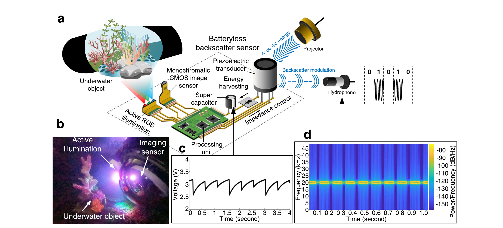

**Original caption:** Fig. 1 | Overview of underwater backscatter imaging. a A remote acoustic projector (top right) transmits sound on the downlink. The acoustic energy is harvested by a piezoelectric transducer and converted to electrical energy that powers up the batteryless backscatter sensor node. The energy accumulates in a supercapacitor that powers up an FPGA unit, a monochromatic CMOS sensor that captures an image, and three LEDs which enable RGB active illumination. The captured image is communicated via acoustic backscatter modulation on the uplink, and a remote hydrophone measures the reflection patterns to reconstruct the transmitted image. b The batteryless sensor is shown in an experimental trial where it is used to image an underwater object with active illumination that enables capturing color images. c The plot shows the voltage in the supercapacitor, which is harvested from acoustic energy and varies over time as a function of the power consumption of different processing stages. d The spectrogram shows the frequency response of the signal received by the hydrophone over time, demonstrating its ability to capture reflection patterns due to backscatter modulation and decode them into binary to recover the transmitted image.

**中文图注:** 图 1｜水下反向散射成像总览。a：远处声学发射器（右上）在下行链路发送声音；压电换能器采集声能并转换为电能，为无电池反向散射传感节点供电。能量先累积在超级电容中，再启动 FPGA、负责成像的单色 CMOS 传感器，以及实现 RGB 主动照明的三只 LED。采集图像在上行链路由声学反向散射调制发送，远处水听器测量反射模式并重建图像。b：实验中的无电池传感器，借助主动照明对水下目标成像，从而获得彩色图像。c：超级电容电压随时间变化，反映不同处理阶段的功耗；能量来自声能采集。d：水听器接收信号的时频图，展示系统能够捕获反向散射调制造成的反射模式，并将其解码为二进制以恢复图像。

**Reading note:** 读图时按“供能链—成像链—通信链”分开看：a 说明系统架构；b 验证全浸没节点确实能主动成像；c 把功耗阶段映射到电容电压；d 给出上行通信的可观测物理证据。

**Original:** A critical step toward realizing battery-free imaging is the development of a technique for ultra-low-power underwater communication. Specifically, the communication component of the system must not consume more energy than what can be harvested from the remote acoustic source, which typically ranges from a few tens to hundreds of microwatts (see Range Analysis in Supplementary Information for an analysis of acoustic energy harvesting as a function of distance). However, state-of-the-art low-power underwater communication modems require 50–100 milliwatts to communicate over tens of meters33. Thus, they would require three to five orders of magnitude more power than what is available from harvesting. This significant energy imbalance would make battery-free operation with these modems impractical (see Supplementary Discussion in Supplementary Information).

**中文:** 实现无电池成像的关键一步，是开发超低功耗水下通信技术。具体而言，通信部件的能耗不能超过从远处声源采集到的能量；该系统可采集的功率通常只有几十到几百微瓦（关于声能采集随距离变化的分析见补充信息的 Range Analysis）。然而，最先进的低功耗水下通信调制解调器在数十米距离通信时需要 50–100 mW [33]，比可采集功率高三个到五个数量级。这种巨大的能量缺口使传统调制解调器无法用于无电池系统（详见补充信息中的 Supplementary Discussion）。

**Original:** To operate within the energy harvesting constraints of our proposed battery-free imaging method, we leverage piezo-acoustic backscatter to communicate the captured image on the uplink, extending a recently developed net-zero power communication technology34,35 to enable telemetry of imaging data. Underwater piezo-acoustic backscatter communicates messages by modulating the reflection coefficient of its piezoelectric transducer (Fig. 1a). Specifically, due to the electromechanical coupling between a piezoelectric transducer and its electrical impedance load, it is possible to modulate the transducer’s radar cross section. Thus, the battery-free node encodes pixels into communication packets by switching between different electric loads (inductors) connected to the transducer (see “Communication through backscatter” in Methods). The switching is done by simply controlling two transistors and is realizable with 24 nanowatts of power. A remote hydrophone measures the received acoustic signal to sense changes in the reflection patterns due to backscatter (Fig. 1d). The reflection patterns are decoded and used to reconstruct the image captured by the remote battery-free cameras. Robust end-to-end communication is realizable by implementing a full networking and communication stack that incorporates underwater channel estimation, packetization, and error detection (see “Uplink decoding” in Methods).

**中文:** 为了在所提出无电池成像方法的能量约束内工作，我们在上行链路上利用压电声学反向散射传输采集图像，并把近期提出的净零功耗通信技术 [34,35] 扩展到成像数据传输。水下压电声学反向散射通过调制压电换能器的反射系数来传递信息（图 1a）。压电换能器与其电阻抗负载之间存在机电耦合，因此可以调制换能器的雷达散射截面。无电池节点只需在不同电负载（电感）之间切换，就能把像素编码为通信包（见 Methods 中的 “Communication through backscatter”）。这种切换仅需控制两个晶体管，功耗约 24 nW。远处水听器测量接收声信号，以感知反向散射造成的反射模式变化（图 1d）；反射模式经解码后用于重建无电池相机采集的图像。通过实现包含水下信道估计、分组化和错误检测的完整网络与通信栈，可以完成稳健的端到端通信（见 Methods 中的 “Uplink decoding”）。

**Original:** Our method is capable of capturing color images of underwater objects at ultra-low power even in low-lighting conditions, which are standard in the deep sea due to light absorption in the water column. To do so, we utilize an ultra-low-power CMOS imaging sensor (HM01B0 from Himax Corporation), which can capture monochromatic images. To reconstruct color images using the monochromatic imaging sensor, we devised a method for low-power multi-color active illumination. Our battery-free imaging system incorporates three monochrome light-emitting diodes (LEDs): red, green, and blue. An ultra-low-power processing and memory unit (IGLOO nano FPGA) alternates between activating each of these LEDs and captures monochromatic images with each active illumination cycle (Fig. 2a). The monochromatic images are acoustically backscattered to the remote receiver. After decoding each of the images, the receiver synthesizes the received packets into multi-illumination pixels by applying them to the RGB channels of a digital pixel array to reconstruct color images, demonstrating the possibility to recover color patterns of underwater objects such as corals (Fig. 2b, see Supplementary Movie 1).

**中文:** 即使在深海常见的低照度条件下，该方法也能以超低功耗捕获水下目标的彩色图像。为此，我们采用 Himax 公司的超低功耗单色 CMOS 图像传感器 HM01B0。要用单色传感器重建彩色图像，我们设计了低功耗多色主动照明的方案：无电池成像系统包含红、绿、蓝三只单色 LED，超低功耗的处理与存储单元（IGLOO nano FPGA）依次点亮每只 LED，并在每次主动照明周期中捕获一幅单色图像（图 2a）。这些单色图像通过声学反向散射传回远端接收器；接收器解码后，把它们分别映射到数字像素阵列的 R、G、B 通道，合成为多照明像素，从而重建彩色图像，并证明可恢复珊瑚等水下目标的颜色模式（图 2b，另见补充视频 1）。

**Original:** We demonstrate that in situ underwater wireless batteryless imaging is possible using a self-powered camera system (Fig. 2c) that harvests acoustic energy and communicates using piezo-acoustic backscatter (Fig. 2d). The harvested energy is expended in cycles that alternate between imaging and communication (Fig. 2e). Upon capturing image segments, the processing unit packetizes the pixels and communicates them using piezo-acoustic backscatter, at a power consumption of 59 μW. To deal with the bandwidth mismatch between the ultra-low-power CMOS image sensors (few Mbps) and the underwater acoustic communication channel (few kbps), the captured images are buffered in the memory unit cells (see “FPGA control and logic” in Methods). Our fabricated opto-electro-mechanical system consists of multilayer piezo-electric transducers, electronic components (diodes, capacitors, low-power voltage regulators, and DC-DC converters, low-power oscillators), a processing and memory unit (FPGA), LEDs, and a CMOS image sensor (Supplementary Fig. 1). Active illumination using the LEDs is the most power consuming operation of the battery-free imaging system. For acoustic communication rates of 1 kbps, empirical measurements demonstrate an average power consumption of 276.31 μW for active imaging (see “Power analysis” in Methods and Supplementary Table 1). In our demonstrations of passive monochromatic imaging where active illumination is not needed, the batteryless camera consumes an average of 111.98 μW (Supplementary Table 2). In both configurations, the entire energy budget is harvested from underwater acoustics. Other configurations with different throughput and active illumination techniques are possible.

**中文:** 我们证明，利用一套自行供电的相机系统即可实现原位水下无电池无线成像（图 2c）：系统采集声能，并通过压电声学反向散射通信（图 2d）。采集到的能量按“成像—通信”循环消耗（图 2e）。处理单元在捕获图像分段后把像素打包，并以 59 μW 的功耗通过压电声学反向散射发送。为应对超低功耗 CMOS 图像传感器（数 Mbps）与水下声通信信道（数 kbps）之间的带宽失配，采集图像会先缓存在存储单元中（见 Methods 中的 “FPGA control and logic”）。我们制作的光—电—机械系统包括多层压电换能器、电子元件（二极管、电容、低压稳压器、DC-DC 变换器、低功耗振荡器）、处理与存储单元（FPGA）、LED 和 CMOS 图像传感器（补充图 1）。LED 主动照明是无电池成像系统中功耗最高的操作。在 1 kbps 声通信速率下，实验测得主动成像平均功耗为 276.31 μW（见 Methods 中的 “Power analysis”和补充表 1）。在不需要主动照明的被动单色成像演示中，无电池相机平均功耗为 111.98 μW（补充表 2）。两种配置的全部能量预算都来自水下声能采集；其他吞吐率和主动照明方案也可行。

### 图 2 主动照明与净零功耗循环

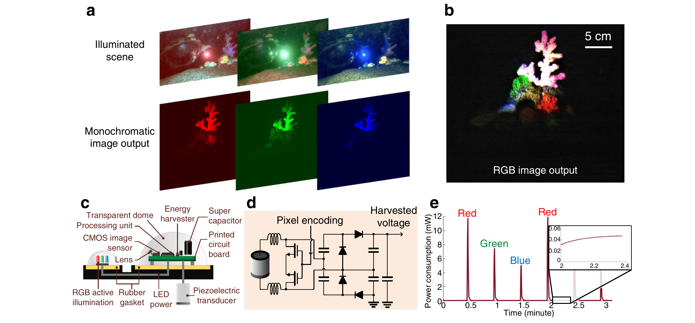

**Original caption:** Fig. 2 | Active illumination in underwater backscatter imaging. a To recover color images with a monochrome sensor, the camera alternates between activating three LEDs—red, green, and blue. The top figures show the illuminated scene, while the bottom figures show the corresponding captured monochromatic images, which are transmitted to a remote receiver. b The figure shows the color image output synthesized by the receiver using multi-illumination pixels which are constructed by combining the monochromatic image output for each of the three active illumination LEDs. c A side view of the camera prototype demonstrates a larger dome which houses the CMOS image sensor and a smaller dome which contains the RGB LEDs for active illumination. The structure is connected to a piezoelectric transducer. d The circuit schematic demonstrates how the imaging method operates at net-zero power by harvesting acoustic energy and communicating via backscatter modulation. e The plots show the power consumption over time. The power consumption peaks during active imaging and drops when the captured images are being backscattered.

**中文图注:** 图 2｜水下反向散射成像中的主动照明。a：为用单色传感器恢复彩色图像，相机依次点亮红、绿、蓝三只 LED；上排显示被照明场景，下排显示相应单色图像，并传至远端接收器。b：接收器把三次主动照明所得单色图组合为多照明像素，从而合成彩色输出。c：相机原型侧视图；较大的穹顶容纳 CMOS 图像传感器，较小的穹顶容纳 RGB 主动照明 LED，整体与压电换能器相连。d：电路示意图展示系统如何通过声能采集与反向散射调制实现净零功耗运行。e：功耗随时间变化；主动成像时出现峰值，发送已采集图像的反向散射阶段功耗下降。

**Reading note:** a 是关键协议图：三色并非一次曝光，而是三次单色曝光后的算法合成。e 要与 c 及图 1c 联读：主动照明是主要耗能项，通信阶段反而允许超级电容回充。

### 2.2 实验验证与评估（Experimental Demonstration and Evaluation）

**Original:** We built a proof-of-concept prototype to demonstrate underwater backscatter imaging with animals, plants, and pollution across controlled and uncontrolled environments. The prototype was tested in Keyser Pond in southeastern New Hampshire (43°N, 72°W), where it was used to image pollution from plastic bottles on a lakebed at 50 cm from the imaging sensor (Fig. 3a). Here, color imaging using a monochromatic sensor was successful (Fig. 3b), despite the presence of external illumination. The prototype was also successful in imaging the Protoreaster linckii, also known as the African starfish, in a controlled environment with external illumination; the captured image displays numerous tubercles along the starfish’s five arms (Fig. 3c). Furthermore, due to the ability of underwater backscatter imaging to operate continuously, the method was successful in monitoring the growth of an Aponogeton ulvaceus, where imaging was performed in the dark over a week, while relying entirely using the harvested energy and active multi-color illumination (Fig. 3d). In all of these scenarios, the prototype was fully-submerged, wireless, batteryless, and autonomous.

**中文:** 我们制作了概念验证原型，在受控与自然环境中展示对动物、植物和污染物的水下反向散射成像。原型在新罕布什尔州东南部的 Keyser Pond（43°N，72°W）测试，对距离成像传感器 50 cm 的湖底塑料瓶污染进行成像（图 3a）；即使存在外部光照，利用单色传感器进行彩色成像仍获得成功（图 3b）。原型还在受控环境和外部照明下成功成像了 Protoreaster linckii，即非洲海星；图像显示出沿其五条腕分布的众多瘤状突起（图 3c）。此外，由于水下反向散射成像可以连续运行，该方法成功监测了 Aponogeton ulvaceus 的生长：系统完全依靠采集能量和主动多色照明，在黑暗中连续一周成像（图 3d）。在所有这些场景中，原型均完全浸没、无线、无电池且自主运行。

### 图 3 池塘、海星与水草生长监测

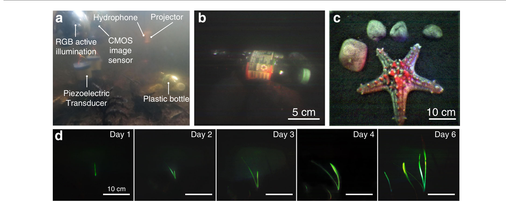

**Original caption:** Fig. 3 | Sample images obtained using underwater backscatter imaging. a The figure shows a photo of a prototype deployed in Keyser Pond for monitoring pollution from plastic bottles on the lakebed. b The RGB image output obtained from the imaging method while monitoring pollution in Keyser Pond. c RGB image output for Protoreaster linckii, demonstrating qualitative success in recovering its color and numerous tubercles along the starfish’s five arms. d The imaging method was used to monitor the growth of an Aponogeton ulvaceus over a week. The figures show the captured images on different days of the week.

**中文图注:** 图 3｜水下反向散射成像获得的样本图像。a：原型部署在 Keyser Pond，用于监测湖底塑料瓶污染。b：监测池塘污染时由成像方法输出的 RGB 图像。c：Protoreaster linckii 的 RGB 图像，定性展示其颜色恢复效果，以及沿五条腕分布的众多瘤状突起。d：用该方法监测 Aponogeton ulvaceus 一周内的生长；图中给出不同日期采集的图像。

**Reading note:** 该图的价值不在“实验室分辨率”，而在野外、黑暗与连续运行条件下仍能形成可解释图像；同时要区分外部环境光与系统自身 RGB 主动照明对结果的影响。

**Original:** The benefits of underwater backscatter imaging extend beyond observational monitoring to more complex tasks such as underwater localization and inference. To demonstrate the feasibility of such tasks, the imaging method was used to detect and localize visual tags such as AprilTags (Fig. 4a); these tags have been previously utilized for underwater localization and robotic manipulation36,37. Figure 4b shows an image of an AprilTag obtained using underwater backscatter imaging. Figure 4c shows the detection accuracy and the localization distance of the AprilTags imaged at different ranges. The results demonstrate very high detection rate and high localization accuracy (localization error below 10 cm) up to 3.5 m. Beyond this range, the current resolution of the CMOS imaging sensor limits both detection and localization; longer detection ranges would be possible with higher-resolution sensors.

**中文:** 水下反向散射成像的优势不止于观测监测，还可扩展到水下定位和推理等更复杂任务。为证明可行性，该方法被用于检测和定位 AprilTag 等视觉标签（图 4a）；此类标签此前已用于水下定位和机器人操作 [36,37]。图 4b 给出通过水下反向散射成像得到的 AprilTag 图像。图 4c 展示不同距离下 AprilTag 的检测准确率和定位距离，结果表明在 3.5 m 内具有很高检测率和定位精度（定位误差低于 10 cm）。超过该距离后，当前 CMOS 图像传感器的分辨率同时限制检测与定位；若采用更高分辨率传感器，有望实现更远检测距离。

**Original:** We also evaluated the method’s harvesting and communication capabilities as a function of distance in the Charles River in eastern Massachusetts (at 42°N, 71°W). Figure 4d shows the harvested voltage in the river as the distance between the projector and the batteryless sensor increases. The figure shows that the harvested voltage decreases with distance, as expected. We also tested the method’s ability to communicate with a hydrophone receiver at different distances, and computed the signal-to-noise ratio (SNR) and the bit error rate (BER) of the decoded packets at different distances (Fig. 4e). The plot shows that SNR decays and the BER increases with distance, demonstrating the ability to robustly decode packets beyond 40 m by leveraging a decision feedback equalizer (DFE) at the receiver38. These results show that underwater backscatter imaging is a viable batteryless telemetry method and that higher ranges may be realizable with higher levels of underwater acoustics or by leveraging underwater transducers with higher efficiency39 (see Range Analysis in Supplemental Information).

**中文:** 我们还在马萨诸塞州东部 Charles River（42°N，71°W）评估了采集与通信能力随距离的变化。图 4d 显示发射器与无电池传感器距离增大时，河流中采集到的电压变化；与预期一致，采集电压随距离下降。我们还测试了系统在不同距离下与水听器接收端通信的能力，并计算解码数据包的信噪比（SNR）与误码率（BER）（图 4e）。结果显示，SNR 随距离衰减、BER 随距离升高；在接收端加入判决反馈均衡器（DFE）后，系统仍可在 40 m 以上稳健解码 [38]。这些结果表明，水下反向散射成像是一种可行的无电池遥测方法；提高水下声源强度或采用更高效率的水下换能器，还有望进一步扩展距离 [39]（见补充信息的 Range Analysis）。

### 图 4 标签定位、采集电压与通信距离

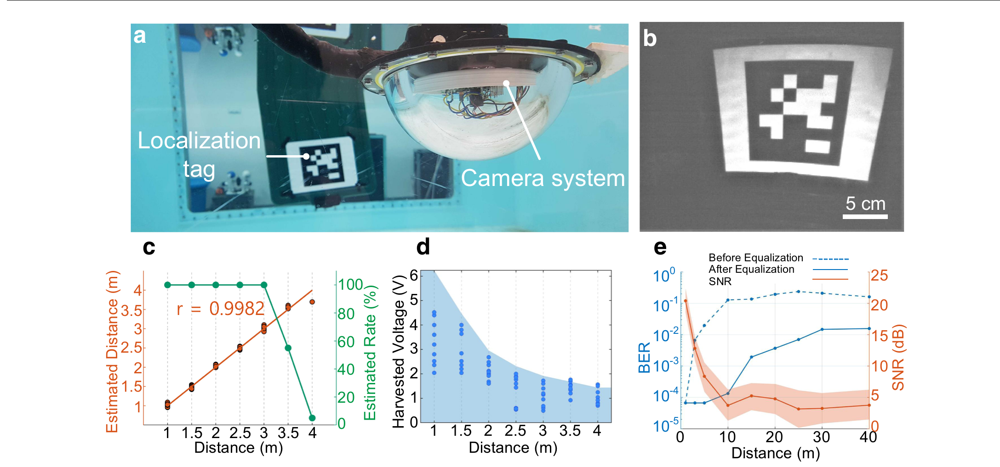

**Original caption:** Fig. 4 | Captured images of AprilTag markers demonstrate successful underwater inference and localization. a The prototype was used to detect and localize submerged localization tags. b An image of the AprilTag obtained using a batteryless prototype. c The estimated location of the AprilTag is plotted in red as a function of its actual location, and the detection rate of AprilTag is plotted in green as a function of distance. d Harvested voltage is plotted as a function of distance between the transmitter and the batteryless camera prototype. The dots indicate the voltage at depths, while the contour indicates the maximum voltage obtained when the node’s depth is varied over the entire water column at the corresponding distance. e SNR and BER of the imaging method are plotted as a function of distance. The lower and upper bound of the orange band around the SNR plot indicate the 10th and 90th percentile of the collected SNR data at the corresponding distance. The dotted and solid lines show the BER of the imaging method before and after equalization, respectively.

**中文图注:** 图 4｜AprilTag 标记图像证明系统可完成水下推理与定位。a：原型用于检测并定位水下定位标签。b：无电池原型获得的 AprilTag 图像。c：红色表示 AprilTag 的估计位置与真实位置的关系，绿色表示检测率随距离的变化。d：采集电压随发射器与无电池相机原型距离的变化；圆点表示不同深度处的电压，等高线表示在相应距离处遍历整个水柱时得到的最大电压。e：系统 SNR 与 BER 随距离的变化；SNR 橙色带的上下边界分别表示该距离下采集 SNR 的第 10 与第 90 百分位数，虚线和实线分别表示均衡前、后的 BER。

**Reading note:** c 的 3.5 m 是“定位精度仍低于 10 cm”的有效范围，不应外推为通信范围；e 说明通信在均衡后可超过 40 m。两条距离证据回答的是不同问题。

**Original:** In summary, we have demonstrated that wireless battery-free imaging in underwater environments is possible. Our method encompasses a highly efficient underwater color camera and innovations that enable robust acoustic backscatter communication in practical underwater environments. The tetherless, inexpensive, and fully-integrated nature of our method makes it a desirable approach for massive ocean deployments. Scaling the method for large-scale deployments requires more sophisticated underwater transducers or high-power underwater acoustic transmissions. Its scalability may be further enhanced by leveraging a mesh network of buoys like those already being deployed on the ocean surface, networks of subsea robots like Argo floats, or surface vehicles like ships to remotely power the energy-harvesting cameras40,41. Massive deployments would enable tracking undersea movements—including the flow of particulate organic carbon42, marine animals, and naval assets—at scales not realizable today. These may be used to create more accurate models capable of monitoring climate change43, decrease the stealthiness of nuclear submarines through large-scale observations, and advance various marine scientific fields.

**中文:** 总之，我们证明水下环境的无线无电池成像是可行的。该方法包含一套高效水下彩色相机，以及使声学反向散射通信能在真实水下环境中稳健运行的多项创新。其无缆、低成本、完全集成的特性，适合大规模海洋部署。若要扩展到更大规模，还需要更复杂的水下换能器或更高功率的水下声发射。借助已在海面部署的浮标网状网络、Argo 浮标等海底机器人网络，或船舶等水面平台远程为采集能量的相机供电，还可进一步提升可扩展性 [40,41]。大规模部署将使我们能够追踪颗粒有机碳通量 [42]、海洋动物和海军资产等水下运动，达到当前无法实现的尺度；这些能力可用于构建更准确的气候变化监测模型 [43]、通过大规模观测削弱核潜艇的隐蔽性，并推动多个海洋科学领域发展。

---

## 3 方法 METHODS

### 3.1 通过反向散射通信（Communication through Backscatter）

**Original:** To enable ultra-low-power communication, our batteryless sensor employs piezo-acoustic backscatter34. Piezo-acoustic backscatter differs from traditional underwater acoustic communication in that it does not need to generate its own acoustic signal to communicate. Instead, it communicates by modulating the reflections of incident underwater sound, and a remote receiver can decode the transmitted data by recovering patterns in the reflected signals.

**中文:** 为实现超低功耗通信，无电池节点采用压电声学反向散射 [34]。它与传统水下声通信的区别在于，节点不需要自行产生用于通信的声信号，而是通过调制入射水下声波的反射来传递信息；远端接收器则可从反射信号模式中恢复并解码数据。

**Original:** To transmit the stored image data via piezo-acoustic backscatter, our prototype uses two N-channel MOSFETs to modulate the impedance across the terminals of an underwater transducer. The design uses these MOSFETs to switch the transducer’s reflectivity between two states similar to prior underwater backscatter designs34,35,44. The signal-to-noise ratio (SNR) at the receiver is maximized when the complex-valued difference (i.e., amplitude and phase) between the two reflective states is maximum. Through our empirical analysis, we have observed that a high SNR on the uplink channel is achieved when the node switches between an inductively matched load and an open circuit. Hence, the FPGA controls the switch to alternate the load between an open circuit and the inductive load to send image data using bi-phase space encoding modulation (also known as FM0) which is known to have high noise resilience in time-varying channels45. Other modulation and coding schemes are also possible.

**中文:** 为通过压电声学反向散射发送已存图像数据，原型使用两个 N 沟道 MOSFET 调制水下换能器两端的阻抗。该设计让换能器反射率在两个状态间切换，方式类似此前的 underwater backscatter 设计 [34,35,44]。当两个反射状态之间的复数值差异，即幅度与相位差异，达到最大时，接收端信噪比（SNR）最高。根据实验分析，当节点在电感匹配负载与开路之间切换时，上行链路可获得高 SNR。因此，FPGA 控制开关在开路与电感性负载之间交替，并用双相空间编码调制（也称 FM0）发送图像数据；FM0 在时变信道中具有较强的抗噪能力 [45]。其他调制和编码方案同样可行。

### 3.2 上行解码（Uplink Decoding）

**Original:** The backscatter communication signal is received by the hydrophone and decoded using a robust demodulation and decoding pipeline (Supplementary Fig. 2) that is implemented through offline packet processing.

**中文:** 水听器接收反向散射通信信号，并通过一套稳健的解调与解码流水线处理（补充图 2）；该流水线采用离线分组处理实现。

**Original:** The demodulation pipeline consists of a series of filters followed by a maximum likelihood decoder. To remove noise from the received signal, we use a bandpass filter centered around the carrier frequency of 20 kHz with a passband of 10 kHz from 15 to 25 kHz (the filter is implemented as a linear phase type 1 discrete-time FIR filter with filter length of 297). After the bandpass filter, we downconvert the passband signal to baseband by multiplying it with the carrier frequency (20 kHz sinusoid), then use a low pass filter with a bandwidth of 4 kHz (a linear phase type 1 discrete-time FIR filter with filter length of 347, and 6 kHz stopband frequency) to remove high-frequency components from the signal. To mitigate low-frequency interference from naturally-occurring surface waves and turbulence, we implement a high-pass filter (a linear phase type 1 discrete-time FIR filter with filter length of 4535; the respective passband and stopband frequencies of the filter are 150 Hz and 20 Hz). These filtering stages enable the receiver to operate correctly in uncontrolled and time-varying underwater environments.

**中文:** 解调流水线由一系列滤波器和一个最大似然解码器组成。为去除接收信号中的噪声，系统使用中心载频 20 kHz、通带为 15–25 kHz（带宽 10 kHz）的带通滤波器；该滤波器实现为长度为 297 的线性相位 I 型离散时间 FIR 滤波器。带通后，将信号与 20 kHz 正弦载波相乘，下变频到基带；再用带宽 4 kHz、阻带频率 6 kHz、长度 347 的线性相位 I 型离散时间 FIR 低通滤波器去除高频分量。为抑制自然水面波和湍流造成的低频干扰，系统还使用长度 4535、通带 150 Hz、阻带 20 Hz 的线性相位 I 型离散时间 FIR 高通滤波器。上述滤波级使接收器能在不受控、时变的水下环境中正确工作。

**Original:** After filtering and demodulation, the receiver proceeds to packet detection. Each backscatter packet starts with a preamble, and each image segment is sent over multiple packets (as discussed in the subsequent section on FPGA control and logic). The receiver correlates the raw received signal with a known preamble sequence to detect the beginning of the packet. After packet detection, the receiver proceeds to decoding the FM0-encoded packets in baseband. We implemented a bit-by-bit maximum likelihood decoder that has high resilience to channel variations. Formally, consider a received FM0 symbol of size n x = x0, x1,…, xn-1. The decoding operation is done in two steps. The first step performs mean subtraction, exploiting the fact that each FM0 encoded bit has zero mean with respect to neighboring half bits. Mean subtraction removes the constant self-interference signal from the projector as well as any hardware offsets at the receiver. The mean-subtracted symbol x′ can be expressed as:

**中文:** 完成滤波和解调后，接收器进入分组检测。每个反向散射数据包均以一段前导码开始，而每个图像分段由多个数据包发送（详见后文 FPGA 控制与逻辑）。接收器将原始接收信号与已知前导序列做相关，以检测数据包起点；随后在基带解码 FM0 编码的数据包。我们实现了逐比特最大似然解码器，对信道变化具有较强鲁棒性。形式上，设接收到的 FM0 符号长度为 n，记为 x = x₀, x₁, …, xₙ₋₁。解码分两步进行：第一步利用每个 FM0 编码比特相对相邻半比特均值为零的性质执行均值扣除，从而消除来自发射器的恒定自干扰以及接收器硬件偏移。扣除均值后的符号 x′ 可写成：

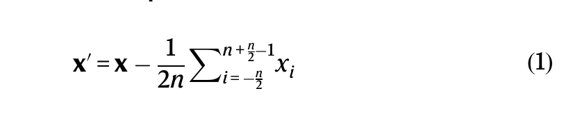

**中文说明：** 式 (1) 做均值扣除。x₀ 是当前接收样本，x′₀ 是扣除相邻半比特均值后的结果；求和索引覆盖 −n/2 到 n/2−1。这一步同时移除恒定自干扰和硬件偏移。

**Original:** The second step is maximum likelihood decoding, which is performed by projecting the mean-subtracted received symbol on the time-series symbols y0 and y1, which represent bits ‘0’ and ‘1’, respectively, as per the equation:

**中文:** 第二步是最大似然解码：将扣除均值后的接收符号分别投影到表示比特‘0’和‘1’的时间序列符号 y₀ 与 y₁ 上，按如下公式选择：

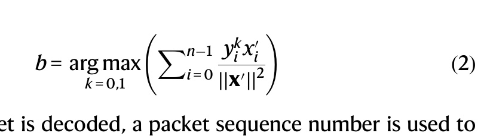

**中文说明：** 式 (2) 在比特 0 与 1 的候选波形间进行最大似然判决。b̂ 是解码比特，yᵢᵏ 是第 k 类符号的第 i 个样本，x′ᵢ 是扣除均值后的接收样本。

**Original:** Once a packet is decoded, a packet sequence number is used to identify if any of the packets were missed or dropped during the communication process, and a parity bit helps identify incorrectly decoded packet payloads. The packet number and parity check allow the receiver to detect corrupted or missed packets. By incorporating downlink communication, future designs may leverage this capability to request retransmissions from the batteryless sensor.

**中文:** 数据包解码后，用包序号判断通信过程中是否有数据包丢失或遗漏，并用奇偶校验位识别负载解码错误。包序号与奇偶校验使接收器能够检测损坏或缺失的数据包。未来若加入下行链路，系统可利用这一能力向无电池传感器请求重传。

**Original:** Finally, it is worth noting that while our implementation focused on uplink communication between one camera sensor and a hydrophone receiver, it is possible to extend to this design with downlink communication, multiple sensor nodes, and multiple receivers; it is also possible to implement other packet sequences with alternate headers that include additional addressing and coding schemes similar to prior work on underwater backscatter34,35.

**中文:** 最后需要指出，虽然当前实现聚焦于单相机传感器与单水听器接收器之间的上行链路通信，但该设计可以扩展到下行通信、多传感节点和多接收器；也可采用包含额外寻址与编码方案的其他数据包序列和头部格式，思路与此前水下反向散射工作相似 [34,35]。

### 3.3 能量采集与电源管理（Energy Harvesting and Power Management）

**Original:** To operate at net-zero power, the batteryless underwater camera sensor may harvest sufficient energy from a remote acoustic source. We use an underwater projector that transmits a 20 kHz sinusoidal acoustic signal (source level 180 dB re 1 µPa @ 1 m) on the downlink. The transmitter uses a layered transducer node to convert the input electrical sinusoidal wave to an acoustic wave.

**中文:** 为以净零功耗运行，无电池水下相机节点需要从远端声源采集足够能量。我们使用水下声学发射器，在下行链路发送 20 kHz 正弦声信号，源级为 180 dB re 1 µPa @ 1 m。发射端采用层叠式换能器节点，将输入电正弦波转换为声波。

**Original:** The transmitted acoustic signal propagates underwater and reaches our batteryless sensor. On the sensor side, a harvesting transducer converts the mechanical vibrations, which are due to pressure changes of the incident acoustic signal, into an electrical sinusoidal signal that can be used to power the circuit. Since the electrical signal produced by our transducer is an alternating current signal, it first needs to be rectified. In our design, the outer layer of the harvesting transducer is directly connected to the harvester circuit; the harvester circuit is composed of an impedance matching network that ensures maximum power transfer efficiency and a four-stage voltage multiplier that rectifies the incoming differential input voltage and quadruples the rectified DC voltage (Supplementary Fig. 1). The rectifier utilizes Schottky diodes with a maximum forward voltage of 350 mV. This rectified voltage is then fed into a super capacitor. The super capacitor’s output voltage is regulated by a 2.8 V Low Dropout (LDO) which drives digital components such as the bank voltage of the FPGA and two external clocks (32 kHz and 4 MHz). The LDO is connected to a DC-DC step down converter, which steps down its 2.8 V to 1.4 V. This allows running the Himax camera and oscillators at their required voltages while running the FPGA core at 1.4 V to minimize power consumption.

**中文:** 发射的声信号在水中传播并到达无电池节点。节点侧，采集换能器把入射声压变化引起的机械振动转换为可为电路供电的电正弦信号。由于换能器输出为交流信号，必须先整流。设计中外层采集换能器直接连接 harvester 电路；该电路由阻抗匹配网络和四级倍压整流器组成，前者保证最大功率传输效率，后者整流差分输入并把整流直流电压提升四倍（补充图 1）。整流器采用最大正向压降为 350 mV 的肖特基二极管，整流电压随后存入超级电容。超级电容输出电压由 2.8 V 低压差线性稳压器（LDO）稳定，用于驱动 FPGA bank 电压和 32 kHz、4 MHz 两个外部时钟。LDO 还连接 DC-DC 降压变换器，把 2.8 V 降到 1.4 V；这样既能让 Himax 相机和振荡器运行在所需电压，又能让 FPGA 核心以 1.4 V 工作，从而降低功耗。

**Original:** In principle, the regulated voltage can be directly used to power up the rest of the sensor electronics and bootstrap the image capture operation and communication. In practice, however, the harvested power may be less than that required to run the electronics for an entire imaging cycle. This is particularly true when the sensor is further away from the projector, leading to a lower harvested power than that required for imaging. In such scenarios, if the capacitor were to provide energy to the rest of the electronic components prematurely, they would drain its energy and abruptly shut down the circuitry before it can capture an image segment.

**中文:** 原则上，稳定后的电压可以直接为其余传感电子设备供电，并启动图像采集和通信。但实际上，采集功率可能不足以让电子设备完成整个成像周期；节点离发射器越远，采集功率越低，这一矛盾越明显。若超级电容过早向其余电子元件供电，元件会迅速抽空能量，使电路在完成一个图像分段之前意外停机。

**Original:** To ensure that the rest of the circuit does not power up prematurely, our method incorporates a cold-start phase where it harvests energy in its super-capacitor before it powers on the rest of the circuit electronics. To implement this cold-start phase, our design leverages the DC-DC step down converter as a power-gating mechanism (i.e., as a way to buffer energy before providing it to the rest of the circuit), exploiting the fact that the DC-DC converter controls the core voltage of the FPGA logic unit. To do this, our design uses a potential divider to feed a portion of the capacitor voltage to the “enable” pin of the DC-DC step down, so that the DC-DC activates when the capacitor voltage reaches a desired voltage (e.g., 3.2 V in our design). This allows our circuit to harvest energy for a sufficient period of time before it starts operation. In addition, once the DC-DC turns on, it does not turn off until the enable pin voltage falls below a minimum threshold voltage (e.g., 1.4 V in our design). In other words, hysteresis allows the DC-DC to stay active even when the voltage at the enable pin is fluctuating over a wide range. The fluctuation in voltage typically happens due to two main reasons: the first is the variations in harvested energy (from sound) due to the changing underwater channel, and the second is the variation in current draw from various on-board components during different phases of operation (as described in subsequent sections on FPGA control and logic and on power analysis).

**中文:** 为避免其余电路过早启动，方法加入冷启动阶段：先让超级电容积累能量，再开启其他电子元件。实现方式是把 DC-DC 降压变换器当作功率门控：在向后级供电前先缓冲能量，并利用它控制 FPGA 逻辑核心电压的特性。设计通过分压器把一部分电容电压送入 DC-DC 的 “enable” 引脚；当电容电压达到目标值，例如本设计中的 3.2 V 时，DC-DC 才启动。这样，电路启动前已有足够时间采集能量。此外，DC-DC 一旦开启，直到 enable 引脚电压低于最低阈值，例如 1.4 V，才会关闭。换言之，滞回使 enable 电压在较大范围内波动时 DC-DC 仍保持工作。电压波动主要来自两方面：一是水下信道变化导致声能采集量变化，二是不同运行阶段各板载元件电流需求变化（见后文 FPGA 控制与逻辑、功耗分析）。

**Original:** Finally, we discuss how the capacitance (C) of 7500 μF and minimum threshold value (Vthres) of 3.2 V are determined. Since the camera sensor requires a minimum voltage (Vmin) of 2.8 V for reliable operation, the design of the batteryless sensor must ensure that the capacitor voltage remains above Vmin when the camera is operational. Conservatively, the super-capacitor needs to store enough energy to power the circuit for capturing an entire image segment before the energy drawn causes the voltage to drop below Vmin; this analysis is conservative since the sensor continues harvesting even during the imaging phase. Mathematically, we can express this energy buffer as:

**中文:** 下面说明 7500 μF 电容 C 与 3.2 V 最低阈值 V_thres 的选取依据。相机传感器可靠工作所需的最低电压 V_min 为 2.8 V，因此无电池节点必须保证成像期间电容电压始终高于 V_min。保守地说，超级电容要储存足够能量，使系统至少能采集完一个完整图像分段，而不会在抽取能量过程中把电压降到 V_min 以下；之所以说保守，是因为成像阶段系统仍在持续采集能量。该能量缓冲条件可写为：

**中文说明：** 式 (3) 给出越过启动阈值与最低工作电压之间可用的电容能量差。主动成像捕获一个图像分段约需 5 mJ，因此原文选取 C = 7500 μF、V_thres = 3.2 V，并保证 V_min = 2.8 V。

**Original:** The energy buffer was determined empirically by measuring the energy required by the camera prototype to capture an image segment using active imaging (5 mJ, see “Power analysis” in Methods). Given that Vmin is 2.8 V, we can select C = 7500 μF and Vthres = 3.2 V to satisfy the above inequality.

**中文:** 能量缓冲需求由实验测得：相机原型用主动成像捕获一个图像分段需要约 5 mJ（见 Methods 中的 “Power analysis”）。在 V_min = 2.8 V 的条件下，选取 C = 7500 μF 和 V_thres = 3.2 V 即可满足上述不等式。

**Original:** Our proof-of-concept implementation employs two separate transducers for harvesting and backscatter communication. In principle, it is possible to use a single transducer—rather than two—for both energy harvesting and backscatter communication, since both transducers are identical. However, doing so would result in less harvested energy; this is because less energy may be harvested in the open-circuit state than in the inductively matched state. Thus, in our prototype implementation, we decouple the communication from the energy harvesting so that both processes can occur simultaneously without either of them reducing the other’s efficiency. Alternate implementations with a single transducer for both harvesting and communication, or with multiple transducers for each of harvesting and communication are possible. The latter is useful for enabling longer-range operation since the combination of multiple transducers can harvest more energy and achieve higher SNR on the uplink (both of which increase with the number of transducers used).

**中文:** 概念验证实现使用两个独立换能器，分别负责能量采集和反向散射通信。原则上，由于两者完全相同，也可只用一个换能器同时完成采集和通信；但这样会减少可采集能量，因为开路状态下的采集能力低于电感匹配状态。原型因此把通信与能量采集解耦，使两者可同时进行且不降低彼此效率。也可以改用单个换能器兼顾二者，或为采集和通信分别配置多个换能器。后者有助于扩大作用距离，因为多个换能器组合能采集更多能量并提高上行 SNR；两项指标都会随换能器数量增加而提升。

### 3.4 FPGA 控制与逻辑（FPGA Control and Logic）

**Original:** A key challenge in enabling net-zero power wireless underwater imaging arises from the limited communication bandwidth of underwater acoustic communication, which is typically of the order of few kilobits/s46. Due to the limited bandwidth of underwater acoustic channels, the transfer time of underwater images is typically tens of minutes or even hours47. In principle, one could keep the CMOS imaging sensor and LED illumination turned on during this period. However, such an approach would be counterproductive since these components consume significantly more power than the rest of the circuit. Here, it is worth noting that higher throughput (thus shorter transfer time) may be realizable using more advanced modulation techniques such as OFDM48. However, these techniques require much higher power consumption than underwater piezo-acoustic backscatter34.

**中文:** 实现净零功耗水下无线成像的关键挑战之一，是水下声通信的带宽有限，通常只有数 kbps 量级 [46]。受此限制，一幅水下图像的传输时间常达数十分钟甚至数小时 [47]。原则上，可以在整个传输期间持续开启 CMOS 图像传感器和 LED 照明，但这些部件功耗远高于电路其余部分，反而会降低能量效率。值得注意的是，OFDM 等更先进调制技术可实现更高吞吐率，从而缩短传输时间 [48]，但其功耗远高于水下压电声学反向散射 [34]。

**Original:** To enable low-power operation while dealing with the bandwidth constraints of underwater acoustic channels, our method employs an FPGA that operates in two phases: image capture phase (which is power-limited) and backscatter communication phase (which is bandwidth limited). The operation in each of these phases is optimized to minimize overall energy consumption of the underwater backscatter imaging method and enable net-zero operation, as explained below.

**中文:** 为兼顾低功耗与水下声信道的带宽约束，方法让 FPGA 在两个阶段运行：成像采集阶段受功率限制，反向散射通信阶段受带宽限制。下文说明如何分别优化两个阶段，以最小化整体能耗并实现净零功耗运行。

#### 3.4.1 成像采集阶段（Image Capture Phase）

**Original:** Once the super-capacitor has stored sufficient energy from harvesting (e.g., 3.2 V or higher), the voltage at the enable pin of the DC-DC overcomes its threshold, allowing it to power the FPGA core at 1.4 V, as well as the 32 kHz external oscillator. Once the FPGA core is turned on, it initiates its logic sequence to power on the Himax camera sensor along with an external 4 MHz oscillator. The higher frequency clock signal is necessary to operate the camera (which requires at least 3 MHz) and communicate with it over an I2C interface (100–400 kHz).

**中文:** 当超级电容采集到足够能量，例如达到 3.2 V 或更高时，DC-DC 的 enable 引脚电压越过阈值，开始以 1.4 V 为 FPGA 核心及 32 kHz 外部振荡器供电。FPGA 核心启动后执行逻辑序列，开启 Himax 相机传感器和外部 4 MHz 振荡器。较高频率时钟既满足相机至少 3 MHz 的工作要求，也支持通过 100–400 kHz 的 I²C 接口与相机通信。

**Original:** Once all the onboard components are powered on, the interfacing process starts. The FPGA configures the camera sensor through the I2C communication bus, which enables it to set different parameters on the camera sensor—such as the image resolution, exposure level, and data bits sequence—to enable adapting the image capture to different environmental conditions. In our implementation, the FPGA logic first resets the camera sensor, then sets the image resolution to Quarter Video Graphics Array (QVGA) frame with a resolution of 324 by 244 pixels (each pixel is represented by 8 bits for a total of 632,448 bits per image) and specifies the data transfer protocol to be serial (using a single port and sending the most significant bit first). Finally, the FPGA sets the clock of the camera sensor core to be master clock (MCLK) divided by 8, or more specifically, 4 MHz/8 = 0.5 MHz. To set these parameters, the FPGA uses two I2C connections (SDA, SCL), and it receives all necessary information from three distinct pins on the camera sensor: (1) HSYNC (or line valid), a signal that goes high when a row of the image is being sent and is low otherwise, (2) PCLK (the pixel clock), and (3) DATA0, where the data is transmitted serially. Moreover, the FPGA controls the power to the camera through the power pins (AVDD/IOVDD) (Supplementary Fig. 1). The CMOS imaging sensor sends an acknowledgment after each I2C instruction, indicating the successful execution of the corresponding instruction.

**中文:** 所有板载组件上电后，接口初始化开始。FPGA 通过 I²C 总线配置相机，以设置分辨率、曝光水平和数据位顺序等参数，从而适配不同环境。当前实现中，FPGA 先复位相机，再把图像分辨率设为 QVGA，即 324 × 244 像素；每像素 8 bit，因此整幅图为 632,448 bit。随后 FPGA 把数据传输协议设为串行模式，使用单端口并先发送最高有效位。最后，将相机核心时钟设为主时钟 MCLK 的 1/8，即 4 MHz / 8 = 0.5 MHz。参数配置通过 SDA、SCL 两条 I²C 线完成，FPGA 还从相机的三个独立引脚接收信息：HSYNC（行有效，一行数据发送时拉高）、PCLK（像素时钟）和 DATA0（串行数据）。此外，FPGA 通过 AVDD/IOVDD 电源引脚控制相机供电（补充图 1）。每条 I²C 指令后，CMOS 图像传感器都会返回确认，表示对应指令执行成功。

**Original:** Upon successful I2C communication, the FPGA powers on the red LED, then instructs the camera sensor to capture an image and initiate data transfer process to the FPGA memory. Due to the limited FPGA on-board RAM size (a total of four 4608-bit blocks), only 12 kbs are saved to memory at a time. The RAM is configured as 256-word-deep FIFO, with 48-bit words. After reaching full memory capacity, the FPGA turns off the camera, LED, and 4 MHz oscillator, and switches to the 32 kHz oscillator as it enters the communication phase where it transmits the stored image segment to the receiver.

**中文:** I²C 通信成功后，FPGA 先点亮红色 LED，再指示相机采集图像并把数据传入 FPGA 存储。由于板载 RAM 有限，共四个 4608 bit 块，一次只能保存约 12 kbit；RAM 被配置为 256 字深、字宽 48 bit 的 FIFO。存储满后，FPGA 关闭相机、LED 和 4 MHz 振荡器，切换到 32 kHz 振荡器并进入通信阶段，把已存图像分段发送给接收器。

#### 3.4.2 反向散射通信阶段（Backscatter Communication Phase）

**Original:** During the backscatter communication phase, our FPGA uses the lower frequency oscillator of 32 kHz for reading from the memory and transmitting the stored image data because the data rate is limited to 1 kbps due to the narrow bandwidth of underwater acoustic channels. In addition, the low-frequency oscillator allows the FPGA to operate at extremely low power because its dynamic power consumption decreases with the clock frequency. At 32 kHz, most of the power consumption is static (as opposed to dynamic).

**中文:** 在反向散射通信阶段，FPGA 使用较低频率的 32 kHz 振荡器从存储器读取并发送图像数据，因为水下声信道带宽较窄，数据率被限制在 1 kbps。低频振荡器还能显著降低 FPGA 动态功耗，因为动态功耗随时钟频率下降而降低；在 32 kHz 下，大部分功耗来自静态部分，而非动态切换。

**Original:** The FPGA encodes the image data into packets (Supplementary Fig. 3). Each 77-bit-long packet contains a 16-bit preamble, followed by a 12-bit packet number, 48 bits of data, and a single parity bit at the end. Furthermore, to help the decoder identify packet boundaries, the FPGA introduces a brief silent period (equivalent to the time needed to transmit 23 bits) at the end of each packet. The FPGA converts the data bits into FM0 modulation. The FPGA feeds the FM0 encoded data bits to the gate pin of the two MOSFETs to communicate the image data through backscatter.

**中文:** FPGA 把图像数据编码为数据包（补充图 3）。每个包长 77 bit，依次包括 16 bit 前导码、12 bit 包序号、48 bit 数据和 1 bit 奇偶校验。为帮助解码器识别包边界，FPGA 还在每个包末尾加入相当于 23 bit 传输时长的静默期。数据位被转换为 FM0 调制，FPGA 再把 FM0 编码位送入两个 MOSFET 的栅极，以通过反向散射发送图像数据。

**Original:** After each image segment (stored in memory) is sent, the aforementioned process repeats for the same segment but with a different LED turned on (i.e., green and then followed by blue). Once the same image segment is transmitted and received for all three illuminations (RGB), the FPGA stores the next segment of the image and repeats the same process until an entire image is transmitted. The FPGA also stores the segment index in a designated register and uses a counter to wait for 12000*segment_index clock cycles to store the desired segment to the FIFO memory.

**中文:** 发送完一个已存图像分段后，系统会在同分段上重复上述过程，但依次改为绿色和蓝色 LED。当同一分段的三种照明图像，即 R、G、B 三幅图，都发送并接收后，FPGA 再存下一个分段，重复该流程直至整幅图像传完。FPGA 还把分段索引存入指定寄存器，并用计数器等待 12000 × segment_index 个时钟周期，再把所需分段写入 FIFO。

**Original:** The overall process requires 53 repetitions (53 segments per image, due to memory constraints on the FPGA) for monochromatic images and 159 for active color illumination. For FPGAs with larger memory size, the number of repetitions will be lower.

**中文:** 受 FPGA 存储限制，单色图像需 53 个分段，也就是 53 次重复；主动彩色照明需重复 159 次。若 FPGA 存储容量更大，重复次数会减少。

### 3.5 功耗分析（Power Analysis）

**Original:** Our proof of concept prototype can perform active and passive imaging at an overall average power consumption of 276 μW (Supplementary Table 1) and 112 μW (Supplementary Table 2), respectively. Note that the additional power requirement for active imaging is due to the active illumination, and that the average power is reported over the duration of capturing and transmitting an entire image (i.e., by dividing the total energy consumed across all operation phases by the time to capture and transmit the image).

**中文:** 概念验证原型进行主动和被动成像时的整机平均功耗分别约为 276 μW（补充表 1）和 112 μW（补充表 2）。主动成像额外功耗来自主动照明；这里的平均功耗按“完整采集并传输一幅图像”的总时长计算，即将所有运行阶段的总能耗除以整幅图像的采集与传输时间。

**Original:** Our method’s ultra-low power consumption is realizable due to multiple design factors. First is the use of underwater backscatter communication to transmit pixel data. In contrast to traditional underwater acoustic communication technologies, underwater backscatter does not need to generate its own signal; instead, it communicates by modulating the reflection patterns of incident acoustic signals. The process of switching between the two states requires passive switches (e.g., MOSFETs) which consume 24 nanowatts of power, making the communication process extremely low power. Second is the use of low-cost commercially available ultra-low-power FPGAs, which consume as little as 22 μW during certain phases of the operation. Third is the switched dual-oscillator method (of 32 kHz and 4 MHz), which allows minimizing the energy consumption by adapting clocking to different phases of operation. Specifically, in the bandwidth-limited phase—i.e., when the method is constrained by the bandwidth of the underwater acoustic channel, the method switches to the low-frequency oscillator (32 kHz), minimizing the power consumption of the FPGA. On the other hand, in the power-limited phase—i.e., when the method is limited by the power consumption of the CMOS image sensor (0.77–1.1 mW) and LEDs (1.9–8.2 mW), it switches to the high-frequency clock to rapidly complete the pixel transfer to the FPGA and turn off the camera and LEDs during the communication phase. Since the FPGA switches the high-power components off during communication, the supercapacitor can harvest energy and recharge during that phase. The overall power consumption is optimized through a simple, low-cost, power-management unit with a DC-DC converter, low-power LDOs, and resistor dividers as described earlier. The ultra-low power consumption may be further reduced by duty cycling rather than continuous operation.

**中文:** 超低功耗来自多个设计因素。第一，利用水下反向散射传输像素数据：与传统水下声通信不同，它不生成自身声信号，只调制入射声信号的反射模式；两个状态之间切换只需无源开关，例如 MOSFET，功耗约 24 nW，因此通信极低功耗。第二，采用低成本、商用超低功耗 FPGA，某些阶段功耗低至 22 μW。第三，采用 32 kHz 与 4 MHz 双振荡器切换策略，按不同阶段适配时钟以降低能耗。在带宽受限阶段，即受水下声信道带宽约束时，系统切换到 32 kHz 低频振荡器，最小化 FPGA 功耗；在功率受限阶段，即受 CMOS 图像传感器 0.77–1.1 mW 和 LED 1.9–8.2 mW 功耗约束时，则切换到高频时钟，尽快把像素传入 FPGA，并在通信阶段关闭相机和 LED。由于高功耗组件在通信时被关闭，超级电容可在该阶段继续采集能量并回充。整体功耗由简单的低成本电源管理单元优化，包括 DC-DC 变换器、低功耗 LDO 和电阻分压器。若用占空比循环替代持续运行，功耗还可进一步降低。

---

## 数据与声明（Data and Declarations）

**Original:** Data availability. All relevant data supporting the findings of this study are available within the main article or in the supplementary information.

**中文:** 数据可用性。支持本研究结论的全部相关数据均可从正文或补充信息中获得。

**Original:** We thank Prof. Michael Triantafyllou and Dr. Andrew Bennett at the MIT Sea Grant and Dr. Mike Benjamin and Fran Charles at the MIT Sailing Pavilion for their support. We thank A. Pentland and the Signal Kinetics group for feedback. The researchers are funded by the Office of Naval Research (N00014-19-1-2325, N00014-20-1-2531), the Sloan Research Fellowship, the National Science Foundation (CNS-1844280), the MIT Media Lab, and the Doherty Chair in Ocean Utilization.

**中文:** 我们感谢 MIT Sea Grant 的 Michael Triantafyllou 教授、Andrew Bennett 博士，以及 MIT Sailing Pavilion 的 Mike Benjamin 博士和 Fran Charles 的支持；感谢 A. Pentland 和 Signal Kinetics 小组的反馈。研究由美国海军研究办公室（N00014-19-1-2325、N00014-20-1-2531）、Sloan Research Fellowship、美国国家科学基金会（CNS-1844280）、MIT Media Lab 和 Doherty Chair in Ocean Utilization 资助。

**Original:** Author contributions. S.S.A., W.A., O.R., M.D., and U.H. wrote the software code; O.R., S.S.A., and W.A. designed and assembled the electrical and mechanical hardware; W.A., S.S.A., and O.R. conducted experiments, characterized system performance, and optimized power consumption; U.H., S.S.A., W.A., O.R. designed the figures; S.S.A., W.A., O.R., U.H., and F.A. wrote the manuscript; M.D. and F.A. edited the manuscript; F.A., S.S.A., W.A., O.R., U.H., and R.G. conceived and conceptualized the method.

**中文:** 作者贡献。S.S.A.、W.A.、O.R.、M.D. 和 U.H. 编写软件代码；O.R.、S.S.A. 和 W.A. 设计并组装电子与机械硬件；W.A.、S.S.A. 和 O.R. 开展实验、表征系统性能并优化功耗；U.H.、S.S.A.、W.A. 和 O.R. 设计图表；S.S.A.、W.A.、O.R.、U.H. 和 F.A. 撰写论文；M.D. 和 F.A. 编辑论文；F.A.、S.S.A.、W.A.、O.R.、U.H. 和 R.G. 提出并构思方法。

**Original:** Competing interests. F.A. is a founder of Cartesian Systems. R.G. is an employee at Apple. The remaining authors declare no competing interests.

**中文:** 利益冲突。F.A. 是 Cartesian Systems 的创始人；R.G. 是 Apple 员工；其余作者声明不存在利益冲突。

**Original:** Supplementary information. The online version contains supplementary material available at https://doi.org/10.1038/s41467-022-33223-x.

**中文:** 补充信息。在线版本包含补充材料，可从 https://doi.org/10.1038/s41467-022-33223-x 获取。

---

## 附录：补充材料（Supplementary Information）

### A.1 制备方法（Fabrication Methods）

**Original:** The underwater camera is attached to two piezoelectric transducers. The fabrication process of these transducers is similar to previous methods of building transducer nodes for underwater communication1,2. Each underwater transducer contains two different types of piezoceramic cylinders (Supplementary Fig. 4). The outer piezoceramic cylinder has an outer radius of 27mm, inner radius of 23.5mm, height of 40mm, and a nominal resonance frequency of 17 kHz in radial mode (SMC5447T40111, Steminc), while the inner piezoceramic cylinder has an outer radius of 18mm, inner radius of 15.5mm, height of 20mm, and a nominal resonance frequency of 30 kHz in radial mode (SMC3631T20111, Steminc). We stacked two of the inner piezoceramic cylinders and soldered them together to obtain the same height as that of the outer cylinder. We laser cut polyurethane gaskets from an abrasion-resistant polyurethane rubber sheet (40A, McMaster-CARR) and set them on 3D-printed (Creator Pro, Flashforge) end caps, and we tightly screwed the entire structure together to prevent leakage. We placed this entire structure inside a 3D printed cylindrical mold with 3.0 cm radius and 7.5 cm height, and we poured a polyurethane mixture (WC-575A/B, BJB Enterprises) into the mold to insulate it from the surrounding environment. The top and base lids have openings in between the outer and inner cylinders which allow the mixture to fill in the gaps between the cylinders. Afterwards, we placed this structure inside a pressure chamber (Pressure Chamber, Smooth-On) for 12 hours at a pressure of 60 psi to remove residual bubbles from the polyurethane solution. After removing the node from the pressure chamber, we manually removed the mold. We used this procedure to fabricate the transducers for both the projector and the camera. We simulated the beam pattern and directivity of these transducers using COMSOL Multiphysics (COMSOL). The transducers have a toroidal radiation pattern with a directivity index (DI) of 2.62 dB (Supplementary Fig. 8).

**中文:** 水下相机连接两只压电换能器。换能器制作流程与此前用于水下通信的换能器节点制造方法类似 [1,2]。每个换能器包含两种压电陶瓷圆柱（补充图 4）。外层压电陶瓷外半径为 27 mm、内半径 23.5 mm、高 40 mm，径向模式标称谐振频率 17 kHz（Steminc SMC5447T40111）；内层压电陶瓷外半径 18 mm、内半径 15.5 mm、高 20 mm，径向模式标称谐振频率 30 kHz（Steminc SMC3631T20111）。作者将两个内层压电陶瓷叠放并焊接，使高度与外层一致；再用耐磨聚氨酯橡胶板（40A，McMaster-CARR）激光切割垫圈，装入 3D 打印（Creator Pro，Flashforge）端盖，并通过螺钉紧固以防漏水。整体结构放入半径 3.0 cm、高 7.5 cm 的 3D 打印圆柱模具中，随后灌入聚氨酯混合物（WC-575A/B，BJB Enterprises）进行环境隔离。顶盖和底盖在外、内圆柱之间留有开口，使混合物填充缝隙。结构随后在压力舱（Smooth-On）中以 60 psi 放置 12 小时，去除聚氨酯溶液中的残余气泡，取出后手工拆除模具。发射器和相机换能器均按此工艺制造。团队用 COMSOL Multiphysics 仿真波束图和方向性；换能器呈环形辐射模式，方向性指数 DI 为 2.62 dB（补充图 8）。

**Original:** The housing of the camera prototype consists of two dome structures (Supplementary Fig. 5). The larger dome is six inches in diameter (6’’ Dome Port Lens, TELESIN) and houses the circuitry. The smaller dome comprises of an in-house built plastic base, an abrasion-resistant polyurethane rubber sheet, an acrylic dome which is 3 inches in diameter (Plastic Hemisphere, SupremeTech), and six screws to hold the entire structure together.

**中文:** 相机原型外壳由两个穹顶结构组成（补充图 5）。较大的 6 英寸穹顶（TELESIN 6’’ Dome Port Lens）容纳电路；较小穹顶由自制塑料底座、耐磨聚氨酯橡胶片、直径 3 英寸的亚克力半球罩（SupremeTech Plastic Hemisphere）和六颗螺钉组成，用于紧固整个结构。

**Original:** The electrical components of the design include a PCB (designed using a freely available software (Eagle, Autodesk) sent for fabrication to a commercial vendor (EasyPCBUSA, Sun Circuits)), an FPGA (IGLOO nano AGLN060, Microsemi), a CMOS monochrome camera sensor (HM01B0, HiMax), a camera connector (609-4320-2-ND, Digikey), two oscillators of 32 kHz (SiT1566AI-JV-18E-32.768E, SiTime) and 4 MHz (SiT8021AI-J4-18S-4.000000E, SiTime) frequencies, a 7500 μF supercapacitor (667-EEU-FS0J752S, Mouser Electronics), a 2.8 V voltage regulator (TPS7A0328PDBVR-LDO, Texas Instruments), a DC-DC step down converter (TPS62841DLCR, Texas Instruments) and red, green, and blue LEDs (604-WP154A4SUREQBFZG, Mouser Electronics). Additional components include four schottky diodes of 0.35 Volt threshold (750-CDBU0130L, Mouser Electronics), four capacitors of 0.1 μF value (587-3502-1-ND, Digikey), three other capacitors of values 47 μF (490-10559-1-ND, Digikey), 10 μF (810-CGA3E1X7T0G106M0, Mouser Electronics), and 4.7 μF (80-C0603C475M9P7411, Mouser Electronics), four resistors of 1 MΩ, two resistors of 4.7 KΩ (13-RE0603FRE074K7LCT-ND, Digikey), one 2.2 μH inductor (118-CC453232A-2R2KLTR-ND, Digikey), and six 750 μH inductors (HM3341-ND, Digikey). Each electrical component is individually tested and manually soldered using a digital hot air rework and soldering station (AO888A, Aoyue). Power measurements of electrical components were made using a power profiler (PPK2, Nordic Semiconductor).

**中文:** 电子部件包括：PCB（用 Autodesk Eagle 设计，交由 Sun Circuits/EasyPCBUSA 制造）、FPGA（Microsemi IGLOO nano AGLN060）、CMOS 单色相机传感器（HiMax HM01B0）、相机连接器（Digikey 609-4320-2-ND）、32 kHz 振荡器（SiTime SiT1566AI-JV-18E-32.768E）、4 MHz 振荡器（SiTime SiT8021AI-J4-18S-4.000000E）、7500 μF 超级电容（Mouser 667-EEU-FS0J752S）、2.8 V 稳压器（TI TPS7A0328PDBVR-LDO）、DC-DC 降压变换器（TI TPS62841DLCR）和红、绿、蓝 LED（Mouser 604-WP154A4SUREQBFZG）。其他元件包括四个阈值 0.35 V 的肖特基二极管、四个 0.1 μF 电容、47 μF／10 μF／4.7 μF 电容各一个、四个 1 MΩ 电阻、两个 4.7 kΩ 电阻、一个 2.2 μH 电感和六个 750 μH 电感。每个电子元件均单独测试，并使用 AO888A 热风返修焊接台手工焊接。功耗由 Nordic Semiconductor PPK2 功率分析仪测量。

**Original:** A function generator (SGD 1032x, Siglent) connected to a fabricated piezoelectric transducer (fabrication procedure described above) through an audio amplifier (XLi 3500, Crown) is used as an underwater projector to transmit acoustic signals. An acoustic hydrophone (H2A, Aquarian) is used as a remote receiver to measure underwater sound. The hydrophone is connected to a laptop (XPS 15 7590, Dell), which records sound using an open-source audio recording software (Audacity) at a sampling rate of 192,000 samples/sec. The signal processing and decoding algorithms are implemented in MATLAB R2020b (Mathworks). The FPGA program is designed using a freely available IDE (Libero SoC v11.9, Microsemi), and the IDE-generated programming file is flashed on the FPGA using a programmer kit (FlashPro 3, Microsemi).

**中文:** 函数发生器 SIGLENT SGD 1032x 经 Crown XLi 3500 音频放大器连接自制的压电换能器，作为水下声学发射器。Aquarian H2A 水听器作为远端接收器测量水下声音，并连接 Dell XPS 15 7590 笔记本；笔记本用 Audacity 以 192,000 samples/s 采样率录音。信号处理与解码算法在 MATLAB R2020b 中实现。FPGA 程序使用 Microsemi Libero SoC v11.9 开发，并由 FlashPro 3 烧录到 FPGA。

### A.2 评估与测试（Evaluation and Testing）

**Original:** The batteryless camera prototype was evaluated qualitatively and quantitatively in enclosed and open water environments.

**中文:** 无电池相机原型在封闭水域和开放水域中进行了定性与定量评估。

#### A.2.1 封闭水域测试（Enclosed Water Testing Environments）

**Original:** Imaging: Testing in controlled environments was performed in an enclosed water tank with a depth of 1.5 m and rectangular cross section of 3 m x 4 m (Supplementary Fig. 6). Here, the projector, hydrophone, and the two transducers of the batteryless camera (for harvesting and backscatter) were all submerged at a depth of 75 cm below the water surface. At the same time, the domes housing the camera and illumination (which are connected to the two transducers using wires) were placed along with the underwater objects in a separate tank to isolate them and control environmental conditions including lighting and nutrient levels. Specifically, the coral reef model and the Protoreaster linckii were co-located with the camera at the base of a smaller tank with a depth of 40 cm and a rectangular cross-section of 40 cm x 50 cm (Supplementary Fig. 6). Similarly, several seeds of Aponogeton ulvaceus were planted in freshwater aquarium substrate in a third tank with the same dimensions (40 cm x 50 cm x 40 cm), and the camera was used to monitor their growth over a period of one week. Images in Fig. 2b, Fig. 3c, and Fig. 3d of the main text demonstrate successful imaging in these evaluation scenarios.

**中文:** 成像：受控环境测试在一个深 1.5 m、横截面 3 m × 4 m 的封闭水箱中进行（补充图 6）。发射器、水听器和无电池相机的两只换能器（采集与反向散射）均位于水面下 75 cm。装有相机与照明的穹顶通过导线连接换能器，并和成像目标一起放入另一个水箱，以隔离外界条件并控制光照、营养等环境变量。具体而言，珊瑚礁模型和 Protoreaster linckii 与相机一同放在底部较小的水箱中，该箱深 40 cm、横截面 40 cm × 50 cm（补充图 6）。Aponogeton ulvaceus 种子则种在第三个同尺寸淡水鱼缸底砂中，相机连续一周监测生长。正文图 2b、图 3c、图 3d 展示了这些测试场景的成功成像结果。

**Original:** AprilTag Data Collection: Data collection for the AprilTag localization and detection task was performed in the larger tank (3 m x 4 m x 1.5 m). For this task, the camera sensor was submerged in the tank at a depth of 30 cm below the surface and placed at one side of the tank to capture images of the AprilTag. The AprilTag was submerged at the same depth. The experimental trial was repeated by placing the AprilTag at 8 different locations separated by 50 cm, up to 4 m of maximum range between the AprilTag and the camera (i.e., the edge of the enclosed tank). At each location (i.e., range), we used the camera to capture 20 images of the AprilTag, where the orientation and angle was varied with respect to the camera in each image, resulting in a total of 160 images (Supplementary Fig. 7). To speed up the data collection process, these images were collected by connecting the FPGA output directly to a USRP N210 software radio (Ettus); this removes the bandwidth limitation of underwater acoustic communication and enables programming the FPGA to transmit captured pixels at a much higher rate (2 Mbps). Note that we did not bypass the FM0 backscatter modulation for the results shown in Fig. 4c, but only bypassed the underwater channel. In addition to this data collection, Fig. 4b of the main text shows a sample AprilTag image captured in this setup using end-to-end batteryless imaging and underwater backscatter communication (at 1 kbps).

**中文:** AprilTag 数据采集：定位与检测任务的数据在较大的 3 m × 4 m × 1.5 m 水箱中采集。相机传感器位于水面下 30 cm，放在水箱一侧拍摄 AprilTag；标签也位于相同深度。实验把标签放在相隔 50 cm 的 8 个位置，相机与标签最大距离达到 4 m，即封闭水箱边缘。每个位置采集 20 张图像，逐张改变标签相对相机的朝向与角度，共 160 张（补充图 7）。为加速采集，FPGA 输出直接连接到 Ettus USRP N210 软件无线电，从而绕开水下声通信带宽限制，并以 2 Mbps 高速发送像素。需要注意，正文图 4c 的结果并没有绕过 FM0 反向散射调制，只是绕过了水下信道。正文图 4b 则展示了该系统中通过端到端无电池成像和水下反向散射通信（1 kbps）得到的 AprilTag 样本。

**Original:** Calibration for AprilTag Localization: In order to determine an accurate relationship between a 3D location in the environment and its corresponding 2D pixel in the image captured by our underwater camera, we compute the 3 x 3 homography matrix that contains all the physical information (location and orientation) of the tag3. Computation of the matrix requires the intrinsic parameters of the camera, such as the focal length and optical center of the camera. To extract the parameters from our underwater camera, we used a checkerboard calibration method, which is standard in 3D reconstruction problems in computer vision3. We captured 150 images of the checkerboard (7x10 square pixels with a pixel size of 23 mm x 23 mm) from different viewpoints at 3 different distances: 50 cm, 80 cm, and 120 cm and extracted the intrinsic parameters using the Multiplane calibration algorithm4. This calibration process needs to be completed only once since we used the same underwater camera throughout all of the measurements.

**中文:** AprilTag 定位标定：为准确建立环境中的三维位置与水下相机二维像素之间的映射，作者计算包含标签位置和朝向等物理信息的 3 × 3 单应矩阵 [3]。计算该矩阵需要焦距、光心等相机内参。团队采用计算机视觉三维重建中标准的棋盘格标定法：拍摄 7 × 10 个方格、方格尺寸 23 mm × 23 mm 的棋盘格，在 50 cm、80 cm、120 cm 三个距离和不同视角下共采集 150 张图像，并用 Multiplane 标定算法提取内参 [4]。由于所有测量使用同一台水下相机，标定只需完成一次。

**Original:** AprilTag Detection and Localization: After the camera is calibrated, the detection and localization tasks are performed on the captured AprilTag images in the dataset described earlier. The tasks were performed following similar procedures to prior work on AprilTag localization5. The detection algorithm computes the gradient of every pixel and clusters the pixels that have similar direction and magnitude into components. After performing a recursive depth-first search, it extracts the edges of the AprilTag. Using the edges, the algorithm finds four-sided regions that have a darker interior than their exterior and verifies if the region has valid tag pixels. If the pattern is valid, the detection succeeds, and the region is used as an input to the homography matrix which outputs the tag’s location.

**中文:** AprilTag 检测与定位：完成相机标定后，对前述数据集中的标签图像执行检测与定位，流程与此前 AprilTag 定位工作类似 [5]。检测算法先计算每个像素的梯度，再把方向与幅值相近的像素聚类为连通分量；随后执行递归深度优先搜索，提取标签边缘。根据边缘寻找内部比外部更暗的四边形区域，并验证区域是否包含有效的标签像素。若图案有效，则判定检测成功，并把该区域输入单应矩阵，由其输出标签位置。

#### A.2.2 开放水域测试（Open Water Testing Environments）

**Original:** Open water testing of the prototype was performed in Keyser Pond, NH and in Charles River, MA (Supplementary Fig. 6a, Fig. 6b).

**中文:** 原型在 New Hampshire 的 Keyser Pond 和 Massachusetts 的 Charles River 进行了开放水域测试（补充图 6a、6b）。

**Original:** In Keyser Pond, the acoustic transmitter *, harvesting and backscatter transducers, and hydrophone were submerged half a meter below the water surface and the camera sensor was placed at a distance of 50 cm from the plastic water bottle. The image was collected at night, yet the prototype was successfully able to capture color features (as shown in Fig. 3b in the main paper) due to its active illumination method.

**中文:** 在 Keyser Pond，声发射器、采集与反向散射换能器以及水听器均位于水面下 0.5 m，相机传感器与塑料水瓶相距 50 cm。图像在夜间采集，但借助主动照明，原型仍成功捕获了颜色特征（如正文图 3b）。原文脚注指出，该实验在距发射器 10 m 处的累计声暴露级 SELcum 为 191.29 dB re 1 μPa²s，除高频鲸类听觉组外符合《海洋哺乳动物保护法》对海洋哺乳动物的限值；实验期间发射器 10 m 范围内没有上述听觉组或其他组别的海洋哺乳动物。

**Original:** Long-range communication experiments were performed in the Charles River, where the acoustic projector, harvesting and backscatter transducers, and hydrophone were all submerged at a depth of 2 m below the water surface. The projector and the backscatter transducer were separated by a distance of 50 cm and the hydrophone was moved further away up to 40 m to test communication at different distances. For this experiment, the backscatter node was programmed to communicate a known pseudo-random sequence of 50 bits (10 bits of preamble with 40 bits of data) in each packet at a data rate of 1 kbps. These bits were constructed in MATLAB and were fed to the transistor switches M1 and M2 using a signal generator (Supplementary Fig. S1). The hydrophone was connected to a USRP N210 to record the received signal for 20 seconds, resulting in 400 packets. For each distance, we recorded data at three different depths (1.5 m, 2 m, and 2.5 m), and for each depth, we computed a single value for BER and different values for SNR (one for each decoded packet). The BER value was computed over all packets by comparing the decoded 50 bits of each packet with the actual transmitted bits. SNR values were computed individually for each packet where the signal power was determined by projecting the received packet onto the transmitted packet and noise power was evaluated by subtracting the signal power from the total received power. The SNR and BER curves are shown in Fig.4e of the main text as a function of distance, where the BER curve shows the median value of BER across all three depths and the solid line for SNR represents the median SNR over 900 packets (300 packets * 3 depths). The lower and upper bound of the shaded region for the SNR curve represent the 10th and 90th percentile respectively.

**中文:** 远距离通信实验在 Charles River 进行，声发射器、采集与反向散射换能器以及水听器均位于水面下 2 m。发射器与反向散射换能器相距 50 cm，水听器逐步移动到最远 40 m，以测试不同距离通信。反向散射节点被编程为在 1 kbps 下发送已知伪随机 50 bit 序列，每包包含 10 bit 前导码和 40 bit 数据。这些比特在 MATLAB 中生成，并用电信号发生器送入晶体管开关 M1、M2（补充图 1）。水听器连接 USRP N210，连续 20 秒记录接收信号，得到 400 个包。每个距离均采集 1.5 m、2 m、2.5 m 三个深度；每个深度计算一个 BER 值，并为每个成功解码包计算一个 SNR 值。BER 通过比较所有包中解码出的 50 bit 与真实发送比特得到；SNR 逐包计算，其中信号功率由接收包投影到发送包上确定，噪声功率等于总接收功率减去信号功率。正文图 4e 给出 SNR 与 BER 随距离变化：BER 曲线是三个深度的中位数，SNR 实线是 900 个包（300 包 × 3 个深度）的中位数，阴影带上下边界分别对应第 10 与第 90 百分位数。

**Original:** In addition to testing the communication capabilities of our method, we also evaluated its harvesting performance at different ranges. An experiment was performed in the Charles River, where the acoustic projector † and the harvester node were submerged at a depth of 2 m below the water surface. The harvester node was moved further away (with an interval of 50 cm) up to 4 m. The open-circuit, rectified, harvested voltage was measured using a digital oscilloscope. For each distance, the harvester node was moved to three different depths (1.5 m, 2 m, 2.5 m) and the voltage was measured at each depth. At each depth, 3 measurements were taken, resulting in a total of 9 measurements at each range. The harvester node was also moved gradually across the entire water column for each distance to measure the maximum voltage that the harvester transducer can harvest at each distance. The plot for harvested voltage as a function of distance is shown in Fig.4d of the main text where the maximum harvested voltage is represented as the contour of the shaded region and the 9 measurements at 3 different depths are represented as dots.

**中文:** 除通信能力外，作者还评估了不同距离下的采集性能。在 Charles River，声发射器与采集节点位于水面下 2 m，采集节点以 50 cm 为间隔逐步移动到 4 m。数字示波器测量开路电压、整流电压和采集电压。每个距离下，节点在 1.5 m、2 m、2.5 m 三个深度各测 3 次，因此每个距离共 9 次测量；此外，节点还沿整个水柱缓慢移动，以测量该距离下换能器可采集到的最大电压。正文图 4d 中，最大采集电压显示为阴影区域轮廓，三个深度的 9 次测量显示为圆点。原文脚注指出 Charles River 实验在 10 m 处的 SELcum 为 168 dB re 1 μPa²s，符合 MMPA 对所有海洋哺乳动物听觉组的声学阈值。

### A.3 距离分析（Range Analysis）

**Original:** In battery-free backscatter communication systems, the end-to-end communication range is determined by the ability of a remote transmitter to power up the battery-free sensor7,8. Hence, to understand the communication range of our underwater battery-free imaging system, we analyze the downlink range between the projector and the battery-free node. Our downlink analysis follows a model introduced in recent work that studied the range of underwater acoustic backscatter communication systems7.

**中文:** 在无电池反向散射通信系统中，端到端通信距离取决于远端发射器能否为无电池节点供电 [7,8]。因此，为理解水下无电池成像系统的通信距离，作者分析发射器与无电池节点之间的下行链路距离，并遵循近期水下声学反向散射通信距离研究提出的模型 [7]。

**Original:** The downlink communication range of our system is determined by two constraints: (a) the harvested power and (b) the rectified voltage. In particular, the harvested power needs to exceed a minimum threshold for continuous operation, and the rectified voltage needs to exceed a minimum activation voltage required to turn on the LDO (see Energy Harvesting and Power Management in Methods). Since the harvested power and the rectified voltage are both a function of the open-circuit voltage, we first analyze the open-circuit voltage as a function of range, then relate it to the harvested voltage and power.

**中文:** 系统下行距离受到两个约束：一是采集功率，二是整流电压。采集功率必须超过连续运行的最低阈值，整流电压则必须超过启动 LDO 所需的最低激活电压（见主文 Methods 中的能量采集与电源管理）。由于二者都取决于换能器开路电压，作者先分析开路电压随距离的变化，再将其与采集电压和采集功率关联起来。

#### A.3.1 开路电压（Open-Circuit Voltage）

**Original:** The voltage at the harvesting transducer is a function of the transmit source level (due to transmit power, projector efficiency, and directivity), range and pathloss (due to absorption, spreading loss, and directivity), and the properties of the harvesting transducer (efficiency, directivity and sensitivity). Specifically, the RMS open-circuit voltage (Voc) can be expressed as7,8:

**中文:** 采集换能器电压取决于发射源级（由发射功率、发射器效率和方向性决定）、距离与路径损耗（由吸收、扩展损耗和方向性决定），以及采集换能器的效率、方向性和灵敏度。具体而言，均方根开路电压 V_oc 可表示为 [7,8]：

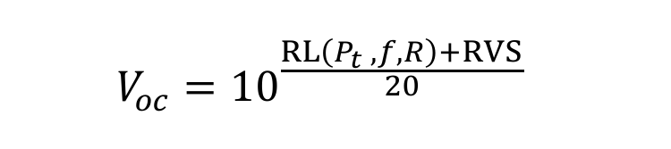

**中文说明：** V_oc 为开路电压；RVS 是反向散射节点换能器的接收电压灵敏度；RL 是换能器收到的信号级，是发射功率、频率和距离的函数。

**Original:** where RVS is the receiving voltage sensitivity of the backscatter node’s transducer, and RL is the received signal level at the transducer, which itself is a function of the transmit power (Pt), transmit efficiency (Tx), range (R), and directivity of the projector (DITx), spreading factor (k), and absorption coefficient (α) as per the following equation8,9:

**中文:** 其中，RVS 是反向散射节点换能器的接收电压灵敏度；RL 是换能器处的接收信号级，其自身是发射功率 P_t、发射效率 η_Tx、距离 R、发射器方向性 DI_Tx、扩展因子 k 和吸收系数 α 的函数，如下式 [8,9]：

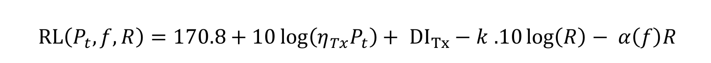

**中文说明：** 该式把发射端与信道参数折算为接收信号级。原文使用 k = 1.5、α = 0.0022 dB、DI_Tx = 2.62 dB、η_Tx = 0.175 和 P_t = 25 W。

#### A.3.2 采集电压（Harvested Voltage）

**Original:** The harvested voltage is a function of the open-circuit voltage (Voc). In particular, recall that the harvesting transducer’s output (after matching) is passed through a multi-stage rectifier that converts the AC to DC voltage and passively amplifies the voltage. The harvested voltage at output of the rectifier (Vrect) is a function of the number of stages (N) and the diode threshold voltage (Vth), and can be expressed as follows10:

**中文:** 采集电压取决于开路电压 V_oc。采集换能器经过匹配后的输出进入多级整流器，把交流转换为直流并进行无源倍压。整流器输出电压 V_rect 是级数 N 与二极管阈值电压 V_th 的函数，可写为 [10]：

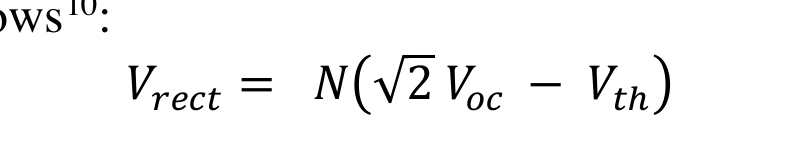

**中文说明：** 该式表明，增加整流级数 N 可提高输出，但每一级都会损失二极管阈值 V_th。原型采用 N = 4、V_th = 0.35 V。

**Original:** In our prototype implementation, RVS = -180dB re 1V/µPa, Tx = 0.175, PTx = 25 W, DITx = 2.62dB, k = 1.5, α = 0.0022dB, N = 4, and Vth= 0.35 V.

**中文:** 原型参数为：RVS = −180 dB re 1 V/µPa，η_Tx = 0.175，P_Tx = 25 W，DI_Tx = 2.62 dB，k = 1.5，α = 0.0022 dB，N = 4，V_th = 0.35 V。

**Original:** To study the harvested voltage constraint in our battery-free imaging system, we simulate the rectified voltage as a function of range following the above model (Supplementary Fig. 9a). The figure also plots the minimum activation voltage (dashed horizontal line), which corresponds to 3.2V in our design. We consider three optimizations for our proof-of-concept prototype, following the parameters highlighted in prior work on underwater backscatter7. First, we consider a design whose harvesting transducers have an RVS of -157dB re 1V/µPa (instead of -180dB re 1V/µPa), and plot the rectified voltage (in blue). Our second optimization considers a projector whose efficiency is 0.5 (instead of 0.175), and we plot the corresponding rectified voltage (in orange). Finally, we study how increasing the transmit power from 25 W to 500 W impacts the harvested voltage as a function of range (in black). The figure shows that with more optimized engineering parameters, the range of an underwater battery-free imaging system may increase to more than 300 meters, matching prior analytical model7.

**中文:** 为研究整流电压约束，作者按上述模型仿真整流电压随距离变化（补充图 9a），并绘出设计中 3.2 V 的最低激活电压虚线。基于既往水下反向散射参数 [7]，原文考虑三种优化：第一，采用 RVS = −157 dB re 1 V/µPa 的采集换能器，取代 −180 dB re 1 V/µPa，并用蓝色曲线表示；第二，将发射器效率从 0.175 提高到 0.5，用橙色曲线表示；第三，把发射功率从 25 W 提高到 500 W，用黑色曲线表示。结果表明，经工程优化后，水下无电池成像距离可扩展到 300 m 以上，与先前的解析模型一致 [7]。

**Original:** It is worth noting that the activation voltage is also function of our system design parameters. In principle, the main limitation on the voltage is determined by the non-linearity of the harvester electronics, specifically the diodes, whose threshold voltage is 0.35V. One can approach this threshold voltage (and achieve higher ranges) by increasing the number of stages in the multi-stage rectifier as well as by using rectifiers with lower threshold voltages 11.

**中文:** 激活电压同样取决于系统设计参数。电压的主要限制来自 harvester 电子器件的非线性，尤其是阈值 0.35 V 的二极管。增加多级整流器的级数，或使用更低阈值的整流器，可逐渐逼近该阈值损失并实现更远距离 [11]。

#### A.3.3 采集功率（Harvested Power）

**Original:** Next, we analyze the harvested power as a function of range. The harvested power (Pharv) is a function of the open-circuit voltage, harvesting circuit efficiency (harv), and transducer impedance (Z) as per the following equation7,8:

**中文:** 接下来分析采集功率随距离的变化。采集功率 P_harv 是开路电压、采集电路效率 η_harv 与换能器阻抗 Z 的函数，如下式 [7,8]：

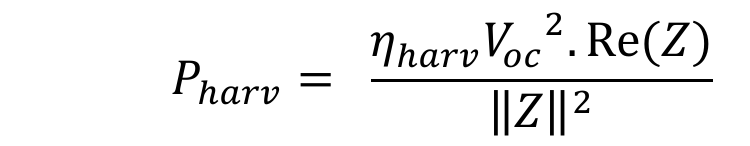

**中文说明：** 该式说明采集功率与开路电压平方成正比，并受电路效率和换能器阻抗匹配限制。原型中 η_harv = 0.16，阻抗 Z = 35 − 203j Ω。

**Original:** In our prototype implementation, harv = 0.16 and Z = 35 - 203j.

**中文:** 原型实现中，η_harv = 0.16，Z = 35 − 203j。

**Original:** We plot the harvested power as a function of range following the same parameters of the above model in (Supplementary Fig. 9b). We also plot the minimum power (dashed horizontal line) required for our prototype to operate continuously. The plot demonstrates that underwater battery-free imaging may be possible at hundreds of meters under optimized engineering design parameters.

**中文:** 作者按同一组模型参数绘制采集功率随距离变化（补充图 9b），并画出原型连续运行所需的最低功率虚线。结果表明，在优化工程参数后，水下无电池成像可能扩展到数百米。

**Original:** It is worth noting that the harvested power can be further improved by optimizing two other design parameters. First, in addition to the parameters discussed above, it is possible to boost the AC-to-DC power conversion efficiency from 0.16 to higher realizable efficiency of 0.6012. Second, the end-to-end power transfer efficiency (and range) may be improved by using beamforming ‡. In particular, past work has considered underwater acoustic beamforming and demonstrated that it can enable directivity gains of 16dB13. A natural question here is: how can a projector identify the optimal beamforming direction so that it may electronically steer its array accordingly? If the backscatter node’s location is known a priori, then the beamsteering direction may be computed geometrically and the projector can apply the corresponding beamsteering vector. Alternatively, if the backscatter node’s location (or the projector’s location) is unknown, then the projector can find the correct beam by employing one of the standard beam searching algorithms14,15. For example, the projector can first scan different directions, by sequentially applying different beamforming vectors. When it reaches the correct direction, the backscatter node powers up and responds with stored bits. The projector uses this feedback to identify the correct direction, and continues beamforming in that direction for the remainder of the communication session. Since the transmit source level in our evaluation is already high (180dB re:1µPa), such optimized designs will be critical to achieve higher range in future work.

**中文:** 采集功率还可通过另外两项设计优化进一步提升。第一，把 AC-DC 转换效率从 0.16 提高到可实现的 0.60 [12]。第二，利用波束成形提升端到端功率传输效率与距离；既往水下声波束成形展示过 16 dB 的方向性增益 [13]。问题在于发射器如何找到最佳波束方向。若反向散射节点位置已知，可几何计算波束指向并施加对应波束向量；若节点或发射器位置未知，则可使用标准波束搜索算法 [14,15]。例如，发射器依次扫描不同方向，当波束对准节点时，节点上电并返回存储比特；发射器据此反馈确定方向，并在余下会话中继续向该方向波束成形。由于当前测试的发射源级已经很高，180 dB re 1 µPa，这类优化对未来提高作用距离至关重要。

### A.4 时序分析（Timing Analysis）

**Original:** In this section, we analyze the timing performance of our ultra-low-power imaging platform. Specifically, we analyze the time that the system needs to harvest sufficient energy to power up and the time needed to capture and communicate one full image.

**中文:** 本节分析超低功耗成像平台的时序性能，包括系统采集足够能量完成上电所需的时间，以及采集并发送一幅完整图像所需的时间。

#### A.4.1 能量采集时间（Energy Harvesting Time）

**Original:** Our battery-free camera sensor operates entirely on the harvested power, and the time, T needed to harvest sufficient energy to capture a gray-scale image is given by the following equation:

**中文:** 无电池相机完全依靠采集功率运行。采集足以捕获一幅灰度图所需的时间 T 由下式给出：

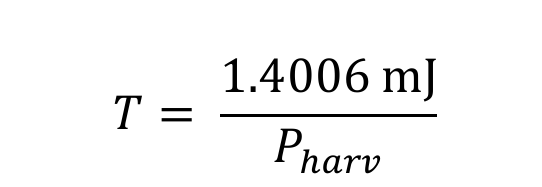

**中文说明：** 式中 1.4006 mJ 是灰度图成像采集阶段的能量需求，P_harv 是采集功率。距离越远，P_harv 越低，启动等待越长。

**Original:** where 1.4006 mJ is the energy required during the image capture phase (see Supplementary Table 2) and Pharv is the harvested power. The harvested power depends on the transmit power, distance from the projector, harvesting transducer’s RVS, and the efficiency of the harvesting circuit. With our current design parameters (see Range Analysis), it takes around 10-12 seconds to harvest sufficient energy at 1 meter. However, recall from our discussion in Range Analysis that these parameters can be optimized to increase the harvested power which would reduce the time needed to harvest sufficient energy. Specifically, using the model parameters mentioned in Range Analysis and the equation given above, we plot the harvesting time, T as a function of distance (Supplementary Fig. 9c). The plot shows that under optimized design parameters, the energy harvesting time is less than a second (i.e., the imaging operation starts instantaneously) even beyond 100 meters.

**中文:** 其中 1.4006 mJ 来自补充表 2，P_harv 为采集功率；后者取决于发射功率、离发射器的距离、采集换能器 RVS 与采集电路效率。按当前设计参数（见 Range Analysis），在 1 m 处采集足够能量约需 10–12 s。根据距离分析，优化参数可提高采集功率，从而缩短等待时间。用相应模型参数和上式可绘制采集时间 T 随距离变化（补充图 9c）；图中显示，在优化设计参数下，即使超过 100 m，采集时间也小于 1 s，可近似认为成像操作可以立即启动。

**Original:** Recall that sending a full image typically requires multiple captures (due to the memory limitations on the FPGA), and one might wonder whether each of these captures requires the above-mentioned harvesting time. However, that is not the case, and the sensor needs the harvesting time only once during the beginning of the operation. To see why, recall that the system operates in two phases: image capture phase and backscatter communication phase. The backscatter communication phase consumes significantly less power of 59 µW (Supplementary Table 2) and lasts longer (due to the narrow bandwidth of the underwater acoustic channel). As a result, the capacitor fully recharges during this phase before it needs to enter the image capture phase again, allowing for uninterrupted operation after the initial harvesting cycle.

**中文:** 由于 FPGA 存储限制，发送一幅完整图像通常需要多次采集；但这些采集并不都需要重新等待上述充电时间。系统只在运行开始时需要一次采集等待。原因在于系统分为成像采集阶段和反向散射通信阶段：通信阶段功耗仅 59 µW（补充表 2），且由于水下声信道带宽较窄而持续时间较长。因此，电容会在通信阶段完全回充，在下一次进入成像采集阶段前已恢复，使系统在初始采集周期后可连续运行。

**Original:** Finally, it is worth noting that the above analysis assumes that the system is operating in warm start (i.e., there is some pre-stored charge across the capacitor). During the cold-start phase (which occurs only once in the system’s lifetime), the capacitor is fully discharged and the time required to harvest sufficient energy to initiate the operation is given by:

**中文:** 上述分析假设系统处于热启动状态，即电容中已有部分预存电荷。冷启动阶段在系统生命周期中只发生一次：电容完全放电，需要从零采集到足以启动系统的能量，其时间由下式给出：

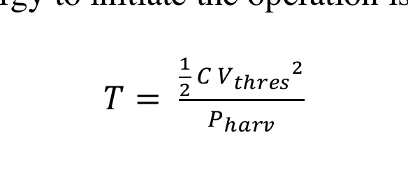

**中文说明：** 式中 C = 7500 μF，V_thres = 3.2 V，P_harv 为采集功率。该式描述从完全放电到达到启动阈值的冷启动时间。

**Original:** Where C is the capacitance value (7500 µF) and Vthres is the threshold voltage (3.2 V) across the capacitor needed to initiate the operation. With our current design parameters, it takes 4-5 minutes to harvest sufficient energy at 1 meter to initiate the imaging operation. Moreover, following the same analysis discussed above, optimizing the system design parameters would allow reducing this initiation time to few seconds.

**中文:** 其中 C = 7500 μF，V_thres = 3.2 V。按当前设计参数，在 1 m 处从冷启动采集到足以启动成像需要 4–5 min；若按前述方式优化系统参数，可把该启动时间缩短到数秒。

#### A.4.2 图像帧率（Image Framerate）

**Original:** The framerate of our system depends on the time needed to capture and communicate image data to a remote receiver. Specifically, the total time, T, needed for one full image is given by the following equation:

**中文:** 系统帧率取决于采集图像并把数据发送到远端接收器所需的时间。一幅完整图像所需的总时间 T 由下式给出：

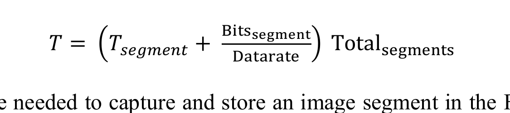

**中文说明：** T_segment 是采集并存储一个图像分段的时间，Bits_segment 是一个分段的等效比特数，Data rate 是反向散射通信速率，Total_segments 是整幅图像的分段数。

**Original:** Where Tsegment is the time needed to capture and store an image segment in the FPGA’s memory and it is equal to 0.7 seconds (Supplementary Table 1), Bitssegment is the total number of bits in a segment (25000 bits, which includes the bit-equivalent silent period, see FPGA Control and Logic in Methods), Datarate is the bitrate of backscatter communication (recall that we used 1 kbps in our experiments), and Totalsegments is equal to the total number of segments (53 segments) in one full image (see FPGA Control and Logic in Methods). For a communication data rate of 1 kbps, it takes 1362.1 seconds (~22.7 mins) to capture a grey-scale image and around 68 min to capture a color image. Note that the image transmission is the most time-consuming part because of the low datarate, and the framerate of the system can be improved by increasing the datarate of communication.

**中文:** 其中，T_segment = 0.7 s（补充表 1），Bits_segment = 25000 bit，包含等价的静默期；数据率在实验中为 1 kbps；整幅图像共 53 个分段（见主文 FPGA 控制与逻辑）。在 1 kbps 下，一幅灰度图约需 1362.1 s，即 22.7 min；彩色图约需 68 min。由于数据率低，图像传输是主要耗时环节；提高通信数据率即可提高系统帧率。

**Original:** To achieve higher framerate, we successfully experimented with communicating at 5 kbps (with BERs of 10-3 at 1m). At such datarates, the time needed to capture and communicate a grey-scale image reduces to ~5 mins (~14 mins for the color image). Moreover, higher framerates are achievable by leveraging past work on underwater backscatter node design which has demonstrated throughputs up to 20kbps2; using such designs would further reduce the time for a grey-scale image to 1.1 mins (3.4 mins for a color image).

**中文:** 为获得更高帧率，作者成功测试了 5 kbps 通信，1 m 处 BER 为 10⁻³。在该速率下，灰度图采集与传输时间降到约 5 min，彩色图约 14 min。利用既往水下反向散射节点设计已达到的 20 kbps 吞吐率 [2]，还可以把灰度图进一步缩短到 1.1 min，彩色图缩短到 3.4 min。

### A.5 成本分析（Cost Analysis）

**Original:** The total cost of fabricating and assembling our underwater batteryless imaging sensor prototype is $353.97 (Supplementary Table 3). The main components of the design are the piezoceramic transducers, camera sensor, FPGA, PCB, and housing. The prototype uses a total of six piezoceramic cylinders: two with a resonance frequency of 17 kHz and four with a resonance frequency of 30 kHz. The total cost of the piezoceramic cylinders is $231.5 (45.7*2 +35*4). The housing of the camera prototype consists of a Telesin dome port which costs $45 and a smaller acrylic dome priced at $11 to encapsulate the active illumination hardware. The IGLOO nano FPGA costs $12.72, the Himax camera sensor costs $9.95, and the total cost of PCB fabrication is $12. The low cost of fabrication of our batteryless prototype - coupled with the fact that it does not require an extensive infrastructure in the form of cabling for power and communication 16,17,18,19 - makes underwater backscatter imaging a viable method for scalable underwater imaging.

**中文:** 无电池水下成像传感器原型的制造与装配总成本为 353.97 美元（补充表 3）。主要成本来自压电陶瓷换能器、相机传感器、FPGA、PCB 和外壳。原型共使用六个压电陶瓷圆柱，其中两个谐振频率为 17 kHz，四个为 30 kHz；压电陶瓷总成本为 231.5 美元，即 45.7 × 2 + 35 × 4。外壳包括 45 美元的 Telesin 穹顶镜头罩，以及用于封装主动照明硬件的 11 美元小型亚克力穹顶。IGLOO nano FPGA 为 12.72 美元，Himax 相机传感器为 9.95 美元，PCB 制造为 12 美元。由于原型成本低，并且不需要为供电和通信铺设大规模电缆基础设施 [16–19]，水下反向散射成像具备规模化部署的可行性。

### A.6 补充讨论（Supplementary Discussion）

**Original:** We discuss the performance of our underwater wireless imaging method in the context of alternative methods for underwater communication.

**中文:** 本部分把水下无线成像方法与替代性水下通信方案进行比较。

#### A.6.1 与低功耗声学调制解调器的比较（Comparison to Low-Power Acoustic Modems）

**Original:** Our imaging method leverages acoustic backscatter communication to communicate image data at net-zero power. Our evaluation demonstrates that the method achieves communication ranges that are comparable to state-of-the-art low-power underwater modems, albeit at much lower power. Specifically, a state-of-the-art low-power acoustic modem20 requires 80 milli-Watts to transmit data at 1 kbps over 100m, while our prototype consumes 59 microwatts to transmit data at the same rate over 40m (see Fig. 4e in Main, and see Backscatter Communication Phase in Table 1 of Supplementary). Our analysis demonstrates that higher ranges are realizable with more optimized transducers (see Range Analysis in Supplementary Information).

**中文:** 成像方法利用声学反向散射以净零功耗传输图像数据。评估表明，其通信距离可与最先进的低功耗水下调制解调器相比，但功耗低得多。具体而言，一种先进低功耗声学调制解调器 [20] 以 1 kbps 在 100 m 传输需 80 mW，而原型可在 40 m 以 1 kbps 发送数据，功耗仅 59 μW（见正文图 4e 与补充表 1 的反向散射通信阶段）。分析还表明，更优化的换能器可进一步扩展距离。

**Original:** One might wonder whether prior low-power modems could be operated entirely based on harvested acoustic energy and used for net-zero-power underwater imaging. To answer this question, we consider the amount of time needed to harvest sufficient energy to transmit an image using a state-of-the-art low-power modem. Since the modem operates at the same data rate as our backscatter prototype, it would require the same amount of time for image transmission (1362.1seconds, see Supplementary Table 2) to capture and transmit a grayscale image. Multiplying this by the communication power (80mW) results in 106.07 Joules, which is 594x higher than our backscatter-based wireless platform. If one were to harvest this energy from an acoustic source (which can typically provide a few hundreds of microwatts, see Range Analysis in Supplemental Information), it would take 4-6 days to harvest sufficient energy before initiating an imaging operation (in comparison to our power-up time of 10-12 seconds). Thus, it would be impractical to design an underwater battery-free wireless imaging system leveraging prior low-power underwater acoustic modems.

**中文:** 那么，能否完全依靠采集的声能来运行传统低功耗调制解调器，实现净零功耗水下成像？若数据率与本文原型相同，传输一幅灰度图仍需 1362.1 s（补充表 2）；乘以通信功耗 80 mW，能量需求为 106.07 J，比基于反向散射的平台高 594 倍。若从通常只有数百微瓦的声源采集这些能量，启动成像前需等待 4–6 天，而本文系统上电只需 10–12 s。因此，用传统低功耗水下声调制解调器构建无电池成像系统并不现实。

**Original:** Here, it is worth noting that backscatter communication does not eliminate the energy requirements altogether; instead, it shifts the burden of power consumption from the backscatter node to a remote acoustic source (which could be on a drone, submarine, ship, or coastal base station) with a dedicated power source. According to the range analysis in prior work7 (see Range Analysis in Supplementary Information), acoustic backscatter can operate at distances of hundreds of meters under optimized system design parameters. Hence, with careful engineering design, it would be possible to leverage underwater backscatter sensor nodes for low-cost, scalable undersea observations.

**中文:** 需要注意，反向散射并没有消除能量需求，而是把功耗负担从节点转移到带专用电源的远端声源，后者可以位于无人机、潜艇、船舶或海岸基站上。根据既往距离分析 [7] 和本文 SI，在优化系统设计参数下，声学反向散射可工作在数百米距离。因此，经过精细工程设计，水下反向散射节点有望支持低成本、可扩展的海底观测。

#### A.6.2 与其他水下通信技术的比较（Comparison to Alternative Underwater Communication Technologies）

**Original:** Next, we compare underwater acoustic backscatter to alternative underwater wireless communication modalities that do not leverage acoustic signals21,22. Underwater optical communication systems can achieve higher data rates than acoustic communication systems (up to Gbps), but their range is limited by the turbidity of water21. Specifically, the communication range of low-power optical modems is less than 10 meters in turbid waters23,24, in contrast to hundreds of meters (or kilometers) for underwater acoustic communications21 (including underwater acoustic backscatter7). Aside from optical communications, some underwater communication systems use radio frequency signals, such as very-low-frequency (VLF) and extremely-low-frequency (ELF); these systems can achieve underwater communication up to few kilometers, but require kilometer-long antennas25, which makes them bulky, expensive, and impractical for a compact underwater imaging system. Finally, researchers have considered higher-frequency RF communication technologies for underwater communication (such as Bluetooth or WiFi), but these are limited to a few tens of centimeters of range26, making them undesirable for underwater communication.

**中文:** 随后，作者把水下声学反向散射与非声学无线通信方式进行比较 [21,22]。水下光通信数据率可达 Gbps，高于声通信，但距离受水体浊度限制 [21]；低功耗光调制解调器在浑浊水中通常不足 10 m [23,24]，而水下声通信可达数百米甚至数千米 [21]，包括水下声学反向散射 [7]。除光通信外，部分系统使用甚低频 VLF 或极低频 ELF 无线电，通信距离可达数千米，但需要千米级天线 [25]，体积大、成本高，不适合紧凑水下成像系统。高频 RF，如蓝牙或 WiFi，在水下通常只有几十厘米作用距离 [26]，同样不适合水下通信。

**Original:** In summary, our evaluation and analysis demonstrate that acoustic backscatter is a viable approach for low-cost, low-power, and long-range imaging of underwater environments. Fundamentally, the power asymmetry inherent to acoustic backscatter communication makes it a desirable approach for underwater sensor nodes, and enables the design of batteryless underwater cameras that could be used for long-term sustainable sensing of the underwater world.

**中文:** 总之，评估与分析表明，声学反向散射是实现低成本、低功耗、远距离水下环境成像的可行路径。声学反向散射固有的功率不对称性，使其特别适合水下传感节点，也让无电池水下相机成为长期可持续海洋感知的现实方案。

### A.7 补充图（Supplementary Figures）

#### 图 S1 硬件设计示意

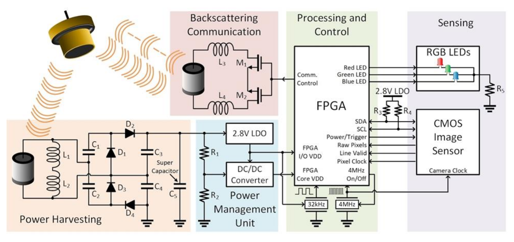

**Original caption:** Fig. 1: Schematic of the hardware design. The harvester node at the bottom is connected to a multi-stage rectifier followed by a supercapacitor, which stores the harvested energy. The supercapacitor voltage is fed to a 2.8V LDO and to a 1.4V DC/DC step-down converter. The output of the DC/DC converter is used to power the FPGA core, and the output of the LDO is used to power the FPGA banks. The FPGA is also connected to two external clocks (32kHz and 4MHz) and to the camera via several GPIO pins (pixel clock, line valid, data, power, master clock). The FPGA controls the operation of the MOSFETs connected to the communication transducer on the top left. This transducer is responsible for sending camera data via backscatter communication.

**中文图注:** 图 S1：硬件设计示意。底部采集节点连接多级整流器，后接超级电容以储存能量。超级电容电压送入 2.8 V LDO 和 1.4 V DC-DC 降压变换器；DC-DC 输出为 FPGA 核心供电，LDO 输出为 FPGA bank 供电。FPGA 还连接 32 kHz、4 MHz 两个外部时钟，并通过像素时钟、行有效、数据、电源和主时钟等 GPIO 引脚连接相机。FPGA 控制左上角通信换能器的 MOSFET，由该换能器通过反向散射发送相机数据。

**Reading note:** 该图把电气链路分为“采集/整流/储能—稳压—计算/成像—反向散射”四层；读图时重点关注 2.8 V 与 1.4 V 两路供电为何必须分离。

#### 图 S2 解调与解码流水线

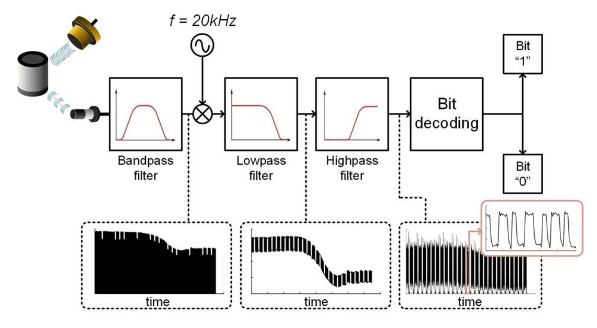

**Original caption:** Fig. 2: Demodulation and decoding pipeline. The signal received by the hydrophone is passed through a band-pass filter, then downconverted and passed through a low-pass filter to remove noise. This signal is then passed through a high-pass filter to remove the signal variations caused by low-frequency surface waves. The demodulated and filtered signal is fed to a maximum likelihood decoder.

**中文图注:** 图 S2：解调与解码流水线。水听器接收信号先经过带通滤波器，再下变频并通过低通滤波器去噪；随后经过高通滤波器，去除低频水面波造成的信号波动。解调并滤波后的信号输入最大似然解码器。

**Reading note:** 三类滤波器各有分工：带通限制载频附近信号，低通去除下变频后的高频分量，高通抑制水面波与湍流；不能把它们理解成可互换的去噪步骤。

#### 图 S3 像素数据分组

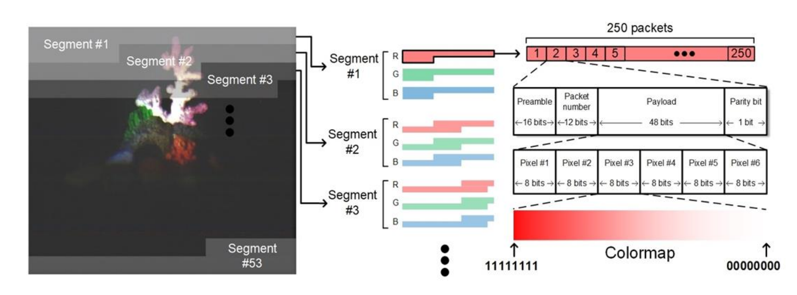

**Original caption:** Fig. 3: Packetization of pixel data. The image captured by the CMOS image sensor is divided into 53 segments. Each image segment is divided into 250 packets, where each packet contains data for 6 pixels. The uplink packet structure includes a 16-bit preamble, followed by a 12-bit long packet number, and a payload of 48 bits. A parity bit is appended to each packet; it is set to 1 if the sum of bits in the payload is even and is set to 0 otherwise.

**中文图注:** 图 S3：像素数据分组。CMOS 图像传感器的整幅图像被划分为 53 个分段，每个分段再分为 250 个包，每包包含 6 个像素的数据。上行包结构依次为 16 bit 前导码、12 bit 包序号和 48 bit 负载；末尾附加 1 bit 奇偶校验，当负载比特和为偶数时置 1，否则置 0。

**Reading note:** 用“53 × 250 × 6”可以核对整幅 QVGA 图像的像素覆盖关系；包序号负责重排与丢包检测，奇偶位负责单包错误检测。

#### 图 S4 层叠式换能器爆炸图

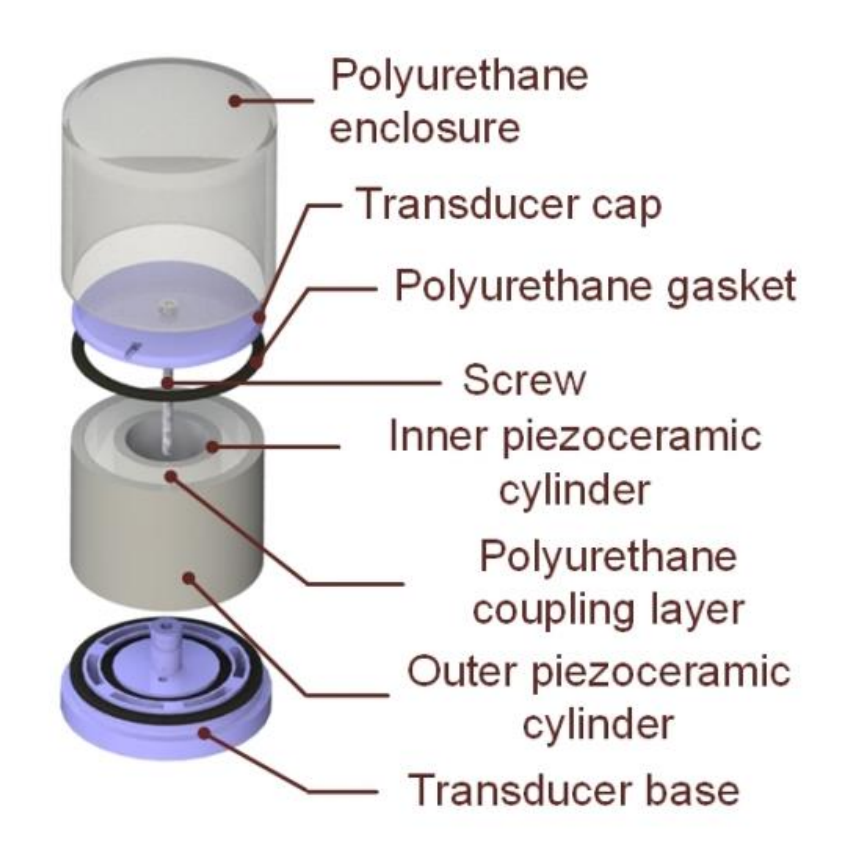

**Original caption:** Fig. 4: Exploded view of the layered transducer. The structure contains a polyurethane layer which is sandwiched between piezoceramic cylinders. The outer piezoceramic cylinder has a nominal resonance frequency of 17kHz, while the inner piezoceramic cylinder has a nominal resonance frequency of 30 kHz. Top and base caps are padded with polyurethane gaskets, and the entire structure is tightened with a screw, then encapsulated with another layer of polyurethane.

**中文图注:** 图 S4：层叠式换能器爆炸图。结构包含夹在压电陶瓷圆柱之间的聚氨酯层；外层压电陶瓷标称谐振频率为 17 kHz，内层为 30 kHz。顶盖和底盖配有聚氨酯垫圈，整体用螺钉紧固，再用另一层聚氨酯封装。

**Reading note:** 双层压电陶瓷与聚氨酯夹层共同决定声学响应；17 kHz 外层靠近发射载频，30 kHz 内层提供第二谐振自由度。

#### 图 S5 相机穹顶与 LED 穹顶

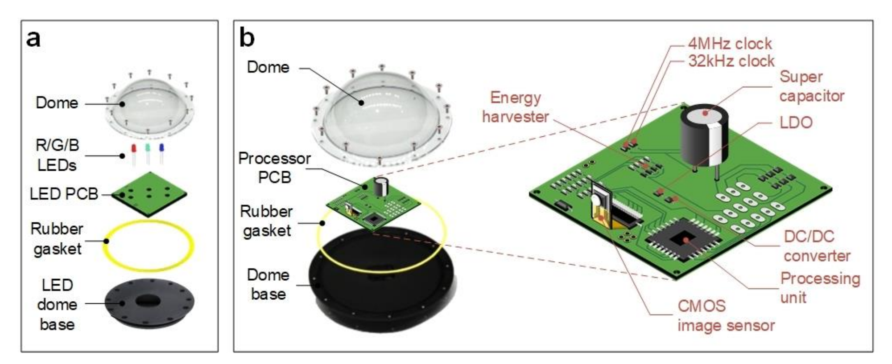

**Original caption:** Fig. 5: Exploded view of the camera dome and LED dome. (a) The LED dome contains the red (R), green (G), and blue (B) LEDs, and a layer of polyurethane gasket is added to the dome base to make it water-proof. (b) The camera PCB contains the Himax image sensor, supercapacitor for harvesting energy, power management electronics, and an FPGA for processing and memory. It also contains programming pins to program the FPGA and change camera parameters. The PCB is enclosed in a transparent dome, and the entire structure is tightly screwed to make it water-proof.

**中文图注:** 图 S5：相机穹顶与 LED 穹顶爆炸图。a：LED 穹顶容纳 R、G、B 三只 LED，底座加有聚氨酯垫圈以实现防水。b：相机 PCB 包含 Himax 图像传感器、能量采集超级电容、电源管理电子器件，以及负责处理与存储的 FPGA，并带有编程引脚，用于烧录 FPGA 和修改相机参数。PCB 封装在透明穹顶内，整体用螺钉紧固以防漏水。

**Reading note:** 该图解释了主动照明的机械隔离：LED 穹顶与相机穹顶分离，既便于封装，也减少 LED 光路与相机光路的机械耦合。

#### 图 S6 封闭与开放水域测试环境

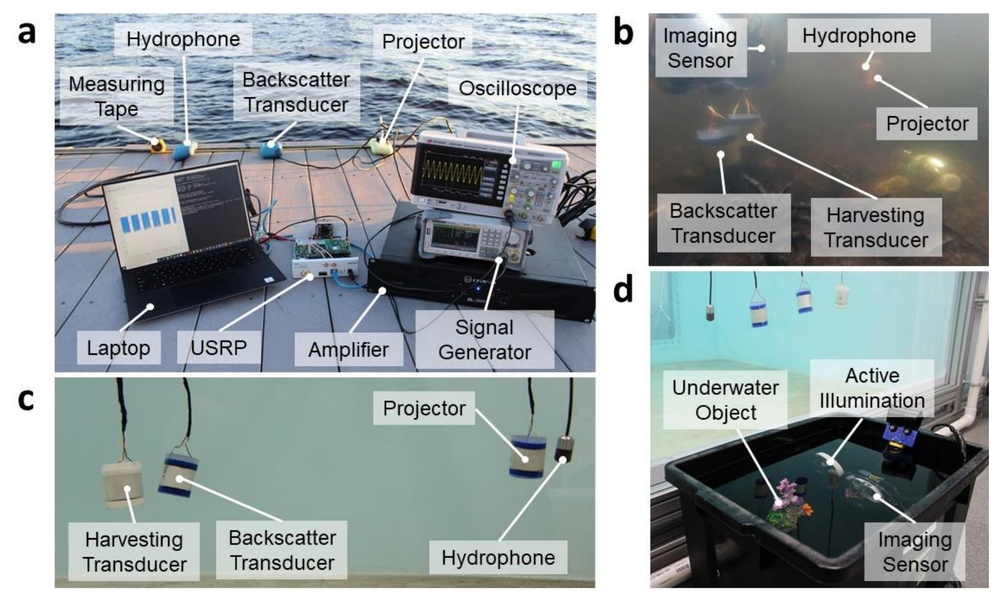

**Original caption:** Fig. 6: The prototype evaluation in enclosed and open environments. (a) shows the experimental setup in Charles River, MA. (b) shows the underwater setup in Keyser Pond, NH. (c) shows the nodes placed in the larger enclosed tank in the lab. (d) shows the experimental setup while imaging in the smaller external tank.

**中文图注:** 图 S6：原型在封闭与开放环境中的评估。a：Massachusetts 州 Charles River 的实验装置。b：New Hampshire 州 Keyser Pond 的水下装置。c：实验室大封闭水箱中的节点。d：在较小外部水箱中成像时的实验装置。

**Reading note:** a/b 验证真实水体中的距离和采集，c/d 用于受控成像与 AprilTag 数据采集；两者回答不同问题，不能混用性能结论。

#### 图 S7 AprilTag 样本图像

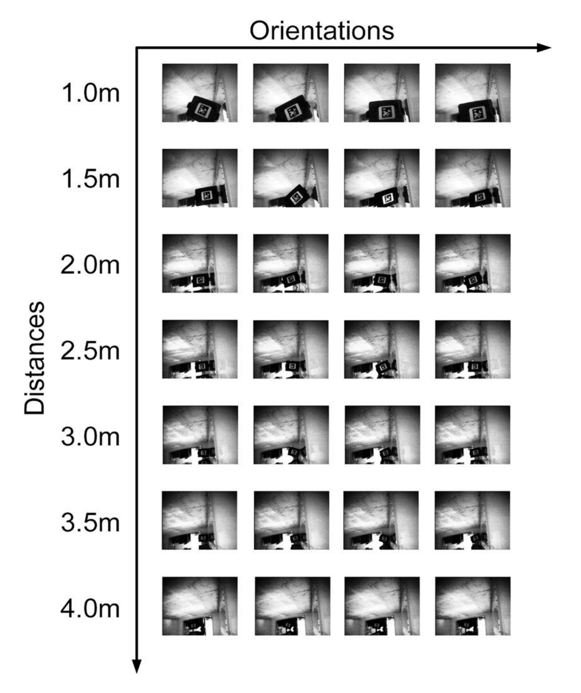

**Original caption:** Fig. 7: Sample AprilTag images. The camera prototype was used to capture a total of 160 AprilTag images at different distances, orientations, and angles.

**中文图注:** 图 S7：AprilTag 样本图像。相机原型在不同距离、朝向和角度下共采集 160 张 AprilTag 图像。

**Reading note:** 样本网格同时改变距离、朝向与视角，用来覆盖定位算法的几何条件；图像外观退化正是图 4c 定位误差上界的来源。

#### 图 S8 层叠式换能器方向性

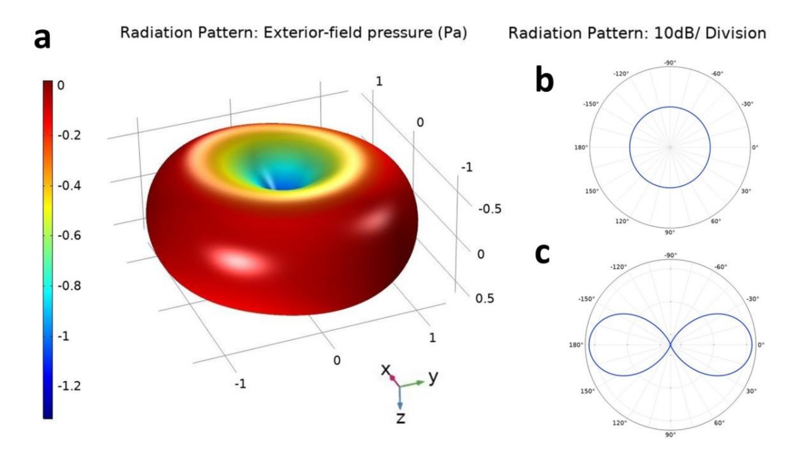

**Original caption:** Fig. 8: Directivity of the layered transducer. (a) shows the pressure radiation heatmap of the layered transducer obtained using COMSOL Multiphysics software. Dark blue regions correspond to low pressure, while dark red regions represent higher pressure. The layered transducer has a directivity index of 2.62 dB (b) shows the transverse cut of the radiation pattern which demonstrates that the layered transducer is omnidirectional in the horizontal plane. (c) shows the lateral cut of the radiation pattern.

**中文图注:** 图 S8：层叠式换能器方向性。a：COMSOL Multiphysics 得到的压力辐射热图；深蓝表示低压，深红表示高压，换能器方向性指数为 2.62 dB。b：辐射图横向切面，表明换能器在水平面内近似全向。c：辐射图侧向切面。

**Reading note:** 环形方向性有利于节点姿态未知时的采集，但也意味着能量向非目标方向分散；因此 SI 3.3 才提出用波束成形进一步提高距离。

#### 图 S9 距离分析

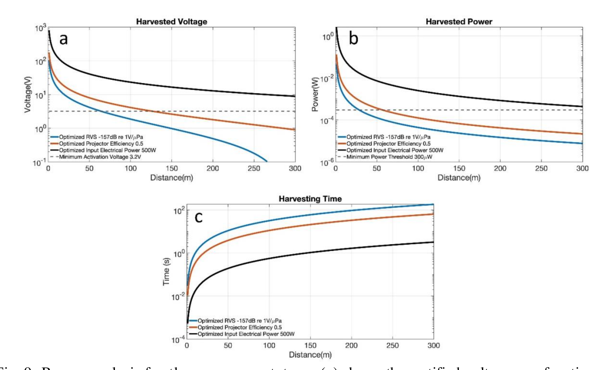

**Original caption:** Fig. 9: Range analysis for the camera prototype. (a) shows the rectified voltage as a function of the distance between the transmitter and the battery-free camera prototype. (b) shows the harvested electrical power plotted as a function of the distance between the transmitter and the battery-less camera prototype. (c) shows the harvesting time as a function of distance.

**中文图注:** 图 S9：相机原型距离分析。a：整流电压随发射器与无电池相机原型距离的变化。b：采集电功率随发射器与无电池相机原型距离的变化。c：采集时间随距离的变化。

**Reading note:** 三联图的约束顺序是“先看电压能否过启动阈值，再看功率能否维持连续运行，最后看从冷/热启动到可成像的等待时间”。优化参数后的百米级距离是模型预测，不是当前原型的实测距离。

### A.8 补充表（Supplementary Tables）

#### 表 S1 主动彩色成像功耗

| 阶段 | 器件 | 成像阶段功率 / mW | 成像阶段能量 / mJ | 通信阶段功率 / mW | 通信阶段能量 / mJ |
|---|---|---:|---:|---:|---:|
| 1 | Camera Sensor | 1.1 | 0.77 | 0 | 0 |
| 2 | Active illumination (R,G,B) | (8.22696, 4.391, 2.71) | (5.7588, 3.0737, 1.8977) | 0 | 0 |
| 3 | AGLN060 FPGA | 0.4807 | 0.336 | 0.0224 | 0.56 |
| 4 | 4 MHz oscillator | 0.168 | 0.1176 | 0 | 0 |
| 5 | 32 kHz oscillator | 0.0126 | 0.0088 | 0.0126 | 0.3150 |
| 6 | DC-DC step-down converter | 0.054867 | 0.0384 | 0.001244 | 0.0311 |
| 7 | LDO (R,G,B) | (1.4372, 1.3127, 0.575233) | (1.00604, 0.91889, 0.4026631) | 0.022854 | 0.57135 |
| 8 | N-channel MOSFETs | 0 | 0 | 24e-9 | 6e-7 |

**Original caption:** Table 1: Power consumption for active color imaging. The table shows the power consumption breakdown for each component in the prototype while performing active imaging. The energy consumption is computed and shown separately for each of the image capture and backscatter communication phases. Since there are 53 segments per image and each segment is repeated three times (once for each active illumination), the average power consumption of capturing and communicating an entire color image is 276.31 μW.

**中文表注:** 表 S1：主动彩色成像功耗。表中按成像采集与反向散射通信两个阶段列出各器件功率与能量。整幅彩色图包含 53 个分段，每个分段重复三次照明；总能耗 894.2 mJ + 234.91 mJ，总时间 4086.3 s，因此平均功耗为 276.31 μW。

**Reading note:** 主要耗能来自三色主动照明与相机传感器；通信阶段 MOSFET 开关仅消耗纳瓦级功率，是该系统能实现净零功耗的关键。

#### 表 S2 被动灰度成像功耗

| 阶段 | 器件 | 成像阶段功率 / mW | 成像阶段能量 / mJ | 通信阶段功率 / mW | 通信阶段能量 / mJ |
|---|---|---:|---:|---:|---:|
| 1 | Camera Sensor | 1.1 | 0.77 | 0 | 0 |
| 2 | AGLN060 FPGA | 0.4807 | 0.33649 | 0.0224 | 0.56 |
| 3 | 4 MHz oscillator | 0.168 | 0.1176 | 0 | 0 |
| 4 | 32 kHz oscillator | 0.0126 | 0.0088 | 0.0126 | 0.3150 |
| 5 | DC-DC step-down converter | 0.054867 | 0.0384 | 0.001244 | 0.0311 |
| 6 | Low dropout | 0.1848 | 0.12936 | 0.022854 | 0.57135 |
| 7 | N-channel MOSFETs | 0 | 0 | 24e-9 | 6e-7 |

**Original caption:** Table 2: Power consumption for passive grayscale imaging. The table shows the power consumption breakdown for each component of the prototype while performing passive grayscale imaging. The energy consumption is computed and shown separately for each of the image capture and backscatter communication phases. The average power consumption of capturing and communicating an entire grayscale image is 111.98 μW.

**中文表注:** 表 S2：被动灰度成像功耗。表中列出各器件在两个阶段的功率与能量。总能耗为 74.234 mJ + 78.304 mJ，总时间 1362.1 s，因此平均功耗为 111.98 μW。

**Reading note:** 与主动彩色成像相比，省去照明后平均功耗降至约 40%；但图像传输时长仍是决定系统帧率的主要约束。

#### 表 S3 原型成本明细

| # | 器件 | 数量 | 成本 / 美元 |
|---:|---|---:|---:|
| 1 | Piezo ceramic cylinder, 17 kHz | 2 | 91.50 |
| 2 | Piezo ceramic cylinder, 30 kHz | 4 | 140.00 |
| 3 | Polyurethane elastomer WC-575 A/B | 1（0.03 gallon） | 4.34 |
| 4 | HiMax HM01B0 camera sensor | 1 | 9.95 |
| 5 | IGLOO nano AGLN060 FPGA | 1 | 12.72 |
| 6 | TELESIN 6″ dome port | 1 | 45.00 |
| 7 | SupremeTech acrylic 3″ dome hemisphere | 1 | 10.99 |
| 8 | PCB fabrication | 1 | 12.00 |
| 9 | HM3341ND inductors | 6 | 18.98 |
| 10 | Electrical components（振荡器、电容、电阻、二极管等） | — | 19.48 |
| | **Total** | | **353.97** |

**Original caption:** Table 3: Cost breakdown of battery-free underwater camera prototype. This table shows the cost breakdown of the underwater battery free imaging prototype. The overall cost of building a battery-free imaging sensor is $353.97.

**中文表注:** 表 S3：无电池水下相机原型成本明细。整个无电池成像传感器原型的制造成本为 353.97 美元。

**Reading note:** 成本主要被压电陶瓷换能器占据；若把该系统部署成阵列，单个节点成本仍远低于铺设供电和通信电缆的基础设施成本。

### A.9 补充参考文献（Supplementary References）

补充材料列出 26 条参考文献，覆盖水下反向散射、压电换能器、声学波束成形、相机标定、AprilTag、光学通信与射频通信等主题。

> 完整参考文献：[Nature Communications 原文与 SI](https://doi.org/10.1038/s41467-022-33223-x)

---

## 阅读提示 / Critical Reading Notes

### 论文解决的问题与核心主张

1. **问题**：传统水下相机依赖电缆供能/通信或电池供电，难以进行规模化、长期、原位观测。
2. **核心主张**：用声能采集驱动全浸没节点，以单色 CMOS 传感器配合 RGB 主动照明恢复彩色图像，并通过压电声学反向散射实现净零功耗上行通信。
3. **关键创新**：远端声源供能、冷启动超级电容管理、超低功耗 FM0 反向散射，以及用普通单色传感器合成彩色图像。
4. **实验范围**：完成塑料瓶、非洲海星、水草生长和 AprilTag 定位实验；通信实验在 Charles River 中扩展到 40 m 以上。

### 证据链与结论边界

- **功耗**：主动彩色成像平均 276.31 μW，被动灰度成像平均 111.98 μW；通信阶段 59 μW，MOSFET 开关仅约 24 nW。
- **供能**：冷启动在 1 m 处需 4–5 min；热启动约 10–12 s。通信阶段功耗低且持续久，超级电容可在此期间回充。
- **成像**：R、G、B 三次单色曝光由接收端映射到三通道；池塘、海星和水草实验以定性成功为主。
- **定位**：AprilTag 在 3.5 m 以内定位误差低于 10 cm；超过该范围后，QVGA 分辨率限制检测与定位。
- **通信距离**：联合 DFE 后，在 40 m 以上仍可稳健解码；SI 中 300 m 以上的结果来自参数优化模型，不是本文实测距离。
- **时间尺度**：1 kbps 下，灰度图约 1362.1 s（22.7 min），彩色图约 68 min；系统更适合长周期监测，而非实时视频。

### 值得注意的局限与风险

- **“净零功耗”的边界**：低功耗的是水下通信节点；能量负担被转移到具有专用电源的远端声源。主文实验发射源级为 180 dB re 1 μPa @ 1 m。
- **主动照明开销**：彩色模式平均功耗明显高于被动灰度模式，深海低光应用必须承担这部分照明能耗。
- **顺序曝光与运动**：三次 RGB 曝光并非同步采集，运动和快速变化场景可能引入颜色或几何误差。
- **分辨率—带宽—能耗耦合**：提高分辨率会增加数据量、传输时间和存储需求，不会自动带来更远的定位距离。
- **声学安全与部署外推**：SI 报告了实验水域的 SELcum 与 MMPA 限值；扩大功率或阵列部署前仍需重新评估海洋哺乳动物声暴露。
- **定量评估不足**：彩色成像以示例和定性成功为主，缺少跨水体浊度、光照和距离的完整 PSNR、SSIM 或色差统计。

### 与领域的关系

- 该方法位于低功耗成像、海洋物联网与水下反向散射通信的交汇点。
- 与水下光通信、VLF/ELF 和 WiFi 等方案相比，声学反向散射的优势是距离与节点功耗，代价是 kbps 级带宽。
- 它为无缆、无电池、可长期部署的水下传感节点提供了系统级参考，但真正的大规模阵列、运动场景和长期生物附着问题仍待现场验证。

### 延伸阅读建议

- 水下反向散射网络与压电超材料：Jang & Adib (2019)；Ghaffarivardavagh et al. (2020)。
- 远距离声学通信与均衡：Freitag et al. (2000)；Sanchez et al. (2011)。
- 低功耗视觉与成像：Himax HM01B0、QVGA 成像、FM0 解码与 DFE 信道均衡。
- 后续可重点追踪：更高吞吐率反向散射、波束成形供能、彩色顺序曝光补偿，以及真实海洋环境中的长期稳定性。
