| 元数据 | 内容 |
|---|---|
| 标题 | Enabling Over-the-Air AI for Edge Computing via Metasurface-Driven Physical Neural Networks |
| 作者 | Chao Feng（冯超）, Shuo Liang, Chenghui Li, Gaogeng Zhao, Beier Jing, Yaxiong Xie, Xiaojiang Chen（陈晓江，通讯作者） |
| 单位 | 西北大学（Northwest University, China）；纽约州立大学布法罗分校（University at Buffalo SUNY, USA）；陕西省无源物联网与神经计算重点实验室；陕西省无源物联网国际联合研究中心；西安市先进无源感知与计算技术国际科技合作基地 |
| 会议 | ACM SIGCOMM 2025（SIGCOMM ’25），2025 年 9 月 8–11 日，葡萄牙科英布拉（Coimbra, Portugal），15 页 |
| DOI | https://doi.org/10.1145/3718958.3750474 |
| 论文类型 | 系统/方法论文（会议论文），15 页 |
| 来源 | Zotero 本地 PDF（selectable-text） |

## 章节索引

| 章节 | 内容 |
|---|---|
| 摘要 ABSTRACT | 系统概述与核心贡献 |
| 1 引言 INTRODUCTION | 引言：端到端“传输即计算”愿景与三大挑战 |
| 2 背景与动机 BACKGROUND AND MOTIVATION | 背景：线性神经网络（LNN）与物理神经网络（PNN）基础 |
| 3 MetaAI 的设计 DESIGN OF METAAI | 设计：训练、超表面权重实现、双并行方案、多传感器与同步/噪声处理 |
| 4 实现 IMPLEMENTATION | 实现：双频段原型、数据集、训练与实验设置 |
| 5 性能评估 PERFORMANCE EVALUATION | 评估：总体性能、微基准、多样因素与跨房间场景、实时人脸识别 |
| 6 相关工作 RELATED WORK | 相关工作：超表面、物理神经网络、RF 计算 |
| 7 讨论与未来工作 DISCUSSION AND FUTURE WORK | 讨论与未来工作 |
| 8 结论 CONCLUSION | 结论 |
| 附录 A：补充材料要点（APPENDIX） | 为何多层 PNN、256 超原子选择（WDD）、并行化折中、端到端能效分析 |

## 公式索引

- [E001 · Eq. (1)](#E001) — 线性神经网络基本运算 Y = WX
- [E002 · Eq. (2)](#E002) — 输出 y₁ 的线性展开
- [E003 · Eq. (3)](#E003) — MetaAI 空中输出 y_r = |Σ H_r(tᵢ)·xᵢ|
- [E004 · Eq. (4)](#E004) — 超表面路径信道模型 H_mts
- [E005 · Eq. (5)](#E005) — 期望权重等于超表面信道
- [E006 · Eq. (6)](#E006) — 远场条件下第 m 个超原子的接收距离
- [E007 · Eq. (7)](#E007) — 超表面相位配置优化问题
- [E008 · Eq. (8)](#E008) — 感知环境多径后的优化问题
- [E009 · Eq. (9)](#E009) — 子载波并行方案的端到端损失
- [E010 · Eq. (10)](#E010) — 天线并行方案的端到端损失
- [E011 · Eq. (11)](#E011) — 第 s 个传感器的输出
- [E012 · Eq. (12)](#E012) — 多传感器概率融合
- [E013 · Eq. (13)](#E013) — 含硬件/环境噪声的计算输出
- [E014 · Eq. (14)](#E014) — 硬件噪声重排为信号预失真
- [E015 · Eq. (15)](#E015) — 单层 PNN 的物理计算过程（附录 A.1）
- [E016 · Eq. (16)](#E016) — 多层 PNN 的简化矩阵展开（附录 A.1）
- [E017 · Eq. (17)](#E017) — PNN 与 LNN 等价条件（附录 A.1）
- [E018 · Eq. (18)](#E018) — 超定方程组（附录 A.1）
- [E019 · Eq. (19)](#E019) — 权重分布密度 WDD（附录 A.2）

## 术语表（Terminology Ledger）

| 原文术语 | 中文 | 说明 |
|---|---|---|
| MetaAI / Meta-AI | MetaAI（系统名） | 论文主文用 MetaAI，附录 A.4 与表格中用 Meta-AI，统一为 MetaAI |
| metasurface (MTS) | 超表面 | 可编程电磁表面；本文中作为计算媒介 |
| meta-atom | 超原子 | 超表面的基本可编程单元（也称单元/晶胞），本文按 meta-atom 直译 |
| PNN | 物理神经网络 | Physical Neural Network，利用物理现象做并行计算 |
| LNN | 线性神经网络 | Linear Neural Network |
| over-the-air computing | 空中计算 | 把计算融入无线信号传播过程 |
| Edge AI | 边缘 AI | 边缘侧人工智能 |
| transmit-then-compute | 先传输后计算 | 传统范式：通信与计算分离 |
| time-division multiplexing | 时分复用 | 多传感器共享同一超表面的调度方式 |
| complex-valued neural network | 复值神经网络 | 权重含幅度与相位两分量 |
| fully connected layer | 全连接层 | 线性网络的核心层 |
| desired weights (H_des) | 期望权重 | 数字网络训练出的目标权重 |
| phase shift | 相移 | 超原子对反射信号的相位调制 |
| 2-bit discrete MTS | 2 比特离散超表面 | 每个超原子 4 个离散相态（0, π/2, π, 3π/2） |
| beam scanning | 波束扫描 | 估计接收方向角 θ 的方法 |
| multipath / multipath cancellation | 多径 / 多径消除 | 利用符号零均值特性抵消环境多径 |
| Cyclic Prefix (CP) | 循环前缀 | 保证多径落在积分窗口内 |
| subcarrier-based parallelism | 基于子载波的并行 | OFDM 多子载波并行计算多类概率 |
| antenna-based parallelism | 基于天线的并行 | 多接收天线并行计算多类概率 |
| CDFA | CDFA（两级同步方案） | Coarse-grained Detection + Fine-grained Adjustment（粗粒度检测与细粒度调整） |
| coarse-grained detection | 粗粒度检测 | 用低功耗能量检测器检测信号到达 |
| fine-grained adjustment | 细粒度调整 | 训练时注入循环移位误差以增强鲁棒性 |
| Gamma distribution | Gamma 分布 | 用于模拟同步误差的分布 |
| hardware noise / environment noise | 硬件噪声 / 环境噪声 | 系统噪声的两类来源 |
| NLoS | 非视距 | Non-Line-of-Sight |
| FoV | 视场角 | Field of View，超表面有效入射角范围 [−60°, 60°] |
| WDD | 权重分布密度 | Weight Distribution Density，衡量超表面权重表征能力 |
| DiscreteNN | 离散神经网络 | 以二值化网络为基线的对照方法 |
| ResNet-18 | ResNet-18 | 高精度深度网络基线 |
| USRP X310 / X410 | USRP X310 / X410 | 软件无线电收发平台 |
| ESP32-CAM | ESP32-CAM | 低功耗物联网摄像头 |
| PIN diode (SMP1340-040LF) | PIN 二极管 | 超原子中实现相位切换的器件 |
| STM32 | STM32 微控制器 | 超表面控制核心 |
| SN74LV595 | SN74LV595 移位寄存器 | 超原子分组控制器件 |
| BPSK/QPSK/16-QAM/64-QAM/256-QAM | 各类调制方式 | 输入数据编码调制方式 |

---

## 摘要 ABSTRACT

**Original:** We present MetaAI, a novel wireless computing paradigm that integrates neural network computation directly into wireless signal propagation. Unlike traditional approaches that treat wireless channels as mere data conduits, MetaAI transforms them into active computing elements through programmable metasurfaces, enabling concurrent data transmission and neural network processing.

**中文:** 我们提出 MetaAI——一种新颖的无线计算范式，它将神经网络计算直接融入无线信号传播过程。与传统方法把无线信道仅仅当作数据传输管道不同，MetaAI 通过可编程超表面把信道转变为主动的计算元件，从而支持数据传输与神经网络处理同时进行。

**Original:** By leveraging the inherent linearity of both wireless propagation and neural networks, our design resolves the fundamental mismatch between sequential wireless transmission and parallel neural computation, while supporting efficient multi-sensor late-stage data fusion.

**中文:** 通过利用无线传播与神经网络内在的线性特性，我们的设计解决了“顺序式无线传输”与“并行式神经计算”之间的根本性错配，同时支持高效的多传感器后期数据融合。

**Original:** We implemented MetaAI using metasurfaces at both dual-band (2.4/5 GHz) and single-band (3.5 GHz) frequencies. Extensive experiments demonstrate robust performance across diverse classification tasks, achieving 82.8% average accuracy (up to 89.8%) even with a simple linear architecture. Multi-sensor fusion further improves accuracy by up to 27.06%.

**中文:** 我们用双频段（2.4/5 GHz）与单频段（3.5 GHz）的超表面实现了 MetaAI。大量实验表明，即使在简单的线性架构下，MetaAI 也能在多种分类任务上表现稳健，平均准确率达到 82.8%（最高 89.8%）。多传感器融合还能将准确率进一步提升最多 27.06%。

**Original:** MetaAI represents a fundamental shift in Edge AI architecture, where wireless infrastructure becomes an integral part of the computing pipeline.

**中文:** MetaAI 代表了边缘 AI 架构的一次根本性转变：无线基础设施成为计算流水线不可分割的一部分。

## 1 引言 INTRODUCTION

**Original:** Edge AI systems, powered by massive networks of IoT devices [7, 22, 23, 31, 42, 64], face a fundamental architectural trade-off. On-device AI offers low latency but is often infeasible due to the limited computational power and battery life of IoT devices. Consequently, many applications adopt the conventional paradigm shown in Fig. 1(a), where data is first transmitted to a powerful edge server for processing.

**中文:** 由海量 IoT（物联网）设备驱动的边缘 AI 系统 [7, 22, 23, 31, 42, 64] 面临一个根本性的架构权衡：设备端（on-device）AI 延迟低，但由于 IoT 设备有限的计算能力与电池寿命，往往并不可行。因此，许多应用采用图 1(a) 所示的传统范式——数据先被传输到强大的边缘服务器进行处理。

**Original:** Crucially, for a vast number of real-world scenarios—including environmental monitoring, industrial process control, and retail analytics—the raw sensor data must be sent to a central server for logging and analysis purposes anyway. In this common "transmit then compute" model, communication and computation are treated as two separate, sequential costs in terms of both energy and latency. This inherent inefficiency has motivated research into new computing paradigms.

**中文:** 关键的是，在大量真实场景中——包括环境监测、工业过程控制与零售分析——原始传感数据无论如何都必须发送到中心服务器进行记录与分析。在这种常见的“先传输后计算”（transmit-then-compute）模型中，通信与计算在能量与延迟两方面都被视为两个彼此独立、依次发生的开销。这种固有的低效促使研究者探索新的计算范式。

**Original:** To break the bottleneck of conventional server-side processing, a promising line of research has explored Physical Neural Networks (PNNs) [35, 45]. PNNs function as specialized hardware accelerators, analogous to GPUs, that leverage physical phenomena like wave diffraction to perform massively parallel computation at the speed of light.

**中文:** 为打破传统服务器端处理的瓶颈，一条有前景的研究路线探索了物理神经网络（PNN）[35, 45]。PNN 类似 GPU，是一种专用的硬件加速器，它利用波衍射等物理现象，以光速执行大规模并行计算。

**Original:** As illustrated in Fig. 1(b) and Fig. 2, a typical PNN operates by first having the server encode input data onto a physical structure. An RF or optical signal is then used not to convey information, but merely as a power source to "light up" this structure, performing the computation as the wave propagates through it. While this architecture offers remarkable computational speed, it remains a co-processor; it still requires the data to be fully transmitted to the server first, thus maintaining the fundamental separation between the acts of communication and computation.

**中文:** 如图 1(b) 与图 2 所示，典型 PNN 的工作方式是：服务器先把输入数据编码到某个物理结构上，随后用射频（RF）或光学信号——其作用不是传递信息，而仅仅是作为“点亮”该结构的能量源——让计算随波的传播完成。尽管这种架构计算速度惊人，但它仍是一个协处理器：数据仍需先被完整地传输到服务器，因此通信与计算在根本上是分离的。

**Original:** More recently, a new line of work has sought to fuse these two tasks. Foundational approaches to over-the-air computing successfully used signal superposition for addition [3, 47, 57]. However, these systems realize the crucial multiplication operation through complex pre-coding at the transmitter's RF front-end, which is not feasible for simple, commodity IoT devices.

**中文:** 更近期的研究开始尝试把这两件事融合起来。空中计算（over-the-air computing）的基础性工作成功利用信号叠加实现了加法 [3, 47, 57]。然而，这些系统通过发射机射频前端复杂的预编码来实现关键的乘法运算，这对简单、商用的 IoT 设备并不可行。

**Original:** The pioneering AirNN [48] system introduces a hybrid physical-digital architecture, using metasurfaces to perform the convolution over the air, with the rest of the network processed digitally. While a key step, AirNN's architecture is that of a specialized computational engine, not a general communication system. To emulate a single convolutional filter, it requires a complex multi-antenna relay to steer signals toward multiple, separate metasurfaces—one for each filter tap. This architectural complexity makes it a specialized apparatus that is difficult to integrate into standard networks.

**中文:** 先驱系统 AirNN [48] 提出了一种物理-数字混合架构：用超表面在空中完成卷积，网络其余部分以数字方式处理。虽然这是关键一步，但 AirNN 的架构是一个专用的计算引擎，而不是通用的通信系统。为了模拟单个卷积滤波器，它需要一个复杂的多天线中继把信号导向多块相互分离的超表面——每个滤波器抽头对应一块。这种架构复杂性使它成为一种难以融入标准网络的专用装置。

**Original:** These limitations lead us to ask a fundamental question: can we design a simple, single-metasurface architecture that enables an end-to-end physical neural network, fully compatible with standard wireless communication links? We answer this question affirmatively with MetaAI, a novel computing paradigm illustrated in Fig. 1(c).

**中文:** 这些局限引出了我们的根本性问题：能否设计一种简单、单超表面的架构，实现一个端到端的物理神经网络，并且与标准无线通信链路完全兼容？我们用 MetaAI 给出了肯定回答——这是一种如图 1(c) 所示的全新计算范式。

**Original:** In our architecture, a single, reconfigurable metasurface is deployed into the environment. When an IoT device transmits its data, the metasurface itself processes the signal during propagation, performing AI tasks—such as human face recognition—within the physical path. As a result, the edge server receives the final inference result instead of the raw data, unifying the acts of communication and computation into a single, efficient process.

**中文:** 在我们的架构中，环境中部署一面可重构超表面。当 IoT 设备发射数据时，超表面在信号传播过程中本身就对信号进行处理，在物理路径内完成诸如人脸识别之类的 AI 任务。于是，边缘服务器收到的是最终推理结果而不是原始数据，通信与计算被统一为单一而高效的过程。

**Original:** By shifting the computation to the air, MetaAI offers several key benefits. IoT devices are relieved from performing computation-intensive and power-hungry AI tasks, potentially extending their battery life and reducing hardware requirements. Simultaneously, edge servers only receive pre-processed AI inference results, providing a structurally private solution by avoiding the transmission of raw data. These advantages position MetaAI as an ideal solution for scenarios such as scalable smart inventory and retail, as well as privacy-preserving building management.

**中文:** 通过把计算转移到空中，MetaAI 带来若干关键收益：IoT 设备无需执行计算密集、耗电的 AI 任务，可延长电池寿命并降低硬件要求；同时，边缘服务器只收到预处理后的 AI 推理结果，通过避免传输原始数据提供了一种结构性隐私保护方案。这些优势使 MetaAI 成为可扩展的智能库存与零售、以及保护隐私的楼宇管理等场景的理想方案。
### 图 1 三种计算范式对比（现有计算架构与 MetaAI）

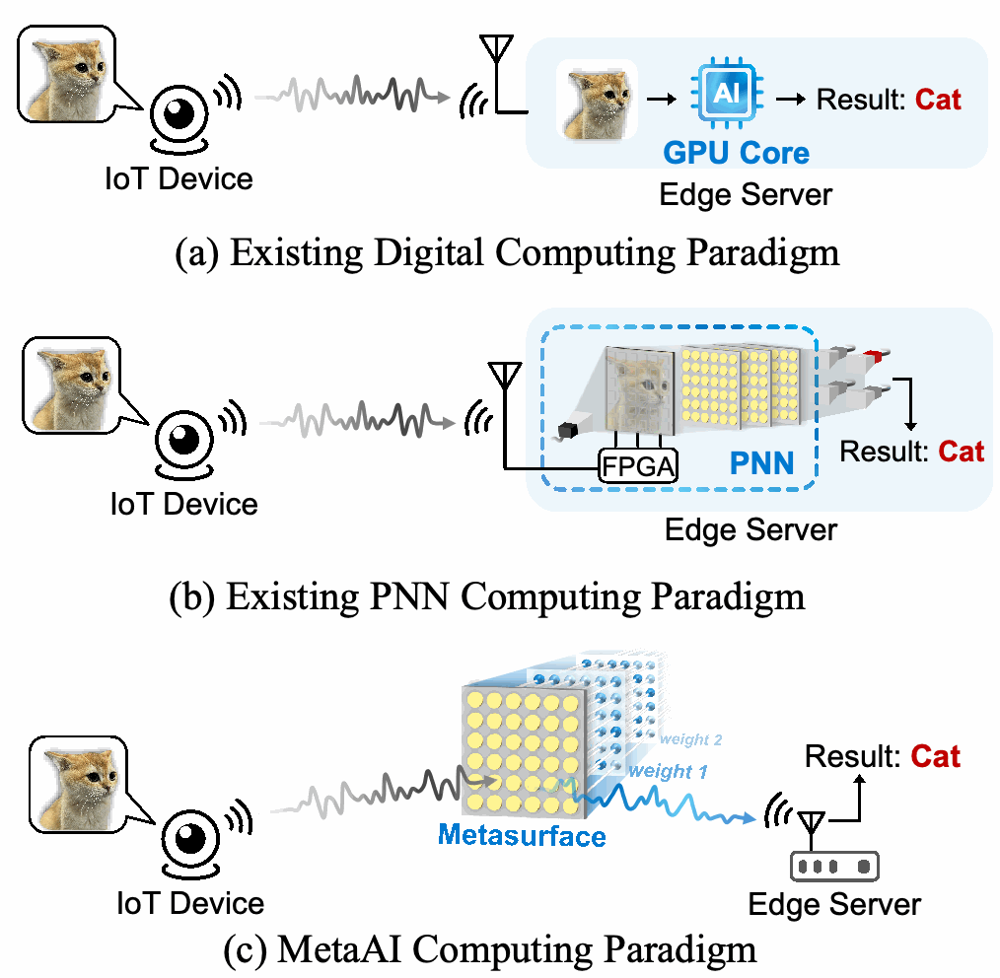

**Original caption:** Figure 1: Comparison between existing computing architecture and MetaAI.

**中文图注:** 图 1：三种计算范式对比（现有计算架构与 MetaAI）

**Reading note:** (a) 数字计算范式；(b) 现有 PNN 范式（数据仍需先传服务器）；(c) MetaAI 范式：超表面在传播路径上完成推理，服务器只收到结果。

**Original:** Implementing neural network computation within wireless signal propagation presents two fundamental challenges. The first challenge concerns data input: there exists a mismatch between sequential wireless transmission and parallel neural network computation. In wireless communication systems, data must be transmitted sequentially, symbol by symbol, while neural networks, including traditional PNNs, are designed to process all input data simultaneously in parallel.

**中文:** 在无线信号传播中实现神经网络计算面临两个根本性挑战。第一个挑战与数据输入有关：顺序式无线传输与并行式神经计算之间存在错配。在无线通信系统中，数据必须逐符号顺序传输；而神经网络（包括传统 PNN）被设计为同时并行处理全部输入数据。

**Original:** Our key insight resolves this apparent contradiction: most current PNN implementations focus on linear neural networks, whose computations can be mathematically decomposed into sequential operations without affecting the final result. This property enables us to transform parallel neural computations into equivalent sequential operations that align naturally with wireless communication.

**中文:** 我们的关键洞察化解了这一表面矛盾：目前大多数 PNN 实现聚焦于线性神经网络（LNN），而线性网络的计算在数学上可以分解为顺序操作而不影响最终结果。这一性质使我们能把并行神经计算转化为与无线通信天然契合的等价顺序操作。

**Original:** The second challenge lies in implementing the neural network computations themselves through wireless signal propagation. Here, we leverage a fundamental property of wireless systems: RF signals naturally undergo linear transformation as they propagate through the wireless channel, mathematically expressed as H(t)·x(t), where x(t) is the input signal and H is the wireless channel. This channel-signal interaction precisely mirrors the linear operations in neural networks.

**中文:** 第二个挑战在于如何通过无线信号传播本身来实现神经网络计算。这里我们利用无线系统的一个基本性质：RF 信号在无线信道中传播时天然经历线性变换，数学上可表示为 H(t)·x(t)，其中 x(t) 是输入信号，H 是无线信道。这种信道-信号的相互作用与神经网络中的线性运算精确对应。

**Original:** By programming metasurfaces to create specific channel conditions H(t), we can implement the exact weights and computations required by our neural network. The metasurface essentially transforms the wireless channel into a configurable computing medium, where neural network weights are realized through precisely controlled signal propagation.

**中文:** 通过编程超表面来构造特定的信道条件 H(t)，我们就能实现神经网络所需的精确权重与计算。超表面本质上把无线信道变成一种可配置的计算媒介，神经网络权重通过对信号传播的精确控制来实现。

**Original:** Our design extends beyond single-sensor scenarios to support multi-sensor late-stage data fusion, a crucial requirement for real-world Edge AI applications. Modern IoT systems enhance sensing performance through either multi-sensor of the same modality (like cameras from different angles) or cross-modality fusion (such as combinations of visual, audio, and other sensor data). Our metasurface-assisted approach naturally accommodates such multi-sensor deployments through simple time-division multiplexing, eliminating the need for additional hardware complexity.

**中文:** 我们的设计不局限于单传感器场景，还支持多传感器后期数据融合——这是真实边缘 AI 应用的关键需求。现代 IoT 系统既可以通过同模态的多传感器（如不同角度的相机）提升感知性能，也可以进行跨模态融合（如视觉、音频等传感数据的组合）。借助简单的时分复用，我们这种超表面辅助方法可以自然地适配多传感器部署，无需额外增加硬件复杂度。

**Original:** This capability enables sophisticated applications like comprehensive smart home monitoring, 360-degree surveillance, or multi-modal human activity recognition, all while maintaining the energy and computational benefits of our wireless computing paradigm.

**中文:** 这一能力支持诸如全面的智能家居监控、360 度监控、多模态人体活动识别等复杂应用，同时保持我们无线计算范式的能量与计算优势。

**Original:** We implemented MetaAI using two metasurfaces: one dual-band (2.4/5 GHz) and one single-band (3.5 GHz) frequencies, demonstrating its versatility across different wireless bands. Our extensive experiments show that even with a simple linear architecture, MetaAI achieves robust performance across diverse classification tasks—from handwritten digits to human gestures—with recognition accuracy averaging 82.8% and peaking at 89.8%.

**中文:** 我们用两块超表面实现了 MetaAI：一块是双频段（2.4/5 GHz），另一块是单频段（3.5 GHz），展示了其跨无线频段的通用性。大量实验表明，即使在简单的线性架构下，MetaAI 也能在从手写数字到人体手势的多种分类任务上表现稳健，识别准确率平均 82.8%、最高 89.8%。

**Original:** The system's performance further improves significantly with multi-sensor fusion: accuracy increases by up to 27.06% when combining different sensor types, and by up to 25% when using multiple sensors of the same type. Importantly, MetaAI maintains its effectiveness even in challenging wireless environments with multipath and non-line-of-sight conditions.

**中文:** 借助多传感器融合，系统性能进一步提升：融合不同传感器类型时准确率最高提升 27.06%，使用同类型多个传感器时最高提升 25%。重要的是，即使在多径与非视距（NLoS）等严苛无线环境中，MetaAI 依然保持有效。

## 2 背景与动机 BACKGROUND AND MOTIVATION

**Original:** In this section, we introduce the fundamental concepts of physical neural networks (PNNs) and motivate our proposed metasurface based PNN (MetaAI) architecture.

**中文:** 本节介绍物理神经网络（PNN）的基本概念，并引出我们提出的基于超表面的 PNN（MetaAI）架构。
### 图 2 光学与射频 PNN 的现有架构

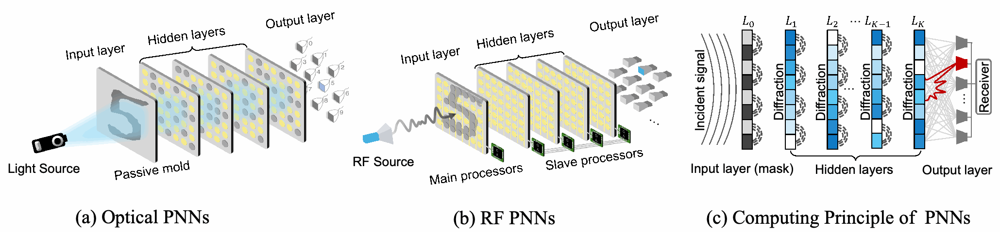

**Original caption:** Figure 2: Existing architectures of optical and RF PNNs.

**中文图注:** 图 2：光学与射频 PNN 的现有架构

**Reading note:** (a) 光学 PNN；(b) RF PNN；(c) 计算原理：输入层（掩模）→ 隐藏层（衍射）→ 输出层；传统 PNN 需要多层堆叠。

### 图 3 数字线性神经网络

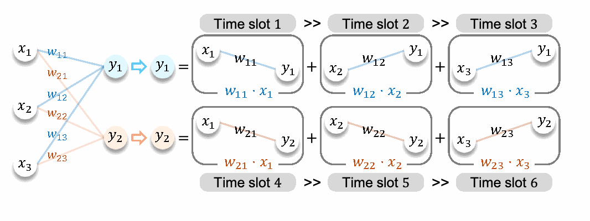

**Original caption:** Figure 3: Digit Linear Neural Network.

**中文图注:** 图 3：数字线性神经网络

**Reading note:** 3 输入、2 输出的线性网络按时间片 1→6 分解为逐符号乘加——与无线顺序传输对齐的雏形。

### 2.1 物理神经网络入门（Primer on Physical Neural Networks）

**Original:** Since most PNN implementations are based on linear neural networks (LNNs), we first present the theoretical foundation of LNNs. A typical LNN [13, 17, 19, 52] consists of three components: an input vector, a linear fully connected layer, and an output vector, as shown in Fig. 3. The relationship between the input vector X, the output vector Y, and the weight matrix W is characterized by:

**中文:** 由于大多数 PNN 实现基于线性神经网络（LNN），我们先给出 LNN 的理论基础。典型 LNN [13, 17, 19, 52] 由三部分组成：输入向量、线性全连接层与输出向量，如图 3 所示。输入向量 X、输出向量 Y 与权重矩阵 W 之间的关系为：

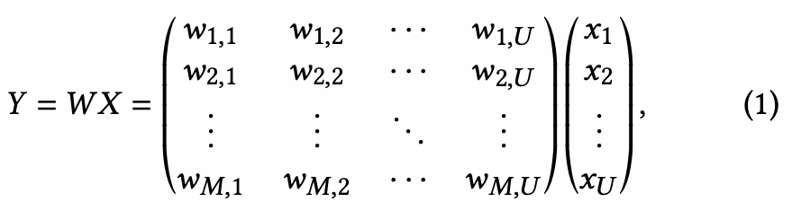

**中文说明：** M 与 U 分别表示隐藏层神经元个数与输入个数。

**Original:** An important property of LNNs is their linear composition: since all operations within an LNN are linear, multiple layers can always be collapsed into an equivalent single layer. Therefore, LNNs only require one hidden layer to capture any linear transformation.

**中文:** LNN 的一个重要性质是线性复合（linear composition）：由于 LNN 内部所有运算都是线性的，多层总能折叠为等价的单层。因此，LNN 只需一个隐藏层即可表示任意线性变换。

**Original:** Network Architecture. Physical Neural Networks (PNNs) [35, 36, 45, 62] have gained significant attention due to their unique advantages of low latency, high energy efficiency, and inherent parallel processing capabilities. Following the LNN architecture, a typical PNN consists of a signal source (either RF or optical), an input encoding layer, hidden processing layers, and an output detection layer (using photodetectors or antenna arrays).

**中文:** 网络架构。物理神经网络（PNN）[35, 36, 45, 62] 因其低延迟、高能效与内在并行处理能力等独特优势而备受关注。遵循 LNN 架构，典型 PNN 由信号源（RF 或光学）、输入编码层、隐藏处理层与输出检测层（使用光电探测器或天线阵列）构成。

**Original:** Each component serves a specific function in the network: the signal source activates the network, while the input layer encodes the incoming information into the physical domain. The hidden layers perform linear transformations through physical interactions, and the output layer captures and converts the physical results back into measurable signals.

**中文:** 每个组件在网络中承担特定功能：信号源激活网络，输入层把到来的信息编码到物理域；隐藏层通过物理相互作用执行线性变换；输出层捕获物理结果并将其转换回可测量的信号。

**Original:** Physical Data Encoding. All PNNs encode input data using specialized encoding devices, typically either a premanufactured mold or a configurable metasurface [35, 62]. The mold approach embeds the input pattern directly in its physical structure, while the metasurface method adjusts its meta-atoms' phase or amplitude to represent the input data, as shown in Fig. 2.

**中文:** 物理数据编码。所有 PNN 都用专用编码设备对输入数据编码，通常要么是预制的模具（mold），要么是可配置超表面 [35, 62]。模具法把输入图案直接嵌入物理结构；超表面法则通过调整超原子（meta-atom）的相位或幅度来表示输入数据，如图 2 所示。

**Original:** When illuminated by a signal source (RF or optic), these encoding devices modulate the incident waves according to the encoded pattern, enabling parallel data input to the network. The modulated waves serve as information carriers, transmitting the encoded data simultaneously through multiple parallel paths for processing.

**中文:** 当被信号源（RF 或光）照射时，这些编码器件按照所编码的图案调制入射波，从而实现对网络的并行数据输入。调制后的波作为信息载体，携带编码数据同时经由多条并行路径传输以进行处理。

**Original:** Analog Linear Computing. Fig. 2(c) illustrates the fundamental computing architecture of PNNs, which performs linear transformations through analog operations. The computation relies on two key physical operations: multiplication and addition. Multiplication occurs as wireless signals propagate through stacked transmissive metasurfaces, where each meta-atom functions as a neuron by modulating the phase or amplitude of incoming signals.

**中文:** 模拟线性计算。图 2(c) 展示了 PNN 的基本计算架构——通过模拟运算执行线性变换。计算依赖两个关键物理操作：乘法与加法。乘法发生在无线信号穿过堆叠的透射式超表面时，每个超原子充当一个神经元，对入射信号的相位或幅度进行调制。

**Original:** Addition happens naturally through wave superposition when multiple modulated signals combine in free space, effectively computing the sum at the speed of light [62]. These physical principles enable PNNs to efficiently implement linear operations, as both light and electromagnetic waves follow linear superposition principles in free space.

**中文:** 加法在多个调制信号于自由空间叠加时自然发生，以光速完成求和 [62]。这些物理原理使 PNN 能够高效实现线性运算，因为光与电磁波在自由空间都遵循线性叠加原理。

**Original:** Multi-layer in Practice. While LNNs theoretically require only a single layer, existing PNNs [35, 36, 45, 62] implement multiple metasurface layers in practice. This apparent contradiction stems from a fundamental difference in computation: digital LNNs can perform multiplication and addition operations independently, whereas in PNNs, these operations occur simultaneously at the meta-atoms.

**中文:** 实践中的多层。虽然 LNN 理论上只需单层，但现有 PNN [35, 36, 45, 62] 在实践中都实现多层超表面。这一表面矛盾源于计算方式的根本差异：数字 LNN 可以独立地执行乘法与加法，而在 PNN 中这两种运算在同一超原子上同时发生。

**Original:** Specifically, when signals from different inputs superimpose at a meta-atom, they are modulated (attenuated or phase-shifted) together, preventing independent weight assignment for each input signal. This coupling of operations means a single-layer PNN cannot fully represent an LNN. As we prove in Appendix A.1, adding more metasurface layers allows PNNs to asymptotically approach LNN performance.

**中文:** 具体而言，当来自不同输入的信号在一个超原子上叠加时，它们会被一起调制（衰减或移相），因而无法为每个输入信号独立分配权重。这种运算耦合意味着单层 PNN 不能完全表示一个 LNN。如附录 A.1 所证明，增加超表面层数可使 PNN 渐近逼近 LNN 的性能。

### 2.2 超表面辅助 PNN（Metasurface-assisted PNN）

**Original:** In this section, we introduce MetaAI, a novel metasurface-assisted PNN architecture that enables concurrent data transmission and neural network processing.

**中文:** 本小节介绍 MetaAI——一种能够同时进行数据传输与神经网络处理的新型超表面辅助 PNN 架构。

**Original:** Challenge: Sequential Wireless Data Transmission. Modern wireless communication systems fundamentally operate on sequential data transmission. Consider transmitting a digital image: the image is first encoded into data bits, which are then grouped and modulated into symbols (e.g., 1 bit per symbol for BPSK modulation), as illustrated in Fig. 4. These symbols are transmitted sequentially over the wireless channel, one after another. This sequential transmission paradigm creates a fundamental mismatch with traditional PNNs, which require parallel data input for processing.

**中文:** 挑战：顺序式无线数据传输。现代无线通信系统从根本上采用顺序数据传输。以传输数字图像为例：图像先被编码成数据比特，再分组并调制为符号（如 BPSK 调制下每符号 1 比特），如图 4 所示。这些符号在无线信道中一个接一个地顺序传输。这种顺序传输范式与传统 PNN 所需的并行数据输入存在根本性错配。
### 图 4 MetaAI 的顺序计算框架

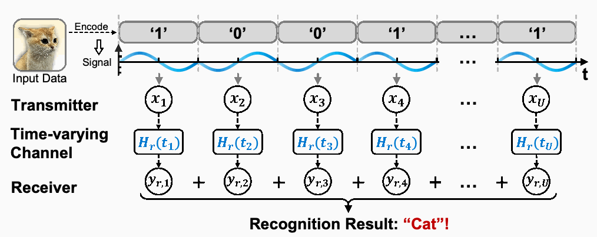

**Original caption:** Figure 4: Sequential computing framework of MetaAI.

**中文图注:** 图 4：MetaAI 的顺序计算框架

**Reading note:** 发射机编码 “1 0 0 1…” 逐符号发送，超表面提供时变信道 H_r(p₁)…，接收端依次累加得 “Cat”。

**Original:** Key Insight: Linear Decomposition of LNN. Our key insight resolves this mismatch: the linearity of LNNs enables decomposition of parallel operations into equivalent sequential computations, as illustrated in Fig. 3. Consider the computation of output y₁ in an LNN:

**中文:** 关键洞察：LNN 的线性分解。我们的关键洞察化解了这一错配：LNN 的线性特性使并行运算可以分解为等价的顺序计算，如图 3 所示。考虑 LNN 中输出 y₁ 的计算：

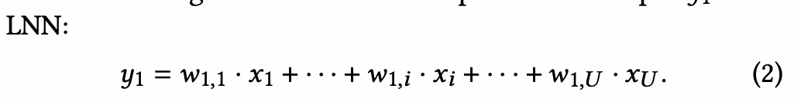

**中文说明：** 式中 w_{1,i} 是第 1 个输出对第 i 个输入的权重，x_i 是第 i 个输入。该式说明一个输出等于各输入的加权求和，因此可以把整批输入的乘累加逐项顺序完成。

**Original:** While traditional PNNs compute this expression by processing all inputs X = [x₁, ⋯, x_U] simultaneously, the linear nature of the operation allows us to compute it sequentially by accumulating the products w_{1,i}·x_i over time. This mathematical equivalence bridges the gap between sequential wireless transmission and neural network processing.

**中文:** 传统 PNN 通过同时处理全部输入 X = [x₁, ⋯, x_U] 来计算该式，而由于运算的线性本质，我们可以随时间依次累加乘积 w_{1,i}·x_i 来顺序地完成计算。这种数学等价性弥合了顺序无线传输与神经网络处理之间的鸿沟。

**Original:** 2.2.1 Architecture of MetaAI. We propose MetaAI, a novel PNN architecture that leverages wireless channels as the computing medium for neural network operations, while maintaining compatibility with standard wireless communication systems. As shown in Fig. 4, MetaAI processes data through three key steps: First, input data is encoded into bits and modulated into wireless signals for sequential transmission. These signals then propagate through the wireless channel, characterized by the time-varying channel response H(t). Finally, the receiver accumulates the sequential signals to compute the neural network outputs:

**中文:** 2.2.1 MetaAI 的架构。我们提出 MetaAI——一种把无线信道当作神经网络运算的计算媒介、同时与标准无线通信系统保持兼容的新型 PNN 架构。如图 4 所示，MetaAI 通过三个关键步骤处理数据：首先，输入数据被编码为比特并调制为无线信号顺序传输；随后，这些信号在由时变信道响应 H(t) 刻画的无线信道中传播；最后，接收端累加这些顺序信号以计算神经网络输出：

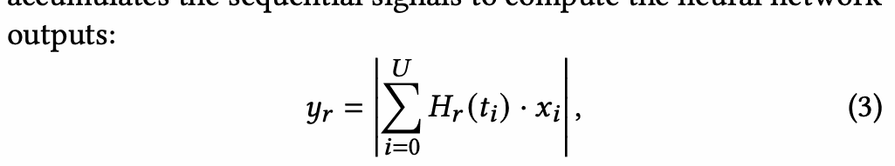

**中文说明：** 式中 H_r（t_i）表示在时刻 t 计算第 r 个输出所用的信道响应。分类任务中每个输出 y_r 对应一个类别概率（例如该图像属于“猫”这一类的可能性）。

**Original:** Note that the multiplication is performed over the air, while sequential accumulation of the results is handled in software.

**中文:** 注意：乘法在空中完成，结果的顺序累加则由软件处理。

**Original:** Single Layer with Operation Decomposition. As illustrated in Fig. 4 and Eqn. 3, MetaAI decouples multiplication and addition operations by leveraging sequential processing, enabling independent weight configuration for each input. This flexibility allows a single-layer MetaAI to achieve equivalent performance to a multi-layer traditional PNN, eliminating the need for multiple metasurface layers to approximate LNN operations.

**中文:** 单层 + 运算分解。如图 4 与式 (3) 所示，MetaAI 借助顺序处理把乘法与加法运算解耦，从而能为每个输入独立配置权重。这种灵活性使单层 MetaAI 能达到与传统多层 PNN 相当的性能，无需再用多层超表面去近似 LNN 运算。

**Original:** 2.2.2 Metasurface (MTS). A metasurface consists of multiple identical meta-atoms, each functioning as a programmable signal modulator. These meta-atoms primarily operate by introducing phase shifts φ to the reflected signals. In typical implementations, each meta-atom maintains uniform reflection amplitude while providing controllable phase modulation. In our prototype MetaAI, to simplify the fabrication process and lower production costs, we use the 2-bit discrete MTS as the case, where each meta-atom has 4 discrete states (0, π/2, π, 3π/2).

**中文:** 2.2.2 超表面（MTS）。超表面由多个相同的超原子组成，每个超原子都充当一个可编程信号调制器。超原子主要通过给反射信号引入相移 φ 来工作。在典型实现中，每个超原子保持反射幅度均匀，同时提供可控的相位调制。在我们的 MetaAI 原型中，为简化制造工艺、降低生产成本，采用 2 比特离散超表面作为实例，每个超原子有 4 个离散状态（0、π/2、π、3π/2）。

**Original:** Time-Varying Channel via Metasurface. Implementing MetaAI requires creating a time-varying channel, as shown in Eqn.3. We achieve this using programmable metasurfaces to dynamically control signal reflection and shape the wireless channel. This approach leverages the well-established capability of metasurfaces for precise, fine-grained channel manipulation demonstrated in prior works [16, 21, 29, 40].

**中文:** 用超表面构造时变信道。实现 MetaAI 需要构造时变信道，如式 (3) 所示。我们用可编程超表面动态控制信号反射、塑造无线信道来实现这一点。该方法利用了先前工作 [16, 21, 29, 40] 所展示的超表面精确、细粒度信道操控能力。

## 3 MetaAI 的设计 DESIGN OF METAAI

**Original:** In this section, we delve into the detailed design of MetaAI, an innovative PNN architecture enabling simultaneous data transmission and neural network computation. We first present how to train the network and implement the weights using metasurface. Next, we outline how parallelism and multi-sensor functionality are integrated into MetaAI's architecture to enhance efficiency and scalability. Finally, we introduce how MetaAI addresses practical issues including clock synchronization and system noises, ensuring robust performance in real-world deployments.

**中文:** 本节深入 MetaAI 的详细设计——一种能同时进行数据传输与神经网络计算的创新 PNN 架构。我们首先介绍如何训练网络并用超表面实现权重；接着说明如何把并行与多传感器功能融入 MetaAI 架构以提升效率与可扩展性；最后介绍 MetaAI 如何解决时钟同步与系统噪声等实际问题，确保在真实部署中的稳健性能。

### 3.1 训练网络（Training the Network）

**Original:** Training our MetaAI system begins with developing a digital neural network model. Since we work with RF signals that are inherently complex-valued (containing both amplitude and phase information), we design our network architecture accordingly. Specifically, we implement a complex-valued neural network with a single fully connected layer, building on established approaches for complex neural network architectures.

**中文:** 训练 MetaAI 系统始于建立一个数字神经网络模型。由于我们处理的是本质上是复值（同时含幅度与相位信息）的 RF 信号，我们据此设计网络架构：具体而言，我们基于已有的复神经网络方法，实现一个带单层全连接层的复值神经网络。

**Original:** The network's structure is tailored to each specific classification task. The fully connected layer has dimensions U × R, where U represents the length of the input data vector, and R corresponds to the number of possible classification categories. For example, in a digit recognition task with 10 classes, R would equal 10, while U would match the dimensionality of the input signal.

**中文:** 网络结构针对具体分类任务定制：全连接层维度为 U × R，其中 U 是输入数据向量的长度，R 是可能的类别数。例如在 10 类数字识别任务中 R=10，而 U 与输入信号的维度一致。

**Original:** For each dataset, we first encode each sample into data bits, which are then modulated into symbols using a specific modulation scheme, e.g., BPSK. This process transforms real-valued data representations into complex-valued formats. We then use the training samples to train this network via complex-valued backpropagation and gradient descent optimization. During training, the network learns to optimize its complex weights, which include both amplitude and phase components. These optimized weights, which we refer to as desired weights (H_des), serve as our target parameters. After training, these desired weights guide the configuration of our MTS, effectively translating our digital neural network into a physical implementation that can process RF signals in real-time.

**中文:** 对每个数据集，我们先把每个样本编码为数据比特，再用特定调制方式（如 BPSK）调制成符号，从而把实数表示转换为复值格式；随后用训练样本通过复值反向传播与梯度下降优化来训练网络。训练中网络学习优化其复权重（含幅度与相位两个分量），这些优化后的权重即我们所说的期望权重（H_des），作为目标参数。训练完成后，期望权重指导超表面的配置，把数字神经网络转化为能实时处理 RF 信号的物理实现。

### 3.2 用超表面实现权重（Weights Implementation with MTS）

**Original:** Design Goal. Our primary goal in weights implementation is to configure the meta-atoms of the MTS to generate the desired time-varying weights H_des obtained from network training. To achieve this, we first need to understand how MTS affects the wireless channel. The wireless channel through the MTS path can be modeled as:

**中文:** 设计目标。实现权重的首要目标是把超表面的超原子配置成能产生训练所得的期望时变权重 H_des。为此，我们首先需要理解超表面如何影响无线信道。经过超表面路径的无线信道可建模为：

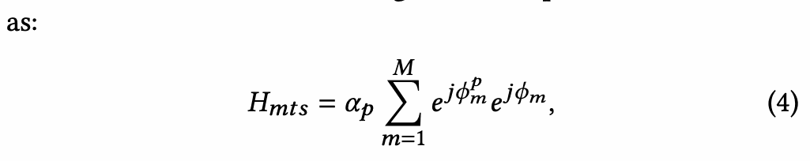

**中文说明：** M 为超原子个数，φ_m 是第 m 个超原子引入的相移，α_p 是传输路径造成的幅度偏移（远场条件下假设对所有超原子相同），φ_m^p 是经过第 m 个超原子的传播路径相位偏移。

**Original:** Notably, while α_p appears in the equation, it does not affect the final classification results. This is because according to Eqn. 3, α_p acts as a uniform scaling factor for all outputs y_r, thus preserving the relative probability distribution of the classification results. Among these parameters, the phase shift φ_m of each meta-atom is the only parameter we can actively configure to achieve:

**中文:** 值得注意的是，虽然 α_p 出现在方程中，它并不影响最终分类结果：因为根据式 (3)，α_p 对所有输出 y_r 都只是一个均匀缩放因子，因而保持了分类结果的相对概率分布。在所有这些参数中，每个超原子的相移 φ_m 是唯一可主动配置的参数，用以实现：

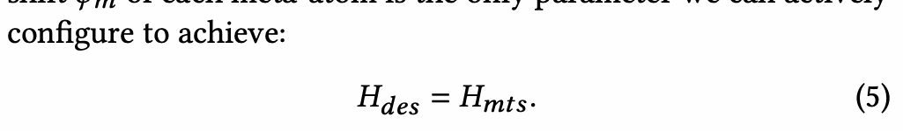

**中文说明：** 式 (5) 给出权重实现的匹配条件：把超表面各超原子配置成使物理信道 H_mts 恰好等于训练得到的期望权重 H_des，即可用超表面“复现”数字网络的权重。

**Original:** Before we can solve Eqn. 5 to obtain the configurations of each meta-atom, we need to determine the phase offset φ_m^p for each meta-atom.

**中文:** 在求解式 (5) 获得各超原子配置之前，我们需要先确定每个超原子的相位偏移 φ_m^p。

**Original:** Deriving the Propagation Phase Offsets. The phase offset φ_m^p can be expressed as k₀(d_{Tx,m} + d_{m,Rx}), where k₀ = 2π/f is the wave number, and f is the wavelength of the RF signal. While d_{Tx,m} (the distance from transmitter to the m-th meta-atom) can be determined from the fixed positions of the transmitter and MTS, calculating d_{m,Rx} (the distance from the m-th meta-atom to receiver) appears to require the receiver's exact location. However, under far-field conditions, we can simplify this calculation significantly. As shown in Fig. 5, in the far-field region, the reflected signals can be approximated as parallel waves, allowing us to express d_{m,Rx} as:

**中文:** 推导传播相位偏移。相位偏移 φ_m^p 可表示为 k₀(d_{Tx,m} + d_{m,Rx})，其中 k₀ = 2π/f 是波数，f 是 RF 信号波长。d_{Tx,m}（发射机到第 m 个超原子的距离）可由发射机与超表面的固定位置确定，但计算 d_{m,Rx}（第 m 个超原子到接收机的距离）似乎需要接收机的精确位置。然而在远场条件下可大幅简化：如图 5 所示，远场区反射信号可近似为平行波，于是 d_{m,Rx} 可表示为：

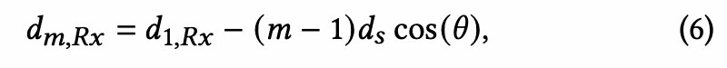

**中文说明：** d_{1,Rx} 是到第一个超原子的距离，d_s 是相邻超原子的间距，θ 是接收方向与超表面水平面之间的夹角。

**Original:** An important observation is that the term e^{jk₀d_{1,Rx}} appears as a common factor for all meta-atoms. According to Eqn. 3, this common phase factor affects all outputs equally and thus does not influence the relative magnitudes of classification probabilities. Therefore, we can focus solely on determining θ, which we achieve through standard beam scanning techniques. This approach transforms a complex three-dimensional positioning problem into a simpler angle estimation task.

**中文:** 一个重要观察是：项 e^{jk₀d_{1,Rx}} 对所有超原子都是公因子。根据式 (3)，这一公共相位因子对所有输出产生相同影响，因而不影响分类概率的相对大小。因此我们只需确定 θ，这可通过标准的波束扫描技术完成。该方法把一个复杂的三维定位问题转化为更简单的角度估计任务。
### 图 5 不同超原子的路径长度

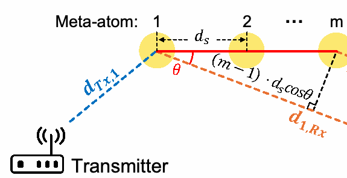

**Original caption:** Figure 5: Path length for different meta-atoms.

**中文图注:** 图 5：不同超原子的路径长度

**Reading note:** 发射机→超表面 M 个超原子→接收机的几何关系：远场平行波假设与接收角 θ 支撑式 (6)。

**Original:** Deriving the MTS Configuration. We obtain the MTS configuration by solving the following optimization problem:

**中文:** 求解超表面配置。我们通过求解以下优化问题来获得超表面配置：

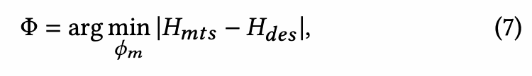

**中文说明：** Φ = [φ₁, φ₂, …, φ_M] 表示所有超原子的相移。

**Original:** However, this optimization faces a practical challenge: while the desired weights H_des can span the entire complex domain, each meta-atom in the MTS can only provide discrete phase states due to hardware limitations.

**中文:** 然而该优化面临一个实际挑战：期望权重 H_des 可以遍布整个复平面，但受硬件限制，超表面中每个超原子只能提供离散的相位状态。

**Original:** The number of meta-atoms in the MTS directly affects our ability to approximate the desired weights. As illustrated in Fig. 6, a larger number of meta-atoms provides denser coverage of the complex plane, enabling better approximation of the desired weights. We then conduct simulated experiments using the six different datasets to analyze how the number of meta-atoms affects recognition accuracy. Through empirical analysis shown in Fig. 7, we observe that the recognition accuracy improves with the number of meta-atoms but saturates beyond 256 meta-atoms. Therefore, we eventually select M = 256 as an optimal trade-off between approximation accuracy and hardware complexity (Detailed analysis seen in Appendix A.2).

**中文:** 超表面的超原子数量直接影响我们对期望权重的逼近能力。如图 6 所示，超原子越多，复平面覆盖越密，能更好地逼近期望权重。我们用六个数据集做仿真实验，分析超原子数量对识别准确率的影响。图 7 的经验分析表明：准确率随超原子数量提升，但在超过 256 个超原子后趋于饱和。因此我们最终选择 M = 256，作为逼近精度与硬件复杂度之间的最优折中（详见附录 A.2）。
### 图 6 合成权重（结果权重）的分布

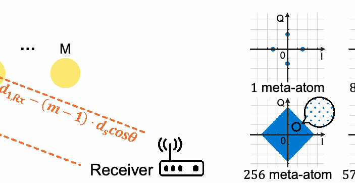

**Original caption:** Figure 6: Distribution of resultant weights.

**中文图注:** 图 6：合成权重（结果权重）的分布

**Reading note:** I-Q 复平面合成权重点分布：超原子越多覆盖越密。

### 图 7 不同超原子数量下的识别结果

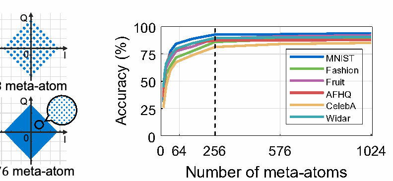

**Original caption:** Figure 7: Recognition results with varying meta-atoms.

**中文图注:** 图 7：不同超原子数量下的识别结果

**Reading note:** 六数据集识别准确率随超原子数提升、256 后饱和——据此取 M=256。

**Original:** Handling Multipath. A direct approach to dealing with environmental multipath is to incorporate it into our optimization. Specifically, if we know the environmental channel response H_e, we can modify our optimization problem to:

**中文:** 处理多径。处理环境多径的一种直接方法是把多径纳入优化：若已知环境信道响应 H_e，可将优化问题修改为：

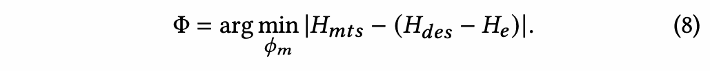

**中文说明：** 若已知环境信道响应 H_e（需先关断超表面估计得到），可让超表面只负责补偿期望权重与多径的差值；该方法仅适用于 H_e 保持不变的静态环境。

**Original:** This approach requires disabling the metasurface to estimate H_e, which introduces additional complexity and can only work in a static environment where H_e maintains constant.

**中文:** 该方法需要关闭超表面来估计 H_e，这引入了额外的复杂性，而且只能在 H_e 保持不变的静态环境中工作。

**Original:** We design a more robust approach that leverages a fundamental property of digital modulation: symbols are designed to have zero mean over their period (Fig. 8(a)). This zero-mean property is not coincidental but rather a deliberate design choice in digital communications to ensure DC-balanced transmission and reliable clock recovery.

**中文:** 我们设计了一种更稳健的方法，利用数字调制的一个基本性质：符号在其周期内被设计为零均值（图 8(a)）。这一零均值性质并非巧合，而是数字通信中的有意设计，用于保证直流（DC）平衡传输与可靠的时钟恢复。

**Original:** When transmitting these zero-mean symbols through a static channel H_e, the received environmental multipath components maintain this zero-mean property (Fig. 8(b)). However, by configuring our MTS to provide different weights within a symbol period, we intentionally break this property for the MTS path while the environmental multipath components remain zero-mean (Fig. 8(c)). Therefore, by sampling and combining multiple points within one symbol period, we can cancel out the environmental multipath while preserving the desired MTS response.

**中文:** 当这些零均值符号经静态信道 H_e 传输时，接收到的环境多径分量仍保持零均值特性（图 8(b)）。然而，通过把超表面配置成在一个符号周期内提供不同权重，我们故意让超表面路径破坏这一性质，而环境多径分量仍保持零均值（图 8(c)）。因此，在一个符号周期内采样并合并多个点，就可以在保留期望超表面响应的同时抵消环境多径。

**Original:** This approach is particularly elegant as it requires no explicit channel estimation and remains effective in dynamic environments where H_e may change between symbols. Note that we also use a standard Cyclic Prefix (CP) to ensure that all these multipath components are contained within the integration window, making this cancellation effective.

**中文:** 这种方法尤其优雅：它无需显式的信道估计，并且在 H_e 随符号变化的动态环境中依然有效。注意我们还使用了标准的循环前缀（CP），确保所有多径分量都落在积分窗口内，从而使这种抵消有效。
### 图 8 多径消除示意图

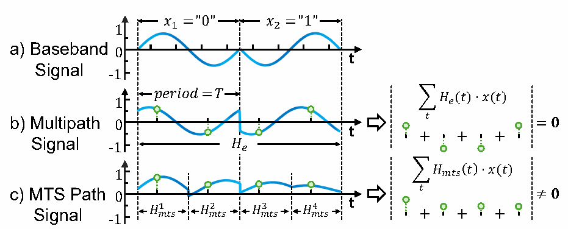

**Original caption:** Figure 8: Illustration of multipath cancellation.

**中文图注:** 图 8：多径消除示意图

**Reading note:** (a) 符号零均值；(b) 环境多径保持零均值；(c) 超表面符号周期内切权重使期望路径非零——实现无信道估计的多径消除。

### 3.3 用并行加速（Accelerating with Parallelism）

**Original:** According to Eqn. 2, each transmission only computes the probability for one category (y₁), as illustrated in Fig. 3. For a classification task with R categories, this means transmitting the input data R times sequentially, introducing substantial latency. To address this challenge, we propose two parallelism schemes that enable simultaneous computation of multiple categories.

**中文:** 根据式 (2)，每次传输只计算一个类别（y₁）的概率，如图 3 所示。对 R 类分类任务，这意味着要把输入数据顺序传输 R 次，带来可观延迟。为解决这一问题，我们提出两种并行方案，使多个类别可以同时计算。

**Original:** Subcarrier-based Parallelism. Our first approach utilizes multiple subcarriers to achieve parallel computation, as shown in Fig. 9(a). However, this presents a technical challenge: while we need different weights for different subcarriers, each meta-atom can only provide a fixed phase value at any given time. To overcome this limitation, we formulate a holistic optimization problem that finds the optimal phase configuration across all subcarriers:

**中文:** 基于子载波的并行。我们的第一种方法利用多个子载波实现并行计算，如图 9(a) 所示。但这带来一个技术挑战：不同子载波需要不同的权重，而每个超原子在任意时刻只能提供一个固定相位值。为克服这一限制，我们构造了一个全局优化问题，寻找跨所有子载波的最优相位配置：

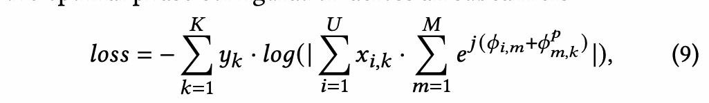

**中文说明：** K 是子载波数（等于类别数），y_k 是真实标签（正确类为 1，其余为 0），指数项表示每个超原子在每个子载波上的相位响应。

**Original:** By minimizing this loss function, we obtain phase configurations that enable effective parallel computation across all subcarriers.

**中文:** 通过最小化该损失函数，我们得到能在所有子载波上有效并行计算的相位配置。

**Original:** Antenna-based Parallelism. Our second parallelization approach leverages multiple receiving antennas, as illustrated in Fig. 9(b). In this scheme, each receiving antenna functions as an independent output neuron, enabling parallel computation of multiple category probabilities. However, since a single MTS generates the same time-varying channel for all antennas, we need a method to create distinct channel responses for each antenna.

**中文:** 基于天线的并行。第二种并行化方法利用多个接收天线，如图 9(b) 所示。该方案中每个接收天线充当一个独立输出神经元，从而并行计算多个类别概率。然而，由于单个超表面为所有天线产生相同的时变信道，我们需要一种为每个天线构造不同信道响应的方法。

**Original:** Similar to the subcarrier-based approach, we formulate this as an optimization problem:

**中文:** 与子载波方案类似，我们把它形式化为一个优化问题：

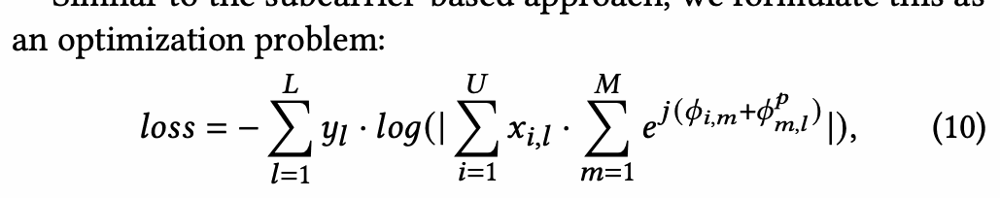

**中文说明：** L 是接收天线数（等于类别数），y_l 是真实标签，指数项表示每个超原子在每个天线位置处的相位响应。

**Original:** By minimizing this loss function, we obtain phase configurations that create effective distinct channels for each antenna.

**中文:** 通过最小化该损失函数，我们得到能为每个天线构造有效且互不相同信道的相位配置。

**Original:** Takeaway. Both parallelization schemes enable simultaneous computation of multiple categories, significantly reducing processing time compared to sequential transmission. Note that this parallelism approach is a trade-off between accuracy and latency. Different numbers of subcarriers and antennas can be used to achieve parallelism, as illustrated in Appendix A.3. This trade-off depends on specific system requirements and hardware constraints.

**中文:** 小结。两种并行方案都能同时计算多个类别，相比顺序传输显著缩短处理时间。注意并行化是准确率与延迟之间的折中：可用于并行的子载波/天线数量不同（如附录 A.3 所示），具体取舍取决于系统需求与硬件约束。
### 图 9 两种并行方案示意图

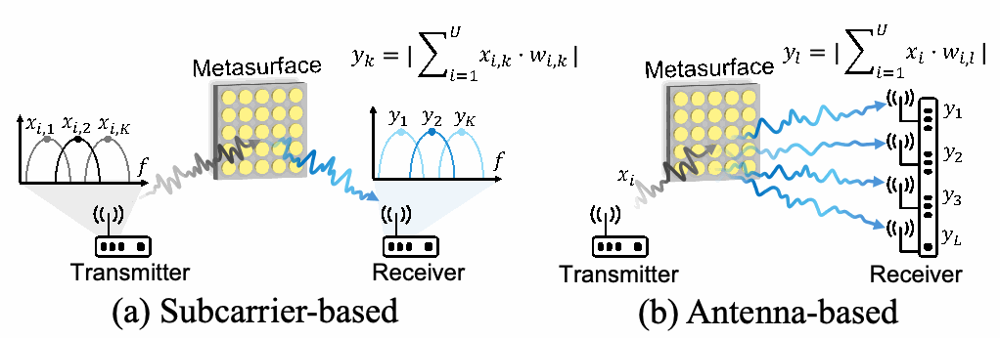

**Original caption:** Figure 9: Illustration of two parallelism schemes.

**中文图注:** 图 9：两种并行方案示意图

**Reading note:** (a) 子载波并行 y₁…y_K；(b) 天线并行 y₁…y_L。

### 3.4 多传感器与多模态（Multi-Sensor and Multi-Modality）

**Original:** In this section, we extend our computing model to support two multi-sensor scenarios: multiple sensors of the same modality (e.g., multiple cameras from different angles) and sensors of different modalities (e.g., camera and microphone). As shown in Fig. 10(a), real-world applications often benefit from combining complementary information from multiple sensors to enhance sensing performance.

**中文:** 本小节把计算模型扩展到两类多传感器场景：同模态的多个传感器（如不同角度的多台相机），以及不同模态的传感器（如相机与麦克风）。如图 10(a) 所示，真实应用往往通过融合多个传感器的互补信息来增强感知性能。

**Original:** Our approach leverages a key property of linear networks: weights associated with different sensor inputs are independent in their computations, as illustrated in Fig. 10(b). This independence enables us to process each sensor's data sequentially in a time-division manner, then combine their results. For N_s sensors, let x_i^s denote the data from the s-th sensor and H_r^s(t_i^s) represent its corresponding MTS weight. The output probability for the r-th category from the s-th sensor is:

**中文:** 我们的方法利用线性网络的一个关键性质：不同传感器输入对应的权重在计算上相互独立，如图 10(b) 所示。这种独立性使我们能以时分方式依次处理每个传感器的数据，再合并其结果。对 N_s 个传感器，令 x_i^s 表示第 s 个传感器的数据，H_r^s(t_i^s) 表示其对应的超表面权重。第 s 个传感器对第 r 类的输出概率为：

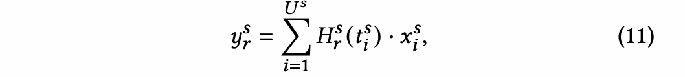

**中文说明：** U_s 是第 s 个传感器的输入数据长度。

**Original:** The final probability distribution combines results from all sensors:

**中文:** 最终的概率分布合并所有传感器的结果：

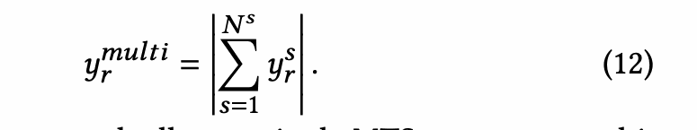

**中文说明：** 多传感器融合式：把 N_s 个传感器各自算出的第 r 类概率直接相加并取绝对值。单块超表面按时分方式服务各传感器即可得到该融合结果。

**Original:** This time-division approach allows a single MTS to support multiple sensors, regardless of their modality, offering significant advantages over traditional PNNs that require separate metasurfaces for each sensor. The approach not only reduces hardware complexity but also maintains flexibility for varying sensor configurations in practical deployments.

**中文:** 这种时分方法允许单个超表面支持多个传感器（无论其模态如何），相比需要为每个传感器配备独立超表面的传统 PNN 有显著优势：既降低了硬件复杂度，又在实际部署中保持了对不同传感器配置的灵活性。
### 图 10 多传感器场景与网络

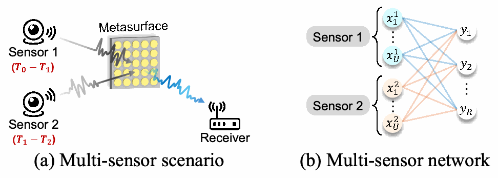

**Original caption:** Figure 10: Multi-sensor scenario and network.

**中文图注:** 图 10：多传感器场景与网络

**Reading note:** (a) 多传感器分时发送；(b) 各传感器独立加权后融合。

### 3.5 系统实现考量（System Implementation Considerations）

**Original:** The aforementioned computing scheme assumes a theoretical scenario. However, in practical implementation, MetaAI encounters several system-level challenges, including clock synchronization between the metasurface and transmitter and system noises. In the following sections, we will elaborate on each issue.

**中文:** 上述计算方案假设的是理想场景。但在实际实现中，MetaAI 会遇到若干系统级挑战，包括超表面与发射机之间的时钟同步，以及系统噪声。下面我们逐一详述。

#### 3.5.1 时钟同步（Clock Synchronization）

**Original:** Until now, the above schemes assume a perfect match between the sequential input data and the weights generated by the MTS, as shown in Fig. 11(a). However, the transmitter and MTS operate in a distributed manner, they do not share the same system clock. Consequently, it induces a basis between the sequential input data and the weight, as depicted in Fig. 11(b). Such a deviation results in a significant reduction in recognition accuracy. For example, as plotted in Fig. 13(b), a synchronization error of 4 µs causes the recognition accuracy to drop to 25.6%.

**中文:** 此前的方案都假设顺序输入数据与超表面生成的权重完全匹配，如图 11(a) 所示。然而，发射机与超表面分布式工作，二者不共享同一系统时钟，于是会在顺序输入数据与权重之间引入偏差（原文为 “induces a basis”，疑为 bias/mismatch 之笔误），如图 11(b) 所示。这种偏差会显著降低识别准确率：例如图 13(b) 显示，4 µs 的同步误差会使识别准确率跌到 25.6%。

**Original:** To overcome this issue, traditional methods [4, 44] usually utilize techniques like preamble codes and cyclic prefixes to achieve synchronization, but these methods are unsuited to our over-the-air computing systems. This is because they rely solely on post-reception adjustments to fine-tune the synchronization error, but the original information in the signals is already disrupted by the weights induced by the MTS in our case. Another option is to use expensive clock synchronization devices [47] to ensure a shared clock. However, this approach is costly and impractical for low-profile IoT devices.

**中文:** 为克服该问题，传统方法 [4, 44] 通常利用前导码与循环前缀等技术实现同步，但这些方法不适用于我们的空中计算系统：它们只依赖接收后的调整来微调同步误差，而在我们系统中信号携带的原始信息早已被超表面引入的权重破坏。另一种选择是使用昂贵的时钟同步设备 [47] 来保证共享时钟，但这对低配置 IoT 设备来说成本过高、不切实际。

**Original:** Instead, we propose a two-phase synchronization strategy called Coarse-Grained Detection and Fine-Grained Adjustment (CDFA), which significantly enhances MetaAI's ability to handle synchronization errors. The details are presented below.

**中文:** 因此，我们提出一种两阶段同步策略——粗粒度检测与细粒度调整（CDFA），显著增强 MetaAI 应对同步误差的能力。细节如下。

**Original:** Coarse-grained Detection: In this initial stage, our basic solution is to deploy a low-power energy detector (such as an envelope detector) in the MTS to detect the arrival of the incident signal. When the detector detects the energy of the incident signal greater than a threshold, it activates an output signal to notify the MCU behind the MTS to start loading the weights. However, this coarse-grained detection still entails certain synchronization discrepancies. We conduct experiments to examine the range of synchronization errors using coarse-grained detection. The result is shown in Fig. 12, from which we can see that 51.7% percentile synchronization error is larger than 3 µs, resulting in a recognition accuracy less than 41%. Such a result does not fully meet the requirements for over-the-air computing.

**中文:** 粗粒度检测：在第一阶段，我们的基本方案是在超表面中部署一个低功耗能量检测器（如包络检测器）来检测入射信号的到达。当检测器检测到入射信号能量大于阈值时，它会激活一个输出信号，通知超表面背后的 MCU 开始装载权重。然而，这种粗粒度检测仍会带来一定的同步偏差。我们通过实验考察粗粒度检测下同步误差的范围，结果如图 12 所示：51.7% 分位的同步误差大于 3 µs，对应的识别准确率低于 41%。这样的结果尚不完全满足空中计算的需求。

**Original:** Fine-grained Adjustment: To further mitigate the influence of residual synchronization errors from coarse-grained detection, we introduce a passive fine-grained adjustment strategy that mimics potential synchronization errors by injecting artificially generated error data into the training process. As shown in Fig. 13(a), a synchronization error injector is added before model training. This injector simulates synchronization errors by cyclically shifting the data, reflecting the application of synchronization errors. Considering that, in practice, synchronization errors more closely follow a Gamma distribution, as shown in Fig. 12, we use a Gamma probability distribution to generate seeds s ∼ Gamma(σ, β), which indicates the number of positions for cyclic shifts.

**中文:** 细粒度调整：为进一步抑制粗粒度检测留下的残余同步误差，我们引入一种被动的细粒度调整策略——在训练过程中注入人工生成的误差数据来模拟可能的同步误差。如图 13(a) 所示，在模型训练前加入一个同步误差注入器：通过对数据进行循环移位来模拟同步误差的作用。考虑到实际中同步误差更接近 Gamma 分布（如图 12），我们用 Gamma 概率分布生成种子 s ∼ Gamma(σ, β)，表示循环移位的位数。

**Original:** We now conduct simulation experiments to validate the improvement in system computational accuracy using the fine-grained adjustment method. The results are plotted in Fig. 13(b). We can see that the recognition accuracy (solid red line) experiences a rapid decline as the synchronization delay error increases. However, when applying our proposed method, CDFA, MetaAI maintains high accuracy levels until the synchronization delay error reaches 4 µs (solid blue line). These results demonstrate that our method can effectively address synchronization issues without requiring complex hardware modifications or precise clock-sharing mechanisms.

**中文:** 我们用仿真实验验证细粒度调整方法对系统计算精度的提升，结果见图 13(b)：不加处理时（红色实线），识别准确率随同步延迟误差增大而快速下降；而应用我们提出的 CDFA 后（蓝色实线），MetaAI 在同步延迟误差达到 4 µs 前都能保持高准确率。这些结果表明，我们的方法无需复杂硬件改造或精确的时钟共享机制就能有效解决同步问题。
### 图 11 同步过程示意图

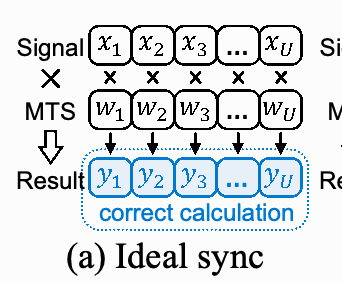

**Original caption:** Figure 11: Illustration of the sync process.

**中文图注:** 图 11：同步过程示意图

**Reading note:** (a) 理想同步（对齐、计算正确）；(b) 同步失败（延迟导致错误）。

### 图 12 粗粒度检测下的同步误差

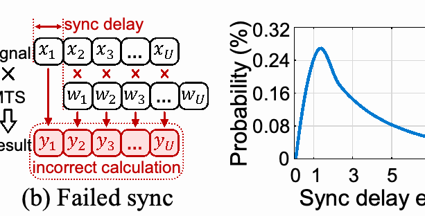

**Original caption:** Figure 12: Sync errors of coarse detection.

**中文图注:** 图 12：粗粒度检测下的同步误差

**Reading note:** 粗检测残留同步误差分布（近 Gamma 分布），可达 3–7 µs。

### 图 13 同步方案示意图

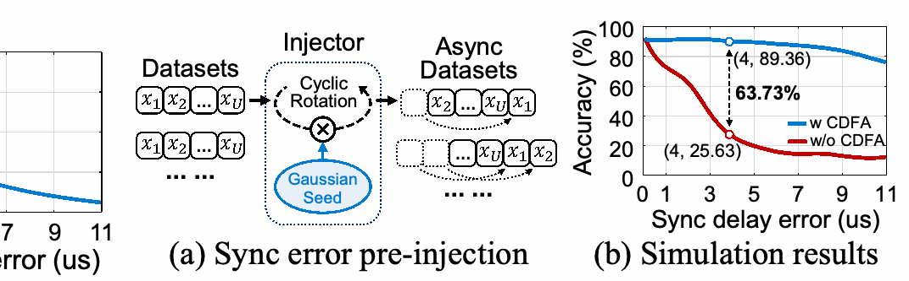

**Original caption:** Figure 13: Illustration of sync scheme.

**中文图注:** 图 13：同步方案示意图

**Reading note:** (a) 训练注入 Cyclic Rotation 模拟误差；(b) 无 CDFA 4 µs 跌至 25.63%，有 CDFA 4 µs 仍 89.36%。

#### 3.5.2 系统噪声抑制（System Noises Alleviation）

**Original:** In practical implementation, MetaAI encounters diverse system noises, including hardware noise (i.e., phase noise due to device discrepancies among meta-atoms) and environmental noise. These noise sources introduce disturbances to the final computation results. To mitigate the impact of actual noise disturbances, we propose a training scheme that introduces different noise levels to the neural network in advance. Specifically, we develop a mathematical model for noise-inclusive computation. The result affected by noise can be expressed as:

**中文:** 实际实现中，MetaAI 会遇到多种系统噪声，包括硬件噪声（即超原子间器件差异造成的相位噪声）与环境噪声。这些噪声源会给最终计算结果带来扰动。为抑制实际噪声扰动的影响，我们提出一种预先向神经网络引入不同噪声水平的训练方案。具体而言，我们建立含噪声计算的数学模型，受噪声影响的结果可表示为：

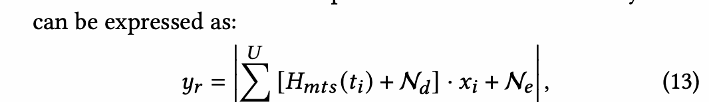

**中文说明：** N_d 是系统硬件噪声，N_e 是环境噪声。

**Original:** For the environment noise N_e, we can artificially add different noise levels to the weighted results. For the hardware noise N_d, since the weights constantly change during network training, we can not directly add different noise levels to the weights. Therefore, we reorganize Eqn. 13 as follows:

**中文:** 对环境噪声 N_e，我们可以人为地在加权结果上叠加不同噪声水平。但对硬件噪声 N_d，由于权重在训练过程中不断变化，无法直接对权重叠加不同噪声水平。因此我们把式 (13) 重排如下：

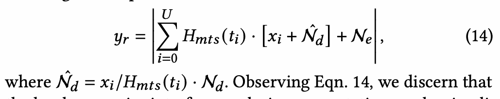

**中文说明：** 其中 N̂_d 是把硬件噪声折算到信号侧的等效噪声：N̂_d = x_i / H_mts（t_i）· N_d。

**Original:** Observing Eqn. 14, we discern that the hardware noise interference during computation can be simplified as a signal pre-disturbed by noise. Based on this insight, we can artificially reduce the signal-to-noise ratio during the model training phase to mimic the device noise. By doing so, we can effectively mitigate the impact of system noises on recognition accuracy.

**中文:** 观察式 (14) 可以发现：计算中的硬件噪声干扰可以简化为“被噪声预扰动的信号”。基于这一洞察，我们可以在模型训练阶段人为降低信噪比来模拟器件噪声，从而有效抑制系统噪声对识别准确率的影响。

## 4 实现 IMPLEMENTATION

**Original:** Metasurface Prototype and Control. MetaAI uses two prototype metasurfaces (MTS) respectively for Wi-Fi and 5G NR frequency bands to verify system performance. One MTS operates at dual-band including 2.4 GHz and 5 GHz, another MTS operates at 3.5 GHz. Each MTS consists of 16 × 16 meta-atoms.

**中文:** 超表面原型与控制。MetaAI 分别针对 Wi-Fi 与 5G NR 频段使用两块原型超表面（MTS）来验证系统性能：一块工作在包括 2.4 GHz 与 5 GHz 的双频段，另一块工作在 3.5 GHz。每块超表面由 16 × 16 个超原子组成。

**Original:** To achieve reconfigurability, we embed two PIN diodes (SMP1340-040LF) in each meta-atom, enabling four phase shift states (0, π/2, π, 3π/2), as illustrated in Fig. 14. By applying different bias voltage (0 V/5 V) to PIN diodes, each meta-atom acts as a 2-bit shifter.

**中文:** 为实现可重构，每个超原子内嵌入两个 PIN 二极管（SMP1340-040LF），可提供四个相移状态（0、π/2、π、3π/2），如图 14 所示。通过向 PIN 二极管施加不同偏置电压（0 V/5 V），每个超原子相当于一个 2 比特移相器。
### 图 14 MTS 1 与 MTS 2 的反射相位

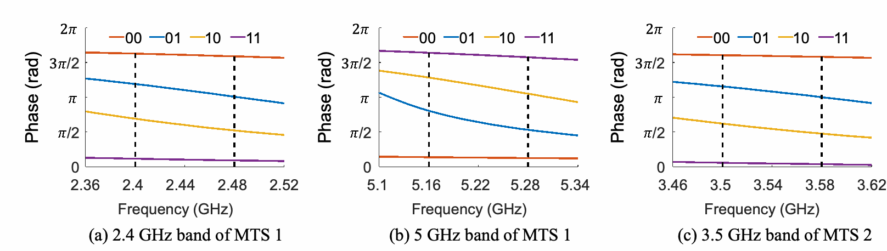

**Original caption:** Figure 14: Reflection phase of MTS 1 and MTS 2.

**中文图注:** 图 14：MTS 1 与 MTS 2 的反射相位

**Reading note:** (a)(b)(c)：MTS1 的 2.4/5 GHz 与 MTS2 的 3.5 GHz 上 4 态反射相位。

**Original:** To independently and precisely control each meta-atom, we employ an STM32 microcontroller as the control core. The 256 meta-atoms are divided into 16 groups, with each group controlled by 4 SN74LV595 shift registers. Parallel control is implemented between groups to enhance efficiency. When the receiver moves to new locations, MetaAI employs a feedback protocol [30] to reconfigure the MTS stages accordingly.

**中文:** 为独立、精确地控制每个超原子，我们以 STM32 微控制器作为控制核心：256 个超原子被分为 16 组，每组由 4 个 SN74LV595 移位寄存器控制，组间并行控制以提升效率。当接收机移动到新位置时，MetaAI 采用反馈协议 [30] 相应重新配置超表面的各级状态。

**Original:** Dataset Description. To evaluate the performance of MetaAI, we select six diverse datasets, including MNIST [26], Fashion-MNIST [59], Fruits-360 [1], AFHQ [2], CelebA [61], and Widar 3.0 [64]. These datasets cover handwritten digits, fashion goods, fruits, animals, human faces, and gestures. The detailed information about the six datasets is listed in Table 1.

**中文:** 数据集描述。为评估 MetaAI 的性能，我们选取六个多样性数据集：MNIST [26]、Fashion-MNIST [59]、Fruits-360 [1]、AFHQ [2]、CelebA [61] 与 Widar 3.0 [64]，涵盖手写数字、服饰、水果、动物、人脸与手势。六个数据集的详细信息列于表 1。

**表 1（Table 1：Performance under different datasets，不同数据集下的性能）**（图注原文见上句；数据来自 PDF 内嵌表格，转写为 Markdown）：

| 数据集 | 训练样本 | 测试样本 | 类别 | ResNet18（仿真） | DiscreteNN（仿真） | DiscreteNN（原型） | MetaAI（仿真） | MetaAI（原型） |
|---|---|---|---|---|---|---|---|---|
| MNIST [26] | 60000 | 10000 | 10 | 99.62 | 81.54 | 72.05 | 92.75 | 89.77 |
| Fashion [59] | 60000 | 10000 | 10 | 93.55 | 79.38 | 66.52 | 86.04 | 80.86 |
| Fruits-360 [1] | 25772 | 6528 | 8 | 99.82 | 80.71 | 68.77 | 89.11 | 85.05 |
| AFHQ [2] | 14630 | 1500 | 3 | 96.07 | 80.47 | 68.20 | 87.33 | 81.47 |
| CelebA [61] | 220 | 80 | 10 | 90.91 | 66.00 | 57.47 | 81.25 | 75.00 |
| Widar3.0 [64] | 2700 | 300 | 6 | 95.00 | 82.33 | 70.67 | 89.67 | 84.67 |

**Original:** Network Model Prototype. MetaAI adopts one fully connected layer complex neural network model, which is trained in the Pytorch platform, termed the "simulation model". The model is trained on a computer powered by an AMD Ryzen 7950x (5.7GHz) processor, complemented by 64GB RAM and NVIDIA RTX4080 GPU. The learning rate of the entire experiment is set to 8 × 10⁻³, the momentum is set to 0.95, the batch size is set to 64, and the training epoch is 60. Once the model is optimized, the weights are then transformed into the MTS configurations, named the "prototype model".

**中文:** 网络模型原型。MetaAI 采用单全连接层复神经网络模型，在 Pytorch 平台上训练，称为“仿真模型”。模型在一台配备 AMD Ryzen 7950x（5.7 GHz）处理器、64 GB 内存与 NVIDIA RTX4080 GPU 的计算机上训练：学习率 8 × 10⁻³，动量 0.95，批大小 64，训练 60 轮。模型优化完成后，权重被转换为超表面配置，称为“原型模型”。

**Original:** Experimental Setup. For controlled experiments, we use one USRP X310 software-defined radio device as the transmitter (Tx) and the receiver (Rx), respectively. We conduct extensive experiments in three indoor environments (corridor, laboratory, and office) to evaluate the performance of MetaAI. Fig. 15 presents a typical experimental scenario in the office environment.

**中文:** 实验设置。在受控实验中，我们分别用一台 USRP X310 软件无线电设备作为发射机（Tx）与接收机（Rx），并在走廊、实验室与办公室三种室内环境中开展大量实验评估 MetaAI。图 15 展示了办公室环境中的典型实验场景。

**Original:** In the default setup, we select the MNIST dataset to test MetaAI performance and use 256-QAM modulation to encode the input data. The carrier frequency is set to 5.25 GHz and the transmission symbol rate is 1 M symbols/sec. The maximum switching rate of the MTS is set to 2.56 MHz coding patterns/sec. We set the Tx-MTS distance as 1 m with an incidence angle of 30°, and the MTS-Rx distance as 3 m with an emerging angle of 40°. All devices are placed at a height of 1.1 m. We use accuracy as a metric to evaluate the performance of MetaAI.

**中文:** 默认设置下，我们用 MNIST 数据集测试 MetaAI，并以 256-QAM 调制编码输入数据：载频 5.25 GHz，符号率 1 M symbols/s；超表面最大切换率 2.56 MHz coding patterns/s；Tx-MTS 距离 1 m、入射角 30°，MTS-Rx 距离 3 m、出射角 40°，所有设备置于 1.1 m 高度。评估指标为准确率。
### 图 15 实际实验场景

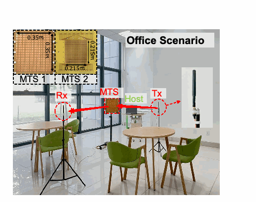

**Original caption:** Figure 15: Practical experiment scenario.

**中文图注:** 图 15：实际实验场景

**Reading note:** 办公室场景：Tx/MTS1/MTS2/Rx/Host 相对摆放（0.35 m、0.215 m 等），对应 1 m/3 m、30°/40° 设置。

## 5 性能评估 PERFORMANCE EVALUATION

### 5.1 总体性能（Overall Performance）

**Original:** To evaluate the system-level performance of MetaAI, we conduct experiments on six different datasets, each varying in size, complexity, and number of classifications. The results, shown in Table 1, reveal that MetaAI achieves recognition accuracies of 89.77%, 80.86%, 85.05%, 81.47%, 75.00%, and 84.67%, respectively. These accuracies are only slightly lower than simulation (run on the digital computer), no more than 7%, demonstrating MetaAI's capability to recognize different tasks effectively.

**中文:** 为评估 MetaAI 的系统级性能，我们在六个规模、复杂度与类别数各异的数据集上实验。表 1 结果显示，MetaAI 的识别准确率分别为 89.77%、80.86%、85.05%、81.47%、75.00% 与 84.67%，只比（在数字计算机上运行的）仿真低不到 7%，说明 MetaAI 能有效识别不同任务。

**Original:** In particular, MetaAI performs worst in recognizing face tasks, likely due to the inherent complexity of human faces, which require a more advanced deep learning framework to extract distinguishing features. Additionally, to verify the effectiveness of our approach that first trains a network with continuous weights and then uses the MTS to best approximate those ideal continuous values, we implement a discrete neural network [24] as a baseline.

**中文:** 尤其地，MetaAI 在人脸任务上表现最差，这可能源于人脸内在的复杂性——需要更先进的深度学习框架来提取区分性特征。此外，为验证“先训练连续权重网络、再用超表面去最佳逼近这些理想连续值”这一方法的效果，我们实现了离散神经网络 [24] 作为基线。

**Original:** The results in Table 1 show that the accuracy of the DiscreteNN method on the six datasets is 72.05%, 66.52%, 68.77%, 68.20%, 57.47%, and 70.67%, respectively, which is significantly lower than that of MetaAI. These results highlight the continuous-to-discrete approximation strategy outperforms methods that are constrained to discrete parameters from the beginning.

**中文:** 表 1 显示 DiscreteNN 在六个数据集上的准确率分别为 72.05%、66.52%、68.77%、68.20%、57.47% 与 70.67%，明显低于 MetaAI。这些结果表明，“连续到离散的逼近”策略优于一开始就受离散参数约束的方法。

### 5.2 微基准测试（Micro-benchmarks）

**Original:** Verification of clock synchronization scheme. To verify the proposed clock synchronization scheme, we conduct a set of experiments with/without a sync scheme. Fig. 16 illustrates the results, we can see that without a sync scheme, the average recognition accuracy is only 19.23%, which is basically a blind guess. With coarse-grained detection (CD), the accuracy increases to 55.71%. By combining coarse-grained detection and fine-grained adjustment (CDFA), MetaAI can achieve a higher recognition accuracy of 89.28%. These results demonstrate the effectiveness of the proposed scheme.

**中文:** 时钟同步方案验证。为验证所提同步方案，我们进行了一组“有/无同步方案”的对比实验。图 16 显示：无同步方案时平均识别准确率仅 19.23%，基本等同于瞎猜；加入粗粒度检测（CD）后准确率升至 55.71%；再结合细粒度调整（CDFA），MetaAI 可达更高的 89.28%。这些结果证明了所提方案的有效性。
### 图 16 同步方案性能

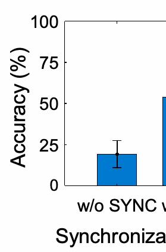

**Original caption:** Figure 16: Performance of sync scheme.

**中文图注:** 图 16：同步方案性能

**Reading note:** w/o SYNC 19.23% → w/ CD 55.71% → w/ CDFA 89.28%。

**Original:** Verification of multipath cancellation scheme. We now evaluate how the multipath cancellation scheme impacts MetaAI performance. Specifically, we conduct extensive experiments in three indoor environments: a corridor, an office, and a laboratory, which respectively represent different complex multipath environments. For each, we randomly move the receiver to 10 locations and collect measurements, respectively. Meanwhile, we evaluate both directional and omni-directional antennas (referred to as Dire and Omni) on the Tx and Rx. Fig. 17 plots the results.

**中文:** 多径消除方案验证。我们评估多径消除方案对 MetaAI 性能的影响：在走廊、办公室与实验室三种室内环境中（分别代表不同复杂程度的多径环境）实验，每种环境随机移动接收机到 10 个位置采集数据；同时在收发端分别使用定向（Dire）与全向（Omni）天线。结果见图 17。

**Original:** Without the multipath cancellation scheme, the recognition accuracy of MetaAI in the corridor is higher than in other environments, while the Dire antenna works better than the Omni antenna. This is because the corridor is a low multipath environment, and the Omni antenna is more susceptible to multipath than the Dire antenna. When using the proposed multipath cancellation scheme, we can observe that MetaAI is capable of achieving an average accuracy higher than 82.65% for both the Dire and Omni under different indoor environments. These results indicate that our proposed method can effectively mitigate the impact of multipath interference, making MetaAI robust across various multipath conditions.

**中文:** 不使用多径消除方案时，MetaAI 在走廊（低多径环境）的准确率高于其他环境，且定向天线优于全向天线——因为全向天线比定向天线更易受多径影响。启用所提多径消除方案后，MetaAI 在不同室内环境下对 Dire 与 Omni 天线都能取得高于 82.65% 的平均准确率。这说明该方法能有效抑制多径干扰，使 MetaAI 在多种多径条件下保持稳健。
### 图 17 多径方案性能

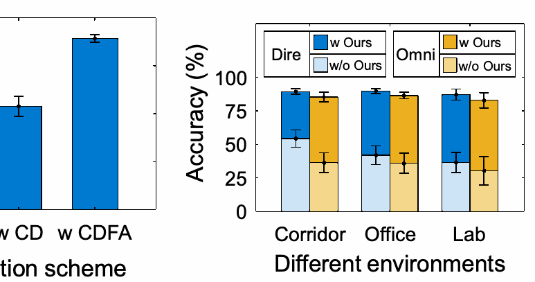

**Original caption:** Figure 17: Performance of multipath scheme.

**中文图注:** 图 17：多径方案性能

**Reading note:** 走廊/办公室/实验室 × Dire/Omni：启用多径消除后均高于 82.65%。

**Original:** Verification of parallelism scheme. We now evaluate the effectiveness of the proposed parallelism schemes based on subcarriers and antennas. For the subcarrier-based implementation, we utilize OFDM modulation to generate multi-subcarrier signals, configuring the base frequency at 5.25 GHz and subcarrier spacing at 40 kHz. In the antenna-based implementation, we use a fully synchronized, multi-antenna receiver array (three USRP X410s). Experiments are conducted on three datasets, and the results are summarized in Fig. 18. Compared to the baseline scheme, both parallelization strategies exhibit only a slight performance degradation, validating the effectiveness of the proposed approaches.

**中文:** 并行方案验证。我们评估基于子载波与天线的并行方案：子载波实现采用 OFDM 生成多子载波信号（基频 5.25 GHz、子载波间隔 40 kHz）；天线实现采用三台完全同步的 USRP X410 构成多天线接收阵列。在三个数据集上的结果见图 18：与基线相比，两种并行策略都只有轻微的性能下降，验证了所提方法的有效性。
### 图 18 并行方案性能

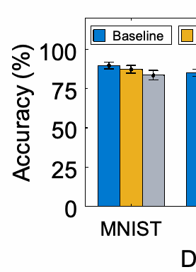

**Original caption:** Figure 18: Performance of parallelism scheme.

**中文图注:** 图 18：并行方案性能

**Reading note:** MNIST/Fruits/AFHQ：Subcarrier/Antenna 并行相对基线仅轻微下降。

**Original:** Verification of system noises alleviation scheme. We now examine how system noises impact MetaAI performance. Specifically, we fix the locations of the Tx and MTS with a distance of 1 m and randomly move the Rx to 20 locations. In each location, for simulating different levels of environmental noises, we vary the transmitter power from 5 dB to 30 dB with a step of 5 dB and collect 20 measurements, respectively. Fig. 19 plots the results with/without using the proposed system noise alleviation scheme. We can see that with the help of the noise alleviation scheme, MetaAI can improve the 80th percentile accuracy from 80.48% to 87.92%, which implies the effectiveness of the proposed scheme.

**中文:** 系统噪声抑制方案验证。我们考察系统噪声对 MetaAI 性能的影响：固定 Tx 与超表面相距 1 m，随机移动 Rx 到 20 个位置；每个位置通过把发射功率从 5 dB 以 5 dB 步长调到 30 dB 来模拟不同环境噪声水平，各采集 20 次测量。图 19 对比了是否使用所提噪声抑制方案的结果：启用后 MetaAI 把 80 分位准确率从 80.48% 提升到 87.92%，验证了方案有效性。
### 图 19 噪声场景下的性能

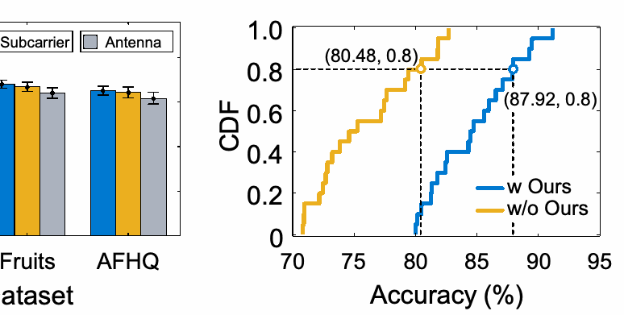

**Original caption:** Figure 19: Performance under noise scenarios.

**中文图注:** 图 19：噪声场景下的性能

**Reading note:** 准确率 CDF：80 分位 80.48% → 87.92%（噪声抑制）。

**Original:** Verification of multi-sensor scheme. We now evaluate the performance of MetaAI with the integration of different types of sensing nodes for collaborative sensing using a shared MTS. Specifically, we select three different multi-sensor datasets, including (1) Multi-PIE [50]: a human face dataset contains images of faces from different camera angles, we select three views (c07, c09, and c29), and respectively select a training set of 192 samples and a test set of 48 samples for 10 classifications in each view; (2) RF-Sauron [60]: an RFID-based gesture dataset consists of three receiving antennas in three different directions. In each antenna, we select a training set of 2800 samples and a test set of 1280 samples for 10 classifications, respectively; (3) USC-HAD [63]: it consists of data from accelerometers and gyroscopes to perform activity recognition. For each sensor, we respectively select a training set of 336 samples and a test set of 85 samples for 6 classifications.

**中文:** 多传感器方案验证。我们评估用共享超表面集成不同类型感知节点进行协同感知的性能。为此选取三个多传感器数据集：(1) Multi-PIE [50]——不同相机角度的人脸数据集，选取三个视角（c07、c09、c29），每个视角各取 192 个训练样本、48 个测试样本做 10 类分类；(2) RF-Sauron [60]——基于 RFID 的手势数据集，包含三个不同方向的接收天线，每根天线各取 2800 个训练样本、1280 个测试样本做 10 类分类；(3) USC-HAD [63]——由加速度计与陀螺仪数据构成的活动识别数据集，每个传感器各取 336 个训练样本、85 个测试样本做 6 类分类。

**Original:** Next, we respectively use the aforementioned datasets to conduct experiments. The results, shown in Fig. 20, demonstrate that as the number of sensing nodes increases, the recognition accuracy improves. For example, for the face dataset, the accuracy with one view is only 64.58%, but it increases to 89.58% with three views, reflecting a 25% improvement. Additionally, it is noteworthy that for collaborative sensing across different modalities, MetaAI continues to enhance accuracy. For instance, in the USC-HAD dataset, using both accelerometer and gyroscope data leads to a 27.06% improvement over using a single modality. These results indicate that MetaAI can effectively leverage a shared MTS to enable collaboration between different sensing nodes, thereby boosting sensing performance.

**中文:** 我们用上述数据集分别实验。图 20 显示：随着感知节点数增加，识别准确率随之提升。例如人脸数据集中，单视角准确率仅 64.58%，三视角时升至 89.58%，提升 25%。值得注意的是，跨模态协同感知时 MetaAI 同样能提升准确率：例如 USC-HAD 数据集中，同时使用加速度计与陀螺仪相比单模态提升了 27.06%。这些结果表明，MetaAI 能利用共享超表面让不同感知节点协作，从而提升感知性能。
### 图 20 多传感器下的性能

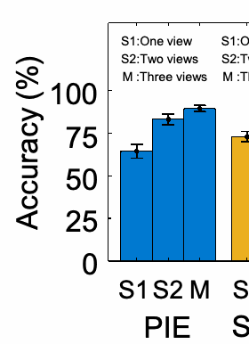

**Original caption:** Figure 20: Performance under multi-sensor.

**中文图注:** 图 20：多传感器下的性能

**Reading note:** 视角/天线/模态融合（Multi-PIE、RF-Sauron、USC-HAD）：融合后准确率最高。

### 5.3 多因素下的性能（Performance under Diverse Factors）

**Original:** Performance under NLoS scenarios. In this experiment, we examine the performance of MetaAI in an NLoS corridor corner. Specifically, the MTS is placed at a corridor intersection, the Tx and Rx are not visible, and the distance of Tx-MTS is set as 1 m. We vary the distance of Rx-MTS from 1 m to 22 m with a step of 3 m. Fig. 21 presents the results. We can see that MetaAI can achieve an average accuracy above 76.60% across different locations, which implies MetaAI can work well in NLoS scenarios.

**中文:** 非视距（NLoS）场景下的性能。本实验考察 MetaAI 在 NLoS 走廊拐角的性能：超表面放在走廊交叉口，Tx 与 Rx 互不可见，Tx-MTS 距离固定 1 m；把 Rx-MTS 距离从 1 m 以 3 m 步长变化到 22 m。图 21 显示，MetaAI 在不同位置都能取得高于 76.60% 的平均准确率，说明其在 NLoS 场景下也能良好工作。
### 图 21 NLoS 场景下的性能

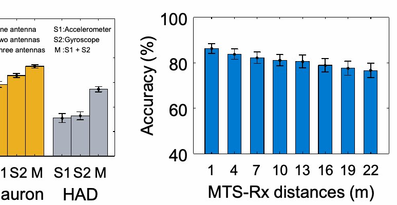

**Original caption:** Figure 21: Performance under NLoS scenarios.

**中文图注:** 图 21：NLoS 场景下的性能

**Reading note:** NLoS 走廊拐角、MTS-Rx 1–22 m：平均准确率 >76.60%。

**Original:** Performance under different frequency bands. In this experiment, we examine the generalization capability of MetaAI at different frequency bands, including 2.4 GHz, 3.5 GHz, and 5 GHz. Specifically, we fix the Tx and the MTS, and randomly move the Rx to ten different locations. In each location, we collect measurements and plot the results in Fig. 22. We observe that MetaAI can achieve an average accuracy above 88.69%, 88.39%, and 89.67% for 2.4 GHz, 3.5 GHz, and 5 GHz, respectively. These results indicate that MetaAI can work well for different frequencies.

**中文:** 不同频段下的性能。本实验考察 MetaAI 在 2.4 GHz、3.5 GHz 与 5 GHz 等不同频段的泛化能力：固定 Tx 与超表面，随机移动 Rx 到十个位置采集数据，结果见图 22。MetaAI 在 2.4 GHz、3.5 GHz、5 GHz 的平均准确率分别高于 88.69%、88.39%、89.67%，说明其能在不同频率下良好工作。
### 图 22 不同频段下的性能

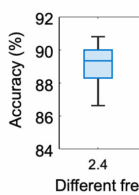

**Original caption:** Figure 22: Performance at different frequency bands.

**中文图注:** 图 22：不同频段下的性能

**Reading note:** 2.4/3.5/5 GHz 平均准确率分别 >88.69%/88.39%/89.67%。

**Original:** Performance under different modulation schemes. We now evaluate the MetaAI performance when the transmitted information is encoded by different modulation schemes including BPSK, QPSK, 16-QAM, 64-QAM, and 256-QAM. The experimental setup is the same as the default. As shown in Fig. 23, the recognition accuracy slightly varies as the modulation order increases. Overall, MetaAI consistently achieves an average accuracy above 88.71%, demonstrating its robust performance across different modulation schemes.

**中文:** 不同调制方式下的性能。我们评估 MetaAI 在 BPSK、QPSK、16-QAM、64-QAM、256-QAM 等调制方式下的表现（实验设置同默认）。图 23 显示，随调制阶数升高准确率仅有轻微波动；总体而言 MetaAI 平均准确率稳定高于 88.71%，在不同调制方案下表现稳健。
### 图 23 不同调制方式的影响

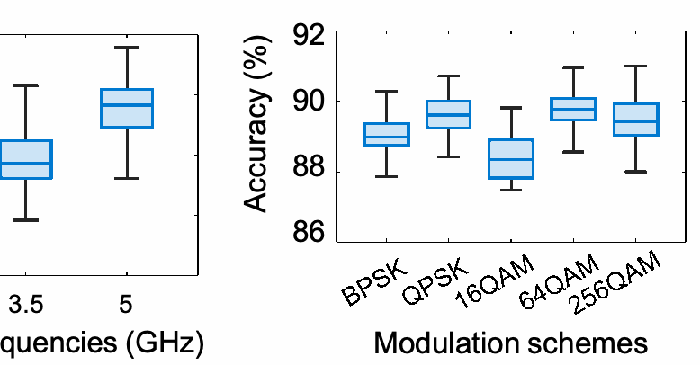

**Original caption:** Figure 23: Impact of different modulation schemes.

**中文图注:** 图 23：不同调制方式的影响

**Reading note:** BPSK→256-QAM 各调制准确率稳定 >88.71%。

**Original:** Impact of different Tx-MTS distances. In this experiment, we examine the impact of different Tx-MTS distances. By moving Tx along the direction of 30°, we change the distance between Tx and MTS from 1 m to 22 m with a step of 3 m. As shown in Fig. 24, MetaAI can consistently achieve an average recognition accuracy higher than 78.94%, which indicates MetaAI is robust to different Tx-MTS distances.

**中文:** 不同 Tx-MTS 距离的影响。本实验考察 Tx-MTS 距离的影响：让 Tx 沿 30° 方向移动，使 Tx 与超表面距离从 1 m 以 3 m 步长变化到 22 m。图 24 显示 MetaAI 始终能取得高于 78.94% 的平均识别准确率，说明其对不同 Tx-MTS 距离具有鲁棒性。
### 图 24 不同 Tx-MTS 距离的影响

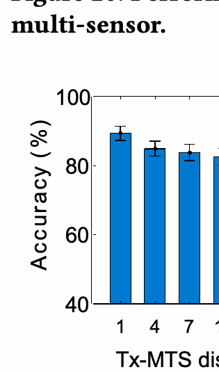

**Original caption:** Figure 24: Impact of different Tx-MTS distances.

**中文图注:** 图 24：不同 Tx-MTS 距离的影响

**Reading note:** Tx-MTS 距离 1–22 m：平均准确率 >78.94%。

**Original:** Impact of different Tx-MTS angles. To evaluate the impact of the angle between Tx and MTS, we move the Tx along a semicircle (1 m radius) from 0° to 80° with a step with 10°. The results are plotted in Fig. 25, we observe that MetaAI can achieve a similar recognition accuracy above 84.85% when the incident angle changes from 0° to 60°. However, when the angle is more than 60°, the accuracy gradually declines. For example, the accuracy is only 75.01% when the angle is 80°. This is because the MTS has a limited FoV (i.e., [−60°, 60°]).

**中文:** 不同 Tx-MTS 角度的影响。为评估 Tx 与超表面夹角的影响，我们让 Tx 沿半径 1 m 的半圆从 0° 以 10° 步长移动到 80°。图 25 显示：入射角从 0° 到 60° 时 MetaAI 能取得高于 84.85% 的相近准确率；超过 60° 后准确率逐渐下降（例如 80° 时仅 75.01%）。这是因为超表面的视场角（FoV）有限，即 [−60°, 60°]。
### 图 25 不同 Tx-MTS 角度的影响

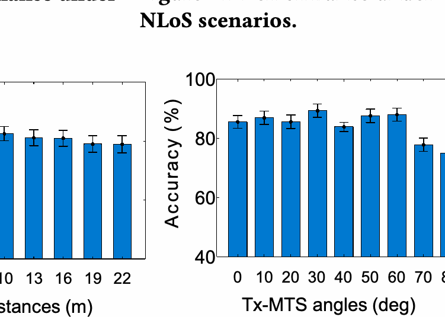

**Original caption:** Figure 25: Impact of different Tx-MTS angles.

**中文图注:** 图 25：不同 Tx-MTS 角度的影响

**Reading note:** 入射角 0°–60° 准确率 >84.85%，80° 降至 75.01%（FoV [−60°,60°]）。

**Original:** Impact of dynamic interference. We now evaluate the performance of MetaAI under different dynamic interference. Specifically, we deploy the Tx-MTS and the Rx-MTS with a distance of 3 m, and respectively ask one interferer to walk normally in four different regions as shown in Fig. 26(a). The results are shown in Fig. 26(b). We observe that the accuracy only slightly decreases in regions R₁ to R₃. This robustness is attributed to our proposed multipath mitigation scheme, which effectively reduces the impact of dynamic interference in scenarios where the environmental channel varies between symbols but remains stable within each symbol—that is, the walking speed of the interferer is significantly lower than the symbol rate. In contrast, a more noticeable accuracy drop occurs in region R₄, where the interferer obstructs the direct path between the receiver and the MTS. Nevertheless, the recognition accuracy in R₄ remains above 85.38%. These results demonstrate that MetaAI is resilient to dynamic environmental interference.

**中文:** 动态干扰的影响。我们评估 MetaAI 在不同动态干扰下的性能：Tx-MTS 与 Rx-MTS 距离均为 3 m，让一个干扰者分别在四个区域（图 26(a)）正常走动。图 26(b) 显示：在区域 R₁–R₃ 准确率仅轻微下降，这归功于我们的多径抑制方案——它能在“环境信道随符号变化、但在单个符号内保持稳定”（即干扰者步行速度远低于符号率）的场景下有效降低动态干扰影响。相比之下，区域 R₄ 出现较明显的准确率下降，因为干扰者遮挡了接收机与超表面之间的直达路径；即便如此，R₄ 的识别准确率仍高于 85.38%。这些结果表明 MetaAI 对动态环境干扰具有韧性。
### 图 26 动态干扰的影响

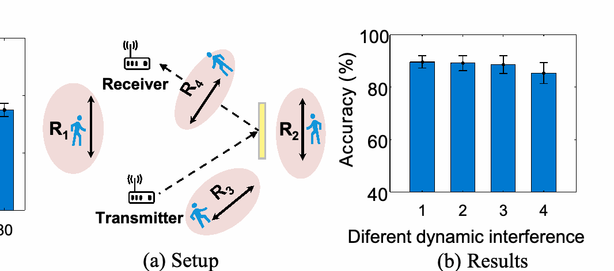

**Original caption:** Figure 26: Impact of dynamic interference.

**中文图注:** 图 26：动态干扰的影响

**Reading note:** (a) 干扰区域 R₁–R₄；(b) R₁–R₃ 几乎无影响，R₄ 略降仍 >85.38%。

**Original:** Performance under cross-room scenarios. We now examine the performance of MetaAI in a cross-room scenario. Specifically, we set the distance of Tx-MTS to 1 m, while the Rx is randomly moved to 18 different locations spanning three offices. The detailed setup is illustrated in Fig. 27(a). At each location, we measure the recognition results. As shown in Fig. 27(b), the recognition accuracy generally decreases as the distance increases. For example, in the first room (P₁-P₆), MetaAI achieves an accuracy above 82.64%; in the second room (P₇-P₁₂), the accuracy remains above 76.55%; and in the third room (P₁₃-P₁₈), MetaAI still achieves an accuracy above 71.53%. These results demonstrate that MetaAI can work well across a realistic cross-room environment.

**中文:** 跨房间场景下的性能。我们考察 MetaAI 在跨房间场景中的表现：Tx-MTS 距离固定 1 m，Rx 被随机移动到跨越三个办公室的 18 个位置（详细设置见图 27(a)），逐点测量识别结果。图 27(b) 显示，识别准确率总体上随距离增加而下降：第一间房（P₁–P₆）高于 82.64%，第二间房（P₇–P₁₂）保持高于 76.55%，第三间房（P₁₃–P₁₈）仍高于 71.53%。这些结果表明 MetaAI 在真实的跨房间环境中也能良好工作。
### 图 27 跨房间场景下的性能

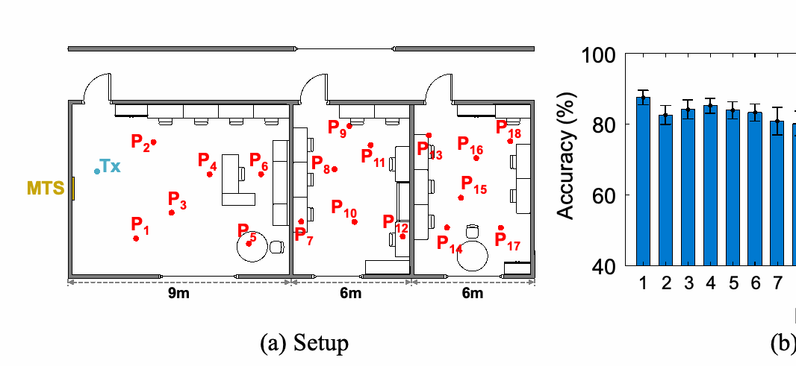

**Original caption:** Figure 27: Performance under cross-room scenarios.

**中文图注:** 图 27：跨房间场景下的性能

**Reading note:** (a) 三房间 18 位置设置；(b) 准确率随距离递减：>82.64%/>76.55%/>71.53%。

### 5.4 案例研究：实时人脸识别（Case Study: Real-time Face Recognition）

**Original:** In this case study, we validate the effectiveness of MetaAI for real-time face recognition using IoT camera devices in real-life scenarios. Specifically, during the data collection phase, we deploy IoT cameras (ESP32-CAM) in five different backgrounds and recruit ten volunteers. Each volunteer naturally stands in the monitored areas while the IoT cameras continuously capture facial images at 30 FPS. Our pre-processing algorithm automatically selects approximately 12 clear face images per background, yielding 60 images per volunteer. To further enhance network robustness, we incorporate an additional 300 facial images from ten individuals in the CelebA dataset [61] as supplementary training data.

**中文:** 本案例研究用物联网摄像头设备在真实场景中验证 MetaAI 的实时人脸识别有效性。数据采集阶段：在五种不同背景下部署 IoT 摄像头（ESP32-CAM），招募十名志愿者；志愿者自然站在监控区域内，摄像头以 30 FPS 连续拍摄人脸图像。预处理算法自动为每个背景挑选约 12 张清晰人脸图，每位志愿者得到 60 张。为增强网络鲁棒性，还加入 CelebA 数据集 [61] 中十人的额外 300 张人脸图像作为补充训练数据。

**Original:** In the testing phase, we let each volunteer stand naturally in the camera-monitored area 20 times, and the IoT cameras continuously stream the facial images in real-time to the control terminal to start the calculation in MetaAI system. Fig. 28 shows that MetaAI can achieve an average accuracy of 78.54%, maintaining stable performance across different users and environmental conditions. This result demonstrates the effectiveness and practicality of MetaAI for IoT-based face recognition applications.

**中文:** 测试阶段：每位志愿者在摄像头监控区域自然站立 20 次，摄像头把面部图像实时流式传输到控制终端，由 MetaAI 系统开始计算。图 28 显示 MetaAI 平均准确率达 78.54%，在不同用户与环境条件下性能稳定。该结果证明了 MetaAI 用于基于 IoT 的人脸识别应用的有效性与实用性。
### 图 28 实时人脸识别

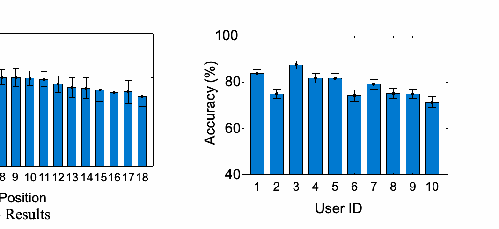

**Original caption:** Figure 28: Real-time face recognition.

**中文图注:** 图 28：实时人脸识别

**Reading note:** ESP32-CAM 实时人脸识别：位置与用户维度准确率，均值 78.54%。

## 6 相关工作 RELATED WORK

**Original:** Metasurfaces. Metasurfaces are emerging as a hot technology to smarten the wireless environment [6, 8, 9, 12, 16, 18, 30, 33, 56]. By encoding the state of each meta-atom, it can manipulate the phase/amplitude of electromagnetic waves to achieve different applications, e.g., coverage expansion [14, 15, 21, 25, 32, 34, 38–40, 46, 51], localization [27, 43, 55], wireless charging [11], etc. For example, AutoMS [41] strategically designs and places multiple passive metasurfaces to extend mmWave coverage. LLAMA [10] employs a programmable metasurface to perform real-time polarization transformation to reduce the signal attenuation. RF-Mediator [38] designs a flexible metasurface to enhance cross-medium link quality. These works mainly focus on improving wireless coverage and signal quality enhancements by leveraging metasurface to perform beamforming, beam steering, and polarization control. In contrast, MetaAI employs a metasurface to achieve physical neural network computation in the wireless channel.

**中文:** 超表面。超表面正成为“智能化无线环境”的热门技术 [6, 8, 9, 12, 16, 18, 30, 33, 56]：通过编码每个超原子的状态，可操控电磁波的相位/幅度，实现覆盖扩展 [14, 15, 21, 25, 32, 34, 38–40, 46, 51]、定位 [27, 43, 55]、无线充电 [11] 等不同应用。例如 AutoMS [41] 策略性地设计并部署多块无源超表面扩展毫米波覆盖；LLAMA [10] 用可编程超表面做实时极化变换以降低信号衰减；RF-Mediator [38] 设计柔性超表面增强跨介质链路质量。这些工作主要通过波束成形、波束转向与极化控制来提升无线覆盖与信号质量；相比之下，MetaAI 用超表面在无线信道内实现物理神经网络计算。

**Original:** Physical Neural Networks. Physical neural networks (PNNs) have gained much research attention in recent years [5, 35–37, 49, 53, 58]. For example, many works [35, 36, 62] use stacked transmissive metasurfaces to emulate the parallel structure of digital neural networks for achieving linear PNNs. Although promising, they require a specialized device (e.g., a passive mold or a metasurface) to encode input data and a light/RF source merely serves to activate or power the PNN, enabling parallel data input to the network. Besides, some of these systems [35, 62] use passive metasurfaces for weight implementation, limiting adjustability and preventing dynamic adaptation to different computing tasks. Other studies [28, 54, 65] have explored nonlinear media layers for activation functions, but they primarily focus on device fabrication and simulate full neural networks.

**中文:** 物理神经网络。物理神经网络（PNN）近年来备受关注 [5, 35–37, 49, 53, 58]。例如许多工作 [35, 36, 62] 用堆叠透射式超表面模仿数字神经网络的并行结构以实现线性 PNN。虽然前景光明，但它们需要专用设备（如无源模具或超表面）编码输入数据，光/RF 源仅仅用于激活或供电，实现并行输入；此外其中一些系统 [35, 62] 用无源超表面实现权重，限制了可调性，无法动态适配不同计算任务。还有研究 [28, 54, 65] 探索用于激活函数的非线性介质层，但主要关注器件制造并对完整神经网络做仿真。

**Original:** Unlike them, MetaAI explores a new design space: integrate computing into the wireless environment. MetaAI directly leverages wireless channels as the computing medium for neural network operations, while maintaining compatibility with standard wireless communication systems. Moreover, MetaAI only employs a single metasurface, and can be shared across multiple IoT devices, enabling multi-sensor integration to enhance accuracy.

**中文:** 与它们不同，MetaAI 探索了一个新的设计空间：把计算融入无线环境。MetaAI 直接把无线信道当作神经网络运算的计算媒介，同时保持与标准无线通信系统的兼容性；并且 MetaAI 只用一块超表面，可被多个 IoT 设备共享，通过多传感器集成提升准确率。

**Original:** RF Computing. Much research has been devoted to using RF signals to achieve OTA computations for diverse applications [3, 20, 47, 57]. For instance, AirFC [47] uses signal superposition to perform the addition operation over the air. While promising, the crucial multiplication operation (i.e., applying the NN weights) is realized through complex pre-coding at the transmitter's RF front-end. This requires specialized, powerful transmitters and is not compatible with simple, commodity IoT devices.

**中文:** 射频计算。大量研究致力于用 RF 信号实现空中（OTA）计算以服务多种应用 [3, 20, 47, 57]。例如 AirFC [47] 用信号叠加在空中完成加法运算。虽然前景可观，但关键的乘法运算（即施加网络权重）是在发射机射频前端通过复杂预编码实现的，需要专用、强大的发射机，与简单商用的 IoT 设备不兼容。

**Original:** More recently, AirNN [48] pioneers a hybrid physical-digital architecture, where the convolution is implemented in the physical domain and the rest of the neural network is processed in the digital domain. While pioneering, its architecture is that of a bespoke computational engine, not a general-purpose communication system. Furthermore, it uses a complex multi-antenna relay to steer signals toward multiple, separate metasurfaces. This architectural complexity makes it not easily integrated into standard communication networks.

**中文:** 更近期，AirNN [48] 开创了物理-数字混合架构：卷积在物理域完成，网络其余部分在数字域处理。虽然具有开创性，但其架构是一个定制计算引擎而非通用通信系统；而且它用复杂多天线中继把信号导向多块独立超表面。这种架构复杂性使其难以融入标准通信网络。

**Original:** In contrast, MetaAI offloads the multiplication operation entirely into the environment and implements an end-to-end neural network using a single, shared metasurface that integrates seamlessly into standard network topologies. This allows the transmitters to be simple, low-cost, commodity IoT devices without requiring any hardware modification or complex pre-coding capabilities, and makes over-the-air computation a practical feature for existing wireless systems. In essence, MetaAI makes over-the-air computation practical for the large-scale, low-cost IoT scenarios.

**中文:** 相比之下，MetaAI 把乘法运算整体卸载到环境中，用一块可无缝融入标准网络拓扑的共享超表面实现端到端神经网络。这让发射机可以是简单、低成本的商用 IoT 设备，无需任何硬件改造或复杂预编码能力，使空中计算成为现有无线系统的实用特性。本质上，MetaAI 让空中计算在大规模、低成本的 IoT 场景中变得切实可行。

## 7 讨论与未来工作 DISCUSSION AND FUTURE WORK

**Original:** Model scalability. Our system currently implements LNNs, where model "size" (input/output dimensions) is limited by the application's latency tolerance, as larger models require more sequential transmissions. While our results show LNNs are effective for many tasks, extending to deeper architectures like Transformers requires integrating non-linear components. We see this as a primary direction for future work.

**中文:** 模型可扩展性。当前系统实现的是 LNN，模型“规模”（输入/输出维度）受应用延迟容限限制——模型越大需要的顺序传输越多。虽然结果表明 LNN 对许多任务有效，但要扩展到 Transformer 等更深架构，需要集成非线性组件。这是我们未来工作的首要方向。

**Original:** Hardware and Deployment Constraints. The performance of MetaAI is fundamentally linked to the physical hardware. The precision of the computation is determined by the MTS's resolution—both the number of meta-atoms and more importantly their individual bit-depth. Our prototype, with 256 2-bit atoms, represents a practical trade-off between cost and performance but we expect more advanced metasurface could further improve the performance.

**中文:** 硬件与部署约束。MetaAI 的性能与物理硬件根本相关：计算精度由超表面的分辨率决定——既包括超原子数量，更包括每个超原子的比特深度。我们的原型采用 256 个 2 比特超原子，是成本与性能之间的实用折中；我们预期更先进的超表面能进一步提升性能。

**Original:** Device Mobility. One limitation of the current system is its handling of device mobility. When the transmitter or receiver moves, the physical propagation paths are altered, invalidating the pre-calculated mapping between MTS configurations and the desired logical weights. To adapt, the system must re-estimate the channel and re-solve the optimization problem (Eqn. 7). The system's ability to support mobility is therefore a race between the target's speed and this recalibration latency.

**中文:** 设备移动性。当前系统的一个局限是对设备移动的处理：当发射机或接收机移动时，物理传播路径改变，预先计算的“超表面配置 ↔ 期望逻辑权重”映射将失效。为自适应，系统必须重新估计信道并重新求解优化问题（式 (7)）。因此系统对移动性的支持能力，本质上是目标移动速度与这套重校准延迟之间的赛跑。

## 8 结论 CONCLUSION

**Original:** In this paper, we design and implement MetaAI, a metasurface-assisted system to enable concurrent data transmission and neural network computation in the wireless environment. By encoding the phase values of each meta-atom, MetaAI can perform multiplication and additions in the air, thus achieving neural network computing.

**中文:** 本文设计并实现了 MetaAI——一个在无线环境中同时进行数据传输与神经网络计算的超表面辅助系统。通过对每个超原子的相位值编码，MetaAI 能在空中完成乘法与加法，从而实现神经网络计算。

**Original:** Ethics: This work does not raise any ethical issues.

**中文:** 伦理声明：本工作不涉及任何伦理问题。

## 附录 A：补充材料要点（APPENDIX）

> 说明：附录 A.1–A.4 为未经同行评审的补充材料。以下按正文阅读价值整理，公式给出结构式转写，细节以原文为准。

### A.1 为什么现有线性 PNN 需要多层超表面？

**Original:** Existing Linear PNNs. The computing process of a single layer PNN can be described as: [Eqn. 15] where α_i represents the weight of the mapping for the i-th meta-atom on the metasurface, M represents that there are M meta-atoms on the metasurface, l means the number of layers and β_l represents the channel offset from l-th layer to (l+1)-th layer. β ∼ G(d, s), where d is the distance of adjacent layers and s is the distance between meta-atoms on the metasurface. Generally, d and s are stable, leading us to conclude that β_l ∼ G(d, s) is also stable.

**中文:** 现有线性 PNN。单层 PNN 的计算过程可描述为（式 (15)，矩阵形式见原文）：其中 α_i 表示超表面上第 i 个超原子的映射权重，M 是超表面的超原子数，l 表示层数，β_l 表示第 l 层到第 (l+1) 层之间的信道偏移。β ∼ G(d, s)，d 为相邻层间距，s 为超表面上超原子间距。一般 d 与 s 稳定，因此 β_l ∼ G(d, s) 也稳定。

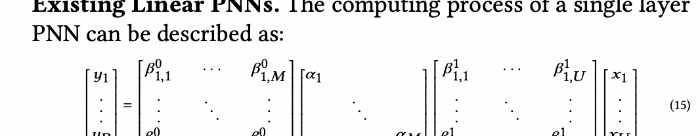

**中文说明：** 低置信转写：PDF 文本层中的式 (15) 为多层矩阵形式（输入经逐层信道偏移 β 与超原子权重 α 映射到输出 y₁…y_R），此处给出结构示意，精确矩阵请以原文为准。

**Original:** This allows us to further simplify the expression as: [Eqn. 16] where F_{R,U} is a function that represents a linear combination of the variables (a₁, a₂, …, a_M).

**中文:** 于是表达式可进一步简化为（式 (16)）：输出向量 = 一个以 F 为元素的矩阵 × 输入向量，其中 F_{R,U} 表示变量 (a₁, a₂, …, a_M) 的线性组合函数。

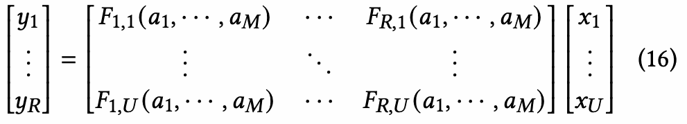

**中文说明：** 附录 A.1：把多层 PNN 的输出简化为 y = F(a)·x 的矩阵形式，F_{R,U}(a₁,…,a_M) 表示对超原子权重 a 作线性组合的函数。

**Original:** Analyzing Existing Linear PNNs Need Multiple Layers. Based on Eqn.1 and Eqn.16, to achieve equivalence between the two networks, the following conditions must be met: [Eqn. 17]. We can convert this formula into a system of equations, like [Eqn. 18].

**中文:** 现有线性 PNN 为何需要多层。基于式 (1) 与式 (16)，要使两种网络等价，必须满足（式 (17)，权重矩阵等于 F 矩阵）。该式可转化为方程组（式 (18)）：w_{i,j} = F_{i,j}(a₁, …, a_M)。

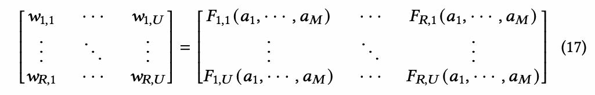

**中文说明：** 附录 A.1：要使多层 PNN 与数字 LNN 等价，权重矩阵 W 必须等于由 F 函数构成的矩阵（与式 (16) 对比）。

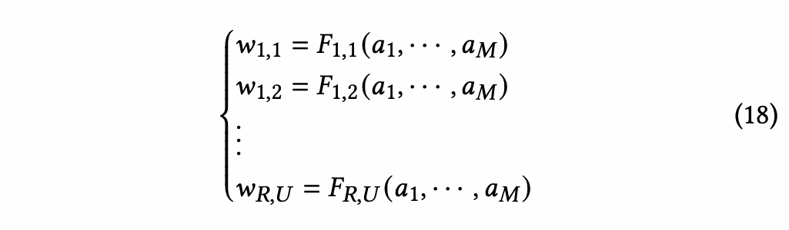

**中文说明：** 附录 A.1：把式 (17) 展开为 R×U 个方程组成的方程组 w_{i,j}=F_{i,j}(a₁,…,a_M)。由于未知参数只有 M 个（通常 M < R×U），单层超表面无法精确表示 LNN，堆叠多层可显著增加自由度、逼近 LNN。

**Original:** In general, it can be stated that M < R × U, Eqn.18 indicates that the number of unknown parameters (a₁, ⋯, a_M) is less than the number of constraints w_{R×U}, resulting in an overdetermined problem. In this scenario, F_{i,j}(a₁, ⋯, a_M) cannot effectively approximate w_{i,j}. However, by stacking multiple layers of PNNs, the number of unknown parameters increases significantly. Thus, F_{i,j}(a₁, ⋯, a_M) can more effectively approximate w_{i,j}, bringing the performance of PNN closer to that of LNN.

**中文:** 一般而言 M < R × U：式 (18) 表明未知参数 (a₁, ⋯, a_M) 的个数少于约束 w_{R×U} 的个数，构成超定问题，此时 F_{i,j}(a₁, ⋯, a_M) 无法有效逼近 w_{i,j}。而堆叠多层 PNN 会显著增加未知参数数量，使 F 能更有效地逼近 w，让 PNN 性能更接近 LNN。

**Original:** We conduct a simulation by adjusting the number of layers from 1 to 6 to examine the impact of varying numbers of metasurface layers on PNN performance. We use the MNIST dataset for testing, the results of the simulation are shown in Fig. 29. It is evident that as the number of layers increases, the recognition accuracy improves. The accuracy reaches its peak with five layers, approaching the performance of a single fully connected digital layer. This finding aligns with the fact that existing PNNs require multiple metasurface layers.

**中文:** 我们用 MNIST 做仿真，把层数从 1 调到 6，考察超表面层数对 PNN 性能的影响，结果见图 29：随层数增加准确率提升，五层时达到峰值，接近单层数字全连接的性能。这一发现与“现有 PNN 需要多层超表面”的事实一致。
### 图 29 不同 PNN 层数的影响

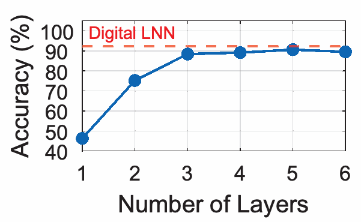

**Original caption:** Figure 29: Impact of different layers of PNNs.

**中文图注:** 图 29：不同 PNN 层数的影响

**Reading note:** PNN 层数 1→6，5 层接近单层数字全连接。

### A.2 为什么选 256 个超原子：权重分布密度（WDD）

**Original:** To quantify the ability of the resultant weights to approximate the ideal weight domain, we propose to use weight distribution density (WDD) to quantify the mapping degree between the resultant weight distribution and the ideal weight domain. The weight distribution density is given as: [Eqn. 19] where we define the set S_c containing all possible MTS weights W_c and a function Size(·) to count the number of elements in the circle with r = √2/2. Besides, ε is the range of tolerated error in mapping.

**中文:** 为量化合成权重对理想权重域的逼近能力，我们提出权重分布密度（WDD）来度量“合成权重分布”与“理想权重域”之间的映射程度。权重分布密度定义为式 (19)：其中集合 S_c 包含超表面所有可能的权重 W_c，Size(·) 统计半径为 r 的圆内元素个数，ε 是映射中允许的误差范围。

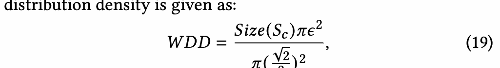

**中文说明：** 原文式 (19) 中分母为半径 r=√2/2 的圆面积 π(√2/2)²；分子中 π ε² 的物理含义是“在容许误差内可映射到同一个超表面权重的数字权重个数”。论文取 ε=0.002。WDD 越大，合成权重分布与理想权重域的映射程度越高、性能通常越好。

**Original:** Note that although the weights of digital neural networks are theoretically distributed throughout the real number space, in practice, the network functions often only rely on the relative relationship and direction information of the weights. Therefore, we can map these weights to a bounded space with the circle with a radius of r as the boundary through normalization or function transformation, i.e., π(√2/2)², thereby representing the behavior of the original network in the weight space.

**中文:** 注意：虽然数字神经网络的权重理论上遍布整个实数空间，但实践中网络功能往往只依赖权重的相对关系与方向信息。因此，我们可以通过归一化或函数变换把这些权重映射到以半径 r 的圆为边界的有界空间，即 π(√2/2)²，从而在权重空间中表示原网络的行为。

**Original:** As shown in Fig. 30, our WDD metric, which reflects the hardware's weight representation capability, increases sharply and then saturates at 256 meta-atoms. This tells us that the hardware's ability to represent weights effectively maxes out at this point. This consistent result—where the accuracy for all datasets stops improving at the same point predicted by our hardware-agnostic WDD metric—provides strong evidence that 256 is the optimal point of diminishing returns. Beyond this, adding more atoms would increase system cost and complexity for no meaningful gain in performance.

**中文:** 如图 30 所示，反映硬件权重表征能力的 WDD 指标先急剧上升，在 256 个超原子处饱和——硬件表征权重的能力在此达到上限。这一结果（所有数据集的准确率恰好在我们“与硬件无关”的 WDD 指标预测的同一点停止提升）强有力地说明 256 是最佳“边际收益递减点”；超过它，增加超原子只会提高系统成本与复杂度，而无实质性能增益。
### 图 30 不同超原子数量下的 WDD 值

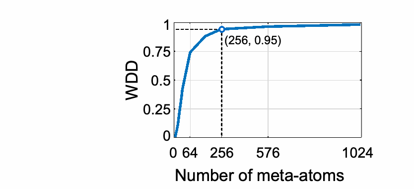

**Original caption:** Figure 30: WDD values with varying meta-atoms.

**中文图注:** 图 30：不同超原子数量下的 WDD 值

**Reading note:** WDD 先升后平，256 处 (256,0.95) 饱和——支撑 M=256 选择。

### A.3 不同子载波/天线数量下的并行性能

**Original:** We performed a simulation (conducted in the MNIST dataset) to quantify and understand the impact of the number of subcarriers/antennas on parallelization schemes. The result is plotted in Fig. 31, and we can see that the recognition accuracy gradually decreases as more subcarriers and antennas are involved. This is because the subcarrier- and antenna-based path signals are jointly modulated (phase-shifted) by the MTS, which prevents assigning independent weights to each path. Despite the drop in accuracy, the processing time is significantly reduced compared to sequential transmission. This reflects a trade-off between accuracy and latency, and the optimal choice depends on specific application requirements and hardware constraints.

**中文:** 我们用 MNIST 仿真量化子载波/天线数量对并行方案的影响，结果见图 31：随子载波与天线数量增多，识别准确率逐渐下降——因为基于子载波与天线的各路信号由同一超表面联合调制（移相），无法为每条路径独立分配权重。尽管准确率下降，处理时间相比顺序传输大幅缩短：这体现了准确率与延迟的折中，最优选择取决于具体应用需求与硬件约束。
### 图 31 不同子载波/天线数量下的性能

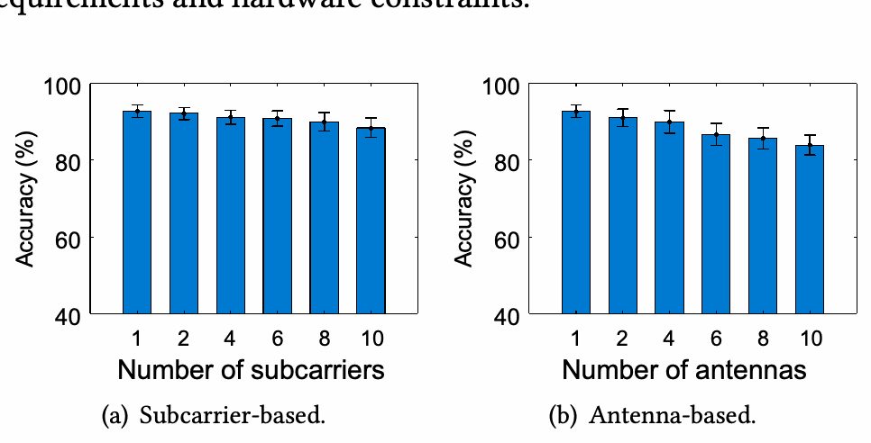

**Original caption:** Figure 31: Performance under different numbers of subcarriers/antennas.

**中文图注:** 图 31：不同子载波/天线数量下的性能

**Reading note:** (a) 子载波数、(b) 天线数增加：准确率略降但处理时间显著缩短。

### A.4 端到端性能分析：能量、延迟与准确率

**Original:** To quantify the practical benefits of our over-the-air computing paradigm, we performed a detailed analysis of Meta-AI's end-to-end energy consumption and inference latency. Since our approach integrates computation directly into the data transmission process, a fair comparison requires that software-based baselines also account for both distinct tasks. Therefore, we compare Meta-AI against two critical systems where data is first transmitted from an IoT device to an edge server (AMD Ryzen 5 CPU, Nvidia RTX4080 GPU) and then processed for inference: (1) ResNet-18: A state-of-the-art deep neural network, representing the high-accuracy benchmark. (2) Software LNN: A model with the exact same architecture as Meta-AI, providing a direct, apples-to-apples comparison of the computational approach.

**中文:** 为量化我们空中计算范式的实际收益，我们对 Meta-AI（原文附录写作 Meta-AI）的端到端能耗与推理延迟做了详细分析。由于我们的方法把计算直接融入数据传输过程，公平比较要求基于软件的基线也同时计入“传输 + 计算”两件事。因此我们把 Meta-AI 与两类系统对比（数据先由 IoT 设备传到边缘服务器（AMD Ryzen 5 CPU、Nvidia RTX4080 GPU），再做推理）：(1) ResNet-18——最先进的深度网络，代表高准确率基准；(2) 软件 LNN——与 Meta-AI 架构完全相同的模型，提供逐项对等的计算方式比较。

**Original:** We tested all systems on the MNIST and AFHQ datasets, measuring the total time and energy required to process a single input image from transmission to result. The outcomes, summarized in Table 2 and Table 3, reveal a clear trade-off between raw accuracy and computational efficiency, where Meta-AI establishes a new, ultra-low-power operating point.

**中文:** 我们在 MNIST 与 AFHQ 数据集上测试所有系统，测量处理单张输入图像从传输到出结果所需的总时间与能量。结果汇总于表 2 与表 3：原始准确率与计算效率之间存在清晰折中，而 Meta-AI 开辟了一个新的超低功耗工作点。

**表 2（Table 2：Performance under MNIST dataset，MNIST 数据集下的性能）**（数据来自 PDF 内嵌表格）：

| 系统 | 模型 | 准确率 | 传输时间 | 服务器计算时间 | 总时间 | 传输能量 | 服务器计算能量 | MTS 能量 | 总能量 |
|---|---|---|---|---|---|---|---|---|---|
| CPU | ResNet-18 | 99.62% | 0.157 ms | 7.71 ms | 7.867 ms | 0.856 mJ | 227.37 mJ | – | 228.23 mJ |
| CPU | LNN | 92.75% | 0.157 ms | 1.96 ms | 2.117 ms | 0.856 mJ | 62.72 mJ | – | 63.576 mJ |
| 4080 GPU | ResNet-18 | 99.62% | 0.157 ms | 4.30 ms | 4.457 ms | 0.856 mJ | 182.37 mJ | – | 183.226 mJ |
| 4080 GPU | LNN | 92.75% | 0.157 ms | 3.99 ms | 4.147 ms | 0.856 mJ | 124.7 mJ | – | 125.56 mJ |
| Meta-AI | LNN | 87.29% | 1.568 ms | 0.013 ms | 1.581 ms | 8.561 mJ | 0.008 mJ | 2.353 mJ | 10.92 mJ |

**表 3（Table 3：Performance under AFHQ dataset，AFHQ 数据集下的性能）**：

| 系统 | 模型 | 准确率 | 传输时间 | 服务器计算时间 | 总时间 | 传输能量 | 服务器计算能量 | MTS 能量 | 总能量 |
|---|---|---|---|---|---|---|---|---|---|
| CPU | ResNet-18 | 96.07% | 0.901 ms | 16.695 ms | 17.596 ms | 4.921 mJ | 349.13 mJ | – | 354.051 mJ |
| CPU | LNN | 87.33% | 0.901 ms | 4.621 ms | 5.522 ms | 4.921 mJ | 94.52 mJ | – | 99.441 mJ |
| 4080 GPU | ResNet-18 | 96.07% | 0.901 ms | 7.147 ms | 8.048 ms | 4.921 mJ | 213.99 mJ | – | 218.911 mJ |
| 4080 GPU | LNN | 87.33% | 0.901 ms | 5.247 ms | 6.148 ms | 4.921 mJ | 155.02 mJ | – | 159.941 mJ |
| Meta-AI | LNN | 80.22% | 2.704 ms | 0.0067 ms | 2.71 ms | 14.764 mJ | 0.002 mJ | 4.054 mJ | 18.82 mJ |

**Original:** The Meta-AI Efficiency Advantage. The data clearly shows that Meta-AI is by far the most efficient system. On the MNIST dataset, Meta-AI's total energy consumption is just 10.92 mJ, which is 5.8x lower than the most efficient software baseline (CPU LNN) and 16.7x lower than the high-accuracy GPU ResNet-18.

**中文:** Meta-AI 的效率优势。数据清楚表明 Meta-AI 是效率最高的系统：MNIST 上其总能耗仅 10.92 mJ，比最高效的软件基线（CPU LNN）低 5.8 倍，比高精度的 GPU ResNet-18 低 16.7 倍。

**Original:** This dramatic improvement stems from a fundamental shift in where the energy is spent. By offloading the energy-intensive matrix multiplications from the server into the wireless channel itself, Meta-AI accepts a small overhead in transmission and MTS control energy. This investment is paid back orders of magnitude over by the reduction in server-side computation, which consumes a mere 0.008 mJ, three to four orders of magnitude lower than the energy consumed by the CPU or GPU for the same task.

**中文:** 这一巨大改进源于“能量花在哪里”的根本转变：把能耗密集的矩阵乘法从服务器卸载到无线信道本身，Meta-AI 只付出传输与超表面控制能量的少量开销；而服务器端计算能耗骤降至仅 0.008 mJ，比 CPU/GPU 做同一任务低三到四个数量级，投入被成数量级地收回。

**Original:** This architectural shift is also the key to Meta-AI's latency advantage. In a traditional system, end-to-end latency is the sum of transmission time and a significant server computation time (e.g., 2.117 ms and 4.147 ms for the CPU/GPU LNN). In contrast, Meta-AI fuses these two steps: the computation happens during signal propagation. This means the time spent on transmission is also the time spent on computation, leaving only a negligible server-side processing time of 0.013 ms. As a result, Meta-AI's total latency (1.581 ms) is faster than the sequential CPU-based LNN (2.117 ms) and solidifies its position as the lowest-latency end-to-end solution.

**中文:** 这一架构转变也是 Meta-AI 延迟优势的关键：传统系统中端到端延迟 = 传输时间 + 可观的服务器计算时间（如 CPU/GPU LNN 的 2.117 ms 与 4.147 ms）；而 Meta-AI 把两步融合——计算在信号传播期间完成，传输时间即计算时间，服务器端处理时间只剩可忽略的 0.013 ms。因此 Meta-AI 总延迟（1.581 ms）快于顺序式的 CPU LNN（2.117 ms），巩固了其最低延迟端到端方案的地位。

**Original:** The Accuracy-Efficiency Trade-off. This significant gain in efficiency comes with a predictable trade-off in accuracy. The complex, multi-layer ResNet-18 achieves the highest accuracy (99.62% on MNIST), which Meta-AI's simpler linear model cannot match. However, the more telling comparison is with the software-based LNN. Here, we see that Meta-AI achieves comparable accuracy (e.g., 87% vs. 92% on MNIST) while providing the immense energy and latency benefits described above. This demonstrates that Meta-AI is not simply a less accurate system; it is a fundamentally different and more efficient way to implement the same class of model. It creates a new, valuable point on the accuracy-vs-efficiency curve for applications where extending the battery life of IoT devices and minimizing server load are more critical than achieving the absolute highest accuracy. Our future work will focus on incorporating more complex operations to close this accuracy gap.

**中文:** 准确率-效率折中。效率的巨大提升伴随可预期的准确率折中：复杂多层 ResNet-18 准确率最高（MNIST 99.62%），Meta-AI 的简单线性模型无法企及。但更有说服力的是与软件 LNN 的对比：Meta-AI 取得了相当的准确率（MNIST 上约 87% vs 92%），同时带来上述巨大能量与延迟收益。这说明 Meta-AI 并非“更不准的系统”，而是用根本不同、更高效的方式实现同一类模型——它在“准确率 vs 效率”曲线上创造了一个新的有价值工作点，尤其适合那些“延长 IoT 电池寿命、降低服务器负载比追求绝对最高准确率更重要”的应用。未来工作将专注于引入更复杂运算以缩小这一准确率差距。

## 阅读提示 / Critical Reading Notes

1. **一句话总结：** MetaAI 把无线信道“变成”一个可编程的线性计算层——IoT 设备按顺序发符号，环境中的可编程超表面在信号反射/传播中完成乘加，接收端累加即得分类结果；通信与计算从“两步”变成“一步”。

2. **本文最漂亮的论证链：** LNN 的线性可分解性（式 2）→ 与无线逐符号传输天然对齐（式 3）→ 单层 MetaAI 即可等价于传统多层 PNN（§2.2.1）；再通过“符号周期内零均值”特性消除环境多径（§3.2），通过时分复用共享同一超表面做多传感器融合（§3.4）。

3. **局限与边界（作者自述）：**
   - 模型仅限线性（LNN），扩展到 Transformer 需引入非线性；
   - 精度受超表面分辨率限制（256 个 2 比特超原子）；
   - 设备移动时需要重估信道并重解优化问题，存在“移动速度 vs 重校准延迟”的赛跑。

4. **额外观察（读者视角）：**
   - 摘要声称“平均 82.8%、最高 89.8%”，但附录 A.4 表 2 中 MNIST 原型准确率写为 87.29%（表 1 中为 89.77%），正文与附录数值口径不完全一致；
   - 文中“it induces a basis between…”疑为 “bias/mismatch” 笔误；
   - “超原子”（meta-atom）一词在中文文献中也常译作“可编程单元/晶胞”，阅读其他资料时注意术语对应。

5. **值得延伸阅读的相关工作：** AirFC [47]（空中加法）、AirNN [48]（混合物理-数字卷积）、以及堆叠透射式超表面 PNN 系列 [35, 36, 62]。
