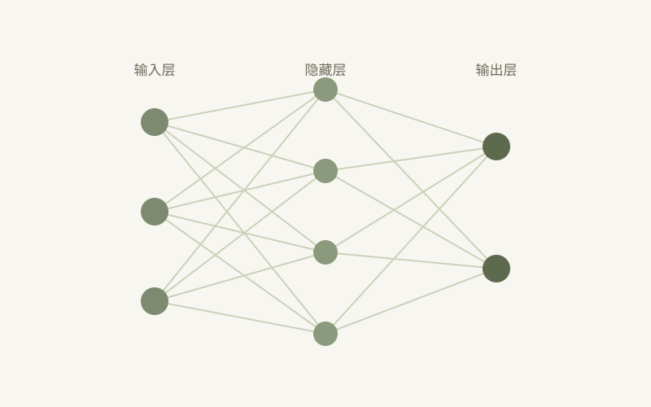

最近在系统地学习 PyTorch。这篇笔记记录我最先理解清楚的三个核心概念：张量、自动求导和计算图。

## 张量：带维度的数组

PyTorch 里一切数据都是 `torch.Tensor`。它和 NumPy 的数组很像，但多了一个最重要的能力：**自动求导**。

```python
import torch

x = torch.tensor([[1.0, 2.0], [3.0, 4.0]], requires_grad=True)
print(x.shape)   # torch.Size([2, 2])
print(x.dtype)   # torch.float32
```

`requires_grad=True` 告诉 PyTorch：记录所有与 `x` 相关的运算，之后可以自动计算梯度。

## 自动求导：反向传播的引擎

PyTorch 通过**动态计算图**记录运算。每做一次运算，它就在图里增加一个节点：

```python
y = (x * x).sum()   # 一个标量
y.backward()        # 自动计算梯度
print(x.grad)       # 2 * x
```

`y.backward()` 会从 `y` 出发，沿着计算图反向传播，把梯度填到每个需要梯度的张量上。



## 一个直觉

把计算图想象成一条河：前向传播是水流向下游，反向传播是沿着河道把「梯度」这种信息运回上游。`optimizer.step()` 就是在上游根据这些信息调整水量（参数）。

## 小结

- `Tensor` = 数据 + 梯度记录开关；
- `autograd` = 用计算图自动完成反向传播；
- 理解了这三者，PyTorch 的大多数 API 就都有了落脚点。

下一期继续写 `nn.Module` 和训练循环。
