| 元数据 | 内容 |
|---|---|
| 标题 | SeaScan: An Energy-Efficient Underwater Camera for Wireless 3D Color Imaging |
| 作者 | Nazish Naeem, Jack Rademacher, Ritik Patnaik, Tara Boroushaki, Fadel Adib（均为 MIT） |
| 会议 | ACM MobiCom ’24, November 18–22, 2024, Washington D.C., DC, USA（第 30 届移动计算与网络国际会议） |
| DOI | https://doi.org/10.1145/3636534.3690661 |
| 论文类型 | 系统/方法论文（会议论文），15 页 |
| 来源 | Zotero 本地 PDF（selectable-text） |

## 章节索引

| 章节 | 内容 |
|---|---|
| 摘要 ABSTRACT | 系统概述与核心贡献 |
| 1 引言 INTRODUCTION | 引言：动机、挑战、贡献 |
| 2 三目无源成像 TRINOCULAR PASSIVE IMAGING | 三目无源成像：对齐问题与跨色彩对齐（SeaNet） |
| 3 跨折射补偿与滤光片选择 CROSS-REFRACTIVE COMPENSATION AND FILTER SELECTION | 跨折射补偿（平面封装）与滤光片选择 |
| 4 端到端系统 END-TO-END SYSTEM | 端到端系统：3D、压缩、反向散射 |
| 5 实现 IMPLEMENTATION | 实现：嵌入式硬件、封装、软件 |
| 6 结果 RESULTS | 结果：能耗、定性/定量评估、点云 |
| 7 相关工作 RELATED WORK | 相关工作 |
| 8 结论 CONCLUSION | 结论与展望 |

## 公式索引

- [E001 · Eq. (1)](#E001) — 斯涅尔定律（平面封装折射）
- [E002](#E002) — 畸变量度量 D = ΔH/H × 100
- [E003](#E003) — 平均功率 P = I_dd·V_dd
- [E004](#E004) — 总能耗 E = ∫P(t)dt

## 术语表（Terminology Ledger）

| 原文术语 | 中文 | 说明 |
|---|---|---|
| SeaScan | SeaScan（系统名称） | 作者提出的水下 3D 彩色成像系统名，保持原文 |
| trinocular lensing system | 三目透镜系统 | 三个镜头构成的无源彩色成像结构 |
| monochromatic image sensor | 单色图像传感器 | 仅输出灰度/单色图像的传感器 |
| passive color filter / gel filter | 无源彩色滤光片 / 凝胶滤光片 | 不耗电的滤色元件；gel filter 通过吸收而非反射实现滤色 |
| Cross Color Alignment | 跨色彩对齐 | SeaScan 提出的两阶段学习式颜色重建方法（粗对齐+精细对齐） |
| RANSAC-flow net | RANSAC-flow 网络 | 用于粗对齐的骨干网络（[50][51]） |
| SeaNet | SeaNet | 作者设计的 2D 卷积网络，用于精细对齐与颜色推断 |
| coarse / fine alignment | 粗对齐 / 精细对齐 | Cross Color Alignment 的两个阶段 |
| barrel distortion | 桶形畸变 | 广角镜头的径向对称负畸变 |
| cross-refractive compensation | 跨折射补偿 | 利用水-空气界面折射抵消广角畸变的技术 |
| dome / flat encapsulation | 穹顶封装 / 平面封装 | 两种防水封装形式 |
| dichroic filter | 二向色滤光片 | 基于薄膜干涉、只透特定波长的滤光片 |
| underwater backscatter | 水下反向散射（通信） | 近零功率无线通信技术 |
| Depth Anything | Depth Anything（深度估计方法） | 单目深度估计方法 [65] |
| Macbeth chart / Macbeth ColorChecker | Macbeth 色卡 | 颜色重建精度的黄金标准 [47] |
| CIEDE2000 | CIEDE2000（色差指标） | 感知颜色差异，越低越好 |
| PSNR | PSNR（峰值信噪比） | 图像质量指标，越高越好 |
| SSIM | SSIM（结构相似性） | 结构相似性指标，越高越好 |
| COTS | 商用现成（组件） | commercial off-the-shelf |
| backscatter communication / FM0 | 反向散射通信 / FM0 调制 | 物理层编码方式 |
| Cross-refractive / cross-color | 跨折射 / 跨色彩 | SeaScan 术语体系中的“跨”前缀 |

---

## 摘要 ABSTRACT

**Original:** We present the design, implementation, and evaluation of SeaScan, an energy-efficient camera for 3D imaging of underwater environments. At the core of SeaScan's design is a trinocular lensing system, which employs three ultra-low-power monochromatic image sensors to reconstruct color images. Each of the sensors is equipped with a different filter (red, green, and blue) for color capture.

**中文:** 我们介绍了 SeaScan 的设计、实现与评估——这是一款面向水下环境 3D 成像的高能效相机。SeaScan 设计的核心是一套三目（trinocular）透镜系统，它采用三个超低功耗单色图像传感器来重建彩色图像。每个传感器都配备一个不同的滤光片（红、绿、蓝）用于彩色采集。

**Original:** The design introduces multiple innovations to enable reconstructing 3D color images from the captured monochromatic ones. This includes an ML-based cross-color alignment architecture to combine the monochromatic images. It also includes a cross-refractive compensation technique that overcomes the distortion of the wide-angle imaging of the low-power CMOS sensors in underwater environments.

**中文:** 该设计引入多项创新，从而能够从所捕获的单色图像重建 3D 彩色图像。其中包括一种基于机器学习（ML）的跨色彩对齐（cross-color alignment）架构来融合各单色图像；还包括一种跨折射补偿（cross-refractive compensation）技术，用于克服低功耗 CMOS 传感器在水下环境中广角成像所产生的畸变。

**Original:** We built an end-to-end prototype of SeaScan, including color filter integration, 3D reconstruction, compression, and underwater backscatter communication.

**中文:** 我们构建了 SeaScan 的端到端原型，包括彩色滤光片集成、3D 重建、压缩以及水下反向散射（backscatter）通信。

**Original:** Our evaluation in real-world underwater environments demonstrates that SeaScan can capture underwater color images with as little as 23.6 mJ, which represents 37× reduction in energy consumption in comparison to the lowest-energy state-of-the-art underwater imaging system.

**中文:** 我们在真实水下环境中的评估表明，SeaScan 仅需低至 23.6 mJ 即可拍摄水下彩色图像，与能耗最低的现有水下成像系统相比，能耗降低了 37 倍。

**Original:** We also report qualitative and quantitative evaluation of SeaScan's color reconstruction and demonstrate its success in comparison to multiple potential alternative techniques (both geometric and ML-based) in the literature.

**中文:** 我们还报告了对 SeaScan 彩色重建的定性与定量评估，并展示了它与文献中多种潜在替代技术（既包括几何方法，也包括基于 ML 的方法）相比所取得的成功。

**Original:** SeaScan's ability to image underwater environments at such low energy opens up important applications in long-term monitoring for ocean climate change, seafood production, and scientific discovery.

**中文:** SeaScan 能以如此低的能耗对水下环境成像，这一能力为海洋气候变化长期监测、海产品生产以及科学发现等重要应用打开了大门。

## 1 引言 INTRODUCTION

**Original:** Long-term underwater imaging of marine animals, plants and the ocean is critical to discovering new species, monitoring the impact of human activities on the ocean, and sustainably monitoring and maintaining aquaculture farms [25, 27, 40]. For example, underwater cameras can help aquaculture farms in regulating feeding patterns, detecting diseases, and monitoring both contamination in their food chains and waste outflow to their surrounding environments [17, 63].

**中文:** 对海洋动物、植物和海洋进行长期水下成像，对于发现新物种、监测人类活动对海洋的影响，以及可持续地监测和维护水产养殖场至关重要 [25, 27, 40]。例如，水下相机可以帮助养殖场调节投喂模式、检测疾病，并监测其食物链中的污染以及排入周边环境的废弃物 [17, 63]。

**Original:** Moreover, long-term underwater imaging can play an instrumental role in oceanography and climatology, allowing us to study and understand sub-sea geological behavior such as submarine volcanoes and hydrothermal vents, nutrient transport dynamics of the ocean carbon cycle, and habitat deterioration such as coral reef bleaching and acidification [16, 31, 44].

**中文:** 此外，长期水下成像还能在海洋学与气候学中发挥重要作用，使我们得以研究和理解海底地质行为（如海底火山和热液喷口）、海洋碳循环中的营养盐输运动态，以及珊瑚礁白化和酸化等栖息地退化现象 [16, 31, 44]。

**Original:** Recent advances in underwater imaging have taken important steps toward this vision through the introduction of underwater cameras that consume joule-level energies per image capture [2]. Yet, it remains desirable to further reduce the energy consumption of these underwater cameras to extend their battery lifetime (proportionately). For example, if we can design underwater cameras to run on sub-joules or tens of milli-joules, then they could last for many years on coin cell batteries,1 paving the way for long-term monitoring in challenging and remote underwater environments.

**中文:** 近期水下成像领域的进展已朝这一愿景迈出重要一步，出现了单次成像能耗在焦耳量级的水下相机 [2]。然而，仍希望进一步降低这些水下相机的能耗，以（按比例地）延长电池寿命。例如，如果我们能设计出运行能耗低于 1 焦耳或仅数十毫焦耳的水下相机，那么它们就能依靠纽扣电池持续工作多年¹，从而为在偏远、恶劣的水下环境中开展长期监测铺平道路。

**Original:** In this paper, we ask whether we can push the boundaries of underwater color imaging by further reducing the energy consumption of underwater cameras. One of the key challenges in doing so lies in how state-of-the-art imaging systems work. Specifically, these systems use ultra-low-power monochromatic CMOS image sensors, but reconstruct color images by sequentially emitting flashes of red, green, and blue light using LEDs; capturing a monochrome image with every flash; then, linearly combining these images to form a color image. Since the sequential flashing and buffering consume more than 80% of the energy during the image capture phase alone, eliminating the need for them would significantly reduce the energy consumption of the camera. A natural alternative is to use a color imaging sensor; however, these sensors typically consume at least an order of magnitude more energy [24, 26, 45, 46] than commercial-off-the-shelf (COTS) monochromatic CMOS imaging sensors [23].

**中文:** 在本文中，我们提出的问题是：能否通过进一步降低水下相机能耗来突破水下彩色成像的边界？其中一个关键挑战在于现有成像系统的工作方式。具体而言，这些系统使用超低功耗单色 CMOS 图像传感器，但通过 LED 依次发出红、绿、蓝三色闪光来重建彩色图像：每闪一次光捕获一幅单色图像，再将这些图像线性组合成彩色图像。由于仅在图像采集阶段，依次闪光与缓冲就消耗了超过 80% 的能量，因此消除这些环节将显著降低相机能耗。一个自然的替代方案是使用彩色图像传感器；然而，这类传感器通常比商用现成（COTS）单色 CMOS 成像传感器 [23] 至少多消耗一个数量级的能量 [24, 26, 45, 46]。

**Original:** We introduce SeaScan, an energy-efficient underwater imaging system for wireless 3D color imaging. SeaScan leverages COTS ultra-low power monochromatic imaging sensors to capture color images without flashing LEDs. Not only can SeaScan capture rich color images, but it can also construct 3D point clouds and wirelessly transmit images at ultra-low-energy via underwater backscatter.

**中文:** 我们提出 SeaScan——一个面向无线 3D 彩色成像的高能效水下成像系统。SeaScan 利用 COTS 超低功耗单色成像传感器，在不闪烁 LED 的情况下捕获彩色图像。SeaScan 不仅能拍摄丰富的彩色图像，还能构建 3D 点云，并通过水下反向散射以超低能耗无线传输图像。

**Original:** At the core of SeaScan is a trinocular lensing design that is inspired by how human eyes (as well as color cameras) work. As depicted in Fig. 1(b), SeaScan consists of three monochromatic CMOS lenses equipped with different passive color (red, green, and blue) filters. In principle, the images captured from these filter-equipped lenses can be combined to form a color (RGB) image.

**中文:** SeaScan 的核心是一种三目透镜设计，其灵感来自人眼（以及彩色相机）的工作方式。如图 1(b) 所示，SeaScan 由三个单色 CMOS 镜头组成，每个镜头配备不同的无源彩色滤光片（红、绿、蓝）。原则上，将这些带滤光片镜头捕获的图像组合起来，即可形成彩色（RGB）图像。

### 图 1 系统总览（System Overview）

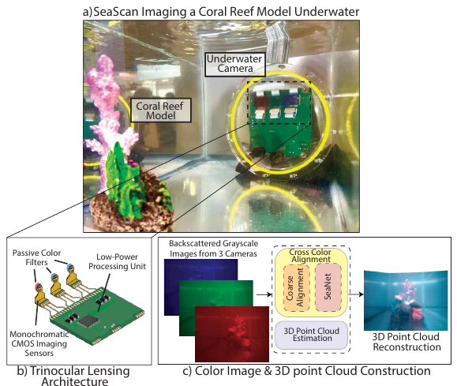

**Original caption:** Figure 1: System Overview. (a) shows SeaScan imaging a coral reef model. (b) depicts our trinocular lensing system. (c) shows the processing pipeline.

**中文图注:** 图 1：系统总览。（a）展示 SeaScan 拍摄珊瑚礁模型；（b）描绘我们的三目透镜系统；（c）展示处理流水线。

**Reading note:** 注意 (a) 中相机拍摄珊瑚礁模型的示意图，(b) 三目透镜结构，(c) 处理流水线（从三台相机灰度图到颜色对齐、深度估计与 3D 点云）。

**Original:** However, translating this design into a practical system faces several challenges. In typical color cameras, adjacent photodetectors capture different colors of the same part of a scene, and can be linearly combined to reconstruct a color image (The same happens with different cone cells in the human eye). In contrast, SeaScan captures different colors from spatially separated lenses. As a result, the same object appears at different locations (pixels) in three resulting images. Thus, a direct combination of the images would result in poor color reconstruction, as shown in Fig. 2(d).

**中文:** 然而，将这一设计转化为实用系统面临若干挑战。在典型彩色相机中，相邻的光电探测器捕获场景同一部位的不同颜色，并可线性组合以重建彩色图像（人眼中不同的视锥细胞也是如此）。相比之下，SeaScan 从空间上分离的镜头捕获不同颜色。因此，同一物体会出现在三幅结果图像中的不同位置（像素）上。于是，直接组合这些图像会导致很差的彩色重建效果，如图 2(d) 所示。

**Original:** One might assume that knowing the position of the three lenses and applying a simple geometric transformation would enable us to combine the three images for color reconstruction. But, the translational and rotational relationship of the position of the cameras does not directly translate into the captured images, thus resulting in poor color reconstruction as shown in Fig. 2(e).

**中文:** 有人或许会认为，只要知道三个镜头的位置并施加一个简单的几何变换，就能组合三幅图像完成彩色重建。然而，相机位置的平移、旋转关系并不能直接转化为所捕获图像中的关系，因此仍会导致较差的彩色重建，如图 2(e) 所示。

### 图 2 不同方法下的成像对比（Ground Truth / 基线 / SeaScan）

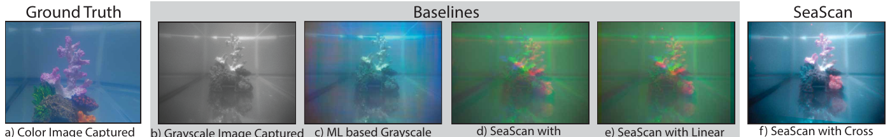

**Original caption:** Figure 2: This figure shows (a) Image captured from a GoPro camera. (b) Grayscale image of the same scene captured from a low power CMOS imaging sensor. (c) Output image of a machine learning based colorization method when image in part (b) is given as input. (d) Image captured by SeaScan if the three images were directly combined without any alignment. (e) Image captured by SeaScan if the three images were linearly transformed before combining. (f) Image captured by SeaScan if the three images combined using the Cross Color Alignment method described in the paper.

**中文图注:** 图 2：本图展示（a）GoPro 相机拍摄的图像；（b）低功耗 CMOS 成像传感器拍摄的同一场景灰度图像；（c）将（b）图输入基于机器学习的着色方法后输出的图像；（d）三幅图像不做任何对齐直接组合时 SeaScan 拍摄的图像；（e）三幅图像线性变换后再组合时 SeaScan 拍摄的图像；（f）三幅图像采用文中所述的 Cross Color Alignment 方法组合时 SeaScan 拍摄的图像。

**Reading note:** 对比 (d) 直接组合、(e) 线性变换与 (f) Cross Color Alignment 的结果，可见对齐对颜色重建的关键作用。

**Original:** To overcome this challenge, SeaScan introduces Cross Color Alignment, a learning-based approach for reconstructing color images from its trinocular lensing design. One thing to note here is that the color image reconstruction is not entirely an image alignment problem but also an inference problem. This is because we are capturing images from three spatially separated cameras. As a result, it is possible that a part of the scene is visible in one camera but occluded from another camera's field of view. Therefore, Cross Color Alignment not only aligns but also infers the missing colors from the contextual information.

**中文:** 为克服这一挑战，SeaScan 引入了 Cross Color Alignment（跨色彩对齐）——一种基于学习的方法，用于从其三目透镜设计重建彩色图像。这里需要注意：彩色图像重建并不完全是一个图像对齐问题，同时也是一个推理问题。这是因为我们是从三台空间分离的相机拍摄图像，因此场景的某一部分可能在一台相机中可见，却被另一台相机的视野遮挡。因此，Cross Color Alignment 不仅要完成对齐，还要从上下文信息中推断缺失的颜色。

**Original:** Our method breaks the color image reconstruction problem into two steps. First, we coarsely align the images using a RANSAC-flow architecture [50]. Second, we feed the aligned images into to SeaNet, a custom-designed 2D convolutional neural network, that performs fine alignment and color inference on the misaligned and missing parts of the images.

**中文:** 我们的方法将彩色图像重建问题分解为两步。首先，使用 RANSAC-flow 架构 [50] 对图像进行粗对齐。其次，将对齐后的图像送入 SeaNet——一个自定义设计的 2D 卷积神经网络，由它对图像中未对齐和缺失的部分进行精细对齐与颜色推断。

**Original:** Another challenge in enabling color imaging with SeaScan arises from the low-power COTS CMOS imaging sensor's built-in wide-angle lens. This wide-angle lens is useful for many applications including surveillance, vehicle cameras, or multi-object detection, but introduces distortion to the images [67] that adds new complexities to the image alignment process. Since SeaScan relies on a learning-based approach to reconstruct color images, the presence of such wide-angled distortions in the images significantly impacts the performance of our algorithm.

**中文:** 实现 SeaScan 彩色成像的另一个挑战来自低功耗 COTS CMOS 成像传感器自带的广角镜头。广角镜头在监控、车载相机或多目标检测等许多应用中很有用，但会给图像引入畸变 [67]，从而为图像对齐过程增加新的复杂性。由于 SeaScan 依赖基于学习的方法重建彩色图像，图像中存在的这类广角畸变会显著影响我们算法的性能。

**Original:** Moreover, filtering the incoming light from the scene into the appropriate red, green, and blue channels introduces additional challenges with reflections and artifacts in the resulting images. These artifacts not only negatively impact image and color alignment, but manifest new features in the captured images that cause the depth estimation process to incorrectly estimate the three dimensional characteristics of the scene.

**中文:** 此外，将来自场景的入射光过滤到相应的红、绿、蓝通道，还会在所得图像中引入反射和伪影等额外挑战。这些伪影不仅会对图像与颜色对齐产生负面影响，还会在捕获图像中表现出新的特征，导致深度估计过程错误地估计场景的三维特性。

**Original:** To overcome these challenges, SeaScan exploits the physical characteristics of light propagation at medium boundaries. Specifically, we design the waterproofing encapsulation of SeaScan such that the refraction across the water-air boundary inverts the impact of distortion caused by our imaging sensor's wide-angle lens. By carefully selecting the water-air boundary layer, we can constrain the field of view of the camera and capture rectilinear images of the underwater scene that can be fed directly to our color alignment and depth estimation algorithms.

**中文:** 为克服这些挑战，SeaScan 利用了光在介质边界传播的物理特性。具体而言，我们设计了 SeaScan 的防水封装，使水-空气界面处的折射能够抵消成像传感器广角镜头所造成的畸变影响。通过精心选择水-空气边界层，我们可以约束相机的视场角，捕获水下场景的直线（rectilinear）图像，并将其直接送入颜色对齐与深度估计算法。

**Original:** Furthermore, instead of using highly selective and expensive optical filters for the red, green, and blue channels, SeaScan leverages cheaper and more widely available gel filters. These filters not only maintain the wavelength-selective properties needed for color estimation but significantly improve reflection artifacts that arise from the interaction of light between the scene, our waterproof encapsulation, the filters, and the image sensors.

**中文:** 此外，SeaScan 没有为红、绿、蓝通道使用选择性极强且昂贵的滤光片，而是采用更便宜、更易获得的凝胶滤光片（gel filters）。这些滤光片不仅保留了颜色估计所需的波长选择特性，还显著改善了光在场景、防水封装、滤光片与图像传感器之间相互作用所产生的反射伪影。

**Original:** We implemented an end-to-end prototype of SeaScan shown in Fig. 1(a) and tested it across multiple kinds of images and baseline metrics. We extend our core colorization in three ways to push the boundaries of underwater imaging, 1) SeaScan extends the capability of the imaging system to 3D by leveraging state-of-the-art image-based depth estimation algorithms. This allows SeaScan to recreate the 3D point cloud of the captured environments and gives a deeper understanding of the underwater world. 2) We employ underwater backscatter for wireless communication of the underwater images at extremely low power. 3) We further incorporate image compression to reduce the data that needs to be transmitted and therefore reduce the communication time. As a result, we further reduce the energy consumption of SeaScan compared to the state-of-the-art.

**中文:** 我们实现了如图 1(a) 所示的 SeaScan 端到端原型，并在多种图像与基线指标上对其进行了测试。我们以三种方式扩展核心着色（colorization）能力，以推动水下成像的边界：1) SeaScan 借助最先进的基于图像的深度估计算法，将成像系统的能力扩展到 3D，从而能够重建所捕获环境的 3D 点云，更深入地理解水下世界；2) 我们采用水下反向散射，以极低功耗无线传输水下图像；3) 我们进一步引入图像压缩，减少需要传输的数据量，从而缩短通信时间。其结果是，与现有先进系统相比，SeaScan 的能耗进一步降低。

**Original:** We evaluated SeaScan in more than 80 real-world underwater experiments, and compared it to multiple baselines including a state-of-the-art NN-based Colorization, Direct Combination, and Linear Transformation Alignment: • For the image capture phase SeaScan consumes 23.6 mJ of energy in comparison to the state-of-the-art [2] that consumes 894.2 mJ of energy for color imaging, demonstrating more than 37× reduction in the energy consumption.

**中文:** 我们在 80 多次真实水下实验中评估了 SeaScan，并将其与多种基线方法进行比较，包括最先进的基于神经网络（NN）的着色方法、直接组合（Direct Combination）和线性变换对齐（Linear Transformation Alignment）：• 在图像采集阶段，SeaScan 消耗 23.6 mJ 能量，而现有先进系统 [2] 的彩色成像消耗 894.2 mJ，能耗降低超过 37 倍。

**Original:** We compare Cross Color Alignment with two types of baselines 1) learning-based grayscale colorization method and 2) alignment-based methods. Our method shows a 50% improvement in the CIEDE2000 in comparison to the best baseline on the test dataset.

**中文:** 我们将 Cross Color Alignment 与两类基线进行比较：1) 基于学习的灰度着色方法；2) 基于对齐的方法。在测试数据集上，与最佳基线相比，我们的方法在 CIEDE2000 指标上改善了 50%。

**Original:** We also show the effectiveness of SeaScan in tasks like KNN-based color classification on images captured from SeaScan. SeaScan is 40% more accurate than a random guess in correctly identifying the colors of a captured object, and 20% more accurate than the closest baselines.

**中文:** 我们还展示了 SeaScan 在 KNN 色彩分类等任务上的有效性（基于 SeaScan 捕获的图像）。在正确识别所捕获物体颜色方面，SeaScan 比随机猜测准确率高 40%，比最接近的基线方法高 20%。

**Original:** Contributions SeaScan is the most energy-efficient underwater color imaging system, and the first camera capable of 3D color imaging in underwater environments. Its design introduces multiple innovations including a trinocular lensing design, learning-based color alignment method, and cross-refractive design to capture color images at ultra-low energy. The paper also contributes an end-to-end prototype implementation and evaluation of the system, with integrated compression and underwater backscatter communication.

**中文:** 贡献：SeaScan 是能效最高的水下彩色成像系统，也是第一款能够在 underwater 环境中实现 3D 彩色成像的相机。其设计引入多项创新，包括三目透镜设计、基于学习的颜色对齐方法，以及跨折射设计，从而以超低能耗捕获彩色图像。本文还贡献了系统的端到端原型实现与评估，集成了压缩和水下反向散射通信。

## 2 三目无源成像 TRINOCULAR PASSIVE IMAGING

### 2.1 对齐问题（The Alignment Problem）

**Original:** To understand why color reconstruction from a trinocular lensing system is challenging, consider Fig. 3a, where we depict the camera capturing a color image of a simplified scene containing two simple cubes: one red and one blue. Since the three monochromatic sensors are equipped with passive color filters, they not only see different viewpoints of the same scene but also the same object may exhibit disparate features across the three images (since many features are color-based).2

**中文:** 为理解为什么三目透镜系统的彩色重建具有挑战性，请看图 3a：图中相机对一个简化场景（包含两个简单立方体：一个红色、一个蓝色）拍摄彩色图像。由于三个单色传感器配备了无源彩色滤光片，它们不仅看到同一场景的不同视角，而且同一物体在三幅图像中可能表现出不同的特征（因为许多特征是依赖于颜色的）²。

### 图 3 三目透镜系统（Trinocular Lensing System）

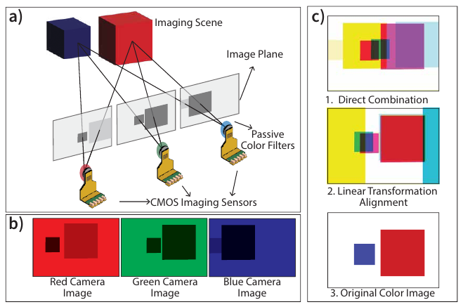

**Original caption:** Figure 3: Trinocular Lensing System. a) shows the three CMOS imaging sensors equipped with passive color filters imaging two cubes. The camera viewpoint can be seen on the imaging plane. b) shows the images captured from the three monochrome cameras equipped with color filters. c) shows the results of 1. Direct Combination, 2. Linear Transformation alignment and 3. Original Color Image if captured from a color camera

**中文图注:** 图 3：三目透镜系统。a) 展示三个配备无源彩色滤光片的 CMOS 成像传感器拍摄两个立方体，成像平面上可看到相机视点；b) 展示三个配备彩色滤光片的单色相机捕获的图像；c) 展示 1. 直接组合、2. 线性变换对齐的结果，以及 3. 若由彩色相机捕获得到的原始彩色图像。

**Reading note:** 观察三个传感器看到的两个立方体位置不同，导致直接组合（1）与线性变换对齐（2）均无法得到正确的原始彩色图（3）。

**Original:** Fig. 3b shows the images captured by the trinocular lensing system. Note that the three sensors capture grayscale images; however, for simplicity, we represent images captured by red, green, and blue color filters as red, green, and blue. Note that both cubes appear at different locations across the three images. Moreover, note that the distance between the pixels of the two cubes is not the same in the three images.

**中文:** 图 3b 显示了三目透镜系统捕获的图像。请注意，三个传感器实际捕获的是灰度图像；为简化起见，我们将红、绿、蓝滤光片捕获的图像分别用红、绿、蓝表示。可以看到，两个立方体在三幅图像中出现的位置各不相同；此外，两个立方体像素之间的距离在三幅图像中也不相同。

**Original:** This is because the position of an object in the image depends on the relative position of the camera from the object. Now that we have three images from the three cameras the next step is to form a color image using the three images. A naive solution is to simply combine the three images captured from the trinocular lensing system to form a color image as shown in image 1 in Fig. 3c. However, since the cameras are looking at the object from distinct physical positions, the objects appear at different locations in all three images, and therefore, the final color image results in distorted colors.

**中文:** 这是因为物体在图像中的位置取决于相机相对物体的位置。既然我们已经从三台相机得到三幅图像，下一步就是利用这三幅图像形成彩色图像。一种朴素的方案是直接将三目透镜系统捕获的三幅图像组合成彩色图像，如图 3c 中的图像 1 所示。然而，由于相机是从不同的物理位置观察物体，物体会出现在三幅图像的不同位置，因此最终彩色图像会出现颜色失真。

**Original:** Another potential solution is to consider the fixed camera positions and determine transformations between the camera images, anticipating an inverse transformation to align the images correctly before incorporating them into the color image channels. While this seems reasonable, it's important to note that camera transformations don't directly translate into image transformations [55]. Image 2 in Fig. 3c shows the result of aligning the images using the transformation in the position of the cameras. In the rest of the paper, we refer to this type of alignment as linear transformation alignment.

**中文:** 另一种可能的方案是考虑固定的相机位置，确定相机图像之间的变换，并期望通过逆变换在将图像放入彩色通道之前正确对齐。这看似合理，但重要的是要认识到：相机变换并不能直接转化为图像变换 [55]。图 3c 中的图像 2 显示了利用相机位置变换对齐图像的结果。在本文其余部分，我们将这种对齐称为线性变换对齐（linear transformation alignment）。

### 2.2 三目跨色彩对齐（Trinocular Cross Color Alignment）

**Original:** To overcome the above challenges and capture color images from the trinocular lensing system, SeaScan introduces Cross Color Alignment, a learning-based approach for aligning the monochrome images captured from the three filtered monochromatic sensors. This method operates in two stages.

**中文:** 为克服上述挑战并从三目透镜系统捕获彩色图像，SeaScan 提出了 Cross Color Alignment——一种基于学习的方法，用于对齐三个带滤光片单色传感器捕获的单色图像。该方法分两个阶段运行。

**Original:** Coarse Alignment: In the past, researchers have extensively looked into the problem of image alignment to enable tasks like visual localization, texture transfer, predicting the 2D geometry optical flow estimation, etc [48]. However, these methods alone are not sufficient for solving the problem in our trinocular lensing system, where the three images of interest represent different channels. To address this problem, SeaScan takes a multi-stage approach, and leverages these past approaches to perform the first stage of alignment. In the coarse alignment stage, SeaScan adapts RANSAC-flow net [51] as a backbone to align the three images in different color channels. It does so in a pairwise fashion. Specifically, we chose one of the captured images (say green camera image3) and used it as the reference/target image as shown in Fig. 4. The other two images are aligned with this target image in two steps. In the first step the red camera image is coarsely aligned with the green image and the result is combined with the green image to form a color image that only has a red and green channel (the blue channel is all zero) shown in Fig. 4 as red-green image. Now in the second stage, this aligned red-green image acts as the reference or target to align the blue camera image using the same process as before. Afterwards, the aligned blue image is ready to be combined with the other two images to form a coarse aligned color (RGB) image as shown in Fig. 4.

**中文:** 粗对齐（Coarse Alignment）：过去，研究者们已深入研究了图像对齐问题，以支持视觉定位、纹理迁移、2D 几何光流估计预测等任务 [48]。然而，仅靠这些方法不足以解决我们三目透镜系统中的问题——因为其中三幅目标图像代表不同的颜色通道。为解决该问题，SeaScan 采用多阶段方法，并借助这些已有方法完成第一阶段的对齐。在粗对齐阶段，SeaScan 以 RANSAC-flow 网络 [51] 为骨干，对不同颜色通道的三幅图像进行对齐，并以两两（pairwise）方式进行。具体而言，我们选择其中一幅捕获图像（例如绿色相机图像³）作为参考/目标图像，如图 4 所示。另外两幅图像分两步与该目标图像对齐：第一步，将红色相机图像与绿色图像粗对齐，结果与绿色图像组合成仅含红、绿通道的彩色图像（蓝色通道全为零），即图 4 中的红绿图像；第二步，以对齐后的红绿图像为参考/目标，用同样流程对齐蓝色相机图像。随后，对齐后的蓝色图像即可与另外两幅图像组合，形成粗对齐的彩色（RGB）图像，如图 4 所示。

### 图 4 Cross Color Alignment 两步流程

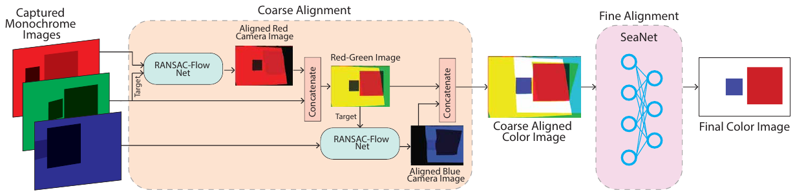

**Original caption:** Figure 4: Cross Color Alignment: works in two steps 1) Coarse Alignment and 2) Fine Alignment. In Coarse Alignment, RANSAC-Flow Net coarsely aligns the images in a pairwise fashion. This coarse aligned color image then goes through the Fine Alignment step where SeaNet produces the final color image

**中文图注:** 图 4：Cross Color Alignment：分两步工作，1) 粗对齐和 2) 精细对齐。在粗对齐中，RANSAC-Flow 网络以两两方式粗对齐图像；粗对齐后的彩色图像随后进入精细对齐步骤，由 SeaNet 生成最终彩色图像。

**Reading note:** 粗对齐阶段以 RANSAC-Flow 网络两两对齐红、绿、蓝相机图像；精细对齐阶段由 SeaNet 生成最终彩色图像。

**Original:** A key thing to note here is that this method of coarse alignment of the images is translationally and rotationally invariant. Specifically, this method does not depend on the distance or relative orientation between the cameras. As a result, this alignment process is robust to minor changes in the relative position or orientation of the CMOS sensors during the manufacturing process.

**中文:** 这里需要强调的一个关键点是：这种图像粗对齐方法具有平移和旋转不变性。具体而言，该方法不依赖于相机之间的距离或相对朝向。因此，该对齐过程对制造过程中 CMOS 传感器相对位置或朝向的微小变化具有鲁棒性。

**Original:** Fine Alignment: Next, we perform fine alignment to correct artifacts and infer the missing color information. We designed a convolution network, SeaNet, consisting of 2D convolutional layers with skip connections. Fig. 5 shows the end-to-end neural network architecture. SeaNet consists of 10 2D convolution layers (∼ 81k parameters), 2 max-pooling layers and 2 upsampling layers. Upsampling layers help in changing the activation size before the skip connections. We have observed that these skip connections are critical in preserving the structural information of the image that is lost at the convolution and pooling steps. We give the coarse-aligned image (from the previous step) as input to the network. Although this image is not an accurate representation of the final color image, it has enough information for the network to reconstruct a representative color image.

**中文:** 精细对齐（Fine Alignment）：接下来，我们执行精细对齐以修正伪影并推断缺失的颜色信息。我们设计了一个卷积网络 SeaNet，由带跳跃连接（skip connections）的 2D 卷积层构成。图 5 展示了端到端神经网络架构。SeaNet 包含 10 个 2D 卷积层（约 8.1 万参数）、2 个最大池化层和 2 个上采样层。上采样层用于在跳跃连接之前改变激活尺寸。我们观察到，这些跳跃连接对于保留在卷积和池化步骤中丢失的图像结构信息至关重要。我们将（上一步得到的）粗对齐图像作为网络输入。虽然该图像并非最终彩色图像的精确表示，但它包含足够的信息，使网络能够重建出有代表性的彩色图像。

### 图 5 SeaNet 网络架构

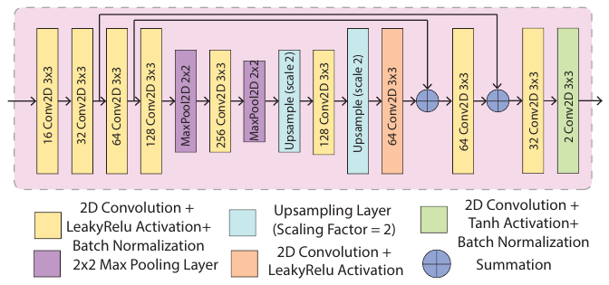

**Original caption:** Figure 5: SeaNet Architecture: The Conv2D layers are written following the convention [channel] Conv2D [k × k] where channel is the number of output channels and [kernel × kernel] is the kernel size

**中文图注:** 图 5：SeaNet 架构：Conv2D 层按 [通道数] Conv2D [k × k] 的约定标注，其中 channel 为输出通道数，[kernel × kernel] 为卷积核尺寸。

**Reading note:** 10 个 2D 卷积层（约 81k 参数）、2 个最大池化层、2 个上采样层，含跳跃连接；通道数 16→32→64→128→256→128→64→32→16。

**Original:** To train our network, we use NeRF-Stereo Dataset [56] with an 80-20 split (on ∼ 6k image triplets). This dataset comprises trinocular real-world image triplets with 3 different camera distance ranges. We divide these image triplets into left, center, and right images. Since, in SeaScan, our idea is to use 3 passive filter cameras where the leftmost camera is the red camera, the middle camera is the green camera, and the rightmost camera is the blue camera; we extract the red, green, and blue channels from the left, center, and right images of the dataset, respectively. We then convert these images into grayscale images before feeding them to the neural network. The color images corresponding to the center camera are used as ground truth to train SeaNet. During the process of training, these images were randomly reshaped to improve the performance of the neural network on different sizes of images.

**中文:** 为训练网络，我们使用 NeRF-Stereo 数据集 [56]，按 80-20 划分（约 6000 个图像三元组）。该数据集包含不同相机距离范围的真实三目图像三元组。我们将这些三元组划分为左、中、右图像。由于 SeaScan 的设计是使用 3 个无源滤光相机（最左侧为红色相机、中间为绿色相机、最右侧为蓝色相机），我们分别从数据集的左、中、右图像中提取红、绿、蓝通道，并在送入神经网络之前将其转换为灰度图像。与中心相机对应的彩色图像用作训练 SeaNet 的真值（ground truth）。训练过程中，这些图像会被随机调整尺寸，以提高神经网络对不同尺寸图像的性能。

## 3 跨折射补偿与滤光片选择 CROSS-REFRACTIVE COMPENSATION AND FILTER SELECTION

**Original:** Up to this point, we have described how our cross-color alignment technique works and how we use a SeaNet to correct for missing colors in the coarse aligned images. In this section, we will discuss the complementary design of both the underwater encapsulation and compensation for the unique lensing and distortion effects experienced in underwater environments.

**中文:** 到目前为止，我们已经描述了跨色彩对齐技术的工作原理，以及如何使用 SeaNet 修正粗对齐图像中缺失的颜色。本节将讨论互补的设计：水下封装，以及对水下环境中特有的透镜与畸变效应的补偿。

### 3.1 畸变补偿（Distortion Compensation）

**Original:** While our CMOS imaging sensor performs excellently in terms of power, its wide-angle lens introduces a radially symmetric negative distortion in the resulting images. This distortion is known as barrel distortion [35]. To illustrate this, Fig. 6a shows a checkerboard pattern captured from the CMOS imaging sensor placed at roughly 30 cm from the sensor against a straight wall in air. The farther away we look from the center of the image, the more the distortion increases, and the straight lines of the checkerboard begin to curve into an increasingly barrel shape. As a result, the image magnification decreases with the distance away from the center.

**中文:** 虽然我们的 CMOS 成像传感器在功耗方面表现优异，但其广角镜头会在所得图像中引入径向对称的负畸变，这种畸变被称为桶形畸变（barrel distortion）[35]。为说明这一点，图 6a 显示了 CMOS 成像传感器在空气中、距离传感器约 30 cm 处正对一面直墙拍摄的棋盘格图案。离图像中心越远，畸变越严重，棋盘格的直线逐渐弯曲成越来越明显的桶形。其结果是，图像放大率随离中心距离的增加而减小。

### 图 6 畸变效果（桶形畸变与两种封装）

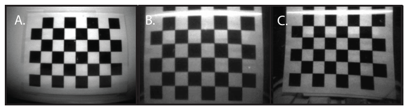

**Original caption:** Figure 6: Distortion Effects: (a) A checkerboard in air with distortion. (b) A checkerboard underwater with a dome encapsulation. (c) A checkerboard underwater with flat encapsulation.

**中文图注:** 图 6：畸变效果：（a）空气中带畸变的棋盘格；（b）穹顶封装下水中棋盘格；（c）平面封装下水中棋盘格。

**Reading note:** 对比 (a) 空气中（有明显桶形畸变）、(b) 穹顶封装（无补偿）与 (c) 平面封装（畸变被抵消）。

**Original:** For our cross-color alignment approach to work properly (similar to any learning-based approach), the underlying distributions of training and testing data need to be similar. However, due to the barrel distortion, this relationship between our training data (described in §2.2) and our test data (from the real world) is mismatched, severely impacting the performance of our cross-color alignment algorithm on the raw images.

**中文:** 为使跨色彩对齐方法正常工作（与任何基于学习的方法类似），训练数据与测试数据的底层分布需要相似。然而，由于桶形畸变的存在，我们的训练数据（见 §2.2）与（来自真实世界的）测试数据之间的关系并不匹配，严重影响了跨色彩对齐算法在原始图像上的性能。

**Original:** One possible solution to this problem is to augment the training dataset to include these distortions via modeling the imaging sensor. However, this approach requires careful characterization of the CMOS sensor [23] and the optical properties of its lens. Unfortunately, not only do we not have access to the exact lens shape and its optical characteristics, but mathematically modeling the interaction of the lens with the scene to sufficiently represent the true distribution of the testing dataset is challenging and prone to significant errors. Furthermore, simply removing the lens is not a viable option (it would result in an unfocused image) and custom-designing a distortion-compensation lens is less desirable than relying on commercial off-the-shelf components.

**中文:** 解决该问题的一种可能方案是通过对成像传感器建模，在训练数据集中加入这些畸变。然而，这种方法需要对 CMOS 传感器 [23] 及其镜头的光学特性进行细致的表征。遗憾的是，我们既无法获得镜头的确切形状与光学特性，而且对镜头与场景相互作用进行数学建模、以充分表示测试数据集的真实分布，既困难又容易出现显著误差。此外，直接移除镜头并不可行（会导致图像失焦），而定制设计畸变补偿镜头也不如依赖商用现成组件那样可取。

**Original:** Thus, to correct for distortions without introducing significant complexities, our idea is to leverage underwater light propagation properties. Specifically, we know that when light rays travel from one medium to another they experience refraction. The direction of this refraction depends on both the refractive indices of the two mediums and the angle of incidence. We can exploit this refraction between the two mediums to cancel out the barrel distortion in the captured images. In what follows, we describe two different encapsulation designs and their impact on the observed barrel distortion.

**中文:** 因此，为了在不引入显著复杂性的前提下校正畸变，我们的思路是利用水下光的传播特性。具体而言，我们知道当光线从一种介质进入另一种介质时会发生折射，折射方向取决于两种介质的折射率以及入射角。我们可以利用两种介质之间的这种折射来抵消所捕获图像中的桶形畸变。下面，我们介绍两种不同的封装设计及其对观测到的桶形畸变的影响。

**Original:** Dome Encapsulation: One of the more common encapsulations for underwater imaging systems is a dome as shown in Fig. 7a. In such encapsulations, the rays of light entering are perpendicular to the tangential plane and parallel to the normal vector at that point, allowing the light to focus on the center of the dome without any refraction. As a result, this type of encapsulation does not introduce any change in the distortion pattern of the CMOS imaging sensor if the camera is placed at the center of the dome. Fig. 6b shows an image taken underwater from the CMOS imaging sensor when placed in a dome encapsulation. Since the dome doesn't perform any distortion compensation, the barrel distortion in the checkerboard still exists and does not cancel the effect of the wide angle lens.4

**中文:** 穹顶封装（Dome Encapsulation）：水下成像系统较常见的封装之一是穹顶封装，如图 7a 所示。在这种封装中，进入的光线垂直于切平面、平行于该点的法向量，使光无需折射即可聚焦于穹顶中心。因此，如果相机位于穹顶中心，这类封装不会改变 CMOS 成像传感器的畸变模式。图 6b 显示了 CMOS 成像传感器置于穹顶封装中在水下拍摄的图像。由于穹顶不进行任何畸变补偿，棋盘格中的桶形畸变仍然存在，无法抵消广角镜头的影响⁴。

**Original:** Flat Encapsulation: We propose to use a flat encapsulation to correct the distortion in the images captured from the CMOS imaging sensors. In this case, the light is no longer parallel to the surface normal. Fig. 7b shows how a flat acrylic housing causes the incident light to refract across the encapsulation boundary.5 This can be mathematically written as:

**中文:** 平面封装（Flat Encapsulation）：我们提出使用平面封装来校正 CMOS 成像传感器捕获图像中的畸变。在这种情况下，光线不再平行于表面法线。图 7b 展示了平面丙烯酸外壳如何使入射光在封装边界处发生折射⁵。这可以数学地表示为：

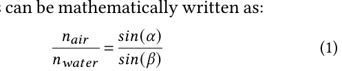

**中文说明：** 其中 n_air 与 n_water 分别为空气和水的折射率；α 与 β 分别为入射角和折射角。上式即斯涅尔定律（Snell's law）的比值形式，用于描述平面封装边界处的折射。

### 图 7 两种封装方法

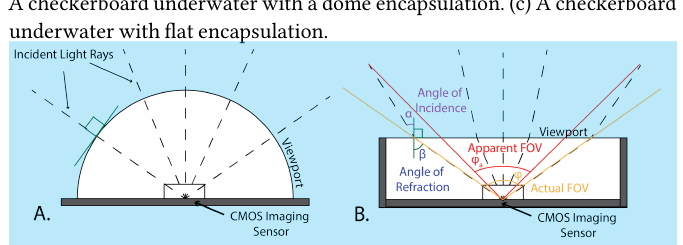

**Original caption:** Figure 7: Encapsulation Methods: (a) Dome encapsulation that passes incident light rays without refraction. (b) Flat encapsulation that decreases the FOV and compensates for the wide-angle effect of the image sensor

**中文图注:** 图 7：封装方法：（a）穹顶封装，入射光线无折射通过；（b）平面封装，减小视场角（FOV）并补偿图像传感器的广角效应。

**Reading note:** (a) 穹顶封装光线无折射通过；(b) 平面封装通过折射减小 FOV，抵消广角畸变。

**Original:** where n_air and n_water are the refractive indices of air and water; α and β are the angles of incidence and refraction. As a result, the field-of-view (FOV) of the imaging sensor is decreased, nearly eliminating the wide-angle distortion caused by the lens. Fig. 6c. shows the image of the same checkered board captured by the CMOS sensor when placed in a flat encapsulation.

**中文:** 其中 n_air 和 n_water 分别为空气与水的折射率；α 和 β 分别为入射角与折射角。其结果是，成像传感器的视场角（FOV）减小，几乎消除了镜头造成的广角畸变。图 6c 显示了 CMOS 传感器置于平面封装中时拍摄的同一棋盘格图像。

**Original:** To quantitatively evaluate the effectiveness of this method, we compute the distortion in the images before and after distortion compensation as D = ΔH/H × 100, where H is the predicted height of the object in the image and ΔH is the change in the object's height from the predicted height in the captured image. Using this metric, we quantify that the flat encapsulation reduces the distortion by 4× improvement (from 8% to 2%). This resulting distortion is sufficiently small that it enables the trinocular cross-color alignment to work correctly in the end-to-end reconstruction, as we demonstrate qualitatively and quantitatively in §6.

**中文:** 为定量评估该方法的有效性，我们按 D = ΔH/H × 100 计算畸变补偿前后图像中的畸变，其中 H 是图像中物体的预测高度，ΔH 是捕获图像中物体高度相对预测高度的变化量。利用该指标，我们量化得出：平面封装将畸变降低了 4 倍（从 8% 降至 2%）。所得畸变足够小，能够使三目跨色彩对齐在端到端重建中正确工作，这一点我们将在 §6 中从定性与定量两方面进行论证。

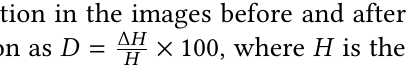

**中文说明：** 畸变度量公式：D 为畸变量，H 为图像中物体的预测高度，ΔH 为物体高度相对预测高度的变化量。

**Original:** This illustrates that the barrel effect is significantly reduced in the captured image and enables our test dataset to be representative of and drawn from the same distribution as the training dataset.6

**中文:** 这说明所捕获图像中的桶形效应已显著减小，并使我们的测试数据集能够代表训练数据集、且与训练数据集来自同一分布⁶。

### 3.2 滤光片选择（Filter Selection）

**Original:** Next, we focus on the selection of the filters for the red, green, and blue channels. Recall from §2 that our idea is to use a passive colorization technique using color filters on three grayscale cameras to enable energy-efficient color imaging. Proper performance of the color filters is critical to the end-to-end colorization performance of SeaScan.

**中文:** 接下来，我们关注红、绿、蓝通道滤光片的选择。回顾 §2，我们的思路是在三台灰度相机上使用彩色滤光片实现无源着色（passive colorization）技术，从而实现高能效彩色成像。彩色滤光片的性能是否正常，对 SeaScan 端到端着色性能至关重要。

**Original:** There are two key factors to be considered in the filter selection. First, the wavelength bands of the filters should not have significant overlap. This is because we need the monochrome images captured by each camera to be as orthogonal in color (to the human eye) as possible to each other. If the wavelength bands have significant overlap, then colors that have significant power in multiple images can recombine to an incorrect output image color. Second, we must also make sure that the presence of the filters themselves does not introduce artifacts such as distortions, internal reflections, or blurriness in the captured images. These artifacts can both deteriorate the performance of our cross color alignment method and effect recovered colors in the images. Given these considerations, we investigated two types of filters: dichroic filters and gel filters.

**中文:** 滤光片选择需考虑两个关键因素。第一，各滤光片的波长带不应有显著重叠。这是因为我们需要每台相机捕获的单色图像在颜色上（对人眼而言）尽可能彼此正交。如果波长带显著重叠，那么在多幅图像中均具有显著功率的颜色可能会重新组合成错误的输出图像颜色。第二，我们还必须确保滤光片本身的存在不会在捕获图像中引入畸变、内反射或模糊等伪影。这些伪影既会降低跨色彩对齐方法的性能，也会影响图像中恢复出的颜色。基于这些考虑，我们研究了两种滤光片：二向色滤光片（dichroic filters）和凝胶滤光片（gel filters）。

**Original:** Dichroic Filters: Dichroic filters are highly precise color filters that only pass light of very specific wavelengths [61]. They operate on the thin-film interference phenomenon, and are widely used in optical research, high-power laser applications, and even theatrical lighting [66]. While these filters perform very well at filtering specific wavelengths, they reflect wavelengths outside of their filtering range. This poses a problem for SeaScan because the unwanted wavelengths don't actually disappear. In fact, shown in Fig. 8, the wavelengths reflected from any filter partially reflect back off the viewport and can impinge onto a different filter that will pass the wavelength to the image sensor. This effect manifests by introducing significant lighting and reflection artifacts into the captured images.

**中文:** 二向色滤光片：二向色滤光片是高精度的彩色滤光片，只允许非常特定波长的光通过 [61]。它们基于薄膜干涉现象工作，广泛用于光学研究、高功率激光应用，甚至舞台灯光 [66]。虽然这类滤光片在过滤特定波长方面表现优异，但它们会反射滤光范围之外的波长。这对 SeaScan 构成问题，因为不需要的波长实际上并未消失。事实上，如图 8 所示，从任一滤光片反射出的波长会部分地从视窗反射回来，并可能照射到另一块滤光片上，后者会将这一波长传给图像传感器。这种效应表现为在所捕获图像中引入显著的照明与反射伪影。

### 图 8 二向色滤光片问题

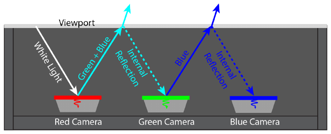

**Original caption:** Figure 8: Dichroic Filter Problem: Incoming white light reflecting from dichroic filters, introducing artifacts into the captured images.

**中文图注:** 图 8：二向色滤光片问题：入射白光经二向色滤光片反射，在所捕获图像中引入伪影。

**Reading note:** 白光经二向色滤光片反射后在视窗与滤光片间来回反射，引入照明与反射伪影。

**Original:** Gel Filters: A color gel or a lighting gel is a simple transparent colored material that is used to change the color of any white light [32]. The primary advantage of these filters is that they operate by absorbing unwanted wavelengths rather than totally reflecting them. In the context of our encapsulation, this means that the filters will absorb wavelengths that should not pass through the filter and suppress the lighting and reflection artifacts that are seen with dichroic filters. Even though these filters don't have well-defined passband wavelengths like the dichroic filters do, their band of operation and filtering performance are sufficient to reconstruct color images from the monochrome image sensors. Thus, we selected gel filters as our red, green, and blue color filters in SeaScan's design.

**中文:** 凝胶滤光片：彩色凝胶（color gel）或灯光凝胶（lighting gel）是一种简单的透明着色材料，用于改变任意白光的颜色 [32]。这类滤光片的主要优点是：它们通过吸收不需要的波长来工作，而不是将其完全反射。在我们封装的场景中，这意味着滤光片会吸收不应通过的波长，从而抑制二向色滤光片所表现出的照明与反射伪影。虽然这类滤光片不像二向色滤光片那样具有明确定义的通带波长，但其工作波段与滤波性能足以从单色图像传感器重建彩色图像。因此，我们在 SeaScan 设计中选用凝胶滤光片作为红、绿、蓝彩色滤光片。

## 4 端到端系统 END-TO-END SYSTEM

**Original:** Now that we have described SeaScan's core design, we describe how we extend it to an end-to-end system. From 2D to 3D: 3D underwater color reconstruction is important for various applications: monitoring fish growth, infrastructure, etc. Thus, we investigated various methods that can leverage monocular and stereo cameras for 3D reconstruction [11, 21, 49]. Our investigation showed that a (very) recent depth estimation method, called Depth Anything [65], performs extremely well. This method takes monocular images as input and outputs the depth estimation for each pixel in the captured scene. Thus, we integrated Depth Anything into our end-to-end pipeline. Specifically, SeaScan feeds the 2D color images to Depth Anything to estimate the depth of each pixel, then combines the depth estimates with the captured color image to reconstruct a 3D point cloud of the environment.

**中文:** 在描述了 SeaScan 的核心设计之后，我们介绍如何将其扩展为端到端系统。从 2D 到 3D：3D 水下彩色重建对多种应用都很重要，例如监测鱼类生长、基础设施等。因此，我们研究了多种可利用单目和立体相机进行 3D 重建的方法 [11, 21, 49]。我们的调研发现，一种（非常）新的深度估计方法——Depth Anything [65]——表现极为出色。该方法以单目图像为输入，输出所捕获场景中每个像素的深度估计。于是，我们将 Depth Anything 集成到端到端流水线中。具体而言，SeaScan 将 2D 彩色图像送入 Depth Anything 以估计每个像素的深度，再将深度估计与所捕获的彩色图像结合，重建环境的 3D 点云。

**Original:** Compression: Recall that SeaScan aims to transfer its captured images wirelessly to a remote receiver. Unfortunately, the limited bandwidth of underwater acoustic communication (kHz-level) leads to long data transfer durations (e.g., around over an hour for the state-of-the-art low-power underwater camera), and can consume up to 20% of the overall energy of the system (even if it relies on an ultra-low-power underwater communication technology like backscatter). Thus, to further improve the energy efficiency of the system, we implement an on-board JPEG compression algorithm to reduce the size of the image that needs to be communicated. The on-board JPEG compression algorithm helps us reduce the image size significantly. By controlling the quality of the compressed image (a tunable parameter in the JPEG compression algorithm), we can control the amount of data that needs to be transmitted. This allows us to considerably reduce the communication time as compared to the state-of-the-art system which improves the overall energy efficiency.

**中文:** 压缩（Compression）：回顾一下，SeaScan 的目标是将捕获的图像无线传输到远程接收端。遗憾的是，水下声学通信的带宽有限（kHz 量级），导致数据传输时间很长（例如，现有最先进的低功耗水下相机需要约一个多小时），并且即使采用反向散射这类超低功耗水下通信技术，通信也可能消耗系统总能量的 20%。因此，为进一步提升系统能效，我们实现了机载 JPEG 压缩算法，以减小需要传输的图像大小。机载 JPEG 压缩算法帮助我们将图像大小显著减小。通过控制压缩图像的质量（JPEG 压缩算法中的一个可调参数），我们可以控制需要传输的数据量。与现有先进系统相比，这使我们能够大幅缩短通信时间，从而提升整体能效。

**Original:** Backscatter Communication: After capturing and compressing the filtered monocular images, SeaScan needs to wirelessly transmit this data to a remote server for color recovery and 3D reconstruction. Since SeaScan's goal is to enable energy-efficient underwater imaging, it integrates underwater backscatter [29] for net-zero power wireless communication. Specifically, the pixel data for each monochrome image is encoded into data frames and transmitted on an uplink channel. Similar to past work, the data frame can include headers (with sequence numbers and addressing), footers (CRC checks), and coding. At the physical layer, the data is encoded using FM0 modulation, and the backscatter is governed by an embedded microcontroller that interfaces with the backscatter switch. Our design focused on omnidirectional backscatter nodes, but can be extended to retroreflective designs that would enable data transmissions up to hundreds of meters as demonstrated in recent work [3, 4]. Furthermore, if desired, the design can be extended via energy harvesting [2, 29] to enable battery-free operation of SeaScan.

**中文:** 反向散射通信（Backscatter Communication）：在捕获并压缩带滤光片的单目图像之后，SeaScan 需要将这些数据无线传输到远程服务器，以进行颜色恢复和 3D 重建。由于 SeaScan 的目标是实现高能效水下成像，它集成了水下反向散射 [29] 以实现近零功率的无线通信。具体而言，每幅单色图像的像素数据被编码为数据帧，并在上行链路上传输。与以往工作类似，数据帧可包含帧头（含序列号与寻址）、帧尾（CRC 校验）和编码。在物理层，数据采用 FM0 调制编码，反向散射由与反向散射开关接口的嵌入式微控制器控制。我们的设计聚焦于全向反向散射节点，但可扩展至逆反射（retroreflective）设计，正如近期工作 [3, 4] 所展示的，可支持数百米的数据传输。此外，如有需要，该设计还可通过能量采集 [2, 29] 扩展，使 SeaScan 实现无电池运行。

## 5 实现 IMPLEMENTATION

### 5.1 嵌入式硬件（Embedded Hardware）

**Original:** We designed and implemented a custom printed circuit board (PCB) powered by a Samsung 25R 2500 mAh battery [1] to house the three cameras, a microcontroller for receiving, processing, and transmitting the images, and backscatter switching. The overall schematic architecture is shown in Fig. 9a and the PCB is shown in Fig. 9b.

**中文:** 我们设计并实现了一块定制印刷电路板（PCB），由三星 25R 2500 mAh 电池 [1] 供电，用于容纳三台相机、一块负责接收/处理/传输图像的微控制器，以及反向散射开关。整体原理图架构如图 9a 所示，PCB 如图 9b 所示。

### 图 9 系统实现与评估总览

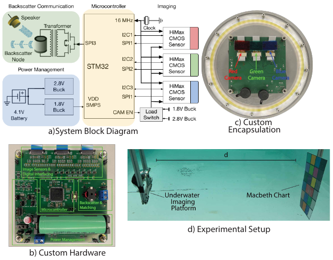

**Original caption:** Figure 9: System Implementation & Evaluation Overview

**中文图注:** 图 9：系统实现与评估总览。

**Reading note:** (a) 系统框图、(b) 定制硬件 PCB、(c) 定制封装、(d) 实验设置（含 Macbeth 色卡）。

**Original:** (a) Image Sensors. We use the HM01B0 CMOS imaging sensors [23] from Himax as our 3 cameras. These cameras consume a maximum of 4 mW during the active capture phase.

**中文:** (a) 图像传感器。我们使用 Himax 公司的 HM01B0 CMOS 成像传感器 [23] 作为我们的 3 台相机。这些相机在主动采集阶段的最大功耗为 4 mW。

**Original:** (b) Microcontroller. Our microcontroller is STM32U535VETQ6 from STMicroelectronics [38]. We use its serial peripheral interfaces (SPI) to receive the serial data from the HM01B0 cameras. We chose this microcontroller for its superior ultra-low-power consumption in both run and low-power modes. We send a main clock (MCLK) frequency of 4 MHz to each of the cameras and sequentially take the pictures from camera 1, camera 2, and camera 3 by receiving the serial data on two of the three available SPI interfaces: SPI1 and SPI2. These SPI interfaces are placed in the receive-only slave mode and use the HM01B0 cameras' pixel clock (PCLK) output as their SPI clocks. We capture the images by receiving data from camera 1 on SPI1, from camera 2 on SPI2, and then we hot-swap the SPI1 to a different set of pins to receive data from camera 3. Note that the three cameras capture images sequentially due to the limited availability of the SPI on the STM32U535VETQ6 microcontroller; however, the three cameras can still capture images in a fraction of a second. Since this microcontroller contains 274 KBytes of SRAM, we can store each of the 320 × 240-sized images temporarily in SRAM before JPEG compression.

**中文:** (b) 微控制器。我们的微控制器是意法半导体（STMicroelectronics）的 STM32U535VETQ6 [38]。我们使用其串行外设接口（SPI）接收 HM01B0 相机的串行数据。选择这款微控制器是因为它在运行模式和低功耗模式下都具有优异的超低功耗特性。我们向每台相机发送 4 MHz 的主时钟（MCLK），并通过三个可用 SPI 接口中的两个（SPI1 和 SPI2）接收串行数据，依次拍摄相机 1、相机 2 和相机 3 的图像。这些 SPI 接口被配置为只接收的从机模式，并以 HM01B0 相机的像素时钟（PCLK）输出作为其 SPI 时钟。我们通过 SPI1 接收相机 1 的数据、SPI2 接收相机 2 的数据，然后将 SPI1 热切换到另一组引脚以接收相机 3 的数据。需要注意的是，由于 STM32U535VETQ6 微控制器可用 SPI 数量有限，三台相机是顺序采集图像的；不过三台相机仍可在不到一秒的时间内完成采集。由于该微控制器包含 274 KB 的 SRAM，我们可以在 JPEG 压缩之前将每幅 320×240 的图像临时存储在 SRAM 中。

**Original:** (c) JPEG Compression & Backscatter Transmission. Once the images are captured, we JPEG compress each of them using the open-source JPEC library [39] using a quality factor of 30% to prepare them for backscatter transmission. The CPU operates at an 80 MHz clock rate in order to compute faster and optimize the energy consumption of the system. After compression, we throttle the microcontroller's clock rate down to the minimum possible 100 kHz for the lowest possible power consumption. We transmit the compressed image data to the backscatter switch using the SPI3 interface in transmit-receive slave mode. The image data bits are encoded into FM0 symbols which are then transferred to the SPI3 transmit data buffer via the direct-memory access (DMA) controller. Backscatter switching is realized using a dual n-channel BSD840NH6327XTSA1 [52] MOSFET.

**中文:** (c) JPEG 压缩与反向散射传输。图像捕获后，我们使用开源 JPEC 库 [39] 以 30% 的质量因子对每幅图像进行 JPEG 压缩，为反向散射传输做准备。CPU 以 80 MHz 时钟运行，以加快计算并优化系统能耗。压缩完成后，我们将微控制器时钟降至最低可能的 100 kHz，以获得最低功耗。我们通过 SPI3 接口（收发从机模式）将压缩后的图像数据传输到反向散射开关。图像数据位被编码为 FM0 符号，再通过直接存储器访问（DMA）控制器送入 SPI3 发送数据缓冲。反向散射开关采用双 N 沟道 BSD840NH6327XTSA1 [52] MOSFET 实现。

### 5.2 封装（Encapsulation）

**Original:** Recall from our discussion in §3, our camera needs to be encapsulated such that the CMOS imaging sensors face a flat clear acrylic housing. To do so, we laser cut a clear, scratch-resistant piece of acrylic into a circle that serves as the viewport for the scene. This circular viewport fits the circumference of a dome7 that provides enough room to house our custom PCB and image sensors. The acrylic viewport and backing dome are secured together with 8 machine screws that compress an o-ring to create a watertight seal. We attached a Micro-Con-X [15] 4 pin circular connector to the flat viewport in the encapsulation as shown in Fig. 9c.

**中文:** 回顾 §3 的讨论，我们的相机需要封装成使 CMOS 成像传感器面向平面透明丙烯酸外壳的形式。为此，我们激光切割出一块透明、耐刮擦的圆形丙烯酸片，作为观察场景的视窗。这个圆形视窗与穹顶⁷ 的圆周相匹配，穹顶提供了容纳我们定制 PCB 和图像传感器的足够空间。丙烯酸视窗与背衬穹顶通过 8 颗机制螺钉固定在一起，并压缩 O 形圈形成水密密封。我们在封装的平面视窗上安装了一个 Micro-Con-X [15] 4 针圆形连接器，如图 9c 所示。

### 5.3 软件（Software）

**Original:** The camera data was received and decoded in MATLAB on an Ubuntu 20.4 machine. This machine is connected to a remote server with a GTX 1080 Ti GPU where we perform Cross Color Alignment, depth estimation and point cloud generation. We trained SeaNet with the GTX 1080 Ti GPU in Python with Adam optimizer and smooth L1 loss for 300 epochs.

**中文:** 相机数据在 Ubuntu 20.4 机器上通过 MATLAB 接收和解码。该机器连接到一台配备 GTX 1080 Ti GPU 的远程服务器，我们在其上执行 Cross Color Alignment、深度估计和点云生成。我们使用 GTX 1080 Ti GPU、采用 Python 训练 SeaNet，优化器为 Adam，损失函数为平滑 L1 损失，共训练 300 个 epoch。

## 6 结果 RESULTS

### 6.1 实验装置（Experimental Setup）

**Original:** To evaluate the performance of SeaScan, all real-world experiments were performed underwater in either a small 20′′ × 12′′ × 10′′ tank or a large 4 m × 3 m × 1.2 m experimental pool under standard indoor lighting conditions. We note that in all of our experiments, there was no underwater light present. We used a GoPro 9 camera to obtain the ground truth. In our evaluation, we use models of fish and coral reefs, as well as a Macbeth chart as a gold standard for color reconstruction accuracy [47]. Our evaluation setup with the Macbeth chart is shown in Fig. 9d.

**中文:** 为评估 SeaScan 的性能，所有真实实验均在标准室内照明条件下于水下进行，实验环境为小型 20′′ × 12′′ × 10′′ 水槽或大型 4 m × 3 m × 1.2 m 实验池。我们指出，在所有实验中均不存在水下光源。我们使用 GoPro 9 相机获取真值。在评估中，我们使用鱼和珊瑚礁模型，并以 Macbeth 色卡作为颜色重建精度的黄金标准 [47]。使用 Macbeth 色卡的评估设置如图 9d 所示。

### 6.2 能耗（Energy Consumption）

**Original:** We measure the energy consumption of SeaScan in three phases: image capture, data compression, and backscatter communication. For a given phase, as the microcontroller firmware runs, we measured the current trace of our system at different I_dd testpoints on the PCB using the DMM6500 multimeter [53]. We calculated the average power as defined by P = I_dd V_dd, where the V_dd is the voltage at the testpoint. Using the average power and the time duration, we computed the total energy consumption of the entire system and its components (as E = ∫ P(t)dt).

**中文:** 我们从三个阶段测量 SeaScan 的能耗：图像采集、数据压缩和反向散射通信。对于给定阶段，在微控制器固件运行期间，我们使用 DMM6500 万用表 [53] 测量系统在 PCB 上不同 I_dd 测试点处的电流轨迹。我们按 P = I_dd V_dd 计算平均功率，其中 V_dd 为测试点电压。利用平均功率和时间长度，我们计算了整个系统及其各组件（按 E = ∫ P(t)dt）的总能耗。

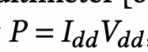

**中文说明：** 平均功率计算公式：P 为平均功率，I_dd 为测试点电流，V_dd 为测试点电压。

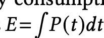

**中文说明：** 总能耗计算公式：E 为总能量，P(t) 为随时间变化的瞬时功率。

**Original:** Tab. 1 compares the energy consumption to a state-of-the-art baseline for low-power underwater color imaging [2] for each of the three phases. We make the following remarks: • The energy consumption during the image capture phase for SeaScan is 23.6 mJ, while that of the baseline is 894.2 mJ. This is a 37× reduction compared to the prior work. • SeaScan takes 0.6 seconds for the image capture phase, and baseline requires 111.2 seconds. Thus, our system is able to capture images 185 × faster than the prior art. This is because our architecture runs at a much higher clock rate. • For the JPEG compression phase, SeaScan consumes a total of 9 mJ.8 However, due to the compression9, the total energy for backscatter communication is significantly less for SeaScan (85.1 mJ) than it is for the baseline (234.9 mJ). Note that for fair comparison, we use the same datarate as in [2] i.e., 1 kbps for the backscatter communication. • SeaScan consumes a total energy of 117.7 mJ, while the baseline consumes 1129.1 mJ. Thus, our system achieves more than 9× reduction in total energy consumption compared to the state-of-the-art underwater imaging system.

**中文:** 表 1 将能耗与低功耗水下彩色成像的先进基线方法 [2] 在三个阶段的能耗进行了比较。我们得出以下结论：• 图像采集阶段 SeaScan 能耗为 23.6 mJ，而基线为 894.2 mJ，比此前工作降低 37 倍。• SeaScan 图像采集阶段耗时 0.6 秒，而基线需要 111.2 秒，因此我们的系统采集速度比现有技术快 185 倍，这是因为我们的架构运行在更高的时钟频率上。• JPEG 压缩阶段 SeaScan 总共消耗 9 mJ⁸；但由于压缩⁹ 的作用，SeaScan 反向散射通信的总能耗（85.1 mJ）显著低于基线（234.9 mJ）。请注意，为公平比较，我们采用了与 [2] 相同的数据速率，即反向散射通信为 1 kbps。• SeaScan 总能耗为 117.7 mJ，而基线为 1129.1 mJ，因此我们的系统相比现有先进水下成像系统，总能耗降低超过 9 倍。

### 表 1 能耗对比（SeaScan vs 基线 [2]）

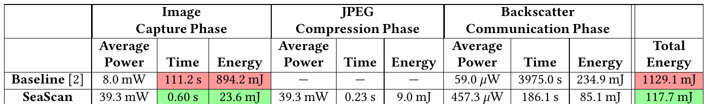

**Original caption:** Table 1: Energy Consumption. The table shows the energy consumption of the state-of-the-art imaging system [2] and SeaScan in Image Capture Phase, JPEG Compression Phase, and Backscatter Communication Phase.

**中文图注:** 表 1：能耗。该表展示了现有先进成像系统 [2] 与 SeaScan 在图像采集阶段、JPEG 压缩阶段和反向散射通信阶段的能耗。

**Reading note:** SeaScan 总能耗 117.7 mJ vs 基线 1129.1 mJ，约 9.6 倍降低；采集阶段 37 倍、速度 185 倍提升。

**表格内容（整理版）：**

| 阶段 | 平均功率 | 时间 | 能量 | 平均功率 | 时间 | 能量 | 平均功率 | 时间 | 能量 | 总能量 |
|---|---|---|---|---|---|---|---|---|---|---|
|  | 图像采集 |  |  | JPEG压缩 |  |  | 反向散射 |  |  |  |
| 基线 [2] | 8.0 mW | 111.2 s | 894.2 mJ | — | — | — | 59.0 µW | 3975.0 s | 234.9 mJ | 1129.1 mJ |
| SeaScan | 39.3 mW | 0.60 s | 23.6 mJ | 39.3 mW | 0.23 s | 9.0 mJ | 457.3 µW | 186.1 s | 85.1 mJ | 117.7 mJ |

**Original:** Interestingly, SeaScan consumes more instantaneous power than the baseline. During the image capture phase, it has an average power consumption of 39.3 mW compared to 8 mW for the baseline. For the backscatter communication phase, SeaScan has an average power consumption of 457.3 µW, while the baseline has a power consumption of 59.0 µW. The higher power consumption of our system is despite the fact that SeaScan does not flash LEDs and is because SeaScan runs at a higher clock rate and has a larger memory block as compared to [2]. This was a deliberate design decision because a high clock rate is more energy-efficient even if it consumes more instantaneous power.

**中文:** 有趣的是，SeaScan 的瞬时功率消耗高于基线。在图像采集阶段，其平均功耗为 39.3 mW，而基线为 8 mW。在反向散射通信阶段，SeaScan 的平均功耗为 457.3 µW，而基线为 59.0 µW。我们的系统功耗更高，尽管 SeaScan 不闪烁 LED，这是因为与 [2] 相比，SeaScan 运行在更高时钟频率并具有更大的存储块。这是一项经过深思熟虑的设计决策，因为高时钟频率即使消耗更多瞬时功率，总体上却更节能。

**Original:** Tab. 2 breaks down the energy consumption of SeaScan by hardware components across the three phases. Here we note: • The monochrome CMOS sensors require an average power of 3.8 mW during the image capture phase, and consume 2.3 mJ of energy. Note that the cameras are disabled during the JPEG compression and backscatter communication phases, hence they do not consume energy in those phases. • The STM32U535VETQ6 microcontroller uses an average power of 28.9 mW during image capture, 33.4 mW during JPEG compression, and 395.3 µW during backscatter communication. The microcontroller consumes 17.3 mJ of energy over image capture, 7.7 mJ over compression, and 73.5 mJ over backscatter. The reduction in power consumption from JPEG compression to backscatter is caused by the microcontroller switching to a low power mode for the backscatter phase. • The PCB also includes power converters and load switches which draw power during operation. These miscellaneous active components use 6.7 mW, 5.7 mW, and 62 uW during image capture, JPEG compression, and backscatter phases, respectively. The components consume 4 mJ, 1.3 mJ, and 11.5 mJ while collecting images, compressing data, and communicating over backscatter, respectively.

**中文:** 表 2 按硬件组件分解了 SeaScan 在三个阶段中的能耗。我们在此指出：• 单色 CMOS 传感器在图像采集阶段的平均功耗为 3.8 mW，能耗为 2.3 mJ。请注意，相机在 JPEG 压缩和反向散射通信阶段被禁用，因此在这些阶段不消耗能量。• STM32U535VETQ6 微控制器在图像采集、JPEG 压缩和反向散射通信阶段的平均功耗分别为 28.9 mW、33.4 mW 和 395.3 µW，相应能耗为 17.3 mJ、7.7 mJ 和 73.5 mJ。从 JPEG 压缩到反向散射阶段功耗下降，是因为微控制器在反向散射阶段切换到了低功耗模式。• PCB 还包括功率转换器和负载开关，它们在运行时会消耗功率。这些杂项有源组件在图像采集、JPEG 压缩和反向散射阶段的功耗分别为 6.7 mW、5.7 mW 和 62 µW，相应能耗为 4 mJ、1.3 mJ 和 11.5 mJ。

### 表 2 SeaScan 各组件能耗分解

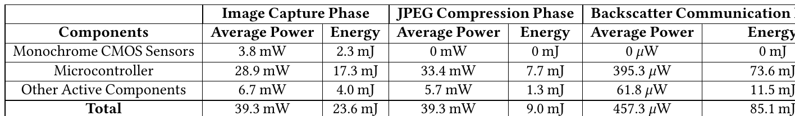

**Original caption:** Table 2: Energy Consumption Breakdown. The table shows the energy consumption of different components of SeaScan over all three phases.

**中文图注:** 表 2：能耗分解。该表展示了 SeaScan 各组件在全部三个阶段中的能耗。

**Reading note:** 微控制器是主要耗能组件；相机在压缩与通信阶段被禁用、不耗能。

**表格内容（整理版）：**

| 组件 | 采集:平均功率 | 采集:能量 | 压缩:平均功率 | 压缩:能量 | 反向散射:平均功率 | 反向散射:能量 |
|---|---|---|---|---|---|---|
| 单色CMOS传感器 | 3.8 mW | 2.3 mJ | 0 mW | 0 mJ | 0 µW | 0 mJ |
| 微控制器 | 28.9 mW | 17.3 mJ | 33.4 mW | 7.7 mJ | 395.3 µW | 73.6 mJ |
| 其他有源组件 | 6.7 mW | 4.0 mJ | 5.7 mW | 1.3 mJ | 61.8 µW | 11.5 mJ |
| 合计 | 39.3 mW | 23.6 mJ | 39.3 mW | 9.0 mJ | 457.3 µW | 85.1 mJ |

**Original:** Note that SeaScan can capture color images without the need to illuminate the scene with different color lights. Furthermore, it can be augmented with a white LED (10.73 mJ) to enable its operation in dark environments (e.g., in deep sea). In this case, the energy consumption of SeaScan during the image capture phase increases to 23.6 mJ + 3×10.73 mJ = 55.79 mJ, which is 16× lower than the 894.2 mJ consumed in [2]. Here, the 16× improvement comes entirely from SeaScan's novel optimized microcontroller architecture for ultra-low-power underwater imaging.

**中文:** 请注意，SeaScan 无需用不同颜色的光照射场景即可捕获彩色图像。此外，它可以加装一个白光 LED（10.73 mJ），以在黑暗环境中（例如深海）运行。在这种情况下，SeaScan 图像采集阶段的能耗将增加到 23.6 mJ + 3×10.73 mJ = 55.79 mJ，比 [2] 中的 894.2 mJ 低 16 倍。这里的 16 倍提升完全来自 SeaScan 面向超低功耗水下成像的新型优化微控制器架构。

### 6.3 定性结果（Qualitative Results）

**Original:** Next, we evaluate the qualitative performance of SeaScan and compare it to alternate implementations and a GoPro camera underwater as ground truth. Alternate Implementations. We compared the performance of our Cross Color Alignment algorithm with (recall from §2) • Direct Combination: This method involves directly applying red, green, and blue images to the red green and blue channels of a color image without any transformation. • Linear Transformation Alignment: Here, we use the position of the three cameras to determine the transformation between them. Then, we linearly invert these transforms before applying the three images to their respective channels. • NN-based Colorization: [68] This baseline uses state-of-the-art neural network based colorization method to convert grayscale images into color images.

**中文:** 接下来，我们评估 SeaScan 的定性性能，并将其与替代实现以及作为真值的水下 GoPro 相机进行比较。替代实现（Alternate Implementations）：我们将 Cross Color Alignment 算法的性能与（回顾 §2）以下方法比较：• 直接组合（Direct Combination）：该方法直接将红、绿、蓝图像分别施加到彩色图像的红、绿、蓝通道，不做任何变换。• 线性变换对齐（Linear Transformation Alignment）：该方法利用三台相机的位置确定它们之间的变换，然后在将三幅图像施加到各自通道之前，对这些变换进行线性求逆。• 基于 NN 的着色（NN-based Colorization）：[68] 该基线使用最先进的基于神经网络的着色方法，将灰度图像转换为彩色图像。

**Original:** Imaging Results. Fig. 10 shows real images captured by our setup from multiple scenes. The first column in Fig. 10 shows the image captured by the GoPro 9 camera. The second, third, fourth, and fifth column of Fig. 10 show the color images as a result of Direct Combination, Linear Transformation Alignment, NN-based Colorization, and our method respectively. The first row shows the set of images for a Macbeth chart taken from a distance of 70 cm from the camera. The second row shows the set of images of the same object in the same environment with a distance of 100 cm from the camera. The third and fourth rows show results for an image of a plastic model of a coral reef and a toy fish, respectively, captured from a distance of 30 cm.

**中文:** 成像结果（Imaging Results）。图 10 显示了我们的装置从多个场景捕获的真实图像。图 10 的第一列显示 GoPro 9 相机捕获的图像；第二、三、四、五列分别显示直接组合、线性变换对齐、基于 NN 的着色和我们方法得到的彩色图像。第一行显示的是距相机 70 cm 处拍摄的 Macbeth 色卡图像组；第二行显示同一环境中同一物体在距相机 100 cm 处的图像组；第三、四行分别显示在距相机 30 cm 处拍摄的塑料珊瑚礁模型和玩具鱼图像的结果。

### 图 10 定性结果（多场景对比）

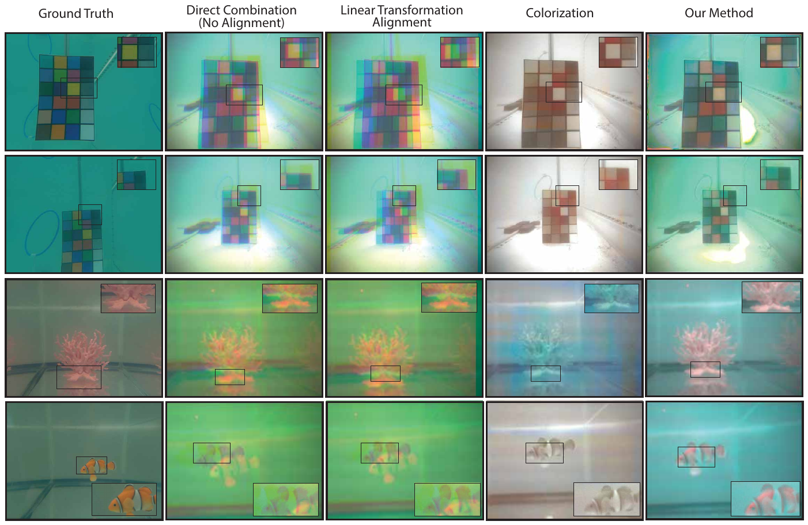

**Original caption:** Figure 10: Qualitative Results. This figure shows the qualitative results of our method and the baselines. The first column shows the images taken from the GoPro 9 camera. The columns represent different imaging methods and the rows represent different scenarios. The second, third, and fourth columns show the results of Direct Combination, Linear Transformation Alignment, and NN-based Colorization, respectively. The fifth row shows the result of our system.

**中文图注:** 图 10：定性结果。本图展示我们方法与基线的定性结果。第一列显示 GoPro 9 相机拍摄的图像；各列代表不同的成像方法，各行代表不同场景；第二、三、四列分别显示直接组合、线性变换对齐和基于 NN 的着色的结果；第五行显示我们系统的结果。（原文如此：末句疑为“第五列”的笔误）

**Reading note:** 每行一个场景（Macbeth 色卡 70cm/100cm、珊瑚礁模型、玩具鱼），第一列为 GoPro 真值，最后一列为 SeaScan 结果。

**Original:** Based on these qualitative results, we note: • It can be seen from Fig. 10 that Cross Color Alignment (our) method perfectly aligns the three images taken from three different cameras and fills in the information gap as well while keeping the true colors of the scene intact. • Note that Direct Combination performs better in the image of the Macbeth chart at 1m (second row) compared to 0.7m (first row). This is because as we move the object further from the camera, the difference in the position of the object in the three camera images is very small, reducing the need for alignment for far away objects. However, when zoomed into the edges of the chart in the second row, one can notice the blurry edges and artifacts which are the result of misalignment between the three cameras. • Linear Transformation Alignment is not able to align the colors in different scenarios, this is because this method uses the physical transformation between cameras. As explained in §2, this physical transformation does not match the transformations between the image of an object across the three camera frustum. • Note that NN-based Colorization fails in coloring the images, especially the Macbeth charts. This is because the neural network, which NN-based Colorization relies on, guesses colors based on visual cues in images, and there is no reliable cue to enable guessing Macbeth chart colors.

**中文:** 基于这些定性结果，我们指出：• 从图 10 可以看出，Cross Color Alignment（我们的）方法完美对齐了三台不同相机拍摄的三幅图像，在保持场景真实颜色不变的同时，还填补了信息空缺。• 直接组合在 1 m 处（第二行）拍摄的 Macbeth 色卡图像上的表现优于 0.7 m 处（第一行）。这是因为当物体离相机更远时，物体在三幅相机图像中的位置差异非常小，从而降低了对远处物体进行对齐的需求。然而，放大第二行色卡边缘可以看到模糊的边缘和伪影，这是三台相机之间未对齐的结果。• 线性变换对齐无法在不同场景中对齐颜色，这是因为该方法使用相机之间的物理变换。如 §2 所述，这种物理变换与物体图像跨三个相机视锥（frustum）之间的变换并不匹配。• 需要注意的是，基于 NN 的着色在给图像着色时表现失败，尤其是 Macbeth 色卡。这是因为基于 NN 的着色所依赖的神经网络是根据图像中的视觉线索来猜测颜色的，而 Macbeth 色卡的颜色没有可靠的线索可供猜测。

**Original:** Impact of Alignment Steps. Fig. 11 shows the qualitative performance of Cross Color Alignment algorithm steps. Recall from §2.2, Cross Color Alignment is a two-step process. Fig. 11a shows the qualitative performance of Cross Color Alignment after the first step (i.e., Coarse Alignment), and Fig. 11b shows the results after the second step (i.e., Fine Alignment). The first column from the left in Fig. 11a and b is from the test dataset [56] and the other two images are captured from our energy-efficient imaging platform. After the coarse alignment step, most of the objects in the Fig. 11a images are misaligned with artifacts at the edges and incorrect colors in some parts of the images. Once we apply fine alignment on these images, note that the fine alignment step (i.e., the SeaNet) has removed the misalignment and the colors of the images are more representative of the captured scenes.

**中文:** 对齐步骤的影响（Impact of Alignment Steps）。图 11 展示了 Cross Color Alignment 算法各步骤的定性性能。回顾 §2.2，Cross Color Alignment 是一个两步过程。图 11a 展示了第一步（即粗对齐）之后 Cross Color Alignment 的定性性能，图 11b 展示了第二步（即精细对齐）之后的结果。图 11a 和图 11b 中最左列来自测试数据集 [56]，另外两幅图像来自我们的高能效成像平台。经过粗对齐步骤后，图 11a 图像中的大多数物体仍存在错位，边缘有伪影，部分区域颜色不正确。一旦我们对这些图像应用精细对齐，可以看到精细对齐步骤（即 SeaNet）消除了错位，图像颜色也更能代表所捕获的场景。

### 图 11 Cross Color Alignment 各步骤的影响

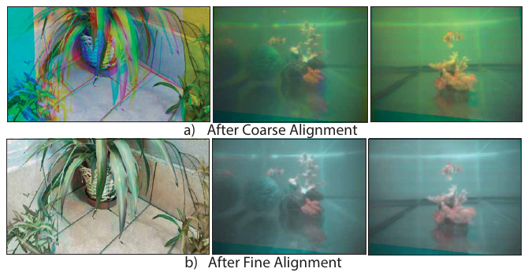

**Original caption:** Figure 11: Impact of Cross Color Alignment steps. a) shows the impact of Coarse Alignment b) shows the performance of the Fine Alignment step.

**中文图注:** 图 11：Cross Color Alignment 各步骤的影响。a) 展示粗对齐的影响；b) 展示精细对齐步骤的性能。

**Reading note:** (a) 粗对齐后仍有错位与边缘伪影；(b) 精细对齐（SeaNet）后错位消除、颜色更准确。

### 6.4 颜色分类（Color Classification）

**Original:** In this section, we evaluate the performance of SeaScan in detecting different colors in each scene. This is important since many underwater imaging applications rely on tracking the changes in the appearance of underwater objects over time, for instance, to detect coral reefs' bleaching by observing their color change over time [18], or the changing hues in colors of marine mammals as a result of diseases and infections [20]. To perform color classification, we first transformed the colors of the pixels from RGB space to LAB color space, a three-dimensional color space that is focused on the human color perception range [9]. We then perform KNN classification on n ∈ {3,4,5,6,7,8,9} different colors (furthest colors in LAB space that are present in the Macbeth chart).

**中文:** 本节评估 SeaScan 检测每个场景中不同颜色的性能。这一点很重要，因为许多水下成像应用依赖于随时间追踪水下物体外观的变化，例如通过观察珊瑚礁颜色随时间变化来检测其白化 [18]，或监测海洋哺乳动物因疾病和感染而产生的颜色色调变化 [20]。为进行颜色分类，我们首先将像素颜色从 RGB 空间转换到 LAB 颜色空间——一个专注于人类颜色感知范围的三维颜色空间 [9]。然后我们对 n ∈ {3,4,5,6,7,8,9} 种不同颜色（即 Macbeth 色卡中 LAB 空间相距最远的颜色）执行 KNN 分类。

### 图 12 分类准确率 / PSNR vs 距离 / PSNR vs 图像质量

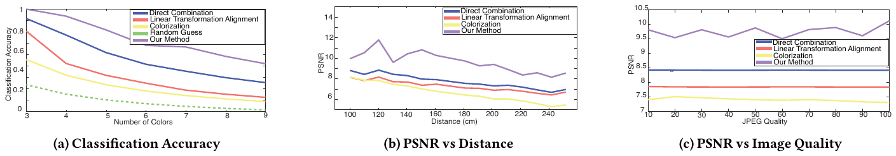

**Original caption:** Figure 12: (a) shows the color classification accuracy vs the number of colors (or classes). (b) shows the performance of our method and the baseline at different distances, plotting PSNR vs distance. (c) shows the effect of the compression on the performance of our method and the baselines, plotting PSNR vs image quality.

**中文图注:** 图 12：（a）颜色分类准确率与颜色数（类别数）的关系；（b）不同距离下我们方法与基线的性能，绘制 PSNR 与距离的关系；（c）压缩对我们方法与基线性能的影响，绘制 PSNR 与图像质量的关系。

**Reading note:** (a) 颜色分类准确率；(b) PSNR 随距离变化；(c) PSNR 随 JPEG 图像质量变化。紫色线/柱为 SeaScan。

**Original:** Fig. 12a plots the accuracy of the color classification algorithm on the output of our method and the baselines. The figure also plots the expected accuracy of a random guess where it randomly assigns a color class to each pixel. We note: • SeaScan consistently outperforms all the baseline and shows a 100% accuracy in classifying colors into 3 categories • Note that although Direct Combination reached 91% accuracy in classifying pixels into 3 classes, its accuracy drops below 35% when the number of classes is increased to 9. • The Linear Transformation Alignment shows 80% accuracy when there are only 3 classes, and drops to 22% accuracy with 9 classes. The random policy has 11% accuracy with 9 classes. • NN-based Colorization has 55% accuracy with only 3 classes, and its accuracy falls to 20% with only 8 classes.

**中文:** 图 12a 绘制了颜色分类算法在我们方法和各基线输出上的准确率。图中还绘制了随机猜测的期望准确率（即随机为每个像素分配一个颜色类别）。我们注意到：• SeaScan 始终优于所有基线，在将颜色分为 3 类时达到 100% 的准确率。• 虽然直接组合在将像素分为 3 类时达到 91% 的准确率，但当类别数增加到 9 类时，其准确率降至 35% 以下。• 线性变换对齐在仅 3 类时准确率为 80%，在 9 类时降至 22%。随机策略在 9 类时准确率为 11%。• 基于 NN 的着色在仅 3 类时准确率为 55%，在 8 类时降至 20%。

### 6.5 PSNR 与距离（PSNR vs Distance）

**Original:** To evaluate the performance of our system at different distances, we capture images of the Macbeth chart at different distances from our system and calculate the Peak Signal-to-Noise Ratio (PSNR) using the images captured from a GoPro 9 camera as ground truth. PSNR is a standard quantitative measure to evaluate the quality of an image in the presence of noise. Higher PSNR indicates a better quality image. Note that the physical position, camera resolution, and camera intrinsics of GoPro and SeaScan are different. Consequently, pixel-by-pixel comparison of the images captured from GoPro and SeaScan is not possible. To deal with this problem, we extracted the individual Macbeth chart color patches from the GoPro and SeaScan images manually and compare them. Therefore, it is the relative PSNR values that are important here rather than the absolute values.

**中文:** 为评估系统在不同距离下的性能，我们在不同距离拍摄 Macbeth 色卡图像，并以 GoPro 9 相机捕获的图像为真值计算峰值信噪比（PSNR）。PSNR 是评估图像在存在噪声时质量的标准化定量指标，PSNR 越高表示图像质量越好。请注意，GoPro 与 SeaScan 的物理位置、相机分辨率和相机内参均不同，因此无法对 GoPro 与 SeaScan 捕获的图像进行逐像素比较。为解决该问题，我们手动从 GoPro 和 SeaScan 图像中提取各个 Macbeth 色卡色块进行比较。因此，这里重要的是相对 PSNR 值，而非绝对值。

**Original:** Fig. 12b plots the image's PSNR on the y-axis and the distance of the Macbeth chart from the camera on the x-axis. We make the following remarks: • Note that the PSNR of our method (purple line) is on average 2 dB higher than the simple alignment method at all distances. This is considered a meaningful quantitative improvement in the imaging literature [12, 37, 54], yet the qualitative results reported earlier remain the more desirable approach to evaluate imaging performance. • The performance of simple alignment and linear transformation alignment methods show very similar trends across different distances with an average difference of ∼ 0.5 dB.

**中文:** 图 12b 将图像的 PSNR 绘于 y 轴，将 Macbeth 色卡与相机的距离绘于 x 轴。我们得出以下结论：• 在所有距离上，我们方法的 PSNR（紫色线）平均比简单对齐方法高 2 dB。在成像文献中，这被认为是有意义的定量改进 [12, 37, 54]；不过，前面报告的定性结果仍是评估成像性能更理想的方式。• 简单对齐与线性变换对齐方法在不同距离上的性能趋势非常相似，平均差异约 0.5 dB。

### 6.6 PSNR 与图像质量（PSNR vs Image Quality (JPEG)）

**Original:** In this section, we evaluate the performance of SeaScan against different image qualities as a result of image compression. Recall from §4 that we implement image compression on our system to reduce the data that needs to be transmitted to further decrease the energy consumption of our system. Fig. 12c shows the PSNR on the y-axis and JPEG image quality on the x-axis for our method and the baselines. Note that even at 10% image quality the performance of our method has negligible effect and consistently performs better than the baselines. Our method consistently has a PSNR above 9.5 dB, while baselines consistently have a PSNR lower than 8.5 dB. Fig. 13 shows the qualitative results of our method on three image qualities (30%, 60% and 100%). Note that the performance of Cross Color Alignment method is not affected even though the quality of the image has been significantly reduced.

**中文:** 本节评估 SeaScan 在图像压缩导致的不同图像质量下的性能。回顾 §4，我们在系统上实现了图像压缩，以减少需要传输的数据量，从而进一步降低系统能耗。图 12c 展示了我们方法与基线在 y 轴为 PSNR、x 轴为 JPEG 图像质量下的结果。请注意，即使在 10% 图像质量下，我们方法的性能也几乎不受影响，并且始终优于基线。我们方法的 PSNR 始终高于 9.5 dB，而基线的 PSNR 始终低于 8.5 dB。图 13 展示了我们方法在三种图像质量（30%、60% 和 100%）下的定性结果。请注意，即使图像质量被显著降低，Cross Color Alignment 方法的性能也未受影响。

### 图 13 不同图像质量下的性能

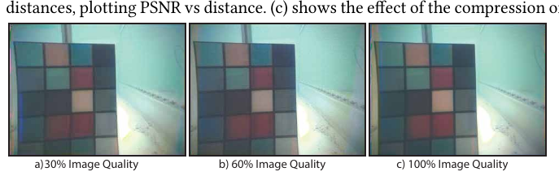

**Original caption:** Figure 13: Performance on Different Image Qualities. SeaNet's performance on images with 30%, 60%, and 100% JPEG compression qualities

**中文图注:** 图 13：不同图像质量下的性能。SeaNet 在 30%、60% 和 100% JPEG 压缩质量图像上的性能。

**Reading note:** 30%、60%、100% JPEG 压缩质量下 SeaNet 的输出几乎不受影响。

### 6.7 无源着色性能（Performance of Passive Colorization）

**Original:** To further evaluate the performance of the Cross-Color Alignment algorithm, we use two types of datasets 1) unseen online test dataset [56] and 2) real-world images taken with SeaScan. In addition to PSNR, we compute two additional metrics: • Structural Similarity Index [8]: SSIM is an image quality metric between -1 and 1 indicating the structural similarity between any given two images. Similar to PSNR, the higher the SSIM better the performance of the system. • CIEDE2000 [22]: A quantitative metric to measure the perceived color difference between two images. Unlike PSNR and SSIM, lower CIEDE2000 is better.

**中文:** 为进一步评估 Cross-Color Alignment 算法的性能，我们使用两类数据集：1) 未见过的在线测试数据集 [56]；2) 用 SeaScan 拍摄的真实图像。除 PSNR 外，我们还计算两个额外指标：• 结构相似性指数（SSIM）[8]：SSIM 是一个介于 -1 到 1 之间的图像质量指标，表示任意两幅图像之间的结构相似性。与 PSNR 类似，SSIM 越高表示系统性能越好。• CIEDE2000 [22]：衡量两幅图像之间感知颜色差异的定量指标。与 PSNR 和 SSIM 不同，CIEDE2000 越低越好。

**Original:** Performance on Online Test Dataset. We evaluate the performance of our Cross-Color Alignment algorithm, described in §2, on unseen online dataset [56]. Specifically, this dataset includes multiple RGB images from the same scene. To evaluate our system on this dataset, we choose 3 different images from each scene in the test dataset, and extract the red channel from the first, green channel from the second, and the blue channel from the third image. This allows us to simulate SeaScan images from its three red, green, and blue camera. We evaluate the performance of our algorithm on over 1190 images. Fig. 14a shows the performance of our alignment method and compares it to the baselines as bar plots. Specifically, Fig. 14a shows the average CIEDE2000, PSNR, and SSIM respectively for our method (purple bars), NN-based Colorization baseline (yellow bars), Direct Combination baseline (red bars), and Linear Transformation Alignment baseline (blue bars). We make the following remarks. • CIEDE2000 (Fig. 14a(i)) of our method is 5.05, ∼ 2× less than the simple and linear transformation alignment methods. • CIEDE2000 for NN-based Colorization baseline is much higher than that of the other three methods with a value of 199.7. This is because, out of all four methods we are comparing, NN-based Colorization method does not have any hint about the color of the objects in the scene. It relies solely on the neural network parameters learned during training. • PSNR (Fig. 14a(ii)) of Direct Combination and Linear Transformation Alignment are comparable with values of 30.5 and 30.8 dB respectively. Whereas our method shows better performance with a PSNR of 34.1 dB. • Fig. 14a(iii) shows the SSIM of the four methods. It is to be noted that SSIM ranges from −1 to 1, with its value being 1 for two identical images. Note that our method shows an SSIM of 0.9913 which is very close to a perfect SSIM, whereas the other three methods show SSIM of 0.82, 0.83 and −0.22.

**中文:** 在线测试数据集上的性能（Performance on Online Test Dataset）。我们在未见过的在线数据集 [56] 上评估 §2 所述的 Cross-Color Alignment 算法。具体而言，该数据集包含来自同一场景的多幅 RGB 图像。为在该数据集上评估我们的系统，我们从测试数据集中每个场景选取 3 幅不同图像，并分别提取第一幅的红色通道、第二幅的绿色通道和第三幅的蓝色通道，从而模拟由红、绿、蓝三台相机产生的 SeaScan 图像。我们在 1190 多幅图像上评估了算法性能。图 14a 以柱状图形式展示了我们的对齐方法并与基线比较。具体而言，图 14a 分别展示我们方法（紫色柱）、基于 NN 的着色基线（黄色柱）、直接组合基线（红色柱）和线性变换对齐基线（蓝色柱）的平均 CIEDE2000、PSNR 和 SSIM。我们得出以下结论：• 我们方法的 CIEDE2000（图 14a(i)）为 5.05，约为简单对齐和线性变换对齐方法的 1/2。• 基于 NN 的着色基线的 CIEDE2000 远高于其他三种方法，达到 199.7。这是因为在我们比较的所有四种方法中，基于 NN 的着色方法对场景中物体的颜色没有任何线索，它完全依赖训练期间学到的神经网络参数。• 直接组合和线性变换对齐的 PSNR（图 14a(ii)）相当，分别为 30.5 和 30.8 dB；而我们方法表现更好，PSNR 为 34.1 dB。• 图 14a(iii) 展示了四种方法的 SSIM。需要注意的是，SSIM 取值范围为 -1 到 1，两幅完全相同的图像其值为 1。我们方法的 SSIM 为 0.9913，非常接近完美 SSIM，而其他三种方法的 SSIM 分别为 0.82、0.83 和 -0.22。

### 图 14 无源着色的定量性能

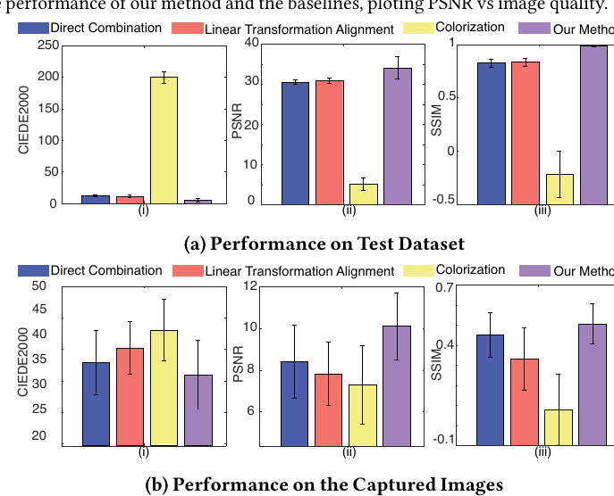

**Original caption:** Figure 14: Quantitative Performance of Passive Colorization. (a) and (b) plots CIEDE2000, PSNR, and SSIM performance of the SeaNet on test data [56] and underwater images captured by SeaScan, respectively.

**中文图注:** 图 14：无源着色的定量性能。（a）和（b）分别绘制 SeaNet 在测试数据 [56] 和 SeaScan 捕获的水下图像上的 CIEDE2000、PSNR 和 SSIM 性能。

**Reading note:** (a) 在线测试数据集、(b) SeaScan 捕获图像上的 CIEDE2000、PSNR、SSIM 对比；紫色为我们的方法。

**Original:** Performance on Images Captured by SeaScan. Now we evaluate the performance of the Cross-Color Alignment algorithm on the images captured using our platform. We image the Macbeth chart, as shown in Fig. 9d, at different distances using our platform. We used a GoPro 9 camera and placed it next to our camera to capture the image of the same scene. As mentioned in §6.5, we cannot directly compare the two images captured by these two cameras. Therefore, we extract the color patches out of the images to perform the comparison. Fig. 14b shows the CIEDE2000, PSNR, and SSIM of our method and the baselines. We make the following remarks: • Fig. 14b(i) shows that our method has a CIEDE2000 of 35.8, ∼ 5 − 20% less than the baselines. It is to be noted that since these values are calculated by comparing the images captured using a low-power CMOS sensor with a high-resolution GoPro 9 camera, it is the relative difference that has more significance than the absolute value. This plot signifies the correctness of the color and is highly dependent on the choice of filters. With better filter design the absolute CIEDE2000 can be further reduced. • Fig. 14b(ii) shows the PSNR of our method in purple as compared to the other baselines. Our method shows an increase ∼ 2−3 dB increase in PSNR as compared to the baselines. • Fig. 14b(iii) shows the SSIM of our method and compares it with the SSIM of the baselines. It can be seen from the plot that the average SSIM of our method is over 0.5.

**中文:** SeaScan 捕获图像上的性能（Performance on Images Captured by SeaScan）。现在我们评估 Cross-Color Alignment 算法在使用我们平台捕获的图像上的性能。我们使用平台在不同距离拍摄 Macbeth 色卡（如图 9d 所示），并将 GoPro 9 相机放在我们的相机旁边以捕获同一场景的图像。如 §6.5 所述，我们无法直接比较这两台相机捕获的图像，因此从图像中提取色块进行比较。图 14b 展示了我们方法与基线的 CIEDE2000、PSNR 和 SSIM。我们得出以下结论：• 图 14b(i) 显示我们方法的 CIEDE2000 为 35.8，比基线低约 5%–20%。需要注意的是，由于这些值是通过将低功耗 CMOS 传感器捕获的图像与高分辨率 GoPro 9 相机比较计算得到的，因此相对差异比绝对值更有意义。该图表明了颜色的正确性，且高度依赖滤光片的选择；通过更好的滤光片设计，绝对 CIEDE2000 可进一步降低。• 图 14b(ii) 以紫色展示我们方法与其他基线相比的 PSNR。与基线相比，我们方法的 PSNR 提高了约 2–3 dB。• 图 14b(iii) 展示我们方法的 SSIM，并与基线的 SSIM 比较。从图中可以看出，我们方法的平均 SSIM 超过 0.5。

### 6.8 生成的 3D 点云（Generated Point Clouds）

**Original:** Finally, we qualitatively show sample 3D point clouds generated using the images captured from SeaScan in Fig. 15 for an underwater plant and Macbeth chart. This shows that SeaScan is capable of being used with the existing computer vision techniques to extend its applications.

**中文:** 最后，我们在图 15 中定性地展示了使用 SeaScan 捕获图像生成的水下植物和 Macbeth 色卡的示例 3D 点云。这表明 SeaScan 能够与现有计算机视觉技术结合使用，以扩展其应用。

### 图 15 估计的 3D 点云

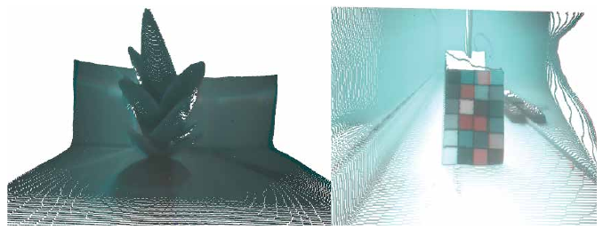

**Original caption:** Figure 15: Estimated 3D Point Clouds. shows the estimated point cloud of a plant in a small tank and Macbeth chart in a large tank

**中文图注:** 图 15：估计的 3D 点云。展示小型水槽中一株植物和大型水槽中 Macbeth 色卡的估计点云。

**Reading note:** 植物（小水槽）与 Macbeth 色卡（大水槽）的 3D 点云重建结果。

## 7 相关工作 RELATED WORK

**Original:** Low-power & Underwater Cameras. The past few years have witnessed growing interest in ultra-low-power cameras in the mobile computing community [28, 30, 41, 43, 58]. Past work has achieved important advances in developing low-power imaging systems, adding wireless capabilities, and increasing their frame-rate and resolution. However, the majority of this past literature has focused on grayscale imaging in air. Our research shares the motivation of these past systems and aims to achieve ultra-low-power color imaging in underwater environments.

**中文:** 低功耗与水下相机（Low-power & Underwater Cameras）。过去几年，移动计算社区对超低功耗相机的兴趣日益增长 [28, 30, 41, 43, 58]。以往工作在开发低功耗成像系统、增加无线能力以及提高帧率和分辨率方面取得了重要进展。然而，这些文献中的大多数聚焦于空气中的灰度成像。我们的研究与这些以往系统动机相同，目标是实现水下环境中的超低功耗彩色成像。

**Original:** One might wonder whether recent systems for low-power color imaging in air – such as Video Backscatter [41] and NeuriCam [58] – could be used for underwater color imaging. However, Video Backscatter's COTS implementation is limited to grayscale imaging (the potential for color imaging), and it still requires specialized ASICs to achieve color imaging. Additionally, NeuriCam's approach would not work well underwater. This system combines a (highly duty-cycled) color sensor with a (high-frame rate) grayscale sensor; by streaming sensor high-frame-rate data to a receiver, it can interpolate the color images. However, due to the significant bandwidth limitations of the underwater acoustic channel, it remains infeasible today to stream high frame-rate videos using low-power underwater cameras. Moreover, this past system consumes 83 mW, which is significantly higher than SeaScan's peak power consumption.

**中文:** 有人可能会问：近期面向空气中低功耗彩色成像的系统——例如 Video Backscatter [41] 和 NeuriCam [58]——能否用于水下彩色成像？然而，Video Backscatter 的 COTS 实现仅限于灰度成像（只是具备彩色成像的潜力），并且仍需专用 ASIC 才能实现彩色成像。此外，NeuriCam 的方法在水下效果不佳。该系统将一个（高度占空比工作的）彩色传感器与一个（高帧率的）灰度传感器结合；通过将传感器的高帧率数据流式传输到接收端，它可以插值出彩色图像。然而，由于水下声学信道的带宽限制严重，目前用低功耗水下相机流式传输高帧率视频仍不可行。而且，这一以往系统功耗为 83 mW，远高于 SeaScan 的峰值功耗。

**Original:** In the context of underwater imaging, most past systems consume tens of Watts, which makes it difficult to use them for long-term battery-powered operation [7, 17, 34, 59, 60, 64]. The only system we are aware of for low-power underwater color imaging consumes around 1 J of energy due to LED flashing [2]. SeaScan is motivated by this recent system and has orders of magnitude lower energy consumption.

**中文:** 在水下成像的背景下，大多数以往系统功耗为数十瓦，这使它们难以用于长期电池供电运行 [7, 17, 34, 59, 60, 64]。据我们所知，唯一面向低功耗水下彩色成像的系统因 LED 闪烁而消耗约 1 J 能量 [2]。SeaScan 正是受这一近期系统的启发，且能耗低了数个数量级。

**Original:** Finally, past work has investigated building custom chips for low-power imaging [10, 14, 33, 42]. However, since these ASICs are not commercially available, they require specialized costly fabrication. In contrast, SeaScan is designed entirely using COTS hardware, making it easily available for researchers and practitioners for use and deployment.

**中文:** 最后，以往工作还研究了为低功耗成像构建定制芯片 [10, 14, 33, 42]。然而，由于这些 ASIC 无法在市场上购买，需要专门且昂贵的制造工艺。相比之下，SeaScan 完全使用 COTS 硬件设计，使研究人员和从业者易于获得、使用和部署。

**Original:** Colorization and Color Reconstruction. The problem of colorizing grayscale images has received attention over the past few years [5, 13, 62, 69], for example, to colorize footage of past historical events. The vast majority of these methods rely on ML-trained models for colorization. However, because these methods are trained on in-air images (mainly of humans and aerial sites), they do not perform well on underwater images as we demonstrated empirically in our results. Moreover, due to the dearth of available underwater footage, it is difficult to retrain for underwater environments.

**中文:** 着色与彩色重建（Colorization and Color Reconstruction）。灰度图像着色问题在过去几年受到关注 [5, 13, 62, 69]，例如为过去历史事件的影像着色。这些方法绝大多数依赖 ML 训练的着色模型。然而，由于这些方法是在空气中图像（主要是人物和空中场景）上训练的，它们在水下图像上表现不佳，正如我们在结果中通过实验证明的那样。此外，由于可用的水下影像匮乏，针对水下环境重新训练也很困难。

**Original:** There has also been past research on ML-based approaches for color enhancement of underwater color images to perform dehazing or extract the true colors of the scene [6, 19, 36, 57]. These methods address an orthogonal problem to SeaScan, and SeaScan's output can be fed into them to extract true color (similar to how an underwater GoPro image can be fed into them to extract its true colors).

**中文:** 此前也有关于基于 ML 的水下彩色图像颜色增强方法的研究，用于去雾或提取场景的真实颜色 [6, 19, 36, 57]。这些方法处理的是与 SeaScan 正交的问题，SeaScan 的输出可以输入给它们以提取真实颜色（类似于将水下 GoPro 图像输入它们以提取真实颜色）。

## 8 结论 CONCLUSION

**Original:** Low-power underwater imaging is important for long-term observations of subsea environments, with applications ranging from ocean climate change monitoring and scientific discovery to seafood production and robotic navigation. This paper marks a new step towards that vision by introducing a highly energy-efficient underwater color imaging system. As the research evolves, it would be valuable to investigate methods that continue to push the boundaries of these systems through even lower power as well as higher frame rates and resolutions. Moreover, it would be interesting to investigate how some of the proposed methods here (e.g., trinocular lensing) may lend themselves to in-air imaging applications. More generally, the paper sits at the intersection of two emerging trends in the mobile computing community - of low-power imaging and ocean IoT - and we believe that the area of low-energy underwater imaging will benefit from technical advances in both of these areas.

**中文:** 低功耗水下成像对于海底环境的长期观测非常重要，其应用涵盖海洋气候变化监测、科学发现、海产品生产和机器人导航等。本文通过引入一个高能效水下彩色成像系统，向这一愿景迈出了新的一步。随着研究的发展，探索通过更低功耗以及更高帧率与分辨率来持续突破这些系统边界的方法将很有价值。此外，研究本文提出的某些方法（例如三目透镜）如何适用于空气中成像应用也很有趣。更一般地，本文处于移动计算社区两大新兴趋势——低功耗成像与海洋物联网——的交汇点，我们相信低能耗水下成像领域将受益于这两个领域的技术进步。

**Original:** Acknowledgments. We thank our shepherd, the anonymous reviewers, and the Signal Kinetics group for their feedback. We also thank MIT SeaGrant. The research is funded by the Office of Naval Research and National Science Foundation.

**中文:** 致谢（Acknowledgments）。我们感谢指导老师（shepherd）、匿名审稿人以及 Signal Kinetics 小组的反馈。我们还感谢 MIT SeaGrant 的支持。本研究由海军研究办公室（Office of Naval Research）和美国国家科学基金会（National Science Foundation）资助。

---

## 阅读提示 / Critical Reading Notes

### 论文解决的问题与核心主张

1. **问题**：现有低功耗水下彩色相机依赖 LED 三色闪光 + 顺序采集（如 [2]，单幅约 1 J），能耗高；而直接使用彩色传感器功耗高一个数量级。SeaScan 提出用三个带无源滤光片的超低功耗单色 CMOS 传感器（不闪光）重建彩色图像，并把能耗降到 23.6 mJ（采集阶段），整机 117.7 mJ。
2. **两大技术挑战**：(a) 三目镜头空间分离导致同一物体在三幅图像中位置不同，简单组合/线性变换对齐都不行 → 提出 Cross Color Alignment（RANSAC-flow 粗对齐 + SeaNet 精细对齐/颜色推断）；(b) 低功耗 CMOS 的广角镜头带来桶形畸变 → 提出平面封装的“跨折射补偿”，利用水-空气界面折射抵消畸变（畸变从 8% 降到 2%）。
3. **端到端**：集成 Depth Anything 做单目深度估计生成 3D 点云；机载 JPEG 压缩（30% 质量因子）减少传输量；水下反向散射实现近零功率无线传输。

### 证据链与结论边界

- 能耗数据来自 PCB 测试点电流测量（DMM6500），按 P=I_dd·V_dd、E=∫Pdt 计算。
- 定量指标：CIEDE2000（测试集 5.05，比简单/线性变换对齐约低 2 倍）、PSNR（34.1 dB vs 30.5/30.8 dB）、SSIM（0.9913）。
- 颜色分类：3 类时 100% 准确率；9 类时仍显著优于基线。
- **边界**：PSNR/CIEDE2000 的绝对数值受 GoPro 与 SeaScan 分辨率/内参不同影响，作者明确说明“相对差异”更有意义；定性结果（人眼视觉）被视为更理想的评估方式。
- 训练数据来自 NeRF-Stereo 数据集（空气中三目图像），通过灰度化模拟 SeaScan 输入；真实世界测试则依赖平面封装将畸变降到与训练分布一致。

### 值得注意的局限与风险

- **多目遮挡**：作者承认颜色重建不仅是对齐问题还是推理问题（部分场景只在某台相机可见），SeaNet 负责从上下文推断缺失颜色，但推理可靠性取决于训练数据覆盖。
- **滤光片选择**：凝胶滤光片通带不如二向色滤光片精确，颜色正确性高度依赖滤光片选择（图 14b 注释）。
- **相机顺序采集**：因微控制器 SPI 接口有限，三台相机顺序拍摄（仍需不到 1 秒）；严格同步性受限于硬件。
- **SSIM 为负的基线**：NN-based Colorization 基线 SSIM = -0.22，说明该基线在水下场景几乎失效，也提示“与最强基线比 50% 提升”的表述需结合具体基线理解。
- **正文笔误**：图 10 图注“The fifth row”疑为“fifth column”；图 14a 正文 SSIM 数值顺序与图注对应关系需以图为准。

### 与领域的关系

- 位于“低功耗成像”（Video Backscatter、NeuriCam 等）与“海洋物联网/水下成像”（LED 闪光方案 [2]、数十瓦级传统水下相机）两大趋势的交汇点。
- 与现有水下图像增强/去雾方法（如 [6,19,36,57]）正交：SeaScan 输出可作为这些方法的输入进一步恢复真实颜色。

### 延伸阅读建议

- RANSAC-Flow [50,51]（粗对齐骨干）、Depth Anything [65]（深度估计）、NeRF-Stereo 数据集 [56]、CIEDE2000 [22] 与 SSIM [8] 的定义。
