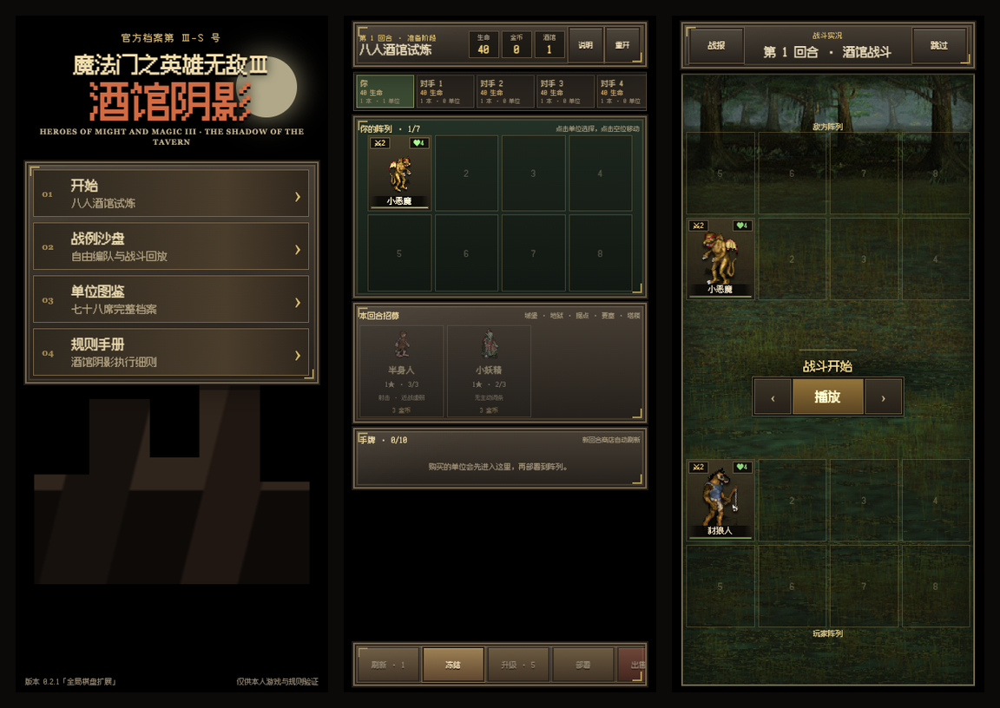

《酒馆阴影》的核心规则一开始就不是为战斗沙盘准备的。此前我们先把武器摆上桌，现在终于把整家酒馆打开：主菜单里的“开始”不再弹出装订提示，而是直接进入一局标准八人试炼。



## 0.2.0 可以玩什么

- 从三枚金币起步，购买、出售、刷新、冻结和升级商店。
- 购买单位进入手牌，选择空阵位部署，也可以在棋盘上点击或拖拽换位。
- 三张相同的九城基础单位自动合成强化形态，部署时触发一次发现。
- 八名参与者各自拥有生命、酒馆等级与阵容，回合结束后自动配对并结算战斗。
- 玩家对局提供完整逐帧回放，可以暂停、逐步、调速和拖动时间轴。
- 战败扣除英雄生命，生命归零即淘汰；最后幸存者获得第一名。
- 对局草稿自动保存在本地，关闭页面后仍可从主菜单继续。

## 一局是怎样走完的

准备阶段只关心一件事：用有限金币决定这一轮阵容。商店里的每一张卡都来自共享卡池，购买、刷新、三连和发现都会真实占用或归还池中份数。

点击“开始战斗”后，屏幕会切到逐帧回放。攻击、射击、反击、范围伤害、死亡和再生都沿用核心 `Battle.frames`，而不是为界面另写一套动画结果。回放结束后可以看到本回合战报、英雄伤害和当前排名，再进入下一回合。

战例沙盘没有被移除。它继续作为长期模式保留，适合自由编队、验证规则和理解单位差异；正式试炼则负责把这些规则放进完整经济与淘汰流程中。

## 手机上的对局布局

正式对局采用严格单屏布局：

- 顶部显示回合、生命、金币和酒馆等级。
- 八人状态条横向滚动，避免把关键阵容压得过矮。
- 自己的七格阵列固定在屏幕中部。
- 商店、手牌和操作按钮分别拥有独立的横向滚动区域。
- 从 320×568 的旧款小屏到 560px 桌面竖屏画布，都保持页面级无横纵溢出。

这条约束比单纯把内容做小更重要。手机上长时间对局时，棋盘必须持续可见，操作区不能把阵容顶出屏幕。

## 本版保留的技术边界

0.2.0 的产品版本号提升到 `0.2.0`，但核心状态仍保持 `Game.version = 1`，因为规则对象结构没有不兼容变化。正式对局使用新的本地草稿键 `sot-game-v1`，与战例沙盘的 `sot-sandbox-v1` 分离保存。

当前回放重点仍是玩家参与的每一场战斗；其他 AI 对阵目前只保留结算摘要。音频、Service Worker 离线缓存、账户系统和云存档仍不在这个版本内。

酒馆已经可以完整营业一轮了。下一步不是继续往桌上堆按钮，而是让每一轮信息更清楚、节奏更稳，并把所有对阵都变成可复查的战报。

> **0.2.2 棋局视野更新**：棋子现在常驻显示攻击和当前生命，受伤、治疗、击杀与重生会直接在棋子上播放数值和颜色反馈。战斗界面不再嵌入任何行动日志，时间轴、倍速与底部事件条也已移除；全局棋盘改为更高的 5:6 棋子格，把空间留给更大的棋子。独立回合战报与结算系统继续保留。
