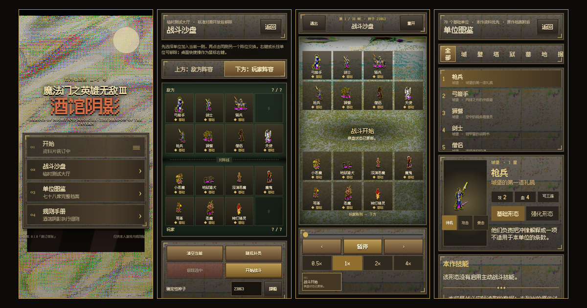

《酒馆阴影》已经完成第一轮重新设计。这次不是把旧网页重新排版，而是从展示层开始重写：保留原来的纯 TypeScript 战斗规则，重新制作竖屏界面、中文图鉴、规则卷和原版动画资源管线。



## 当前可以测试什么

- 主菜单、战斗沙盘、单位图鉴和完整规则手册。
- 九座城镇与十五种中立单位，共 78 个基础单位、141 个原作形态。
- 双阵营编队，每方最多七个单位；支持基础／强化切换、点击换位、拖拽换位和预设阵容。
- 上下对峙的逐帧战斗回放，支持暂停、逐步、0.5× / 1× / 2× / 4×速度和时间轴拖动。
- 图鉴首先展示本作实际参与结算的攻血与技能，原版属性作为折叠档案附后。
- 中立单位只显示基础形态，不参与三连，也不会生成强化页或发现候选。

## 手机测试建议

页面按竖屏逻辑制作，桌面端同样只显示居中的竖屏游戏画布。建议使用 iPhone 或 iPad 的 Safari 打开，先测试主菜单，再进入“战斗沙盘”：

1. 选择上方或下方阵容。
2. 从单位名册添加单位，点击同侧阵位进行交换，也可以拖动。
3. 选择预设阵容可以快速进入七人对七人的战斗。
4. 开始战斗后拖动时间轴，逐帧核对攻击、反击、范围伤害、死亡和结算。
5. 在图鉴中切换基础／强化形态，并查看“原作档案”折叠区。

当前没有接入音频，也没有 Service Worker 离线缓存。PWA 清单和主屏图标已提供，因此可以在 iPhone 上通过 Safari 的“添加到主屏幕”独立打开。

## 本次资源处理

单位动画取自本机原版资源，并通过新写的 LOD／DEF 解析器提取。完整的移动、待机、受击、死亡、转向、近战、射击和特殊动画组均被保留，按九个城市与中立单位拆分。浏览器只在实际需要时加载对应图像。

资源总量约 24MB，最大阵营包约 3.1MB。原版游戏目录、音频和未压缩资源不会进入网页构建。

## 尚未完成

第一里程碑仍以战斗沙盘为中心，标准八人完整对局尚未开放；主菜单中的“开始”会显示资料片装订提示。后续将优先补上征募、升级、三连、八人淘汰和完整对局闭环，然后再决定战斗沙盘入口的去留。

酒馆仍在营业，只是账房暂时只开放了武力测试窗口。
