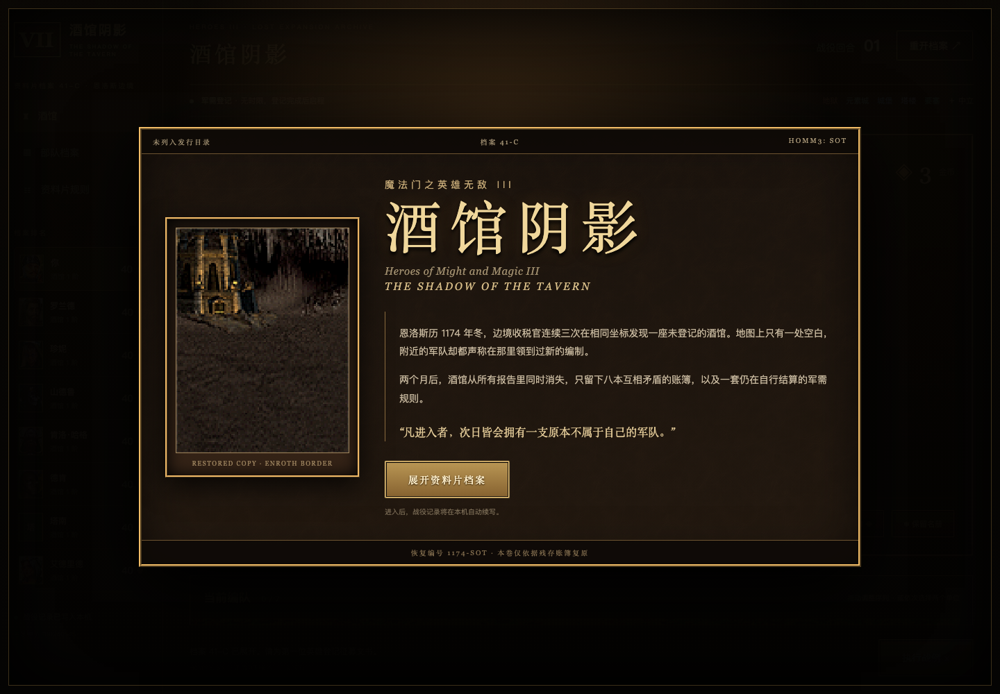

恩洛斯历 1174 年冬，边境收税官连续三次在相同坐标发现一座未登记的酒馆。地图上只有一处空白，附近的军队却都声称在那里领到过新的编制。

两个月后，酒馆从所有报告中消失，只留下八本互相矛盾的账簿，以及一套仍在自行结算的军需规则。这份档案没有出版编号，封面也没有署名，只在边角标注了三个字母：**SoT**。

## 恢复完成



当前恢复版本不需要安装，也不连接账户。为了避免档案在浏览器中丢失，军需进度会自动写入本机；刷新页面可以继续续卷。更换浏览器、清除网站数据，或从本地地址切换到线上地址时，原有记录不会随行。重开档案会覆盖当前版本记录。

恢复版采用本地《英雄无敌 III》兵种动画、阵营背景、英雄头像与界面纹理。它没有接入音乐，也没有补写原版法术、士气和幸运系统。相关页码在档案中确实存在，但内容已经无法辨认。

## 账簿如何结算

资料片要求八位英雄共用同一份军需账册。每卷会从九座城镇中开放五座，中立单位始终列入征募名册；所有单位都只有有限份数。

1. **登记征募**：使用金币取得单位，也可以更换名册，或保留当前名册等待下一回合。
2. **编成队伍**：战场上最多登记七个单位。可以拖动调整序列，也可以依次选择两个单位交换位置。
3. **三重合编**：三份相同九城基础单位会合为升级形态，基础攻血翻倍；首次编入升级单位时，档案会从更高一阶中补录三项候选。
4. **执行战例**：军需登记完成后进入自动战例。攻击、反击和结算会依次重演，可以暂停、逐步核对、加速或跳过。
5. **继续续卷**：战败一方会承受对方酒馆阶位与存活单位星级之和，直到只剩最后一位英雄，或自己的记录被划去。

当中立单位进入账册后，情况开始变得不合常理。它们可以重复持有多份，却不会合编，也不会产生高阶补录。四条龙甚至不在普通名册中出现，只在酒馆达到七阶后的附录里留下八星登记页。

## 卷内收录

恢复版收录九城 63 组基础／升级编制，以及 15 种不参与合编的中立单位，共 141 个原版形态。每条单位记录都保留了原版攻击、防御、伤害、生命、速度、产量与招募资料，可以用作核对。

特殊龙类被放在七阶合编附录中。四条龙各登记五份，不进入普通名册；只要有一条在战例结束时仍存活，对方就会承受八点单位伤害。若附录候选不足，账簿只列出剩余条目；龙池耗尽后会退回七星补录。

## 版本注记

本次更新恢复了资料片名称、卷首、界面文案、规则卷和发布材料，没有改变此前的战斗结算、兵种数值或存档结构。当前版本号为 **v0.3 档案包装版**。

档案仍有三处缺口：法术、士气与幸运尚未载入；空中与地面单位的移动差异被压缩为出手序列；原版六角格战场没有被复原。修复这些部分需要新的原始页，而目前找到的手稿都在同一句话后中断：

> 酒馆并不贩卖战争，它只负责让战争显得更有秩序。
